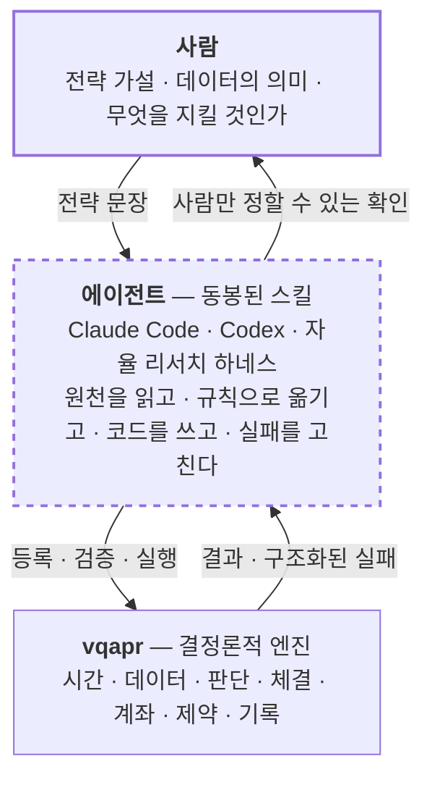
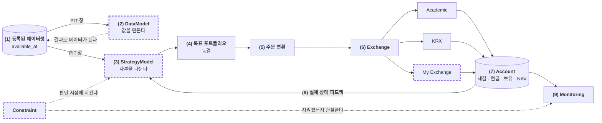
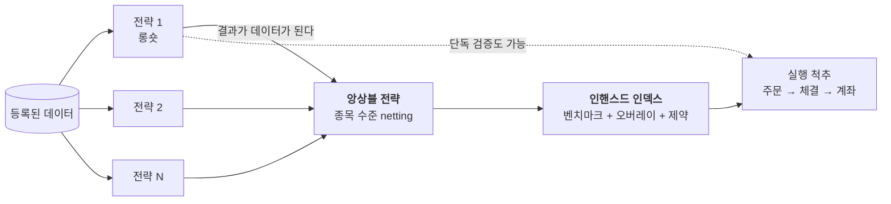

# vqapr

> 🌐 **English** → [README.en.md](README.en.md)

**v**ibe **q**uant **a**sset **p**ricing / **a**lpha **p**ortfolio **r**esearch

**말로 하는 퀀트 전략 리서치 프레임워크.**
전략은 말로 설명하고, 코딩 에이전트가 그것을 규칙과 코드로 옮기고, 프레임워크가 결정론적으로 검증하고 실행한다.

<!-- ─────────── DEMO PLACEHOLDER 1 ─────────── -->
> 🎬 **데모 1 — 빈 폴더에서 데이터 등록까지** *(녹화 예정)*
>
> 처음 보는 CSV 몇 개를 가리키기만 하면, 에이전트가 파일을 열어보고 축·시점·체결 조건의 후보를 근거와 함께
> 제시한다. 사람이 확정하면 등록이 끝난다.
>
> `docs/assets/demo-01-register.gif`
<!-- ─────────────────────────────────────────── -->

---

## 이 프레임워크가 하는 일

- **Claude Code, Codex 같은 코딩 에이전트에서 쓰라고 만들었다.** 혼자 읽고 배우는 라이브러리가 아니다.
  설치하면 에이전트가 읽을 스킬이 프로젝트에 깔리고, 그때부터 전략은 문장으로 시작한다.
  *"코스피200에서 최근 12개월 수익률 상위 30종목을 매월 말 동일비중으로, 단일종목 5% 이내"* —
  이 한 줄에서 데이터 등록, 전략 코드, 실행, 리포트가 나온다.

- **데이터의 시점과 체결 가정을 인터뷰로 확정한다.** 종가는 언제부터 쓸 수 있나, 재무제표는 언제 공시되나,
  판단 다음 날 시가에 체결인가 당일 종가인가. **백테스트를 조용히 망치는 것은 대부분 이 가정들이다.**
  에이전트가 원천 파일을 직접 열어보고 후보를 근거와 함께 제시하면 사람이 고른다. 추측으로 채우는 자리가 없다.

- **미래를 볼 통로를 엔진이 막는다.** 전략은 데이터를 직접 열 수 없고, 그 시점까지 유효했던 창만 받는다.
  미래 행은 창 안에 존재하지 않는다. 어느 종목이 그날 거래정지인지, 얼마에 체결되는지도 판단 시점에는 보이지 않는다.

- **수익률이라 부르는 숫자는 전부 체결을 통과한다.** 가중치에 다음 기간 수익률을 곱해 더하는 지름길이 없다.
  거래정지, 정수 수량, 수수료·세금, 현금이 모자라 잘린 주문이 결과에 그대로 남는다.

- **등록한 데이터, 돌린 전략, 나온 결과가 전부 기록으로 쌓인다.** 매번 새 노트북을 여는 방식이 아니다.
  무슨 데이터로 어떤 전략을 언제 돌려 무엇이 나왔는지, 실패한 시도까지 조회된다.
  **전략의 결과는 다시 데이터가 되어 다음 전략이 구독한다.**

- **하나가 아니라 여러 전략을 쌓는 것이 목적이다.** 롱숏 전략을 여러 개 만들어 풀을 이루고, 앙상블하고,
  인핸스드 인덱스 위에 얹는다. → [전략 팩토리](#전략-팩토리)

---

## 제품 철학

**하나의 척추.** 수익률·NAV·손익·회전율을 주장하는 모든 경로는 목표 포트폴리오 → 주문 → 체결 → 계좌 반영을
지난다. 우회로가 없다. 학술적 롱숏과 실물 롱온리는 다른 생애가 아니라 **같은 생애에 다른 프로필**이다.

**추측하지 않는다.** 프레임워크는 사용자에게 묻지 않고, 빠진 값을 비슷한 필드로 대체하지 않고, 경제적 의미를
짐작하지 않는다. 모르면 결과를 만들기 전에 멈추고 무엇이 왜 없는지를 구조화된 실패로 돌려준다.
**대화는 에이전트가, 판정은 프레임워크가, 확정은 사람이 한다.**

**BYOD — Bring Your Own Data.** 벤더 커넥터도, 다운로더도, 번들 데이터셋도 없다. 원천이 xlsx든 DB 덤프든
사내 웨어하우스든 그것을 표로 준비하는 것은 프로젝트와 그 에이전트의 몫이다. 대신 프레임워크는
**등록되려면 무엇을 만족해야 하는지를 기계가 읽을 수 있는 계약으로 먼저 내놓고**, 만족했는지만 판정한다.
컬럼 이름은 강제하지 않는다 — `ticker`든 `종목코드`든 무엇이 종목인지는 등록할 때 잇는다.

**내장은 일관성을, 확장은 자율성을.** 순위·중립화·가중 같은 자주 쓰는 계산은 내장으로 준다. 에이전트마다
같은 것을 매번 다시 만들지 않게 하기 위해서다. 그러나 **내장 전략은 없다** — 무엇을 사고팔지는 프로젝트가
정한다. 확장점 넷(`DataModel` · `StrategyModel` · `Exchange` · `Constraint`)은 내장과 **같은 문으로 들어와
같은 검증을 받는다.** 내장만 쓸 수 있는 뒷문이 있으면 내장은 따라 할 수 없는 예시가 된다.

**연구는 누적된다.** 성공한 시도만 남기면 같은 실패를 반복한다. 실패, 진단, 지원하지 않는다는 판정,
그때 사람이 내린 결정이 함께 남아 다음 연구의 출발점이 된다.

---

## 프레임워크 구조



**사람**은 의미를 정한다. 무슨 가설을 검증할지, 이 데이터가 무엇인지, 언제부터 알 수 있었는지, 무엇을 제약으로
둘지. 결과의 의미를 바꾸는 결정은 전부 여기에 있다.

**에이전트**는 동봉된 스킬을 읽는다. 프레임워크 문서 전체가 아니라 스킬 하나다. 원천 파일은 에이전트가 자기
도구로 직접 열어보고, 실패가 나면 그 실패를 읽고 고친다. 이 자리에 사람이 앉아 대화할 수도, 자율 하네스가
앉아 가설 루프를 돌 수도 있다.

**엔진**은 판정하고 실행한다. 숫자를 만드는 것은 언제나 엔진이지 LLM이 아니다.

---

## 백테스트 구조



> **점선 굵은 테두리 넷이 프로젝트가 로컬 코드로 갈아끼우는 자리다.** 내장 구현과 같은 문으로 들어오고 같은
> 검증을 받는다. 반대로 계좌 권위, 평가와 NAV 정의, 실행 순서는 갈아끼울 수 없다 — 그것까지 프로젝트마다
> 달라지면 두 연구를 비교할 수 없다.

**(1) 등록된 데이터셋** — 준비된 표. 모든 소비자는 필요한 것을 선언하고, 엔진이 그 시점의 창을 잘라 건넨다.

**(2) DataModel — 값을 만든다.** 시가총액, 베타, 예측값, 팩터 노출처럼 **여러 전략이 나눠 쓸 값**을 한 번만
계산한다. 결과는 다시 데이터가 되어 같은 방식으로 읽힌다. 시가총액을 "체결"할 수는 없으므로 **DataModel은
척추에 들어오지 않는다.** 필수 단계도 아니다 — 전략이 직접 계산해도 된다.

**(3) StrategyModel — 자본을 나눈다.** 전략이 사는 곳이다. 그 시점의 데이터 창, (2)의 결과, 그리고 **자기 계좌의
실제 이력**을 읽고 판단한다. 계좌를 볼 수 있으므로 손절·쿨다운·회전율을 고려한 리밸런스처럼 **이전 체결 결과가
다음 판단을 바꾸는 전략**이 그대로 표현된다. 제약이 선언되어 있으면 여기서 그 한계 안의 최선을 만든다.

**(4) 목표 포트폴리오** — 판단은 반드시 **동결된 목표 하나**로 확정된다. 롱숏이든 롱온리든 같은 문을 지난다.
같은 전략 결과를 학술 롱숏 구성과 롱온리 인핸스드 인덱스 구성으로 각각 확정할 수 있다.

**(5) 주문 변환** — 주문은 판단 시점이 아니라 **체결 시점에** 만들어진다. 그 시점의 실제 보유·현금, 그 시점의
거래 가능 여부와 가격을 쓴다. 종목별 요청 수량과 체결 수량, 잘린 사유가 전부 남는다.

**(6) Exchange — 현실성이 정해지는 곳.** `Academic`은 부호 있는 소수점 수량을 비용 0으로 전량 체결한다(가상임을
명시한다). `KRX`는 정수 수량, 시점별로 유효한 수수료·세금, 비용을 포함한 현금 부족 시 수량 클리핑을 적용한다.
다른 시장 규칙이 필요하면 직접 쓴다. **이름이 현실성을 주장하지 않는다** — 구현된 규칙과 명시한 한계만 주장한다.

**(7) Account — 유일한 권위.** 체결된 것, 실제 현금, 실제 보유, 그 평가와 이력. 목표도 주문도 권위가 아니다.
*의도 ≠ 주문 ≠ 체결 ≠ 계좌 반영* — 이 넷은 결과에서 끝까지 구분된다. "판단하지 않음"과 "판단해서 그대로 유지"와
"주문했지만 하나도 체결 안 됨"은 같은 빈 값이 아니다.

**(8) 피드백** — 다음 판단은 실제로 체결된 결과에서 시작한다. 이것이 닫힌 고리다.

**(9) Monitoring** — 판단과 독립된 주기로 계좌를 관찰한다. 가격이 움직여 비중이 한도를 넘었다면 그날 주문이
하나도 없어도 위반으로 기록된다. 관찰은 계좌를 고치지 않고, **한도를 넘었다고 실행을 중단하지도 않는다** —
그러면 그 전략이 실제로 무엇을 하는지 끝까지 볼 수 없다.

**미래는 이 그림에서 세 곳이 막는다.** (1)이 그 시점의 창만 건네므로 미래 행을 읽는 코드를 쓸 수가 없고,
(2)가 만든 값의 시점은 실제로 읽은 관측에서 엔진이 정하므로 계산을 여러 단 쌓아도 경계가 느슨해지지 않으며,
(5)의 체결 정보는 (3)에 보이지 않고 체결은 언제나 판단보다 뒤에 온다.
다만 **체결 가격이 실제로 언제 관측된 값인지**는 데이터에 없어 엔진이 판정하지 못한다. 그 자리는 에이전트가
경고하고 사람이 확정하며 결과에 한계로 남는다.

---

## 전략 팩토리

vqapr가 겨냥하는 것은 백테스트 한 번이 아니라 **전략을 쌓고 조합하는 연구 사이클**이다.
전략의 결과가 다시 데이터가 되기 때문에(위 그림의 점선), 지난 전략이 다음 전략의 입력이 된다.



1. **롱숏 전략을 여러 개 만든다.** 부호 있는 횡단면 판단이 기본 연구 자산이다. 실제로 공매도가 어렵다는 이유로
   **연구 의도를 미리 롱온리로 축소하지 않는다.** 실현되지 않은 숏 의도와 제약에 잘린 잔여는 따로 남는다.
2. **풀이 쌓인다.** 각 전략의 결과는 시점이 붙은 데이터다. 기존 것들과의 상관·중첩·증분 기여를 볼 수 있고,
   실패한 시도도 이유와 함께 남는다.
3. **앙상블한다.** 저장된 전략들을 구성원으로 참조해 종목 수준에서 netting한 하나의 판단을 만든다.
   구성원을 다시 계산하지 않고 저장된 결과를 읽는다.
4. **인핸스드 인덱스 위에 얹는다.** 벤치마크 대비 액티브 비중으로 실물 롱온리 포트폴리오를 구성하고,
   단일종목 상한 같은 제약을 반영한다.
5. **같은 척추를 지난다.** 1번의 단독 전략이든 4번의 최종 포트폴리오든 주문·체결·계좌를 똑같이 통과한다.

<!-- ─────────── DEMO PLACEHOLDER 2 ─────────── -->
> 🎬 **데모 2 — 전략 문장에서 결과 리포트까지** *(녹화 예정)*
>
> 등록된 데이터 위에서 전략을 만들고, 검증하고, 실행하고, 결과와 그 결과가 의존한 데이터를 읽기까지 한 번의 대화.
>
> `docs/assets/demo-02-strategy.gif`
<!-- ─────────────────────────────────────────── -->

---

## 시작하기

```bash
uv add vqapr
uv run vqapr skill install
```

두 줄이 전부다. 첫 줄이 엔진을 설치하고, **둘째 줄이 에이전트가 읽을 스킬을 프로젝트에 설치한다.**
스킬이 없으면 에이전트는 이 프레임워크를 쓸 줄 모른다. 설치는 미리보기를 거치고, 기존 `AGENTS.md`나
`CLAUDE.md`가 있으면 vqapr가 소유한 블록만 건드린다.

그다음부터는 문장으로 시작한다.

```text
data/의 데이터를 등록해줘.
등록된 신호로 새로운 리버설 전략을 연구해줘.
저장된 전략들을 앙상블해서 롱온리 인핸스드 인덱스로 백테스트해줘.
이번 결과가 어떤 데이터와 신호에 의존하는지 보여줘.
```

패키지 소스를 열어볼 필요는 없다. 정상적인 사용을 위해 내부를 읽어야 한다면 그것은 제품의 결함이다.

---

## 자주 묻는 것

**손절처럼 이전 체결에 따라 판단이 달라지는 전략도 되나?**
된다. 전략은 자기 계좌의 이력 — 진입 평단, 보유 수량, 실현손익, 현금, NAV — 을 선언해서 읽는다.
실제로 체결된 가격을 기준으로 판정하므로, 비용 때문에 요청보다 적게 체결됐다면 그 적게 체결된 수량이 기준이 된다.
손절·쿨다운·연속 손실 판정은 전략 내부 상태 없이 계좌 이력만으로도 표현된다.
**날짜별로 독립적인 가중치 벡터를 계산하는 방식이 아니다** — 그 방식으로는 이런 전략을 쓸 수 없다.

**일별만 되나? 분 단위도 되나?**
된다. **전략은 주기에 묶여 있지 않다.** 주기는 엔진에 박혀 있지 않고 등록한 데이터와 체결 선언에 있다.
관측·판단·체결·평가·관찰이 각각 다른 주기를 가질 수 있어서, 일별로 보고 평가하면서 월별로 리밸런스하고
매일 계좌를 관찰하는 구성이 그대로 표현된다. 분 단위 데이터와 분 단위 체결 테이블을 등록하면 같은 전략 코드가
분 단위로 돈다. 다만 호가창·부분 체결·시장 충격은 모델링하지 않는다.

**주식 말고 선물·채권·옵션도 되나?**
지금은 **주식과 ETF**의 실물 체결이다. 지수는 추적·평가 대상으로만 다룬다.
다른 자산군은 **추가할 예정**이며, 계약 단위·증거금·롤·쿠폰과 만기처럼 그 자산군 고유의 의미가 정의된 뒤에
들어온다. 목록에 이름만 늘리고 실제로는 주식처럼 다루는 방식은 하지 않는다.

**공매도는?**
부호 있는 롱숏은 **연구 의도로서 1급 시민**이다. 반면 실물 공매도(차입·담보·마진)는 모델링하지 않으며,
가상 프로필의 음수 포지션은 결과에 *가상*으로 표시된다. 둘을 같은 능력으로 취급하지 않는다.

**종목 수는 얼마나 감당하나?**
일별 3,000종목 규모의 횡단면 실행이 설계 기준이다. 종목별 체결과 진단을 누락하지 않는다.

**실제 주문을 낼 수 있나?**
아니다. 브로커 연결, 인증, 상시 스케줄링, 주문 분할·재전송은 범위 밖이다. 리서치와 시뮬레이션 엔진이다.

**데이터는 어디서 오나?**
프로젝트에서 온다. 이 프레임워크는 데이터를 제공하지 않는다 — [BYOD](#제품-철학).

---

## 참고

- 여러 전략을 만들어 조합하는 방식은 WorldQuant의 alpha factory 접근에서 영감을 얻었다.
- 설계를 검토하며 [Qlib](https://github.com/microsoft/qlib)과
  [NautilusTrader](https://github.com/nautechsystems/nautilus_trader)를 참고했다. 둘 다 런타임 의존성은 아니다.
- 차용한 계산의 출처는 [`NOTICE`](NOTICE)에 있다.

---

## 라이선스

Apache License 2.0 — [`LICENSE`](LICENSE).
