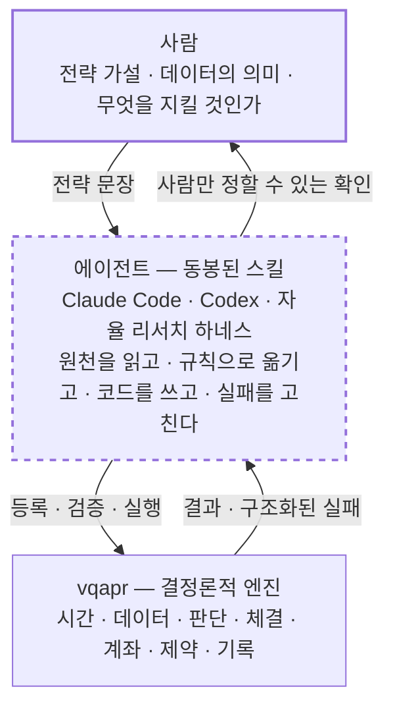
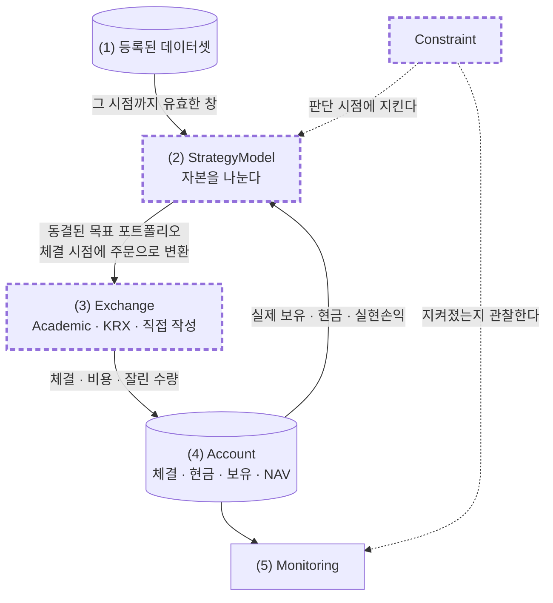
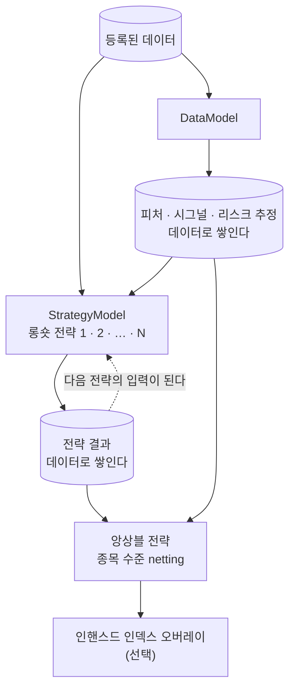

# vqapr

> 🌐 **English** → [README.en.md](README.en.md)

**v**ibe **q**uant **a**sset **p**ricing / **a**lpha **p**ortfolio **r**esearch

**말로 하는 퀀트 전략 리서치 프레임워크입니다.**
전략은 말로 설명하고, 코딩 에이전트가 그것을 규칙과 코드로 옮기고, 프레임워크가 결정론적으로 검증하고 실행합니다.

<!-- ─────────── DEMO PLACEHOLDER 1 ─────────── -->
> 🎬 **데모 1 — 빈 폴더에서 데이터 등록까지** *(녹화 예정)*
>
> 처음 보는 CSV 몇 개를 가리키기만 하면, 에이전트가 파일을 열어보고 축·시점·체결 조건의 후보를 근거와 함께
> 제시합니다. 사용자가 확정하면 등록이 끝납니다.
>
> `docs/assets/demo-01-register.gif`
<!-- ─────────────────────────────────────────── -->

---

## 프레임워크의 특징

### Claude Code · Codex 등 코딩 에이전트 사용 최적화

- 프레임워크 사용법을 담은 **스킬이 내장되어 있습니다.** 설치하면 AI 에이전트가 곧바로 프레임워크를 다룹니다.
- 전략을 추상적으로 말해도 됩니다. 에이전트가 사용자와 인터뷰하며 구체적인 규칙으로 만들고, 데이터 등록부터
  실행과 리포트까지 처리합니다.

### 사용자가 커스터마이징하는 네 가지

- 전략은 사용자가 AI와 함께 짭니다. 내장 전략은 없습니다.
- 네 가지 요소를 직접 만들어 끼울 수 있습니다.
  - `StrategyModel` — 자본을 어떻게 나눌 것인가
  - `DataModel` — 여러 전략이 나눠 쓸 피처·시그널·리스크 추정
  - `Exchange` — 어느 시장에서 어떤 규칙으로 체결되는가
  - `Constraint` — 무엇을 지켜야 하는가
- 내장으로 제공하는 것은 자주 쓰지만 틀리기 쉬운 계산뿐입니다.
  - Fama-French 브레이크포인트 — 기준 시장에서 컷포인트를 잡아 전체 유니버스에 적용
  - 중립화 — 시그널에서 시장·섹터·사이즈 노출을 회귀로 걷어내고 잔차만 남김(시총가중 회귀 지원)
  - 가중 배분 — 동일가중, 크기비례, 시그널비례 배분과 예산 재조정
  - 정수 수량 변환 — 목표 비중을 거래 단위에 맞춰 떨어뜨리기

### 중요한 결정은 사용자와의 인터뷰로 확정

- 전략이나 데이터에 불분명한 부분이 있으면 에이전트가 사용자와 함께 결정합니다. 예를 들어 재무제표를 언제부터
  알 수 있었다고 볼 것인지는 사용자가 확정합니다.
- 프레임워크는 추측하지 않습니다. 빠진 값을 비슷한 것으로 대체하지 않고, 모르면 결과를 만들기 전에 멈춥니다.

### Loop 기반 백테스팅 엔진

- 전략은 **정해진 lookback의 데이터를 받아 종목별 가중치를 내는 것**으로 일반화됩니다.
- 전략은 stateful합니다. 이전 판단과 결과를 memory에 남길 수 있어 손절 같은 path-dependent 전략을
  구현할 수 있습니다.
- 가중치는 주문으로 나가고, 거래소별 조건(수수료·세금·정수 수량·거래정지·현금)에 따라 체결되거나 못 됩니다.
  **그 결과가 계좌에 반영되어 다음 판단으로 되돌아옵니다.**
- 전략은 그 시점에 available했던 데이터만 볼 수 있도록 엔진이 강제합니다.
  **forward-looking(look-ahead) bias가 원천 차단됩니다.**

### BYOD — Bring Your Own Data

- 임의의 데이터를 가져와 등록해 쓸 수 있습니다. 벤더 커넥터도 번들 데이터셋도 없습니다.
- 등록할 때 정하는 것은 데이터의 의미입니다.
  - `available_at` — 각 값을 언제부터 쓸 수 있었는가
  - 체결 데이터라면 언제 얼마에 체결되는 것으로 볼 것인가
  - 어떤 종목코드가 주식이고 어떤 것이 ETF인가
- 사용자가 이것을 정해주면 등록은 에이전트가 합니다.

### 전략(알파) 팩토리 구조

- 등록한 데이터, 만든 피처, 돌린 전략과 그 결과가 **실패한 시도까지 전부 기록으로 남습니다.**
- 전략의 결과는 다시 데이터가 되어 다음 전략이 씁니다. 롱숏 전략을 쌓아 풀을 만들고, 앙상블하고,
  필요하면 인핸스드 인덱스 위에 얹습니다. → [전략 팩토리](#전략-팩토리)

---

## 프레임워크 구조



**사람**은 의미를 정합니다. 무슨 가설을 검증할지, 이 데이터가 무엇인지, 언제부터 알 수 있었는지, 무엇을
제약으로 둘지. 결과의 의미를 바꾸는 결정은 전부 여기에 있습니다.

**에이전트**는 동봉된 스킬을 읽습니다. 원천 파일은 에이전트가 자기 도구로 직접 열어보고, 실패가 나면 그 실패를
읽고 고칩니다. 이 자리에 사람이 앉아 대화할 수도, 자율 하네스가 앉아 가설 루프를 돌 수도 있습니다.

**엔진**은 판정하고 실행합니다.

---

## 백테스트 구조



> 점선 굵은 테두리가 프로젝트가 로컬 코드로 갈아끼우는 자리입니다.

**(1) 등록된 데이터셋** — 준비된 표입니다. 전략은 저장소를 직접 열지 않고 필요한 것을 선언하며, 엔진이 그
시점의 창을 잘라 건넵니다.

**(2) StrategyModel** — 전략이 사는 곳입니다. 그 시점의 데이터 창과 **자기 계좌의 실제 이력**을 읽고 판단합니다.
판단은 반드시 **동결된 목표 포트폴리오 하나**로 확정되고, 롱숏이든 롱온리든 같은 문을 지납니다. 제약이 선언되어
있으면 여기서 그 한계 안의 최선을 만듭니다.

**주문 변환** — 주문은 판단 시점이 아니라 **체결 시점에** 만들어집니다. 그 시점의 실제 보유·현금, 그 시점의
거래 가능 여부와 가격을 씁니다. 종목별 요청 수량과 체결 수량, 잘린 사유가 전부 남습니다.

**(3) Exchange — 현실성이 정해지는 곳입니다.** `Academic`은 부호 있는 소수점 수량을 비용 0으로 전량
체결합니다(가상임을 명시합니다). `KRX`는 정수 수량, 시점별로 유효한 수수료·세금, 비용을 포함한 현금 부족 시
수량 클리핑을 적용합니다. 다른 시장 규칙이 필요하면 직접 씁니다. **이름이 현실성을 주장하지 않습니다** —
구현된 규칙과 명시한 한계만 주장합니다.

**(4) Account — 유일한 권위입니다.** 체결된 것, 실제 현금, 실제 보유, 그 평가와 이력. 목표도 주문도 권위가
아닙니다. *의도 ≠ 주문 ≠ 체결 ≠ 계좌 반영* — 이 넷은 결과에서 끝까지 구분됩니다. "판단하지 않음"과
"판단해서 그대로 유지"와 "주문했지만 하나도 체결 안 됨"은 같은 빈 값이 아닙니다.
다음 판단은 여기서 시작합니다. 이것이 닫힌 고리입니다.

**(5) Monitoring** — 판단과 독립된 주기로 계좌를 관찰합니다. 가격이 움직여 비중이 한도를 넘었다면 그날 주문이
하나도 없어도 위반으로 기록됩니다. 관찰은 계좌를 고치지 않고, **한도를 넘었다고 실행을 중단하지도 않습니다** —
그러면 그 전략이 실제로 무엇을 하는지 끝까지 볼 수 없습니다.

미래는 이 그림에서 두 곳이 막습니다. (1)이 그 시점의 창만 건네고, 체결 정보가 (2)에 보이지 않습니다.
다만 **체결 가격이 실제로 언제 관측된 값인지**는 데이터에 없어 엔진이 판정하지 못합니다. 그 자리는 에이전트가
경고하고 사용자가 확정하며 결과에 한계로 남습니다.

---

## 전략 팩토리

vqapr가 겨냥하는 것은 백테스트 한 번이 아니라 **전략을 쌓고 조합하는 연구 사이클**입니다.
피처도 전략 결과도 시점이 붙은 데이터로 쌓이기 때문에, 지난 연구가 다음 연구의 입력이 됩니다.



1. **피처를 만듭니다.** 시가총액, 베타, 예측값, 팩터 노출처럼 여러 전략이 나눠 쓸 값을 `DataModel`이 한 번만
   계산하고, 그 결과는 다시 데이터가 되어 같은 방식으로 읽힙니다. 필수 단계는 아닙니다 — 전략이 직접 계산해도
   됩니다.
2. **롱숏 전략을 여러 개 만듭니다.** 부호 있는 횡단면 판단이 기본 연구 자산입니다. 실제로 공매도가 어렵다는
   이유로 연구 의도를 미리 롱온리로 축소하지 않으며, 실현되지 않은 숏 의도와 제약에 잘린 잔여는 따로 남습니다.
3. **풀이 쌓입니다.** 각 전략의 결과도 시점이 붙은 데이터입니다. 기존 것들과의 상관·중첩·증분 기여를 볼 수
   있고, 실패한 시도도 이유와 함께 남습니다. 데이터·피처·지난 전략 결과를 섞어 새 전략을 만들 수 있습니다.
4. **앙상블합니다.** 저장된 전략들을 구성원으로 참조해 종목 수준에서 netting한 하나의 판단을 만듭니다.
   구성원을 다시 계산하지 않고 저장된 결과를 읽습니다.
5. **필요하면 인핸스드 인덱스 위에 얹습니다.** 벤치마크 대비 액티브 비중으로 실물 롱온리 포트폴리오를
   구성하고 단일종목 상한 같은 제약을 반영합니다. 선택 단계이며, 단독 전략도 앙상블도 그대로 실행할 수 있습니다.

<!-- ─────────── DEMO PLACEHOLDER 2 ─────────── -->
> 🎬 **데모 2 — 전략 문장에서 결과 리포트까지** *(녹화 예정)*
>
> 등록된 데이터 위에서 전략을 만들고, 검증하고, 실행하고, 결과와 그 결과가 의존한 데이터를 읽기까지 한 번의
> 대화입니다.
>
> `docs/assets/demo-02-strategy.gif`
<!-- ─────────────────────────────────────────── -->

---

## 시작하기

```bash
uv add "vqapr @ git+https://github.com/jaepil-choi/vqapr@master"
uv run vqapr skill install
```

두 줄이 전부입니다. 아직 PyPI에 올리기 전이라 GitHub의 release 브랜치에서 직접 설치합니다.
첫 줄이 엔진을 설치하고, **둘째 줄이 에이전트가 읽을 스킬을 프로젝트에 설치합니다.**
스킬이 없으면 에이전트는 이 프레임워크를 쓸 줄 모릅니다. 스킬은 `.agents/skills/vqapr/`에 놓이고,
`.claude/skills/`에는 그것을 가리키는 한 줄짜리 어댑터가 함께 놓입니다.
**기존 `AGENTS.md`나 `CLAUDE.md`는 건드리지 않습니다.** 무엇이 만들어질지 먼저 보려면 `--dry-run`을 붙입니다.

그다음부터는 문장으로 시작합니다.

```text
data/의 데이터를 등록해줘.
등록된 신호로 새로운 리버설 전략을 연구해줘.
저장된 전략들을 앙상블해서 롱온리 인핸스드 인덱스로 백테스트해줘.
이번 결과가 어떤 데이터와 신호에 의존하는지 보여줘.
```

패키지 소스를 열어볼 필요는 없습니다. 정상적인 사용을 위해 내부를 읽어야 한다면 그것은 제품의 결함입니다.

---

## FAQ

**일별만 되나요? 분 단위도 되나요?**
됩니다. **전략은 주기에 묶여 있지 않습니다.** 주기는 엔진에 박혀 있지 않고 등록한 데이터와 체결 선언에
있습니다. 관측·판단·체결·평가·관찰이 각각 다른 주기를 가질 수 있어서, 일별로 보고 평가하면서 월별로
리밸런스하고 매일 계좌를 관찰하는 구성이 그대로 표현됩니다. 분 단위 데이터와 분 단위 체결 테이블을 등록하면
같은 전략 코드가 분 단위로 돕니다. 다만 호가창·부분 체결·시장 충격은 모델링하지 않습니다.

**주식 말고 선물·채권·옵션도 되나요?**
지금은 **주식과 ETF**의 실물 체결입니다. 학술 연구용으로 **팩터**를 합성 단가로 사고팔 수 있고,
지수는 벤치마크처럼 참조만 합니다.
다른 자산군은 **추가할 예정**이며, 계약 단위·증거금·롤·쿠폰과 만기처럼 그 자산군 고유의 의미가 정의된 뒤에
들어옵니다. 목록에 이름만 늘리고 실제로는 주식처럼 다루는 방식은 하지 않습니다.

**공매도는요?**
부호 있는 롱숏은 **연구 의도로서 1급 시민**입니다. 반면 실물 공매도(차입·담보·마진)는 모델링하지 않으며,
가상 프로필의 음수 포지션은 결과에 *가상*으로 표시됩니다. 둘을 같은 능력으로 취급하지 않습니다.

**실제 주문을 낼 수 있나요?**
아닙니다. 브로커 연결, 인증, 상시 스케줄링, 주문 분할·재전송은 범위 밖입니다. 리서치와 시뮬레이션 엔진입니다.

---

## 참고

- 여러 전략을 만들어 조합하는 방식은 WorldQuant의 alpha factory 접근에서 영감을 얻었습니다.
- [Qlib](https://github.com/microsoft/qlib)과 [NautilusTrader](https://github.com/nautechsystems/nautilus_trader)의
  구조를 참고하였습니다.

---

## 라이선스

Apache License 2.0 — [`LICENSE`](LICENSE).
