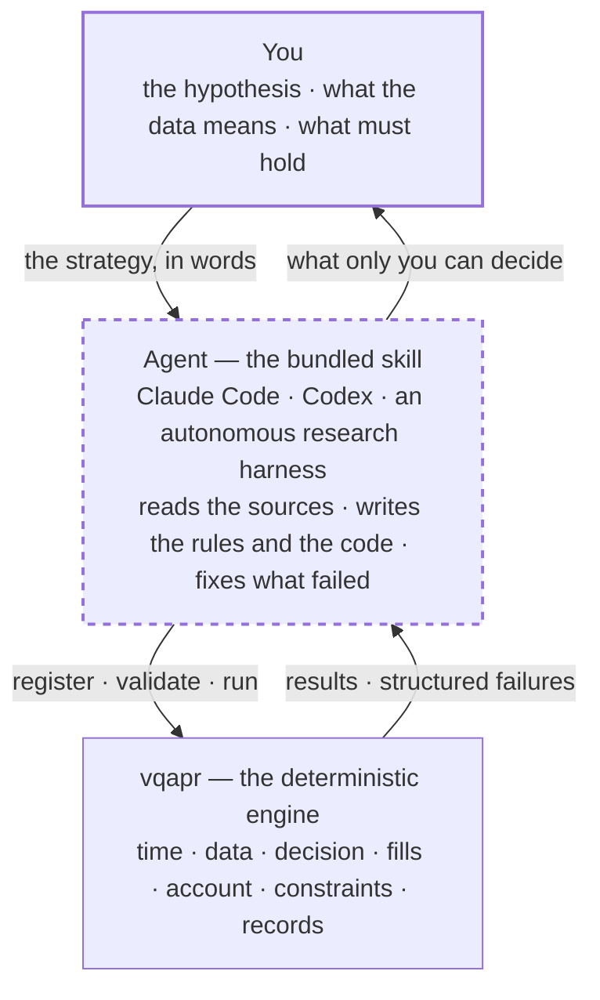
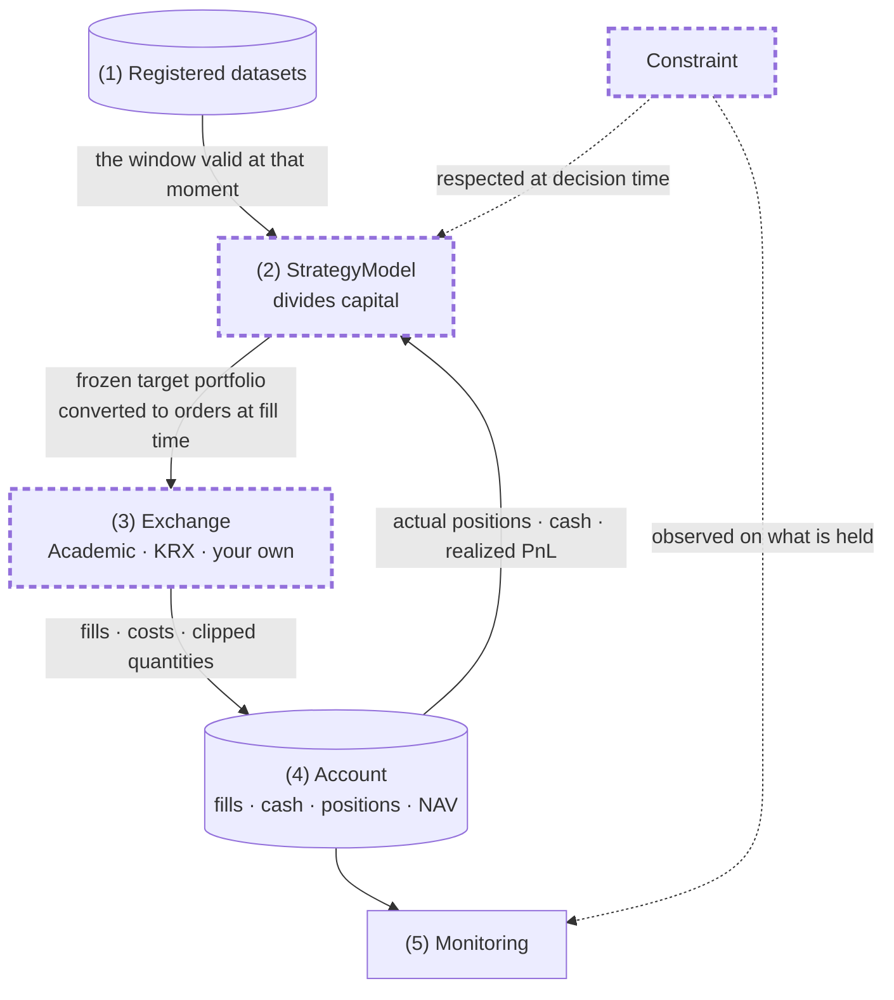
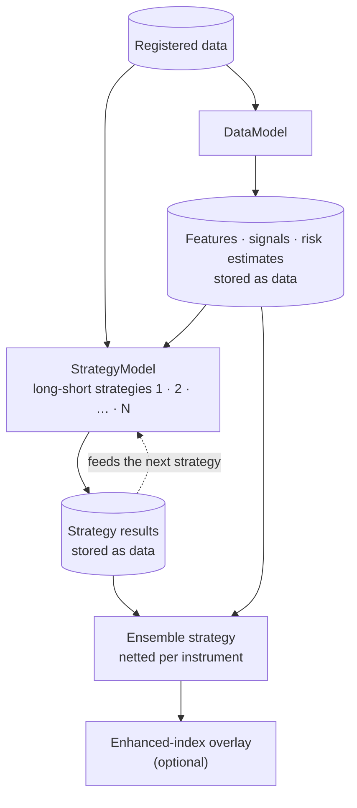

# vqapr

> 🌐 **한국어** → [README.md](README.md)

**v**ibe **q**uant **a**sset **p**ricing / **a**lpha **p**ortfolio **r**esearch

**A quant strategy research framework you drive by talking.**
You describe the strategy in plain language, a coding agent turns it into rules and code, and the
framework validates and runs it deterministically.

<!-- ─────────── DEMO PLACEHOLDER 1 ─────────── -->
> 🎬 **Demo 1 — from an empty folder to registered data** *(recording pending)*
>
> Point the agent at a few CSVs it has never seen. It opens them, proposes candidates for the axes,
> the availability timestamps and the fill conditions, with its reasons. You confirm, and
> registration is done.
>
> `docs/assets/demo-01-register.gif`
<!-- ─────────────────────────────────────────── -->

---

## What the framework is

### Built for coding agents — Claude Code, Codex, and the like

- **The skill that teaches the framework ships with it.** Install it and your AI agent can drive the
  framework immediately.
- You can state a strategy loosely. The agent interviews you into concrete rules and handles
  everything from data registration to running it and reporting the result.

### Four things you customize

- You write the strategy, together with your AI. There is no built-in strategy.
- Four components are yours to write and plug in.
  - `StrategyModel` — how capital is divided
  - `DataModel` — features, signals and risk estimates that several strategies share
  - `Exchange` — which venue fills orders, under which rules
  - `Constraint` — what must be respected
- What ships built in is only the arithmetic that is easy to get wrong.
  - Fama-French breakpoints — cut points taken on a reference market and applied to the universe
  - Neutralization — regress market, sector and size exposures out of a signal and keep the residual
    (weighted regression supported)
  - Weighting — equal, size-proportional and signal-proportional allocation, and budget rescaling
  - Integer quantity conversion — turning target weights into tradable lot sizes

### The decisions that matter are settled with you

- When something about the strategy or the data is ambiguous, the agent settles it with you. When a
  financial statement became knowable, for instance, is yours to decide.
- The framework never guesses. It does not substitute a similar value for a missing one, and when it
  does not know, it stops before producing a result.

### A loop-based backtesting engine

- A strategy is generalized as **taking a declared lookback of data and returning weights per
  instrument.**
- Strategies are stateful. They can keep prior decisions and outcomes in memory, which is what makes
  path-dependent strategies such as stop-loss expressible.
- Those weights leave as orders and are filled — or not — under the venue's rules: fees, taxes,
  integer quantities, halts, available cash. **The outcome lands in the account and comes back as
  the input to the next decision.**
- The engine enforces that a strategy sees only what was available at that moment.
  **Forward-looking (look-ahead) bias is structurally impossible.**

### BYOD — Bring Your Own Data

- Bring any data and register it. No vendor connectors, no bundled datasets.
- What you settle at registration is what the data means.
  - `available_at` — when each value became usable
  - for execution data, at what time and at what price a fill is taken to happen
  - which tickers are stocks and which are ETFs
- Once you have settled that, the agent does the registration.

### A strategy (alpha) factory

- Registered data, computed features, strategies you ran and what came out of them are all kept —
  **including the attempts that failed and why.**
- A strategy's output becomes data that the next strategy reads. Stack long-short strategies into a
  pool, ensemble them, and overlay them on an enhanced index if you want to.
  → [Strategy factory](#strategy-factory)

---

## How it is put together



**You** decide meaning: which hypothesis to test, what the data is, when it became knowable, what to
constrain. Every decision that changes what a result means lives here.

**The agent** reads the bundled skill. It opens your source files with its own tools, and when
something fails it reads the failure and fixes it. A person can sit in that seat and talk, or an
autonomous harness can sit there and run a hypothesis loop.

**The engine** decides whether things are valid, and runs them.

---

## How a backtest runs



> The dashed bold borders are what your project replaces with local code.

**(1) Registered datasets** — the tables you prepared. A strategy never opens the store; it declares
what it needs and the engine hands it the window valid at that moment.

**(2) StrategyModel** — where the strategy lives. It reads that window and **its own account
history**, then decides. The decision is always settled into **one frozen target portfolio**, long-short
or long-only alike. If constraints are declared, this is where the best portfolio within them is built.

**Order conversion** — orders are built at **fill time**, not at decision time, using the positions and
cash held then and the tradability and price of that moment. Requested and dealt quantities, and the
reason anything was clipped, are all kept.

**(3) Exchange — where realism is decided.** `Academic` fills signed fractional quantities in full at
zero cost, and says so — the result is marked hypothetical. `KRX` applies integer quantities,
effective-dated fees and taxes, and clips quantities when cost-inclusive cash falls short. Write your
own if your venue differs. **A name claims no realism** — only the rules implemented and the limits
stated.

**(4) Account — the only authority.** What was filled, the actual cash and positions, their marks and
their history. Neither the target nor the order is authoritative. *Intended ≠ requested ≠ dealt ≠
committed* — the four stay distinguishable in the result. "Did not decide", "decided to hold" and
"ordered but nothing filled" are not the same empty value.
The next decision starts here. That is the closed loop.

**(5) Monitoring** — watches the account on its own cadence, independent of decisions. If prices move
a position past its cap, the breach is recorded even on a day with no orders at all. Monitoring never
edits the account, and **never halts the run for a breach** — halting would hide what the strategy
actually does.

Two places in this picture keep the future out: (1) hands over only the window of that moment, and
execution information is invisible to (2). What the engine cannot judge is **when a fill price was
actually observed** — the data does not say. The agent warns about that, you decide, and it stays in
the result as a stated limitation.

---

## Strategy factory

What vqapr aims at is not one backtest but **a research cycle that accumulates and combines
strategies.** Features and strategy outputs alike are stored as data carrying their own timestamps,
so past research becomes the input to the next.



1. **Build features.** Market cap, beta, predictions, factor loadings — values several strategies
   share are computed once by a `DataModel`, and the output becomes data read the same way as any
   other. It is optional: a strategy may compute its own.
2. **Build several long-short strategies.** Signed cross-sectional judgement is the primary research
   asset. Research intent is not pre-shrunk to long-only because shorting is hard in practice;
   unrealized short intent and constraint residue are kept separately.
3. **The pool accumulates.** Each result is timestamped data. Correlation, overlap and incremental
   contribution against what already exists can be measured, failed attempts stay with their reasons,
   and a new strategy can mix raw data, features and earlier strategy results.
4. **Ensemble.** Reference stored strategies as members and net them per instrument into a single
   decision, reading the stored results rather than recomputing the members.
5. **Overlay on an enhanced index, if you want.** Build a physical long-only portfolio as active
   weights against a benchmark, respecting constraints such as a single-name cap. This step is
   optional — a single strategy or an ensemble runs just as well on its own.

<!-- ─────────── DEMO PLACEHOLDER 2 ─────────── -->
> 🎬 **Demo 2 — from a sentence to a result report** *(recording pending)*
>
> One conversation: write a strategy on the registered data, validate it, run it, and read the result
> along with the data it depended on.
>
> `docs/assets/demo-02-strategy.gif`
<!-- ─────────────────────────────────────────── -->

---

## Getting started

```bash
uv add "vqapr @ git+https://github.com/jaepil-choi/vqapr@master"
uv run vqapr skill install
```

Two lines. It is not on PyPI yet, so it installs from the release branch on GitHub. The first line
installs the engine; **the second installs the skill your agent reads.** Without the skill the agent
does not know how to use the framework. The skill goes to `.agents/skills/vqapr/`, with a one-line
adapter pointing at it under `.claude/skills/`. **Your `AGENTS.md` and `CLAUDE.md` are never
touched.** Add `--dry-run` to see the paths first.

From there you work in sentences.

```text
Register the data in data/.
Research a new reversal strategy from the registered signals.
Ensemble the stored strategies and backtest them as a long-only enhanced index.
Show me which data and signals this result depended on.
```

You never need to open the package source. If ordinary use requires reading it, that is a defect in
the product.

---

## FAQ

**Is it daily only, or does it do minute bars?**
It does. **Strategies are not tied to a frequency.** Frequency is not baked into the engine; it lives
in the data you register and the execution table you declare. Observation, decision, fills, valuation
and monitoring can each run on their own cadence, so observing and marking daily while rebalancing
monthly and monitoring the account every day is expressible as it stands. Register minute data and a
minute-level execution table and the same strategy code runs on minute bars. Order books, partial
fills and market impact are not modelled.

**What about futures, bonds and options?**
Today it is physical execution of **stocks and ETFs**. **Factors** can be traded against a synthetic
unit price for academic work, and indices are referenced — as benchmarks — rather than held.
Other asset classes **are planned**, and each arrives once its own semantics are defined: contract
size, margin, rolls, coupons and maturity. Adding a name to a list while treating it like a stock is
not how they will arrive.

**And shorting?**
Signed long-short is **a first-class research intent.** Physical shorting — borrow, collateral,
margin — is not modelled, and negative positions on the hypothetical profile are marked *hypothetical*
in the result. The two are never treated as the same capability.

**Can it send real orders?**
No. Broker connectivity, authentication, always-on scheduling and order slicing or replacement are
out of scope. This is a research and simulation engine.

---

## Acknowledgements

- The approach of building many strategies and combining them is inspired by WorldQuant's alpha
  factory.
- The structures of [Qlib](https://github.com/microsoft/qlib) and
  [NautilusTrader](https://github.com/nautechsystems/nautilus_trader) were a reference.

---

## License

Apache License 2.0 — [`LICENSE`](LICENSE).
