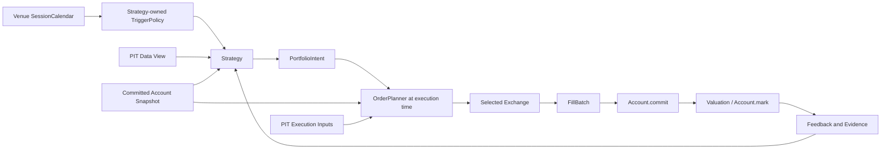

# vqapr Architecture

Status: target architecture for the clean rewrite
Product authority: the canonical vqapr PRD
Target package/import/CLI name: `vqapr`
Implementation status: not yet implemented; source migration starts only after this architecture is accepted

이 문서는 **vibe quant asset pricing / alpha portfolio research**를 뜻하는 `vqapr`의 목표 구조를 정의한다.
PRD가 요구하는 observable behavior와 use case가 authority이고, 이 문서의 class·module·event 이름은 그 요구를
구현하기 위한 concrete design이다. 구현이 이 문서와 다르면 구현을 현재 architecture로 간주하지 않는다.

## 1. 핵심 명제

### 1.1 모든 executable Strategy는 하나의 spine을 따른다



Peer momentum의 long-short와 5-day return top-10의 long-only는 **Strategy 내부 계산만 다르다.** 둘 다 public
execution boundary에서 `PortfolioIntent`를 반환하고, 이후 `OrderPlanner → Exchange → FillBatch → Account →
Valuation`을 그대로 통과한다.

Model-only, feature materialization, label, IC/RankIC, stored-result comparison과 report는 research operation이다.
이들은 portfolio return을 만들지 않으므로 execution spine 전에 끝날 수 있다. 반대로 portfolio return, NAV,
PnL 또는 turnover를 만드는 workflow가 spine을 우회하는 것은 금지한다.

### 1.2 `PortfolioIntent`만 executable portfolio target이다

Executable Strategy의 public output은 `PortfolioIntent` 하나다. `DecisionIntent`, `TARGET`/`RESEARCH_ONLY` action,
raw weight의 Exchange 직접 제출은 두지 않는다. Research-only 여부는 Strategy output의 action이 아니라 사용자가
선택한 workflow 종류로 구분한다.

Strategy 내부에서 signal, score, rank, weight를 어떤 순서와 타입으로 계산할지는 다음 설계 대화에서 확정할 수
있다. 그 선택은 외부 계약을 바꾸지 않는다.

```python
class Strategy(Protocol):
    def trigger(self) -> TriggerPolicy: ...
    def requirements(self) -> tuple[DataRequirement, ...]: ...
    def decide(self, context: StrategyContext) -> PortfolioIntent: ...
```

`PortfolioIntent`는 최소한 다음을 가진 immutable value다.

```python
class PortfolioIntent(BaseModel):
    intent_id: UUID
    strategy_id: str
    decision_time: datetime
    effective_after: datetime
    targets: tuple[PortfolioTarget, ...]
    cash_target: Decimal | None
    budget: BudgetSemantics
    source_refs: tuple[ArtifactRef, ...]
    account_version_seen: int
    strategy_state_ref: ArtifactRef | None
```

`PortfolioTarget`은 instrument와 target weight 또는 target quantity 중 정확히 하나를 표현한다. 둘을 동시에
채우거나 둘 다 비우면 validation error다. `PortfolioIntent`는 아직 order나 Fill이 아니고 actual holding을
바꾸지 않는다.

### 1.3 Profile 차이는 spine이 아니라 policy 차이다

Academic과 KRX-style daily simulation은 다음 interface를 공유한다.

- 동일한 `PortfolioIntent`
- 동일한 execution-time `OrderPlanner`
- 동일한 `OrderBatch`와 `FillBatch` envelope
- 동일한 `Account.commit(expected_version=...)`
- 동일한 valuation, history, feedback, failure와 evidence shape

다음 항목만 profile에 따라 달라진다.

- listing과 supported instrument
- permitted direction과 short realism
- instrument별 fractional/lot quantity rule
- execution event와 price rule
- tradability, cost, tax, slippage와 liquidity assumption
- compatible Account state-transition mode
- result limitation과 realism label

## 2. Authority와 layer

### 2.1 두 runtime authority

vqapr에는 서로 바꾸어 쓸 수 없는 두 상태 authority가 있다.

1. **Account authority**: committed Fill과 Mark가 만든 cash, position, cost, NAV와 history
2. **Strategy-state authority**: Strategy가 명시적으로 반환하고 commit한 bounded private state

`PortfolioIntent`, proposed post-trade state, constraint finding, requested order와 evidence는 authority가 아니다.
그것들은 의도·계산·감사 기록이다.

### 2.2 여섯 semantic layer

| layer | 질문 | 대표 module |
|---|---|---|
| Runtime | 언제 callback을 호출하는가 | `runtime.clock`, `runtime.calendar` |
| Data | 그 시점에 무엇을 읽을 수 있는가 | `data.registration`, `data.store`, `data.view` |
| Decision | Strategy가 어떤 portfolio를 의도하는가 | `strategy`, `portfolio` |
| Execution | intent가 어떤 order와 Fill이 되는가 | `orders`, `exchange` |
| State | Fill과 Mark가 실제 run state를 어떻게 바꾸는가 | `account`, `valuation` |
| Evidence | 무엇을 읽고 무엇이 일어났는가 | `evidence`, `artifacts` |

`flow`는 이 layer들을 조립하고 event를 배달하지만 경제 규칙을 소유하지 않는다.

## 3. 시간 모델

### 3.1 세 축을 분리한다

1. **Session time**: venue가 제공하는 eligible session date, open, close
2. **Event time**: Clock이 callback을 호출하는 timezone-aware timestamp
3. **Availability time**: observation을 처음 사용할 수 있는 `available_at`

Event timestamp가 dataset row에 존재할 필요는 없다. PIT read의 유일한 universal predicate는 다음이다.

$$
available\_at \le event.ts
$$

### 3.2 SessionCalendar는 venue fact다

```python
class Session(BaseModel):
    session_date: date
    open_at: datetime
    close_at: datetime

class SessionCalendar(Protocol):
    venue_id: str
    timezone: ZoneInfo
    def sessions(self, start: date, end: date) -> tuple[Session, ...]: ...
```

Strategy는 휴장일이나 session을 생성하지 않는다. 첫 구현은 다음 중 하나를 frozen run input으로 받는다.

- 명시적으로 전달한 session 목록
- run definition에 provider identity/version을 기록한 승인된 calendar provider의 결과

가격 row coverage, 특정 instrument의 결측, 단순 weekday 추정으로 session calendar를 만들지 않는다.

### 3.3 Trigger는 Strategy가 소유한다

```python
class EveryNSessions(BaseModel):
    n: int
    local_time: time = time(4, 0)
    timezone: str = "Asia/Seoul"
    anchor: date | None = None
```

`n=1`은 매 eligible session, `n=5`는 anchor부터 센 다섯 번째 eligible session마다 decision candidate를 만든다.
Flow가 `SessionCalendar`의 날짜와 Strategy의 `TriggerPolicy`를 결합해 DECISION event를 schedule한다. Strategy는
trigger를 선언하지만 Clock을 직접 진행시키거나 자신을 호출하지 않는다.

### 3.4 표준 daily-close timeline

```text
2024-03-05 15:30 Asia/Seoul
  close row becomes available

2024-03-06 04:00 Asia/Seoul
  Strategy decision event
  permitted rows: available_at <= 04:00
  PortfolioIntent is frozen

2024-03-06 15:30 Asia/Seoul
  next eligible close execution event
  OrderPlanner uses current Account + execution-time PIT inputs
  Exchange produces FillBatch
  Account commits, then valuation marks
```

`2024-03-05 04:00`에는 3월 5일 close를 읽을 수 없다. `2024-03-06 04:00` event는 data에 04:00 row가 없어도
Clock queue에 정상적으로 들어간다.

### 3.5 동일 timestamp 순서

동일 timestamp에서는 deterministic priority를 사용한다.

1. `DATA_AVAILABLE`
2. `DECISION`
3. `EXECUTION`
4. `FILL_COMMIT`
5. `VALUATION`
6. `MONITORING`
7. `FINALIZE`

같은 timestamp에 decision과 execution을 배치하려면 price availability를 별도로 증명해야 한다. Daily-close
default는 04:00 decision과 15:30 execution을 분리한다.

## 4. Data registration과 PIT View

### 4.1 최소 등록

```python
class DatasetRegistration(BaseModel):
    dataset_id: str
    instrument_field: str
    available_at: AvailabilityBinding
    key_fields: tuple[str, ...]
    fields: tuple[str, ...]
    source: SourceIdentity
```

Universal required semantics는 다음뿐이다.

- instrument binding
- `available_at` field 또는 user-confirmed derivation rule
- logical row key
- 선택한 data fields
- source identity와 provenance

`observation_time`은 universal field가 아니다. `fiscal_period`, `session_date`, `event_time`, `revision`,
`horizon_end`는 일반 column이며 필요한 component가 요구하고 해석한다.

Registration에는 `research_close`, `execution_price`, `valuation_price` 같은 consumer-purpose alias를 두지 않는다.
같은 `close` field도 Strategy, Exchange와 Valuation이 각자 자기 requirement로 선택한다.

### 4.2 component-owned requirement

```python
class DataRequirement(BaseModel):
    consumer_id: str
    dataset_id: str
    fields: tuple[str, ...]
    lookback: Lookback
    coverage: CoverageRequirement | None = None
```

- Strategy는 signal/feature/benchmark/constituent field와 lookback을 요구한다.
- OrderPlanner 또는 Exchange는 fill에 필요한 price, volume, tradability field를 요구한다.
- Valuation은 모든 held instrument를 mark할 field를 요구한다.

Flow의 `RequirementResolver`가 event마다 requirement를 resolve하고 bounded immutable View를 주입한다. Exchange나
Strategy가 Store를 직접 열어 PIT gate를 우회할 수 없다.

### 4.3 Store와 View

```python
class ObservationStore(Protocol):
    def query(self, query: BoundedQuery) -> ObservationBatch: ...

class StrategyView(Protocol):
    evaluation_time: datetime
    def observations(self, requirement: DataRequirement) -> ObservationBatch: ...
    def account(self) -> AccountSnapshot: ...
    def prior_feedback(self) -> tuple[ExecutionFeedback, ...]: ...
    def strategy_state(self) -> StrategyStateSnapshot | None: ...
```

`BoundedQuery`는 dataset, fields, instruments, lower bound/lookback, `available_at <= evaluation_time`을 모두 Store
query에 전달한다. 전체 history를 읽은 뒤 Strategy에서 slice하는 방식은 허용하지 않는다. View는 실제 access를
기록해 lineage를 만든다.

### 4.4 availability derivation example

Source에 date만 있고 그 값이 KRX daily close를 의미한다고 user가 확인했다면 registration rule이
`2024-03-05 -> 2024-03-05 15:30 Asia/Seoul`로 변환한다. Source date를 00:00으로 자동 해석하지 않는다.
Fundamental row가 어느 회계기간을 설명하는지는 `fiscal_period` column으로 Strategy가 요구하면 된다.

## 5. Strategy와 `PortfolioIntent`

### 5.1 StrategyContext

```python
class StrategyContext(Protocol):
    event: DecisionEvent
    view: StrategyView
    universe: UniverseSnapshot
    account: AccountSnapshot
    state: StrategyStateSnapshot | None
```

Strategy는 Context가 제공한 bounded surface만 읽는다. Clock, Store, Exchange, mutable Account를 직접 참조하지
않는다.

### 5.2 Portfolio construction 위치

Portfolio construction은 executable Strategy의 public boundary다. Built-in Strategy는 내부에서 reusable
`PortfolioConstructor`를 composition할 수 있고, user Strategy는 직접 construction할 수 있다. 어느 쪽이든
`decide()` 반환값은 `PortfolioIntent`다.

```python
class PortfolioConstructor(Protocol):
    def construct(
        self,
        research_values: object,
        context: PortfolioContext,
    ) -> PortfolioIntent: ...
```

`research_values`의 public 표준화 여부는 아직 확정하지 않는다. 이것이 signal인지 weight인지에 관한 결정은
Strategy 내부 composition API에만 영향을 주고 execution contract에는 영향을 주지 않는다.

### 5.3 Intent validation

`PortfolioIntent` 생성 시 다음을 검증한다.

- timezone-aware decision/effective time
- unique instrument target
- finite quantity/weight
- declared budget semantics
- source and account-version lineage
- selected execution profile과의 direction/instrument compatibility preflight

Fractional/lot validation은 하지 않는다. 그것은 execution venue가 instrument listing을 해석할 때 결정한다.

### 5.4 Hold도 `PortfolioIntent`다

Hold를 별도 action enum이나 `None`으로 표현하지 않는다. Strategy는 현재 committed portfolio와 같은 complete
target을 가진 `PortfolioIntent`를 반환한다. OrderPlanner가 execution 시점 state와 비교하면 delta가 0인
`OrderBatch`가 되고, intent와 no-trade diagnostic은 남지만 Fill이나 Account mutation은 생기지 않는다. 이렇게
하면 “판단하지 않음”, “판단해서 유지함”, “주문했지만 dealt 0”을 구분할 수 있다.

## 6. Order preparation

### 6.1 execution-time responsibility

```python
class OrderPlanner(Protocol):
    def requirements(self, intent: PortfolioIntent) -> tuple[DataRequirement, ...]: ...
    def plan(
        self,
        intent: PortfolioIntent,
        account: AccountSnapshot,
        market: ExecutionView,
        exchange_rules: ExchangeRulesView,
    ) -> OrderBatch: ...
```

OrderPlanner는 decision time의 stale quantity를 재사용하지 않는다. Execution event에서 읽은 committed position,
cash, execution price, tradability와 venue rule로 target delta를 physical order로 바꾼다.

각 `OrderRequest`는 다음을 가진다.

- instrument, side, requested quantity
- originating intent ID와 target
- account version seen
- conversion price와 data lineage
- rounding/clipping/skip diagnostic

`PortfolioIntent`를 다시 계산하거나 Strategy를 재호출하지 않는다.

### 6.2 atomic batch boundary

MVP decision은 하나의 `OrderBatch`다. Required price나 listing이 하나라도 없고 profile이 batch-atomic을 선언하면
Exchange 호출 전에 전체 batch가 실패한다. 부분 성공 policy는 future capability다.

## 7. Exchange

### 7.1 공통 계약

```python
class Exchange(Protocol):
    exchange_id: str
    calendar: SessionCalendar

    def rules(self, at: datetime, instruments: tuple[InstrumentId, ...]) -> ExchangeRulesView: ...
    def requirements(self, orders: OrderBatch) -> tuple[DataRequirement, ...]: ...
    def execute(
        self,
        event: ExecutionEvent,
        orders: OrderBatch,
        account: AccountSnapshot,
        market: ExecutionView,
    ) -> FillBatch: ...
```

Exchange는 Store를 직접 읽지 않는다. Flow가 Exchange requirement를 resolve한 `ExecutionView`만 전달한다.

### 7.2 Instrument-specific quantity rule

```python
class ListingRule(BaseModel):
    instrument_id: InstrumentId
    quantity_step: Decimal
    minimum_quantity: Decimal
    fractional_allowed: bool
    permitted_sides: frozenset[Side]
```

Fractional quantity는 Account mode가 아니라 **Exchange가 해당 venue의 Instrument listing에 대해** 결정한다.
같은 instrument도 academic venue에서는 `quantity_step=0.000001`, KRX profile에서는 `quantity_step=1`일 수 있다.
Exchange는 rounding 결과, requested/dealt quantity와 rule identity를 Fill diagnostic에 남긴다.

### 7.3 Academic profile

첫 fixture profile은 다음을 명시한다.

- signed direction 지원
- listing별 fractional quantity 허용 가능
- next eligible close의 exact PIT reference price
- full fill
- fee, tax, slippage, impact, borrow cost = 0
- borrow/locate/margin/collateral 미모델링
- result realism = `hypothetical`

Academic profile도 `OrderBatch -> FillBatch -> Account.commit -> mark`를 그대로 따른다.

### 7.4 KRX daily physical-simulation profile

첫 fixture profile은 다음을 명시한다.

- long-only equity/ETF
- listing의 integer lot/quantity step
- next eligible close price
- supported order full fill
- effective-dated fee/tax
- cost-aware cash clipping
- partial fill, volume impact, actual settlement 미모델링
- result realism = `simulation`

“KRX”라는 label 자체가 실제 거래소 완전 재현을 뜻하지 않는다. 구현된 rule과 limitation만 주장한다.

### 7.5 FillBatch

`FillBatch`는 requested/dealt quantity, price, fee/tax/cost, reason, listing rule, execution data lineage, exchange ID,
intent ID와 order batch ID를 가진다. Zero-dealt와 rejected order를 Fill로 가장하지 않는다.

## 8. Account

### 8.1 하나의 aggregate

```python
class AccountMode(str, Enum):
    LONG_ONLY = "long_only"
    SIGNED = "signed"

class Account:
    def snapshot(self) -> AccountSnapshot: ...
    def commit(self, fills: FillBatch, *, expected_version: int) -> AccountSnapshot: ...
    def mark(self, marks: MarkBatch, *, expected_version: int) -> AccountSnapshot: ...
    def history(self, query: AccountHistoryQuery) -> AccountHistory: ...
```

Account는 mode와 무관하게 같은 cash, position, cost, version, journal, snapshot과 history 구조를 사용한다.
Mode는 run 시작 시 동결되고 중간에 바뀌지 않는다.

### 8.2 mode별 차이는 state-transition validity뿐이다

- `LONG_ONLY`: FillBatch 적용 후 어떤 position도 0보다 작을 수 없다.
- `SIGNED`: FillBatch 적용 후 negative position을 허용한다.

이 차이만 mode-specific이다. AccountMode는 fractional 허용, lot size, rounding, listing, price source, cost와 fill
timing을 결정하지 않는다.

공통 validation은 expected version, finite amount, known instrument/currency, batch integrity, cash arithmetic와
journal consistency다. Validation 실패 시 position, cash, version과 journal을 하나도 바꾸지 않는다.

### 8.3 Exchange와 Account의 이중 방어

Exchange는 venue 규칙에 맞는 Fill만 만든다. Account는 그 Fill을 신뢰해 무조건 적용하지 않고 자신의 frozen
state-transition mode와 공통 accounting invariant를 마지막으로 검증한다. 예를 들어 signed Academic Fill을
`LONG_ONLY` Account에 commit하면 mutation 전에 실패한다.

### 8.4 valuation

Valuation은 held instrument 전체를 요구한다. `ValuationService.requirements(snapshot)`가 필요한 field를 선언하고,
Flow가 PIT MarkView를 공급한다. 일부 held instrument의 mark가 없으면 NAV를 추정하지 않고 `MarkBatch` commit 전에
실패한다.

## 9. Flow와 event-driven IoC

### 9.1 Flow 책임

`SimulationFlow`는 하나만 둔다.

- run definition freeze와 compatibility preflight
- SessionCalendar + Strategy TriggerPolicy schedule 조립
- event dispatch와 동일 timestamp ordering
- component requirement resolution과 bounded View 생성
- Strategy 호출과 `PortfolioIntent` publication
- execution event에서 OrderPlanner/Exchange 호출
- FillBatch와 MarkBatch Account commit
- feedback, evidence와 finalization

Academic용 Flow와 KRX용 Flow를 따로 만들지 않는다. Exchange, AccountMode, policies와 calendar를 주입한다.

### 9.2 callback shape

```python
class SimulationFlow:
    def on_decision(self, event: DecisionEvent) -> None: ...
    def on_execution(self, event: ExecutionEvent) -> None: ...
    def on_fill_commit(self, event: FillCommitEvent) -> None: ...
    def on_valuation(self, event: ValuationEvent) -> None: ...
    def on_monitoring(self, event: MonitoringEvent) -> None: ...
    def on_finalize(self, event: FinalizeEvent) -> RunResult: ...
```

Clock은 callback을 호출할 뿐 Strategy나 Exchange 의미를 알지 못한다. Component는 다음 component를 직접 호출하지
않고 결과를 Flow에 반환한다.

### 9.3 event state machine

```text
CREATED
  -> PREFLIGHTED
  -> RUNNING
       DECISION -> INTENT_FROZEN
       INTENT_FROZEN -> EXECUTION_READY
       EXECUTION_READY -> FILLS_PRODUCED
       FILLS_PRODUCED -> ACCOUNT_COMMITTED
       ACCOUNT_COMMITTED -> MARKED
       MARKED -> FEEDBACK_PUBLISHED
       ... repeat ...
  -> FINALIZED

any pre-commit step -> FAILED_WITHOUT_MUTATION
post-commit publication failure -> FAILED_AFTER_COMMIT(account_version recorded)
```

Failure를 warning-and-skip으로 숨기지 않는다. Retry는 같은 operation identity와 expected Account version에서만
idempotent해야 한다. Interrupted-run resume는 future scope다.

## 10. Evidence와 artifact

### 10.1 evidence는 영수증이다

Evidence는 authority가 아니라 “무엇을 보고 어떤 계산과 state transition이 일어났는지”를 보여주는 영수증이다.
최소 lineage chain은 다음과 같다.

```text
data access
-> Strategy + trigger
-> PortfolioIntent
-> OrderBatch conversion
-> Exchange rules + execution inputs
-> FillBatch
-> Account version before/after
-> MarkBatch
-> feedback / performance / limitations
```

서로 경제적으로 다른 cadence, calendar, Strategy version, Exchange profile, AccountMode 또는 data source를 같은
run으로 취급하지 않는다. 이를 구현하는 hash를 public product 용어로 강제하지 않으며, immutable run definition과
dependency identity로 비교 가능하게 만든다.

### 10.2 publication

Portable artifact는 producer private class 없이 읽고 validation할 수 있어야 한다. Success publication은 envelope,
payload와 catalog record가 완결된 뒤에만 visible하다. Failure artifact는 성공 결과와 구분하고 mutation 여부와
account version을 기록한다.

### 10.3 intended와 realized 분리

Report는 최소한 다음을 나란히 보여준다.

- intended target
- requested order
- dealt quantity와 Fill
- committed position/cash/NAV
- rounding, clipping, rejection, missing-data reason
- selected profile, AccountMode와 realism limitation

## 11. 두 Strategy walkthrough

### 11.1 공통 fixture

- Venue sessions: 2024-03-05, 2024-03-06
- Daily close available at each session close 15:30 Asia/Seoul
- Strategy trigger: every eligible session at 04:00 Asia/Seoul
- Decision: 2024-03-06 04:00, using data through 2024-03-05 15:30
- Execution: 2024-03-06 15:30

### 11.2 Peer momentum long-short

1. StrategyView에서 peer group과 5-day returns를 읽는다.
2. Strategy 내부에서 peer-relative rank를 계산한다.
3. Portfolio construction이 winner long, loser short, gross 200%, net 0% target을 만든다.
4. Strategy는 signed `PortfolioIntent`를 반환한다.
5. OrderPlanner가 15:30의 signed Account snapshot과 exact execution price로 quantity delta를 만든다.
6. Academic Exchange가 listing별 fractional rule로 FillBatch를 만든다.
7. `SIGNED` Account가 negative position을 허용해 atomic commit한다.
8. Valuation이 NAV, gross/net exposure, PnL과 turnover를 mark한다.
9. 다음 04:00 decision은 이 committed hypothetical state와 Fill feedback을 읽는다.

### 11.3 5-day return top 10 long-only

1. StrategyView에서 같은 5-day return input을 읽는다.
2. Strategy 내부에서 상위 10종목을 고른다.
3. Portfolio construction이 각 10%, cash 0%의 long-only target을 만든다.
4. Strategy는 long-only `PortfolioIntent`를 반환한다.
5. 같은 OrderPlanner가 15:30 Account snapshot과 price로 quantity delta를 만든다.
6. KRX Exchange가 instrument listing의 integer step, cost와 cash clipping을 적용해 FillBatch를 만든다.
7. `LONG_ONLY` Account가 negative position 없는 전이를 atomic commit한다.
8. 같은 Valuation과 feedback path를 따른다.

차이는 3, 6, 7의 policy다. Flow와 lifecycle은 같다. Peer momentum이 반드시 Academic이고 top-10이 반드시 KRX인
것도 아니다. Compatible한 intent/profile/mode 조합이면 같은 Strategy intent를 다른 profile에서 별도 run으로
비교할 수 있다.

## 12. Package layout

```text
src/vqapr/
├── domain/              # shared immutable IDs, money, instrument, errors
├── runtime/
│   ├── clock.py         # deterministic event queue
│   ├── events.py        # typed events and priorities
│   └── calendar.py      # Session and SessionCalendar contracts
├── data/
│   ├── registration.py  # minimal registration
│   ├── requirements.py  # component-owned DataRequirement
│   ├── store.py         # PIT query port
│   └── view.py          # bounded role views and access lineage
├── strategy/
│   ├── base.py          # Strategy protocol
│   ├── trigger.py       # TriggerPolicy, EveryNSessions
│   └── context.py       # StrategyContext
├── portfolio/
│   ├── intent.py        # PortfolioIntent, PortfolioTarget
│   └── construction.py  # reusable construction policies
├── orders/
│   ├── planner.py       # execution-time target-to-order conversion
│   └── contracts.py     # OrderRequest, OrderBatch
├── exchange/
│   ├── base.py          # Exchange protocol, ListingRule
│   ├── academic.py      # hypothetical signed profile
│   └── krx_daily.py     # KRX-style daily simulation profile
├── account/
│   ├── aggregate.py     # Account commit/mark authority
│   ├── mode.py          # LONG_ONLY/SIGNED transition validity
│   ├── snapshot.py      # AccountSnapshot and history
│   └── journal.py       # atomic state transition record
├── valuation/
│   ├── service.py       # held-instrument requirements and MarkBatch
│   └── performance.py   # NAV/PnL/return from committed state only
├── flow/
│   ├── simulation.py    # one common executable coordinator
│   ├── resolver.py      # requirement resolution and View assembly
│   └── run.py           # frozen RunDefinition and RunResult
├── evidence/
│   ├── lineage.py       # access and dependency graph
│   └── artifacts.py     # portable publication envelope
├── research/            # model/materialization/analysis operations without execution claims
├── project/             # user config, registry and assembly
└── public.py            # documented installed-package facade
```

### 12.1 의존 방향

```text
domain <- runtime/data/portfolio/orders/account
domain + ports <- strategy/exchange/valuation/research
all component ports <- flow
flow + project assembly <- public facade
```

`domain`은 storage, pandas, provider 또는 concrete Exchange를 import하지 않는다. `strategy`는 `exchange`와 mutable
`account`를 import하지 않는다. `exchange`는 Store를 import하지 않는다. `account`는 Strategy와 Exchange 구현을
import하지 않는다.

## 13. Configuration과 compatibility preflight

```python
class RunDefinition(BaseModel):
    run_id: UUID
    strategy: ComponentRef
    exchange: ComponentRef
    account_mode: AccountMode
    calendar: CalendarRef
    start: datetime
    end: datetime
    initial_account: AccountSnapshot
    dataset_bindings: tuple[DatasetBindingRef, ...]
    policies: tuple[PolicyRef, ...]
```

Run 시작 전에 다음을 검사하고 freeze한다.

- Strategy trigger timezone과 calendar timezone compatibility
- Portfolio direction과 Exchange permitted side compatibility
- Exchange와 AccountMode compatibility
- instrument listing과 quantity rule availability
- component data requirement satisfiability
- initial account invariant
- event schedule determinism

Preflight 성공 후 project config 변경은 해당 run에 영향을 주지 않는다.

## 14. Failure taxonomy

| code family | 의미 | mutation |
|---|---|---|
| `DATA_*` | required field, coverage, PIT input 부족 | 없음 |
| `CALENDAR_*` | session/calendar/timezone 불일치 | 없음 |
| `INTENT_*` | invalid portfolio target/budget/lineage | 없음 |
| `ORDER_*` | target conversion 불가 | 없음 |
| `EXCHANGE_*` | listing, side, quantity, cost, price rule 불가 | 없음 |
| `ACCOUNT_*` | version conflict 또는 invalid state transition | 없음 |
| `VALUATION_*` | held instrument mark 불가 | Fill commit 가능; exact version 기록 |
| `PUBLICATION_*` | artifact publication 불완전 | authority 변화 여부 기록 |

모든 error는 operation, event time, failed requirement, mutation 여부, retry precondition과 correlation identity를
가진다. 비슷한 field, 이전 price, 다른 cost policy로 silent fallback하지 않는다.

## 15. PRD traceability

| PRD requirement/use case | architecture path |
|---|---|
| `UC-DATA-001`, `UC-DATA-002`, `UC-PIT-001`, `UC-ERROR-001`, `GAP-MATERIALIZATION-PIT-001` | §4 registration → progressive requirement → bounded Store query; §14 structured failure |
| `UC-AGENT-001` | §4/§14 machine-readable requirement gap를 public agent guidance가 설명하되 의미를 추측하지 않음 |
| `UC-TRIGGER-001`, `GAP-TIME-001` | §3 Strategy TriggerPolicy + frozen SessionCalendar + Clock |
| `UC-SIGNAL-001`, `UC-SIGNAL-002`, `UC-ENSEMBLE-001`, `UC-STATE-001` | §5 StrategyContext/Strategy + separate strategy-state authority |
| `UC-ALPHA-BUDGET-001`, `UC-ALPHA-PATH-001`, `UC-ALPHA-CHILD-001`, `UC-ALPHA-ADAPTIVE-001` | §5 immutable intent/source state + §9 feedback and isolated run definition |
| `UC-PORTFOLIO-001` | §5 sole `PortfolioIntent` executable boundary |
| `UC-CONSTRAINT-001`, `UC-CONSTRAINT-002`, `UC-CONSTRAINT-ADJUST-001` | optional construction policy inside §5; missing inputs fail through §4/§14 before mutation |
| `UC-EXEC-001`, `UC-EXEC-002`, `GAP-EXECUTION-PREPARATION-001` | §6 execution-time OrderPlanner → §7 Exchange |
| `UC-ACADEMIC-001`, `GAP-DIRECTION-001` | §7.3 Academic Exchange + §8 `SIGNED` Account |
| `UC-COST-001`, `UC-COST-002`, `UC-COST-003`, `UC-COST-004`, `UC-CLOSED-LOOP-001`, `UC-SCALE-001` | §7 effective rules/batch → §8 atomic commit → §9 feedback |
| `UC-ACCOUNT-HISTORY-001`, `UC-EXEC-003` | §8 snapshot/history + independent monitoring event |
| `UC-MONITOR-001` | §9 independent MONITORING callback + §10 finding evidence |
| `UC-LOOKTHROUGH-001`, `UC-LOOKTHROUGH-002`, `UC-LOOKTHROUGH-003` | Strategy-owned §4 requirement and §5 calculation; no Instrument auto-expansion |
| `UC-ARTIFACT-001`, `UC-ARTIFACT-002`, `UC-RESEARCH-001`, `UC-REPORT-001` | §10 portable lineage/publication and intended-realized split |
| `UC-EXTENSION-001`, `UC-EXTENSION-002` | §12 inward ports/public facade; local producer must return and validate the same public contracts |
| `UC-PROD-001`, `UC-PROD-002` | future OMS adapter must preserve §7 order/fill distinction and §8 authority; not current implementation |
| `UC-FUTURE-001`, `UC-PERP-001`, `UC-CASHFLOW-001`, `UC-SETTLEMENT-001` | future lifecycle/cash-flow ports; current Exchange/Account algorithms explicitly reject unsupported semantics |

Stable `GAP-*` acceptance inventory도 다음 target boundary로 추적한다.

| GAP acceptance ID | architecture path |
|---|---|
| `GAP-ONBOARD-001`, `GAP-PROJECT-CONFIGURATION-001`, `GAP-PUBLIC-FACADE-001` | §12 public/project assembly + §13 frozen incremental run definition |
| `GAP-LOOKBACK-001`, `GAP-RETURN-AUTHORITY-001` | §4 bounded query + §1 research/execution return boundary |
| `GAP-CONSTRAINT-001`, `GAP-MONITOR-001` | §5 construction policy + §9 independent monitoring callback |
| `GAP-EXCHANGE-BASE-001`, `GAP-IMPACT-001`, `GAP-REAL-SHORT-001` | §7 common Exchange and explicit unsupported realism boundaries |
| `GAP-EXECUTION-CONVENTION-001`, `GAP-EXECUTION-FEEDBACK-001` | §3 execution schedule + §9 committed feedback loop |
| `GAP-ACCOUNT-HISTORY-001`, `GAP-STRATEGY-STATE-001` | §2 separate authorities + §8 common Account history |
| `GAP-STRATEGY-COMPOSITION-001` | §5 immutable member/source lineage and sole intent boundary |
| `GAP-CATALOG-001` | §10 atomic portable publication |
| `GAP-RECOVERY-001` | §9 failure state records mutation/version; interrupted-run resume remains future scope |

## 16. Rewrite order

이 architecture가 승인된 뒤 구현은 기존 source를 조금씩 호환시키는 방식이 아니라 다음 vertical slices로 다시 만든다.

1. `domain` + `runtime` + explicit `SessionCalendar`
2. minimal `data` registration/requirement/PIT View
3. `Account` aggregate, `AccountMode`, Fill/Mark commit
4. `PortfolioIntent` + `OrderPlanner`
5. common `Exchange` contract + Academic fixture
6. one `SimulationFlow` closed loop
7. KRX daily profile
8. peer momentum and top-10 showcases on the same public spine
9. artifacts, reports, installed-package facade and external-consumer test
10. package metadata/import/CLI migration to `vqapr`

중간 단계에서 두 번째 executable Flow, legacy intent adapter 또는 Account fork를 만들지 않는다. Temporary adapter가
불가피하면 public surface 밖에 두고 제거 조건과 test를 같은 implementation record에 기록한다.

## 17. 아직 열어 둔 한 가지 결정

**Strategy 내부 research value의 표준 shape**는 아직 확정하지 않는다. Signal, score, rank, signed weight 중 무엇을
first-class reusable value로 둘지 다음 architecture discussion에서 결정한다. 다만 다음은 이미 확정되어 있어 이
결정 때문에 downstream을 다시 설계하지 않는다.

- executable Strategy의 public result는 `PortfolioIntent`
- portfolio construction은 Strategy boundary 안에서 반드시 완료
- OrderPlanner는 `PortfolioIntent`만 소비
- Exchange는 `OrderBatch`만 소비
- Account는 `FillBatch`와 `MarkBatch`만 commit

## 18. Acceptance checklist

- [ ] Peer momentum과 top-10이 같은 `SimulationFlow`와 event sequence를 사용한다.
- [ ] 두 Strategy 모두 `PortfolioIntent`만 execution boundary에 반환한다.
- [ ] `EveryNSessions`와 04:00 decision event가 explicit calendar에서 생성된다.
- [ ] 04:00 event는 data row 없이 schedule되고 PIT cutoff만 data visibility를 결정한다.
- [ ] registration의 universal time field는 `available_at`뿐이다.
- [ ] Strategy, Exchange, Valuation이 자신의 field requirement를 각각 선언한다.
- [ ] Academic과 KRX Exchange가 같은 `OrderBatch`/`FillBatch` contract를 구현한다.
- [ ] fractional/lot rule은 Exchange listing에 있고 AccountMode에는 없다.
- [ ] Account mode별 차이는 negative-position state-transition validity뿐이다.
- [ ] Fill/Mark commit, history, feedback와 evidence shape가 profile 간 동일하다.
- [ ] intended, requested, dealt, committed와 marked state가 report에서 구분된다.
- [ ] source/package/import/CLI가 최종적으로 `vqapr`로 일치한다.

이 checklist가 architecture와 characterization test로 닫히기 전에는 clean rewrite를 완료했다고 주장하지 않는다.
