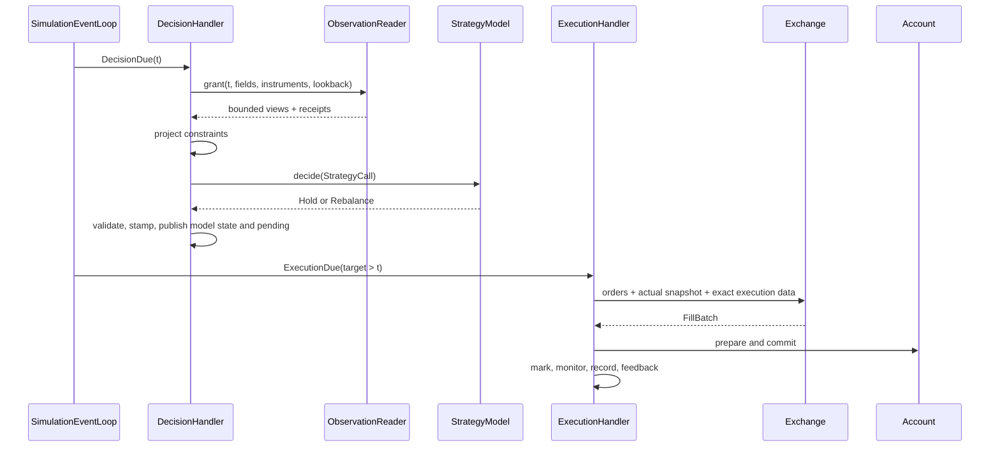

# VQAPR OOP 재설계 검토 — gpt6-astra-high

작성일: 2026-09-08 · 상태: **검토 및 설계 제안, 구현 미착수**

## 1. 검토 기준과 먼저 확인된 사실

시작 HEAD는 `2fad4ed0913995358b1de645e9644f4572188a04`이며 당시 tracked working tree는 clean이었다.
검토 중 `ddb4d7d8ac816cd1756f3a2c46f0ab2464086b57`이 추가되었다. 두 SHA 사이의 변경은
[네 개의 읽는 자 리뷰](2026-09-08-four-readers-one-loop-and-the-missing-shapes.md) 한 문서뿐이다.
아래 소스 근거는 시작 SHA에 고정하며, 마지막에 추가된 리뷰도 대조했다. 이후 별도 register-dataset 스킬·그 테스트·구현 기록도 추가되었으나 검토 대상 runtime/data Python 소스는 바뀌지 않았다. 이 문서는 그 작업과 기존 리뷰를 수정하지 않는다.

**사용자 문제 제기는 일부가 이미 구현된 사실과 겹치고, 일부는 실제 계약 결함을 가리킨다.**

- `DataModel`과 `StrategyModel`은 이미 `Model`을 공유한다. `Constraint`까지 세 역할의 읽기는
  `DatasetInput`과 `_DeclaredReads`로 공통화되어 있다. 따라서 공통 추상이 전혀 없다는 진단은 부정확하다.
- `OccurrenceFlow`는 과거 흔적만이 아니라 현재 두 run kind가 사용하는 실행 코드다.
- `Grain`, `DatasetRegistration`, `Panel`, `PanelWindow`, `Observation`도 존재한다.
  문제는 데이터 타입의 전면 부재보다 **타입이 담는 의미, 공개하는 권한, 구현에 대한 의존성**이다.
- 기존 리뷰가 다루지 않은 **PIT 경계 우회와 종목 축 없는 rows 읽기 실패를 재현했다.**
  또한 root 이력 보존의 이차 증가를 작은 상태 전이 실험으로 확인했다. 이름과 파일 배치만 바꿔서는 해결되지 않는다.

근거: [Model](../../src/vqapr/authoring.py#L279), [공유 읽기](../../src/vqapr/calls.py#L106),
[OccurrenceFlow](../../src/vqapr/flow/loop.py#L58), [Grain](../../src/vqapr/data/datasets.py#L41),
[PanelWindow](../../src/vqapr/data/panel.py#L156).

이에 따라 권고하는 방향은 **역할별 도메인 모델을 갖춘 modular monolith**, **명시적인 동기식 simulation event loop**,
**역할별 handler와 좁은 데이터·기록 port**, **계산 상태와 감사 이력의 분리**다.
네 저자 클래스를 하나의 범용 `EventLoop` 또는 `judge()` 부모로 합치는 방향은 권고하지 않는다.

### 범위와 증거 수준

[프로젝트 manifest](../../.agent/project.yaml), [PRD](../vqapr-prd.md) §0·1.2·2.3·2.4·3·4·6.6·13,
[architecture](../vqapr-architecture.md) §2.2와 데이터 관련 절,
[agent-first 설계](../design/agent-first-surface.md), [진단 색인](../diagnostics/README.md),
[한 모양 캠페인](../refactoring/2026-09-04-the-one-shape-campaign.md),
[handoff](../handoff/2026-09-04-one-shape-campaign-handoff.md)를 대조했다.
과거 문서의 구현 상태와 개수는 현재 사실로 승격하지 않았다. 예컨대 handoff에는 완료 배너와 오래된 착수 지시가 공존한다.
PRD §0은 클래스 계층·모듈 경로를 제품 요구사항으로 강제하지 않는다.

직접 추적한 경로는 `authoring → calls → ModelWindow → store → scan/panel`,
`orchestration → preflight/frozen → loop → callback/compute → execution → account/valuation/monitoring → record`다.
전체 Python 파일 117개를 AST로 열어 물리 줄 수와 import를 조사했고, 위 경로는 본문을 읽었다.
AST 계수는 34,173줄, `flow/` 9,333줄이다. 주석·docstring·빈 줄을 포함하므로 복잡도 점수로 쓰지 않는다.
CLI·report·workspace 전체 함수의 의미, 모든 분기, 실데이터 성능까지 감사한 것은 아니다.

증거 표기는 **재현**(실제 실행 결과), **정적 확인**(소스의 경로·구조), **설계 제안**, **미측정**으로 구분한다.
관련 기존 테스트 55개 통과는 검토한 정상 계약의 일부를 뒷받침한다. 전체 제품 감사 통과를 뜻하지 않는다.

## 2. 네 객체는 무엇을 공유하고 무엇이 다른가

| 역할 | 실제 입력과 시점 | 출력 | 상태와 권한 | 호출 주체 |
|---|---|---|---|---|
| `DataModel` | 선언한 관측의 PIT 창, evaluation time | 재사용 dataset의 행 | `memory` 있음; account·체결 권한 없음 | `DataModelPhase` |
| `StrategyModel` | PIT 창 + committed account + 선언한 history + projected bounds | `Hold` 또는 `Rebalance` | memory/payload; 경제적 판단만 생성 | `CallbackPhase` |
| `Constraint` | `project`: PIT 창·종목; `monitor`: 여기에 actual account·bounds 추가 | bounds 또는 finding | 상태 없는 규칙이 계약; 계좌 변경 없음 | projection/monitoring service |
| `Exchange` | 주문 + account snapshot + 선택된 execution time의 exact snapshot | `FillBatch` | 체결 규칙·비용을 적용; account commit은 하지 않음 | `ExecutionPhase` |

근거: [저자 모델 계약](../../src/vqapr/authoring.py#L238),
[StrategyCall](../../src/vqapr/authoring.py#L892), [Constraint](../../src/vqapr/authoring.py#L1099),
[Exchange](../../src/vqapr/exchange/venue.py#L23), [체결 호출 및 account 준비](../../src/vqapr/flow/execution.py#L119).

**공통점은 입력을 받아 계산한다는 구조이고, 차이는 substitutability다.** Substitutability는 한 구현을 다른 구현으로
교체해도 호출자가 기대하는 계약이 성립한다는 뜻이다. `FillBatch`를 반환하는 Exchange를 `Rebalance`를 반환하는
Strategy 자리에 넣을 수는 없다. 같은 등록·fingerprint 대상이라는 사실도 같은 실행 인터페이스를 요구하지 않는다.

특히 Exchange의 차이는 단순히 wide/long/point라는 모양 차이가 아니다. **관측의 `available_at <= t` 조회와
체결의 `execution_time == target` 선택은 서로 다른 시간 계약**이다. 둘을 하나의 `Grain.POINT`로 표현하면
행의 고유 키와 조회 방식이 섞인다. `point`는 grain보다 selection mode로 분리하는 편이 정확하다.

공통화할 것은 세 층이다.

1. **선언 능력:** DataModel·StrategyModel·Constraint의 `inputs()`와 requirement 변환을 하나의 작은 계약/함수로 둔다.
   `memory`를 갖는가와 독립된 축이다. 기존 `requirements_for`를 활용하며 범용 base부터 만들 필요는 없다.
2. **호출 경계:** bind → invoke → validate → stamp → publish의 순서는 공통 원칙이다.
   출력 validator와 publish 효과는 각 역할의 handler가 소유한다. Constraint의 `project`와 `monitor`는 별도 호출이다.
3. **시간 진행:** 정적 기회와 동적 due의 순서는 하나의 event loop가 소유한다.
   DataModel이나 Constraint 인스턴스가 자기 루프를 소유하지 않는다.

데이터를 `self.feed(data)`로 계속 넣고 나중에 `judge()`로 꺼내는 상태적 API보다 `compute(call)`처럼
**한 호출의 cutoff와 입력 범위가 닫힌 형태**를 유지하는 것이 재현·테스트·병렬 실행에 유리하다.

## 3. 기존 리뷰 재검증과 수정할 판단

| 기존 지적 | 이번 확인 | 판단 |
|---|---|---|
| [flow/evidence 리뷰](2026-09-08-flow-and-evidence-structure.md): kind와 phase 축 혼재 | `datamodel.py`와 `callback.py`는 실제로 다른 층위 | 유효한 탐색·응집도 문제. 다만 파일 수의 대칭 자체는 목표가 아니다 |
| `OccurrenceFlow`의 `object` 반환과 초기화 계약 부재 | `run`, dispatch, finish가 `object`; 세 속성을 하위 클래스가 채움 | 유효. 생성자 계약과 타입 게이트를 함께 개선 |
| DataModel agenda의 `STRATEGY_CALLBACK` | [preflight](../../src/vqapr/flow/preflight.py#L622)과 [identity](../../src/vqapr/flow/frozen.py#L238)에서 재확인 | 잘못된 의미가 identity에 포함됨. 수치 손실이나 hash collision이 재현된 것은 아님 |
| agenda role 우선순위·provenance의 과거 입력 잔재 | `merged_occurrences` 호출은 한 agenda; provenance hash의 실사용 독자 없음 | 현행 경로에 불필요한 구조. DST·UTC 검증까지 함께 삭제할 근거는 아님 |
| record 저장이 flow 안에 있음 | report/CLI 등도 `flow.record`를 직접 소비 | 분리할 이유가 있음. 단순히 새 `record/`를 만드는 것보다 write/read 계약을 먼저 정의 |
| frozen 객체의 `object.__setattr__`가 문제 | 생성 시 정규화, derived memo, 외부 객체 private 주입은 서로 다른 용도 | 생성자 내부 정규화는 정상적인 구현 기법. Exchange 외부 주입과 같은 결함으로 세면 안 됨 |

나중에 추가된 [네 개의 읽는 자 리뷰](2026-09-08-four-readers-one-loop-and-the-missing-shapes.md)에는
동의하는 부분과 재고해야 할 부분이 함께 있다.

- event loop의 의미를 이름과 타입에 드러내자는 방향, timestamp가 붙은 cross-section의 필요성은 타당하다.
- `Component[CallT, JudgmentT].judge()`에 모든 역할을 넣는 제안은 `Constraint.project/monitor`의 이중 계약을
  표현하지 못한 상태다. semantic method를 모두 남기면 범용 judge와 실제 실행 메서드가 이중 표면이 될 수 있다.
- Exchange를 그 base에 넣지 않아도 `ExecutionCall`이나 명시적인 venue factory로 private 주입을 제거할 수 있다.
  **공통 base 편입과 생성자 의존성 주입은 독립 결정**이다.
- `MarkBatch`를 `CrossSection[Mark]` 별칭으로 바꾸는 것은 별도 검토가 필요하다.
  모양이 같아도 중복 종목·가격·시점 검증 같은 경제적 불변식은 별칭만으로 보존되지 않는다.
- pydantic과 dataclass가 함께 존재한다고 검증을 하나로 수렴해야 하는 것은 아니다.
  wire/config 경계의 파싱과 내부 hot path의 value object는 요구가 다르다. **같은 규칙의 중복 소유**를 줄여야 한다.
- `isinstance` 감소량은 품질 지표가 아니다. Generic/ABC는 frozen run과 초기 account의 일치 같은 의미 검증을
  대신하지 못한다. 검사 수를 줄이고 PIT 우회가 남아 있다면 감사 가능성은 개선되지 않은 것이다.
- 기존 진단의 “척추는 건강하다”는 표현을 현재 보증으로 재사용하지 않는다. 아래 F1과 F4는 그보다 구체적인 반례다.

## 4. 추가 발견 — 재설계의 우선순위를 바꾸는 근거

우선순위는 P1(결과 신뢰성 또는 핵심 scale 경로), P2(지원 계약·교체성), P3(탐색·정리)다.
모든 항목을 이미 발생한 사용자 손실로 해석하면 안 된다.

### F1 · P1 · 공개 Panel이 PIT 및 읽기 이력 경계를 우회한다 — 재현

[store.panel_window](../../src/vqapr/data/store.py#L178)는 등록된 **전체 span**을 한 번 읽어 Panel로 만든다.
[PanelWindow.panel](../../src/vqapr/data/panel.py#L173)은 그 전체 Panel을 공개 필드로 보유한다.
정상 `series()`는 slice를 지키지만 `window.panel.columns`는 그렇지 않다.

합성 자료 A의 3월 1일 가격은 10, 3월 2일 가격은 999다. 3월 1일 cutoff로 등록된 데이터를 읽었다.

```text
call.read('x', 'close').series('A')                 -> (10.0,)
window.panel.columns['close']['A'].to_pylist()      -> [10.0, 999.0]
window.panel.columns['volume']['A'].to_pylist()     -> [100.0, 200.0]
window.access log의 fields / access 수             -> ('close',) / 1
```

`volume`은 alias에는 선언했지만 해당 read는 `close`만 기록했다. 전체 Panel 접근으로 그 필드의 미래 값까지
읽어도 추가 access가 남지 않았다. 즉 미래 노출뿐 아니라 **기록된 lineage가 실제 읽기와 달라질 수 있다.**
근거: [access 생성](../../src/vqapr/data/store.py#L256), [read 기록](../../src/vqapr/data/windows.py#L122).

이는 악의적인 Python 코드를 sandbox로 격리하라는 주장이 아니다. 반환된 객체의 평범한 공개 속성이
최소 권한 계약을 깨는 문제다. [architecture §2.2](../vqapr-architecture.md#22-least-authority--bounded-view)의
“접근 불가능성”과 직접 충돌한다. 올바른 `series/current/latest` 자체의 필터 오류는 재현되지 않았다.

**제안:** 전체 backing store/Panel을 저자 view에서 제거하고, cutoff·필드·종목으로 이미 제한된 column view만 제공한다.
private backing 참조와 Arrow slice 공유는 내부에서 유지할 수 있다. raw 전체 buffer export를 public capability로 주지 않는다.
실행 clock과 read grant도 불변 값으로 캡슐화한다. 명칭 변경이나 Protocol 어노테이션만으로는 이 누출이 사라지지 않는다.

### F2 · P2 · 종목 축 없는 rows dataset이 사용자 읽기 경계에서 실패한다 — 재현

`instrument_field=None, grain='rows'`, 키 `(available_at, key)`, 값 `value: DOUBLE`인 자료가
`register_dataset`을 통과했다. `InstantsLookback(2)`로 내부 `ModelWindow.declared()`도 행을 반환했다.
그런데 `DataModelContext.rows()`는 다음과 같이 실패했다.

```text
RAW_BATCH: ({'available_at': <aware datetime>, 'value': 1.0},)
KeyError: row is missing the instrument field 'instrument';
          the dataset declaration does not match the physical table
```

[DatasetRegistration](../../src/vqapr/data/datasets.py#L81)과
[scan.observation_rows](../../src/vqapr/data/scan.py#L1213)는 instrument 없는 자료를 허용한다.
반면 [calls.rows](../../src/vqapr/calls.py#L146)는 무조건 `instrument_field='instrument'`를 넘기고,
[observations](../../src/vqapr/calls.py#L47)는 그 열이 없으면 실패한다.
같은 mixin을 쓰는 Strategy·Constraint에도 해당 경로가 적용된다. **설정의 오류라는 실패 설명도 사실과 다르다.**

처음 시도한 `CalendarLookback`은 rows grain에서 명시적으로 거부됐다. 이 거부는 현행 계약이며 F2가 아니다.
위 재현은 허용된 `InstantsLookback`으로 다시 확인한 결과다.

**제안:** rows 반환 계약은 종목 축의 유무를 표현해야 한다. `LongRow`의 선택적 instrument와 명시적 key,
또는 instrument row와 axisless row의 discriminated union을 선택한다. 현재 지원하지 않을 의도라면 등록 단계에서
불가능한 조합을 거부해야 하지만, 등록은 허용하고 정상 조회만 실패하는 상태는 남길 수 없다.

### F3 · P2 · 같은 Model.memory가 두 lifecycle을 뜻한다 — 정적 확인

[Model](../../src/vqapr/authoring.py#L279)은 두 모델 모두에 portable memory를 설명한다.
하지만 [DataModel 조립](../../src/vqapr/flow/orchestration.py#L458)은 initial memory만 정규화하고,
[DataModelPhase.dispatch](../../src/vqapr/flow/datamodel.py#L565)는 `compute → output 검증 → append`를 수행한다.
각 호출 뒤 memory를 정규화·snapshot·publish·restore하는 경로가 없다.
[DataModelResult](../../src/vqapr/flow/datamodel.py#L535)와
[datamodel record](../../src/vqapr/flow/record.py#L1786)에도 최종 model state가 없다.

반대로 [Strategy callback](../../src/vqapr/flow/callback.py#L69)은 committed memory/payload를 복원하고,
검증한 후보를 [RunStateRepository](../../src/vqapr/flow/run_state.py#L365)에 publish한다.
따라서 DataModel의 mutable memory는 같은 인스턴스의 다음 compute로 갈 수 있지만, 그 사실을
Strategy와 같은 **검증된 상태 확정·복구 계약**이라고 부를 수 없다. 실제 재개 손실을 재현한 것은 아니다.

**제안:** stateful model의 “성공한 호출에서만 다음 상태 확정”을 공통화한다. 기본 선택은 기존 Model 계약을 살려
DataModel에도 상태 확정과 명시적 이어 실행을 설계하는 것이다. payload가 필요한 연구 모델도 그 경계에서 다룬다.
상태 없는 DataModel을 별도 capability로 선언하면 독립 evaluation을 병렬화할 수 있다.
모든 DataModel이 account 없는 Strategy라는 이유만으로 전체 account runtime을 상속하게 해서는 안 된다.

### F4 · P1 · 누적 상태를 매번 복사하고 모든 과거 root를 trace에 보유한다 — 정적 확인 + 크기 재현

[prepare_callback](../../src/vqapr/flow/run_state.py#L387)은 누적 `_model_states`·`_payloads`를 dict로 복사하고
`lifecycle_trace=(*root.lifecycle_trace, lifecycle)`를 만든다.
[OccurrenceTrace](../../src/vqapr/flow/context.py#L118)는 해당 root 전체를 들고,
[loop](../../src/vqapr/flow/loop.py#L73)는 모든 trace를 종료까지 모은다.
row sink로 recorder 행을 빼도 이 연결은 남는다.

매 callback마다 서로 다른 작은 memory를 publish하고 실제 trace와 같이 root를 보존한 harness 결과:

| callback 수 T | 보존된 lifecycle tuple 원소 합 | 보존된 model-state map 엔트리 합 |
|---:|---:|---:|
| 64 | 2,080 | 2,144 |
| 128 | 8,256 | 8,384 |
| 256 | 32,896 | 33,152 |

`1 + ... + T` 구조다. **참조/컨테이너 엔트리 수와 복사 작업은 이 경로에서 Θ(T²)**이고,
상태 내용 자체는 공유될 수 있으므로 “payload bytes를 매번 복제한다”는 뜻은 아니다.
고정 memory여도 lifecycle tuple은 누적된다. 이 harness는 RSS 또는 전체 backtest 시간 벤치마크가 아니다.

**제안:** 현재 authoritative root에는 현재 model state·account·pending만 둔다. 감사 이력은 append-only
record sink로 보내고 trace는 state version/reference와 이번 사건의 delta만 보유한다.
과거 state를 다시 읽어야 한다면 명시적인 snapshot store/보존 정책으로 접근한다.
과거 in-process trace 순회·record builder·실패 후 근거 확보도 함께 이전해야 한다.
**이력을 그냥 버리는 수정은 재설계가 아니다.**

### F5 · P1/P2 · Panel의 메모리 수명이 dataset 전체 및 member 수에 묶인다 — 정적 확인, 성능 미측정

[Panel.from_rows](../../src/vqapr/data/panel.py#L81)는 `fields × instruments × instants` 크기의 Python list들을
만든 뒤 Arrow로 바꾼다. [scan](../../src/vqapr/data/scan.py#L1410)은 먼저 `fetchall()`로 행을 받는다.
따라서 입력 행 객체, dense list와 Arrow 배열의 동시 생존 구간이 있다. Arrow 사용만으로 전체 경로가 columnar인 것은 아니다.

[store](../../src/vqapr/data/store.py#L232)는 **run 범위가 아니라 등록 span 전체**를 읽는다.
또한 “두 전략이 Panel 하나를 공유한다”는 store docstring과 달리, 실제
[_run_strategy](../../src/vqapr/flow/orchestration.py#L589)와
[_run_datamodel](../../src/vqapr/flow/orchestration.py#L463)는 각 member마다 별도 store/session을 만든다.
한 store의 두 consumer가 공유한다는 테스트는 여러 member의 orchestration을 증명하지 않는다.

**제안:** 실행 범위와 최대 lookback에 필요한 `ReadPlan`을 freeze에서 산출하고, 입력 materialization의
메모리 예산·chunk 경계를 명시한다. 우선 Arrow batch 전달로 행 왕복을 줄인 뒤 cache 공유 범위를 측정한다.
서로 다른 process의 Python dict를 공유 cache처럼 취급하지 않는다. immutable artifact/memory map은 후속 선택지다.

의존 크기는 대략 `T × N × F × bytes/cell`이다. 예를 들어 float64 2,500시점 × 3,000종목 × 20필드는
값 buffer만 1.2 GB(십진 단위)이며 null bitmap·축·Python 중간 객체는 별도다. 이것은 **용량 산술 예시**이고 실측이 아니다.

### F6 · P2 · 소비자 계약이 구체 storage와 큰 context에 결합되어 있다 — 정적 확인

[ModelWindow](../../src/vqapr/data/windows.py#L16)는 `DuckDbObservationStore` 타입을 받고 `isinstance`로 제한한다.
[DatasetRegistration](../../src/vqapr/data/datasets.py#L19)은 `scan.ColumnType`을 import한다.
[authoring](../../src/vqapr/authoring.py#L34)은 Arrow-backed PanelWindow 및 optimizer의 `QUANTUM`에 의존한다.
논리 schema·저자 API·물리 adapter를 독립적으로 교체하기 어렵다.

[FlowContext](../../src/vqapr/flow/context.py#L444)는 phase 모두에 account, exchange, strategy, constraints,
scan session, registry, writer와 연결된 state를 통째로 준다. 타입을 채우는 것만으로 읽기·쓰기 권한이 좁아지지 않는다.

**제안:** data application 경계에 `ObservationReader` port, execution 경계에 `ExecutionSnapshotReader`,
기록 경계에 `RunRecordSink/Reader`를 두고 DuckDB/Parquet를 adapter로 둔다.
중요한 port는 caller가 필요한 메서드와 실패 의미로 정의한다. 함수 하나마다 protocol을 만들지는 않는다.
phase에는 필요한 서비스와 해당 account의 commit capability만 주입한다.

### F7 · P2 · Exchange의 확장 표면과 조립 방식이 어긋난다 — 정적 확인

[Exchange Protocol](../../src/vqapr/exchange/venue.py#L23)만 보면 다른 구현이 가능한 것처럼 보이지만
[load_exchange](../../src/vqapr/extension/loading.py#L391)는 shipped profile 두 계열만 받고 `execute` override를 거부한다.
이는 현행 realism 범위를 지키는 의도적인 제품 제한이며, 단순 OCP 위반이라며 제거하면 안 된다.
문제는 그 제약 아래에서도 [bind_registry_to_venue](../../src/vqapr/flow/execution.py#L313)가
frozen venue의 `_registry`·`_rules`를 외부에서 변경해야 한다는 점이다.

**제안:** `VenueFactory.bind(profile, registry)`로 완성된 venue를 만들거나,
`ExecutionCall(orders, account, snapshot, rules)`로 필요한 값을 명시적으로 전달한다.
profile 허용 정책은 loader에 남기되, 실제 실행 port와 분리한다.
새 profile의 도입에는 수량·비용·순서·account conservation conformance가 필요하다.
범용 Component base나 통합 dataset grain은 이 문제의 선행 조건이 아니다.

### F8 · P2/P3 · 데이터의 시간 의미·키·값 모양이 여러 수준에서 섞인다 — 정적 확인

- Panel의 `instants`는 **available_at의 합집합**이다. 실제 거래일·관측 시점과 반드시 같지 않다.
- `current()`는 **창 안 마지막 행의 단면**이다. evaluation time에 데이터가 전혀 없으면 과거 마지막 단면이 나온다.
  3월 3일 cutoff, 마지막 자료 3월 2일인 재현에서도 A=999가 나왔다. 현재 구현 docstring에 부합하므로 버그로 세지 않는다.
- `latest()`는 종목별 마지막 non-null 값이며 그 값의 timestamp가 반환 mapping에서 사라진다.
- rows의 `key_fields`는 uniqueness/order에 쓰이지만 반환은 identity + 선언한 fields다.
  item/revision 등 키를 값 field로 다시 선언하지 않으면 행을 구분할 의미가 자동 전달되지는 않는다.
- [DataModel output 검증](../../src/vqapr/flow/datamodel.py#L148)은 한 호출에 종목별 한 행을 전제한다.
  임의 long 결과나 종목×종목 covariance를 자연스럽게 표현하는 일반 output 계약은 아니다.

**제안:** 아래 데이터 vocabulary로 각 의미를 명시한다. 모든 자료에 회계기간·revision을 강제하지 않는다.
BYOD의 의미 선택은 사용자 소유이고, framework는 선택한 키·시점·layout의 계약을 검증한다.

## 5. 데이터 domain은 무엇을 정의해야 하는가

**Domain은 `domain/` 폴더의 크기로 판단하지 않는다.** account·portfolio·constraints에도 도메인 행위가 있다.
Fowler의 [Domain Model](https://martinfowler.com/eaaCatalog/domainModel.html)은 데이터와 행위를 함께 모델링하는 개념이다.
VQAPR에서는 schema·시간 경계·계좌 보존 규칙을 누가 소유하는지가 중요하다.

| 개념 | 보장할 의미 | 현행에서 활용할 것 / 바꿀 것 |
|---|---|---|
| `DatasetSchema` | 논리 키, 축 유무, field dtype, grain | `DatasetRegistration`의 논리 부분. source path·SQL expression과 분리 |
| `ObservationTime` / `ReadCutoff` | 알 수 있게 된 시각과 이번 호출의 정보 상한 | aware UTC 비교 유지. optional event time은 availability와 분리 |
| `PanelView[T]` | **한 field**, 정렬된 시간축 × InstrumentId 열, bounded view | PanelWindow를 축소; full Panel 공개 제거 |
| `LongTableView` / `RowBatch` | 복합 key와 schema가 보존되는 bounded 행 집합 | tuple Observation의 축 가정 수정; batch iterator는 실제 streaming 보장 필요 |
| `CrossSection[T]` | 선택 시각, 종목별 값, 결측·시점 정책 | `current()` mapping의 의미를 이름과 timestamp로 보강 |
| `Series[T]` | 선택 종목 또는 axisless field의 시간·값 쌍 | 값 tuple만 반환해서 축이 유실되지 않게 함 |
| `ExecutionSnapshot` | 지정 target의 exact 가격·tradability | 기존 ExactExecutionSnapshot 유지; observation 조회와 합치지 않음 |
| `ReadReceipt` | consumer, source/schema identity, cutoff, 실제 접근 필드·범위 | 기존 AccessRecord 유지·보강; 저자 우회 접근 제거 |

이는 필요한 의미의 목록이며 **모든 행을 별도 public class로 만들라는 목록이 아니다.**
의미 차이가 없는 지역 계산은 기존 mapping/tuple로 충분하다. public 경계에서 시간·키·권한을 잃는 곳을 먼저 타입화한다.

예를 들어 `close`라는 한 field에 대해 사용자가 말한 wide panel은 다음과 같다.

```text
available_at          A       B       <- columns = instrument IDs
2024-03-01T00:00Z     10      20
2024-03-02T00:00Z     11     null
```

같은 자료를 `(available_at, instrument, close)` 세 열의 long table로 저장할 수도 있다.
**저장 layout이 long이어도 grain은 instrument_instant이고, 읽기 결과는 wide가 될 수 있다.**
현행 `Grain.ROWS`는 이 모든 long layout의 동의어가 아니라 item 등 더 세밀한 키를 가진 vendor grain의 역할도 한다.
문서·schema에서 logical grain, physical layout, read shape, temporal selection을 구분해야 한다.
여러 field가 있는 Panel은 내부적으로 `field → [time × instrument]`다. field축까지 하나의 2d 값 타입으로 숨기지 않는다.

`at_exact(t)`, `at_or_before(t)`, `latest_per_instrument(max_age=...)`처럼 selection 의미를 구분하고,
없는 시점·stale 값·null·universe 부재의 처리는 명시한다. 이것은 현재 current/latest를 당장 전부 바꾸자는 뜻이 아니라
다음 public contract에서 모호한 “현재”를 제거하자는 제안이다.
종목축 없는 macro series를 가짜 종목 코드 `''`로 모델링하는 내부 편법도 public schema에는 노출하지 않는 편이 낫다.

숫자 표현은 별도 문제다. dataset float와 portfolio/account의 Decimal·정확한 grid 연산을
성급히 하나의 dtype으로 통합하지 않는다. Arrow decimal의 고정 precision/scale을 도입하는 것도 단순 이름 변경이 아니다.

## 6. EventLoop와 OOP 패턴의 구체적인 적용

### 6.1 이름에 패턴을 넣되 실제 책임을 이름으로 말한다

현행 OccurrenceFlow는 **Template Method**다. 부모가 반복 순서를 쓰고 자식이 hook을 구현한다.
규모가 작으므로 `ABC + Generic[TraceT, ResultT] + 명시적 생성자`는 비용이 낮은 중간 개선이다.
장기적으로 event loop와 역할별 dispatch를 조합하면 lifecycle의 다른 점을 상속 hook으로 숨기지 않아도 된다.

권고 이름은 `SimulationEventLoop`다. `EventLoop`도 가능하지만 Python 사용자가
[asyncio event loop](https://docs.python.org/3/library/asyncio-eventloop.html)를 연상할 수 있으므로
**동기식 virtual-time 이산 사건 실행기**라는 범위를 이름/문서에 드러내는 편이 낫다.
asyncio 자체를 도입하라는 권고가 아니다. CPU 중심 계산이 이름 하나로 비동기·병렬이 되지는 않는다.

| 권고 이름/패턴 | 책임 | 선택 이유 |
|---|---|---|
| `SimulationEventLoop` | 사건 순서, 진행, dispatch, 종료 | 현재 공유 반복을 명시화 |
| `DecisionHandler`, `ComputeHandler`, `ExecutionHandler` | 해당 호출의 준비·검증·효과 발행 | 역할별 부작용과 타입 경계를 감사 가능하게 함 |
| `Model` + 좁은 입력 선언 능력 | 저자 계산 및 필요한 상태 계약 | 현재의 동일 저자 클래스 원칙 유지 |
| `Constraint` | 투영/감시 규칙 | 구현이 단순하면 자유 함수 service를 그대로 써도 됨 |
| `ObservationReader`, `RunRecordSink` | application이 요구하는 port | 물리 backend를 교체 가능하게 함 |
| `DuckDbObservationReader`, `ParquetRunRecordWriter` | 구체 adapter | 기술 의존성이 이름과 경계에 드러남 |

`Manager`, `Base`, `Factory`, `Strategy` 같은 접미사를 무조건 붙이지 않는다.
가령 금융 `StrategyModel`과 GoF Strategy pattern은 이름이 겹치지만 같은 개념은 아니다.
패턴은 설계 근거로 설명하고, 이름은 그 객체의 실제 역할을 식별할 수 있을 때 사용한다.

### 6.2 작은 목표 계약 — 제안용 의사코드

```python
class ObservationReader(Protocol):
    def panel(self, grant: ReadGrant, field: str) -> PanelView: ...
    def rows(self, grant: ReadGrant) -> RowBatch: ...

class EventSource(Protocol[EventT]):
    def peek(self) -> Scheduled[EventT] | None: ...
    def pop(self) -> Scheduled[EventT]: ...

class EventHandler(Protocol[EventT, TraceT]):
    def handle(self, event: Scheduled[EventT]) -> TraceT: ...

class SimulationEventLoop(Generic[EventT, TraceT]):
    def __init__(self, sources, handler, trace_sink, ordering, horizon): ...
    def run(self) -> LoopSummary: ...
```

실제 구현 전 variance·event union·생성자 annotation까지 type checker로 고정해야 하는 **계약 스케치**다.
`ReadGrant`는 framework가 만든 불변의 consumer·필드·종목·cutoff·lookback 허가 범위이고 저자가 확대하지 못한다.
`Scheduled`는 UTC timestamp와 결정적인 순서 키를 가진다. 임의 `dict[str, object]` event bus를 만들자는 뜻이 아니다.

기본 event는 `ComputeDue`, `DecisionDue`, `ExecutionDue` 정도로 시작한다. projection·marking·monitoring은
우선 handler 안에서 직접 순서대로 호출한다. 독립 cadence 요구가 실제로 구현될 때만 별도 scheduled event로 승격한다.
**모든 함수 호출을 event로 포장하면 atomicity와 디버깅만 복잡해진다.**

정적 schedule과 동적 pending은 같은 source 계약으로 읽되 **latest accepted intent 하나가 pending을 교체한다는 규칙**은
strategy runtime이 소유한다. 범용 heap에 이전 due까지 쌓으면 이미 취소된 intent가 실행될 수 있다.
같은 시각의 due 우선, stable tie-break, past event 거부, horizon 초과, pending 교체/소비, 실패 후 진행 여부를
loop/handler의 명시적 인수조건으로 둔다. 큐를 iterable로 바꾸는 것만으로 이 규칙이 생기지는 않는다.

### 6.3 책임을 확인하는 한 실행 예



DataModel에서는 `ComputeHandler → compute → output/state 검증 → publish`만 필요하다.
계좌를 `None`으로 넣는 거대한 동일 Context를 쓰지 않는다. Constraint에게도 store·계좌 commit capability가 필요하지 않다.
이는 **Interface Segregation**과 **Dependency Inversion**의 적용이다.
[Ports and Adapters 원문](https://alistair.cockburn.us/hexagonal-architecture)이 설명하는 외부 기술 분리를
데이터/기록 경계에 적용하되, 내부 규칙마다 port를 추가하는 방식으로 확장하지 않는다.

## 7. 목표 배치와 의존 방향

다음은 완성 상태의 후보이며, 먼저 디렉터리를 이동하라는 실행 순서가 아니다.

```text
vqapr/
  authoring/                 공개 저자 surface; 같은 클래스 재수출
    models.py                DataModel, StrategyModel, Model
    constraints.py           Constraint
    calls.py                 역할별 제한 capability
  domain/
    data.py                  논리 schema, key, cutoff와 view 계약
    time.py                  UTC/local instant, occurrence ordering 값
    model_state.py           portable state 계약
  data/
    reader.py                read application service / ports
    duckdb.py                scan adapter
    panel.py                 내부 Arrow materialization
  account/                   계좌 상태·보존 규칙
  portfolio/                 intent·budget·optimizer
  constraints/               projection·monitoring services
  exchange/                  execution port·profiles·snapshot/rules
  runtime/
    loop.py                  SimulationEventLoop
    assembly.py              factory·자원 수명·worker 구성
    handlers/                decision / compute / execution / valuation
    state.py                 현재 authority와 publish 경계
  record/
    contracts.py             저장되는 typed record와 버전
    writer.py                buffered publication
    reader.py                조회·재구성
  report/                    record의 소비자
```

`domain`을 모든 객체의 집합으로 키우지 않는다. account와 portfolio는 자기 도메인의 소유자로 남는다.
`authoring`을 패키지로 나누더라도 **저자가 만든 클래스와 loader가 실행하는 클래스는 하나**여야 한다.
API discoverability를 위해 실제 소유 모듈과 public re-export를 명시하되 adapter Model을 다시 만들지 않는다.

허용 방향은 `UI/facade → application/runtime → domain/ports`와 `adapter → ports`다.
`domain → CLI/workspace/DuckDB/Parquet`, `report → 실행 handler`, `handler → venue._private`는 차단한다.
record schema가 runtime result 전체를 import하지 않도록 publish용 data contract를 분리한다.
AST에서 발견한 `authoring ↔ account.history` 연결은 한쪽이 `TYPE_CHECKING` 안이므로
**runtime import cycle로 보고하지 않는다.** type-only 의존성도 분리할 수 있지만 실제 import 실패와 구분한다.

## 8. 확장성을 검증할 조건

확장성은 이름이나 class 개수로 증명되지 않는다. 무엇이 증가하는지 별도로 측정한다.

| 증가 축 | 현재 근거/위험 | 첫 조치와 검증 |
|---|---|---|
| 종목 N, field F, 기간 T | 전체 span dense Panel + Python 중간 객체 | Arrow batch와 run-window read plan; peak RSS, scanned rows/bytes, cold/warm 시간 |
| callback 수 T | F4의 누적 복사·root 보존 | compact trace + append history; T 두 배에서 컨테이너 보존량과 시간을 측정 |
| member/worker 수 J | member별 store와 spawn worker | `jobs=1/2/4`의 총 RSS·throughput·결과 identity 비교; 메모리 예산으로 worker 수 제한 |
| long 데이터 행 R | `fetchall` + tuple 반환 | batch/stream API의 backpressure와 최대 resident rows를 실측 |
| 새 component/profile | 분산 loader·validator·scaffold 계약 | 역할별 conformance fixture, 하나의 정적 계약 명세와 public sample |
| 실패/중단 | publish와 writer flush가 서로 다른 경계 | commit 전/후, spill 전/후 실패에서 재구성 가능한 evidence와 완료 표시 비교 |

[PRD UC-SCALE-001](../vqapr-prd.md#uc-scale-001--대규모-횡단면-실행)은 약 3,000종목의 누락 없는 실행과
batch/single-name 경제적 동치를 요구한다. 초당 처리량이나 메모리 SLO는 이 리뷰가 측정하지 않았다.
미리 임의의 성능 목표를 합격 기준으로 주장하지 않고 기준 workload와 resource profile부터 고정한다.

**병렬화 단위:** 서로 독립인 run/member, 명시적으로 stateless인 계산은 후보가 된다.
같은 account의 시간축·pending·model memory는 직렬화한다. cross-sectional model을 종목별로 임의 분할하면
rank·회귀·제약 결과가 바뀔 수 있다. worker의 DuckDB thread 수와 process 수를 함께 제한해야 oversubscription을 피할 수 있다.

현재 단일 pending·exact fill·marking을 보존하면서 확장 지점을 설계할 수 있다.
브로커 연결·live OMS·분산 bus·임의 partial-fill engine은 [PRD §13](../vqapr-prd.md#13-current-scope와-future-work)의
현재 지원과 별도다. 미래 지원을 위해 timestamp·schema/version·idempotent publication 경계를 마련하되 지금 구현했다고 말하지 않는다.

또한 record writer의 현행 정책은 normal/exception exit flush + 메모리 buffer + spill이다.
**hard kill에서 spill 전 자료까지 durable하다는 보장은 없다.** 이 리뷰의 append-only 제안은 논리적 이력 구조를 뜻하며,
사건마다 물리 fsync하거나 기존 완료 표시 규칙을 몰래 변경하는 제안이 아니다.

## 9. Breaking change를 허용한 이행 단위

| 순서 | 한 작업 단위 | 완료 기준 |
|---:|---|---|
| 0 | 현행 계약 표·baseline fixtures·좁은 type-check 게이트 | authoring↔loader, PIT/exact, state/pending, 경제적 동치를 검사 가능한 형태로 고정 |
| 1 | F1 bounded data capability, F2 axisless rows | 미래/미선언/미기록 접근 차단, 허용된 grain×axis 조합의 사용자 읽기 성공 |
| 2 | F4 current state와 이력 분리 | 기존 결과/실패 evidence 재구성; retained history의 이차 증가 제거 |
| 3 | F3 Model state lifecycle 정렬 | DataModel과 Strategy 모두 성공/실패/명시적 이어 실행에서 상태 계약 검증 |
| 4 | typed SimulationEventLoop와 역할별 handler | due tie-break·pending 교체·horizon·identity가 정의된 정책과 일치 |
| 5 | reader/snapshot/record ports, F7 완성된 venue 주입 | in-memory fixture와 기존 adapter가 같은 port conformance 통과 |
| 6 | F5 read plan·batch·cache/worker 예산 | 대표 N/T/F/J workload의 CPU/RSS/IO 개선과 결과 동치 |
| 7 | 실제 책임에 맞춘 module 이동·scaffold/public 문서 정렬 | obsolete 경로·중복 저자 클래스 없음; 공개 sample 여정 완주 |

숫자는 리뷰의 제안 순서다. 각각 production 구현을 시작할 때 별도 ExecPlan/implementation record/커밋 경계를 만든다.
이 문서를 작성한 것이 구현 승인이나 단계 전체 착수를 의미하지 않는다.

**명시할 break:** public view 속성 제거, rows 반환 shape, 모델 state/result contract, import 경로,
agenda role/ordering 변경에 따른 frozen identity, record schema, 초기 상태 지정법, sample/scaffold.
동일 선언의 identity가 달라질 수 있으므로 실행 결과를 구버전 record와 동일 run으로 조용히 합치지 않는다.
record에 engine/contract version을 남기고 구버전 읽기를 지원하거나 명확히 거부한다.
기존 연구 산출물의 묵시적 삭제·재계산은 migration이 아니다.

**타입/검증:** 처음부터 전 src의 strict error를 한 번에 0으로 만드는 캠페인보다 새 경계부터 strict로 하고 확장한다.
Generic을 도입하면서 `object`, `Any`, `type: ignore`로 다시 덮지 않는다.
동적 extension 입력·schema·경제적 불변식은 runtime validator가 계속 확인한다.
pydantic은 외부 선언/record 파싱, dataclass는 내부 값에 사용할 수 있으며 규칙의 소유자는 하나로 둔다.

구현 단계의 필수 회귀 범위는 다음과 같다.

- PIT: 미래 sentinel, cutoff 경계, 다른 field/alias 우회, receipt, axisless rows, sparse/current/latest,
  long↔wide 동치, dtype/null/key, 잘못된 read grant.
- 시간/계좌: due와 callback 동시각, latest pending 교체, Hold, horizon 밖 요청, exact execution,
  intended/requested/dealt/committed 구분, 버전 충돌, commit 전후 실패.
- 상태/기록: stateful compute 순서, invalid memory, payload restore, run 분할, record schema migration,
  flush/spill/kill 및 archive reconstruction.
- 구조/규모: backend import 차단, adapter conformance, 공식 public sample,
  source→batch→view→handler 비용, retained roots, multi-worker 동치.

변경 중에는 manifest의 `test`, handoff 전에는 **`uv run pytest tests/ -q -m ""` 및 `uv run ruff check src/`**를 수행한다.
run assembly·record·scaffold 변경은 fast suite만으로 완료하지 않는다. 측정은 이전/이후 같은 workload·환경에서 비교한다.

## 10. 이번 검토의 실행 증거와 한계

- 합성 Parquet를 `register_dataset`으로 등록하고 실제 `DuckDbObservationStore → ModelWindow → DataModelContext`를 통해
  F1·F2를 재현했다. 외부 DB·실계좌·시장 데이터는 사용하지 않았다.
- F4는 실제 `RunStateRepository.prepare_callback/publish`를 호출하고 root를 보존해 엔트리를 셌다.
  전체 simulation RSS/시간 측정은 하지 않았다.
- 아래 기존 테스트만 실행했다: **55 passed in 17.26s**.

```text
uv run --no-sync pytest
  tests/data/test_panel.py
  tests/data/test_grain.py
  tests/data/test_lookbacks_follow_grain.py
  tests/flow/test_acceptance.py
  tests/flow/test_session_callbacks.py
  tests/flow/test_a_datamodel_is_a_run.py
  -q --basetemp=.tmp-gpt6-astra-high-review/pytest-verified
```

위 줄바꿈은 가독성을 위한 것이며 shell에서는 한 명령으로 실행했다. 일반 `uv run`은 기본 uv cache 접근 거부,
작업용 cache로 바꾼 pytest는 temp directory 접근 거부로 실패했다. 같은 여섯 파일을
작업용 `UV_CACHE_DIR` 및 한정된 sandbox escalation으로 다시 실행한 결과가 위 55개 통과다.
환경 재설치·의존성 변경·소스 수정은 하지 않았다. full suite와 lint는 이 문서 작성의 실행 결과로 주장하지 않는다.

### 부록 A. F1/F2 재현 코드

빈 작업용 디렉터리를 만든 뒤 `root`를 그 경로로 지정해 실행한다. 기존 workspace를 대상으로 실행하지 않는다.
아래 코드는 리뷰에서 실행한 자료·호출을 합쳐 정리했으며, 문서에서 코드를 추출하여 별도 새 디렉터리에서 부록 A/B를 다시 실행해 동일 결과를 확인했다.

```python
from datetime import UTC, datetime
from pathlib import Path

import pyarrow as pa
import pyarrow.parquet as pq

from vqapr.authoring import DatasetInput
from vqapr.calls import DataModelContext, requirements_for
from vqapr.data.datasets import DatasetRegistration
from vqapr.data.lookback import InstantsLookback, RowsLookback
from vqapr.data.sources import SourceSpec
from vqapr.data.store import DuckDbObservationStore
from vqapr.data.windows import ModelWindow
from vqapr.public import register_dataset
from vqapr.workspace import Workspace

root = Path('.tmp-gpt6-astra-high-review').resolve()  # 새 작업 디렉터리
at = lambda day: datetime(2024, 3, day, tzinfo=UTC)
source = root / 'source.parquet'
pq.write_table(pa.Table.from_pylist([
    dict(instrument='A', available_at=at(1), close=10.0, volume=100.0),
    dict(instrument='A', available_at=at(2), close=999.0, volume=200.0),
]), source)
register_dataset(root, DatasetRegistration.of(
    'prices', 's', instrument_field='instrument', available_at='available_at',
    key_fields=('available_at', 'instrument'), grain='instrument_instant',
    fields={'close': 'close', 'volume': 'volume'},
    field_types={'close': 'DOUBLE', 'volume': 'DOUBLE'},
), SourceSpec.of('s', source))


def context(dataset, fields, lookback):
    alias = DatasetInput(dataset_id=dataset, fields=fields, lookback=lookback)
    window = ModelWindow(
        evaluation_time=at(1), instruments=('A',),
        store=DuckDbObservationStore(Workspace.open(root)),
        allowed_requirements=requirements_for(alias), consumer_id='model',
    )
    return DataModelContext(window=window, reads={'x': alias})


call = context('prices', ('close', 'volume'), RowsLookback(1))
view = call.read('x', 'close')
assert view.series('A') == (10.0,)
assert view.panel.columns['close']['A'].to_pylist() == [10.0, 999.0]
assert view.panel.columns['volume']['A'].to_pylist() == [100.0, 200.0]
assert len(call.window.accesses) == 1
assert call.window.accesses[0].fields == ('close',)

source = root / 'macro.parquet'
pq.write_table(pa.Table.from_pylist([
    dict(available_at=at(1), key='K', value=1.0),
]), source)
register_dataset(root, DatasetRegistration.of(
    'macro', 'm', instrument_field=None, available_at='available_at',
    key_fields=('available_at', 'key'), grain='rows',
    fields={'value': 'value'}, field_types={'value': 'DOUBLE'},
), SourceSpec.of('m', source))
call = context('macro', ('value',), InstantsLookback(2))
try:
    call.rows('x')
except KeyError as error:
    print(type(error).__name__, error)  # instrument가 없다고 잘못 거부
else:
    raise AssertionError('F2 did not reproduce')
```

### 부록 B. F4의 보존 엔트리 계수

```python
from vqapr.flow.run_state import LifecycleKind, LifecycleTrace, RunStateRepository

for n in (64, 128, 256):
    repository = RunStateRepository()
    roots = []
    for i in range(n):
        roots.append(repository.publish(repository.prepare_callback(
            {'i': i}, b'', lifecycle=LifecycleTrace(LifecycleKind.NO_DECISION),
        )))
    print(n, sum(len(r.lifecycle_trace) for r in roots),
          sum(len(r._model_states) for r in roots))
```

이 계수는 현재 보유 구조의 증거이며 제거할 runtime assertion 수, 신규 클래스 수, 디렉터리 수는 개선의 인수조건이 아니다.
인수조건은 **권한 우회가 없는 데이터 접근, 일관된 상태 확정, 재구성 가능한 이력, 보존되는 경제적 결과,
그리고 workload 증가에 대해 설명 가능한 비용**이다.