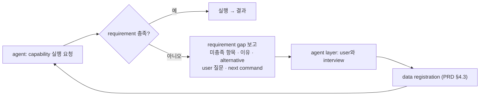

# Handoff — Capability requirement contract

> **Superseded:** The common public requirement contract described here was implemented after the
> user selected full public migration. See `docs/implementations/capability-requirement-contract.md`
> and current `docs/qlibx-architecture.md` §12.2/§16.1. Beta estimation and residualization remain
> deferred.

이 문서는 다음 agent가 **이 대화를 읽지 않고** 작업을 이어받기 위한 것이다.
현재 상태, 다음에 무엇을 왜 어떻게 구현해야 하는지, 그리고 내가 빠졌던 함정을 기록한다.

- **Branch**: `exp/one-shot` (base: `master`)
- **마지막 커밋**: `e134dc3`
- **상태**: working tree clean, `110 passed`, `ruff check .` / `ruff format --check` clean

---

## 0. 시작하기 전에 반드시 읽을 것

순서대로:

1. `AGENTS.md` — repository의 canonical 규칙. `CLAUDE.md`는 여기로 위임한다
2. `.agent/project.yaml` — 명령어와 canonical 문서 경로
3. `docs/qlibx-prd.md` **§1.2 / §4.8 / §5.4 / §5.5 / §8.2 / §8.3 / §13-P8** — 이번 작업의 요구사항
4. `docs/qlibx-architecture.md` **§16.1** — 격차 분석과 이미 존재하는 정답 템플릿
5. `docs/implementations/` — 최근 3개 기록이 지금까지의 설계 결정 근거

검증 명령 (변경 후 반드시):

```bash
uv run pytest && uv run ruff check . && uv run ruff format --check .
```

**중요한 repo 규칙 두 가지:**

- production source 동작을 바꾸면 `docs/implementations/`에 implementation record를 남긴다.
  문서·실험·showcase 전용 변경에는 만들지 않는다.
- 사용자가 명시적으로 지시하지 않는 한 stage/commit/push 하지 않는다.

---

## 1. 지금까지 구현한 것

`master` 이후 6개 커밋. 각각 implementation record가 있다.

| 커밋 | 내용 | record |
| --- | --- | --- |
| `2eafda8` | 정합성 버그 4건 수정 + operation/budget **registry 도입** | `alpha-operation-and-budget-registries.md` |
| `04f8f89` | 구조화 lookup 에러 + module 경계 정리 | `structured-lookup-errors-and-boundary-cleanup.md` |
| `6c25f18` | **PRD 개정** — capability requirement / resolution interview 계약 | (문서 전용, record 없음) |
| `58ccb78` | as-is architecture 문서 | (문서 전용) |
| `bef815f` | `alpha` package 분할 + **계층 강제 테스트** | `alpha-package-split-and-layer-enforcement.md` |
| `e134dc3` | acceptance 테스트 진단 개선 | (테스트 전용) |

### 이번 작업과 직접 관련된 것

**registry 패턴이 자리잡았다.** signal operation과 budget policy는 분기문이 아니라
`OperationSpec` / `BudgetPolicySpec` 등록으로 추가한다. 등록 한 번이 dispatch · lineage ·
`qlibx alpha operations` CLI · 생성 skill 문서에 동시에 반영된다.

**`alpha`가 package로 분할됐다.** `alpha/operations/`에 축별로 파일이 나뉘어 있고, 각 파일이
구현과 `OperationSpec` 선언을 함께 소유한다. 새 operation family = 새 파일 + `operations/__init__.py`에
import 한 줄. **`beta_residualize`를 넣을 자리는 `alpha/operations/factor.py`다.**

**계층이 강제된다.** `tests/test_architecture.py`가 import 방향을 검사한다. 특히
**`alpha`는 `errors` 외 어떤 intra-package module도 import할 수 없다.** 이번 작업에서 requirement
계약을 어디에 둘지 결정할 때 이 제약이 핵심이다 (§3 참조).

### 아직 구현하지 않은 것 (의도적)

`beta_residualize`를 일부러 만들지 않았다. requirement를 선언할 수단이 없는 상태에서 만들면
"factor data가 없으면 조용히 이상한 값을 내는 operation"이 되기 때문이다. 이번 작업이 그 선행 조건이다.

---

## 2. 다음에 구현할 것과 왜

### 문제

qlibx의 많은 capability는 특정 data가 등록되어 있어야만 성립한다. beta residualization은
market return을 요구하고, market return은 index return 또는 market-capitalization weighting 중
하나로 만들어져야 한다. **OHLCV 가격만 등록된 project에서는 어느 경로도 성립하지 않는다.**

PRD가 확정한 흐름:



Core package는 **판정만** 하고 절대 user에게 직접 묻지 않는다. 질문은 gap에 담아 agent layer로 넘긴다.

### 현재 코드의 격차 (실측)

| 요소 | 상태 | 확인 방법 |
| --- | --- | --- |
| requirement 선언 필드 | **없음** | `OperationSpec`에 `parameters`(스칼라)와 `requires_groups: bool`뿐 |
| 미충족 시 agent-readable 실패 | **없음** | `apply_transform("group_demean", df)` → 평범한 `ValueError`, code·context 없음 |
| 조용한 부분 결과 | **발생 중 · PRD 위반** | `analyze_exposure(w, ...)`가 beta 없이 `market_exposure=None`을 예외도 경고도 없이 반환. PRD §2.5가 금지 |
| gap error code | **없음** | 55개 코드 중 해당 계열 없음 |
| read-only plan | **부분적** | `plan_execution_profile`만 존재 |
| skill의 resolution interview | **없음** | SKILL.md에 registration interview는 있으나 operation gap에서 되돌아오는 경로 없음 |

**우선순위가 높은 이유**: 세 번째 항목은 현재 코드가 자기 PRD를 위반하고 있는 상태다.

### 이미 존재하는 정답 템플릿 — 새로 발명하지 말 것

두 곳이 PRD가 요구하는 형태에 근접해 있다. **이걸 일반화하는 작업이지 새 패러다임이 아니다.**

| 기존 구현 | requirement 선언 | gap 보고 | interview 질문 |
| --- | --- | --- | --- |
| `profiles.execution_profile_requirements` + `plan_execution_profile` | `required_roles` | `missing_roles`, `unknown_datasets`, `non_matrix_datasets`, `ready` | `agent_action` |
| `discovery.inspect_data` | — | `unresolved_requirements` | `required_user_questions` |

`ExecutionProfilePlan`의 실제 필드를 먼저 읽어볼 것:

```python
[
    "profile_id",
    "target_semantics",
    "config_path",
    "clock",
    "roles",
    "required_roles",
    "missing_roles",
    "unknown_datasets",
    "non_matrix_datasets",
    "role_contracts",
    "derived_fields",
    "warnings",
    "unsupported_features",
    "ready",
    "read_only",
    "mutates",
]
```

---

## 3. 시작 전에 사용자에게 물어야 할 결정 (미해결)

**requirement 커널을 어디에 둘 것인가.** 이건 내가 결정하지 않았고, 다음 agent가 임의로 정하면 안 된다.

PRD §5.4는 "*모든* capability가 동일한 방식으로 답해야 한다"고 못박았다. 그런데 계층 제약이 있다:

- `alpha`는 `errors` 외 아무것도 import할 수 없다 (`tests/test_architecture.py`가 강제)
- `profiles`는 `catalog`에 의존한다 (등록된 dataset을 알아야 충족 판정이 가능하므로)

즉 **"requirement를 선언하는 것"과 "충족 여부를 판정하는 것"은 서로 다른 계층에 속한다.**

- **선언**(무엇이 필요한가)은 순수 데이터 → kernel 또는 domain 계층에 둘 수 있다
- **판정**(지금 project에 있는가)은 catalog 접근이 필요 → capability 계층

권장 설계는 이 둘을 분리하는 것이다. 그러면 `alpha`가 requirement를 *선언*하면서도 순수 도메인으로
남고, 판정은 상위 계층이 수행한다. 다만 최종 배치는 사용자 확인이 필요하다:

- **(A)** 공용 requirement 커널을 만들고 `profiles`도 그리로 이관 — PRD에 가장 충실, 기존
  `ExecutionProfilePlan` 공개 계약을 건드림
- **(B)** `alpha`에 먼저 만들고 `profiles`는 그대로 — 안전하지만 당분간 두 모양이 공존

내 제안은 **커널을 (A) 모양으로 설계하되 `profiles` 이관은 별도 커밋으로 분리**하는 것이었다.
사용자에게 확인하고 시작할 것.

---

## 4. 어떻게 구현할 것인가

### 4.1 순서

| # | 작업 | 비고 |
| --- | --- | --- |
| 1 | `DataRequirement` 계약 (선언) | 나머지 전부의 토대 |
| 2 | requirement gap error code + 공유 빌더 | `errors.unknown_name` 패턴을 따를 것 |
| 3 | 충족 판정 + read-only plan | plan과 error가 **같은 선언에서** 파생되어야 함 |
| 4 | `analyze_exposure` unavailable 기록 | 현재 PRD 위반 해소 |
| 5 | CLI · schema · SKILL.md resolution interview | agent layer 배선 |
| 6 | `beta_residualize` | 위가 다 있어야 정직하게 구현 가능 |

1~3이 계약, 4~5가 배선, 6이 첫 실증이다. 각 단계마다 테스트를 붙이고, 가능하면 mutation으로
vacuous하지 않은지 확인할 것 (이 repo의 기존 불변식 테스트들이 그렇게 검증되어 있다).

### 4.2 `DataRequirement` — 평평한 목록이 아니다

PRD §5.4가 명시한 핵심: requirement는 **derivation alternative를 가진 선택지**다.

```text
requirement: market_return
  alternative A: registered index return dataset
  alternative B: market_capitalization + instrument return -> cap-weighted market return
  둘 다 불가 -> requirement gap
```

선언에 담아야 할 최소 항목 (PRD §5.4 원문 참조):

- stable requirement ID와 role name
- 경제적 의미, axis, unit, currency
- 어떤 계산에 쓰이는지
- 충족 여부 판정 방법
- point-in-time / availability 조건
- mandatory인지 optional인지, optional이면 없을 때 결과가 어떻게 달라지는지
- acceptable derivation alternative 목록
- 미충족 시 user에게 물을 질문
- gap 해소를 위해 실행할 public command

`OperationSpec`에는 `requires: tuple[DataRequirement, ...] = ()` 형태로 붙이면 기존 등록을
건드리지 않는다 (기본값이 있으므로 13개 built-in은 그대로 동작).

### 4.3 plan과 error는 같은 선언에서

PRD §5.5가 두 형태를 모두 요구한다:

- **plan 형태** — 실행 전 read-only 조회. 아무것도 만들지 않는다
- **error 형태** — 실행 시점에 gap을 발견하면 실패

**둘이 서로 다른 판정을 내리면 안 된다.** 구현상 판정 함수는 하나여야 하고, plan은 그 결과를
반환하고 error는 그 결과로 예외를 만든다. 이걸 강제하는 테스트를 반드시 넣을 것.

### 4.4 gap 보고에 담을 것

`errors.unknown_name()`이 이미 "이름 조회 실패"를 한 모양으로 만든다. 같은 방식으로 gap 빌더를
만들 것. `context`에 최소한:

```text
capability (id, version) / 미충족 requirement + 각각의 이유 / alternative /
이미 충족된 것 / user 질문 / next command / 재실행 가능 여부
```

새 error code는 `documentation.ERROR_GUIDANCE`에 **반드시** 등록한다.
`tests/test_documentation.py::test_every_raised_error_code_has_installed_recovery_guidance`가
raised ↔ documented 양방향 일치를 강제하므로, 빠뜨리면 테스트가 실패한다.

### 4.5 `analyze_exposure`

현재 optional 데이터 인자 `market_beta`, `benchmark_beta`, `groups`, `factors`,
`realized_holdings`가 없으면 해당 필드를 조용히 `None`으로 둔다. PRD §8.3에 따라 **계산하지 못한
항목, 그 이유, 필요한 data를 결과에 명시적으로 기록**해야 한다. `ExposureArtifact`에 필드를
추가하되 기본값을 주어 기존 호출을 깨지 말 것.

### 4.6 `beta_residualize`

`alpha/operations/factor.py`를 새로 만들고 `operations/__init__.py`에 import 한 줄을 추가한다.
estimation window semantics는 PRD가 확정하지 않았으므로 **임의로 정하지 말고** `OperationSpec`의
`parameters`로 명시적으로 받고 그 의미를 문서화할 것.

---

## 5. 내가 빠졌던 함정 (반복하지 말 것)

- **`OperationSpec`에 필드를 추가할 때**는 기본값을 주고 **끝에** 붙인다. 13개 built-in 등록이
  키워드 인자를 쓰므로 순서 변경은 조용히 깨지지 않지만, 기본값이 없으면 전부 수정해야 한다.
- **테스트가 패키지 경로를 가정하지 않게 할 것.** `alpha`를 package로 바꿨을 때
  `pathlib.Path(alpha.__file__).parent`를 패키지 루트로 가정한 테스트가 깨졌다. `qlibx.__file__`
  기준으로 쓸 것.
- **`qlibx.alpha` 등 public import 경로는 계약이다.** 설치된 예제(agent가 복사하는 코드)가
  직접 import한다. 파일을 옮기면 `alpha/__init__.py`의 재수출을 함께 갱신할 것.
  `tests/test_architecture.py::test_public_module_paths_stay_importable`이 지킨다.
- **문서화된 예제를 추가하면 signature가 실제와 맞는지 확인된다.**
  `test_documented_examples_bind_against_real_public_signatures`가 keyword를 실제 signature에
  바인딩해본다. `compile()`만 통과하는 예제는 과거에 실제로 깨진 채 배포됐었다.
- **계층 테스트의 `LAYERS`를 갱신할 것.** 새 module을 추가하면
  `test_every_module_is_assigned_to_a_layer`가 실패한다. 이건 의도된 마찰이다 — 배치를 결정으로
  만들기 위한 것.

---

## 6. 알려진 미해결 이슈

**`tests/acceptance/test_p0_p1_agent_journey.py` 간헐적 실패.**

- 전체 스위트 약 20회 중 2회 실패. 이 리팩터링 **이전**(문서만 바꾼 커밋)에도 발생 → 기존 결함
- 실패하는 실행이 오히려 **빠르다** (19s vs 33s, 이 테스트 단독 23s) → 초반 subprocess 실패로 추정
- 17회 시도했으나 강제 재현 실패
- 두 번 다 소스 파일을 수정한 직후 첫 실행에서 발생
- `e134dc3`에서 진단만 개선함 (command·exit code·stdout·stderr를 실패 메시지에 포함).
  **flake 자체는 고쳐지지 않았다.** 다음에 발생하면 이제 원인을 볼 수 있다

이번 작업 중에 이 테스트가 실패하면 위 내용을 먼저 의심할 것. 새로 만든 변경 때문이 아닐 수 있다.

---

## 7. 완료 판정

PRD §13 **P8**의 11개 항목이 acceptance criteria다. 특히:

- OHLCV만 등록된 project에서 beta residualization을 요청하면 market return requirement와
  alternative를 보고하고, beta를 추정하거나 항목을 비워 둔 채 성공을 반환하지 **않는다**
- 실행 전 read-only plan과 실행 시점 error가 같은 선언에서 **같은 판정**을 만든다
- generated skill이 resolution interview 절차를 포함한다
- agent가 gap 해소 후 같은 요청을 재실행하여 성공한다

작업을 마치면 `docs/qlibx-architecture.md` **§16.1**을 갱신할 것. 그 절이 현재 이 격차를
"미구현 — 최우선"으로 기록하고 있다.
