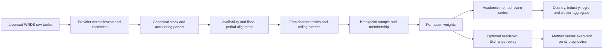

# JKP Data 조사와 vqapr 통합 지점

## 1. 문서 상태

| 항목 | 값 |
|---|---|
| 상태 | Investigation record — non-normative |
| 조사일 | 2026-08-13 |
| 조사 대상 | `references/jkp-data/` |
| upstream | `bkelly-lab/jkp-data` `main@6fb206b42b5778ba0a1d12e3fec0c23ac6b1c251` |
| vqapr 정본 | `docs/vqapr-prd.md` |
| 함께 대조한 설계 문서 | `docs/vqapr-architecture.md` — 구현 후보이며 product authority가 아님 |
| 실행 검증 | 하지 않음 — source, config, tests, documentation의 정적 조사 |

이 문서는 JKP Data를 vqapr의 authority나 runtime dependency로 승격하지 않는다. JKP Data는
`references/` 아래의 비교·provenance 자료이며, vqapr의 제품 의미는 계속 PRD가 정한다.

## 2. 결론

JKP Data에서 가져와야 할 것은 153개 characteristic 구현을 한 파일에서 복사한 결과가 아니라, 그
characteristic들을 반복해서 만드는 동안 드러난 **공통 연구 연산과 의미 계약**이다.

통합 단위는 네 층으로 나눈다.

1. **vqapr core contract** — PIT access, typed result, lineage, failure, atomic publication처럼 모든 연구가
   지켜야 하는 의미와 무결성
2. **built-in research operator** — lag, rolling regression, breakpoint, ECDF, membership, weighting처럼
   여러 논문에서 반복되는 순수·결정적 계산
3. **versioned academic recipe** — F-score, QMJ, residual momentum, JKP portfolio convention처럼 특정
   논문·데이터 vintage가 선택한 공식과 policy
4. **provider adapter** — WRDS, CRSP, Compustat의 credential, SQL, 원천 schema, identifier 및 vendor correction

JKP Data 전체는 vqapr core에 들어가는 module이 아니라, 이 네 층이 실제 대규모 학술 연구를 재현할 수
있는지 검증하는 첫 번째 **full-scale reference recipe와 acceptance workload**가 되어야 한다.

현재 PRD와 architecture는 DataModel materialization, reusable membership, pure weighting, Academic Exchange,
artifact lineage의 기반을 이미 문서화했다. 반면 공통 transform library, JKP recipe/version contract,
provider adapter, full-scale partition execution, paper-level evaluation은 아직 제품 surface 또는 구현으로
확정되지 않았다. 현재 checkout에는 `src/`와 `tests/`도 없으므로, 이 문서의 통합안은 구현 완료 상태가
아니다.

## 3. 조사 범위와 증거

### 3.1 Reference snapshot

`references/jkp-data/UPSTREAM.md`에 따르면 reference는 upstream의 246개 tracked path를 byte-for-byte로
가져온 snapshot이다. upstream Git metadata는 제거되었고, 다음 local metadata만 추가되었다.

- `UPSTREAM.md`
- `.gitattributes`
- ignored upstream artifact를 보존하기 위한 local `.gitignore` 한 개

주요 조사 대상은 다음과 같다.

- `src/jkp/data/main.py` — raw data부터 characteristic output까지의 orchestration
- `src/jkp/data/portfolio.py` — country, industry, regional factor portfolio orchestration
- `src/jkp/data/aux_functions.py` — 데이터 정규화, characteristic, rolling metric, portfolio 계산
- `src/jkp/data/config.py` — 153개 portfolio characteristic과 rolling specification
- `src/jkp/data/compustat_correction.py` — provider-specific price/error correction
- `tests/` — unit, methodology, property, golden, integration, performance evidence
- `CHANGELOG_DATA.md` — 데이터·방법론 vintage 변화

정적 AST와 test inventory 기준으로 다음 규모가 확인되었다.

- `aux_functions.py`: 10,680줄, top-level function 212개
- portfolio characteristic: 153개
- daily rolling family: 4개 window family
- `test_*.py`: 57개
- test function: 907개

이 수치는 code inventory일 뿐 numerical correctness나 full pipeline 성공을 증명하지 않는다.

### 3.2 JKP Data가 실제로 소유하는 범위

JKP Data는 다음 결과를 raw vendor data에서 생성한다.

- global stock return panel
- standardized accounting panel
- firm characteristic panel
- market, industry, country, regional return panel
- characteristic-sorted factor portfolio return
- factor cluster와 composite factor

그러나 이 repository만으로 Jensen, Kelly, and Pedersen (2023)의 모든 표, 검정, replication-rate 결론이
자동 재현되는 것은 아니다. 데이터 생성 이후의 통계 검정과 paper table builder도 별도 research/evaluation
capability로 확인해야 한다.

### 3.3 Paper vintage와 current snapshot은 다르다

`CHANGELOG_DATA.md`는 최소한 다음을 구분한다.

- `30-06-2022 [Paper data set]` — 논문 결과의 기초가 된 vintage
- `05-03-2025 [Factor data set]` — 배포 factor portfolio의 한 vintage
- 2026 snapshot — correction, daily coverage, classification, return column이 추가로 변경된 현재 reference

따라서 `jkp-data@6fb206b`를 재실행하는 것과 2023 논문 숫자를 exact replicate하는 것은 같은 작업이 아니다.
reproduction identity에는 적어도 다음이 들어가야 한다.

- source repository와 commit
- methodology/recipe version
- data snapshot 또는 vendor extraction identity
- output vintage
- correction policy version
- universe와 country classification version
- date range와 frequency

## 4. JKP 파이프라인

`main.run_pipeline()`은 다음 순서로 stock/firm data를 만들고, `run_portfolio()`가 그 결과를 읽어 factor
portfolio를 만든다.

이 흐름에서 `CHAR`, `MEMBER`, `WEIGHT`는 서로 shape가 비슷해도 의미가 다르다. 특히 formation 시점의
characteristic, breakpoint membership, 다음 기간 수익률은 하나의 table에 있더라도 같은 availability를
갖지 않는다.

## 5. 반복되는 공통 기능

### 5.1 통합 분류표

| 기능군 | JKP의 실제 기능·예시 | vqapr 통합 지점 | package 결정 |
|---|---|---|---|
| 원천 접근 | WRDS projection, schema discovery, bounded date query, chunk download, connection reuse, secret redaction | dataset/provider boundary | provider adapter; core에 WRDS를 넣지 않음 |
| 원천 정규화 | CRSP/Compustat identifier, primary security, common-stock, exchange/country flag | registered canonical dataset producer | adapter recipe + typed output validation |
| deterministic dedup | 명시적 sort와 tie-break 후 unique | publication preflight | 공통 contract와 built-in utility |
| provider correction | delisting return, decimal shift, NASDAQ volume, bad observation removal | canonical dataset producer | provider-specific versioned recipe |
| 시간 정렬 | month-end, exact lag, continuity gate, formation→holding shift | DataModel transform | core built-in |
| 회계 PIT | annual/quarterly standardization, quarterize, TTM, publication-lag expansion | DataModel chain | core operator + explicit recipe policy |
| 결측 산술 | `safe_div`, nullable sum/subtract, finite-value handling | pure transform | core built-in with explicit null policy |
| outlier 처리 | grouped cutoffs, source-specific winsorization | DataModel transform | built-in operator; cutoff universe는 recipe |
| 횡단면 변환 | rank, ECDF, z-score, direction, composite score | DataModel transform | core built-in |
| rolling 계산 | 21/126/252/1260-day window, min observations, rolling regression | DataModel transform | common rolling engine |
| characteristic 공식 | F-score, O-score, Z-score, KZ, QMJ, mispricing | DataModel recipe | versioned academic recipe |
| breakpoint | NYSE/non-microcap reference sample, minimum cohort | membership producer | core membership contract + recipe selection |
| bucket assignment | ECDF → quantile portfolio, FF 30/70 split | membership producer | built-in constructor |
| weighting | EW, VW, capped VW, continuous rank weight | `portfolio.weighting` or research formation weight | pure built-in; 의미별 result 분리 |
| factor combination | HML/LMS, direction re-sign, SMB/INV/ROE | factor recipe | common combine operator + recipe |
| multi-level aggregate | industry, country, regional, cluster factor | aggregate transform | generic built-in with explicit sparse-data policy |
| output | deterministic sort, Parquet, split-by-key, end-date filter | artifact publication | vqapr artifact backend가 소유 |
| verification | unit, methodology, property, golden, integration, performance | compatibility gates | reproduction harness로 채택 |

### 5.2 결측과 산술

코드상 가장 넓게 재사용되는 helper는 `fl_none()`과 `safe_div()`다. `safe_div()`는 단순한 0 나누기 방지가
아니라 denominator sign과 numerator 조건에 따라 여러 mode를 가진다. `sum_sas()`와 `sub_sas()`는 두 입력 중
하나만 존재하면 나머지를 0으로 보는 legacy SAS semantics를 재현한다.

vqapr built-in은 다음을 분리해야 한다.

- 표준 null propagation
- zero denominator rejection 또는 null result
- positive-denominator-only policy
- absolute-denominator policy
- legacy null-as-zero compatibility
- NaN, infinity, null의 구분과 serialization behavior

legacy policy를 default로 만들면 안 된다. JKP 자체도 새 코드에서는 `sum_sas`/`sub_sas` 대신 표준 null
propagation 또는 명시적 `coalesce`를 권장한다.

### 5.3 시간, lag와 availability

JKP에서 반복되는 시간 연산은 다음과 같다.

- calendar date를 month index로 변환
- instrument/security 안에서 lag/lead
- 직전 행이 정확히 직전 월인지 검사하는 continuity gate
- monthly formation membership을 다음 달 daily return에 적용
- fiscal period flow를 quarterize하고 4-quarter TTM 생성
- 회계 row를 가정된 publication lag 이후의 monthly `public_date` 구간으로 확장
- annual/quarterly characteristic 중 더 최근 fiscal observation 선택
- rolling window의 requested length와 minimum observation 분리

단순 `shift(1)`은 built-in 계약으로 충분하지 않다. 최소한 다음 의미가 입력 또는 결과에 남아야 한다.

- partition key
- order key와 timezone
- requested lag/window
- calendar lag인지 row lag인지
- continuity requirement
- requested/actual coverage
- minimum-observation rule
- source observation time, result effective time, `available_at`

JKP의 `ret_exc_lead1m`은 formation 시점에 보이는 미래 데이터가 아니다. 다음 달 return이 실현된 뒤 계산되는
outcome이다. vqapr가 같은 값을 저장할 때는 formation time과 outcome period를 보존하고, `available_at`을 outcome
완료 이전으로 붙여서는 안 된다.

### 5.4 횡단면 breakpoint와 membership

`add_ecdf()`는 breakpoint 표본에서만 ECDF를 계산하고 그 CDF를 target universe 전체에 as-of 방식으로
적용한다. 이는 전체 표본에 대한 단순 percentile rank와 다르다.

membership built-in은 다음을 분리한다.

- eligibility universe
- breakpoint reference universe
- portfolio target universe
- characteristic direction
- breakpoint values와 tie policy
- bucket count와 label
- reference/target sample size
- excluded instrument와 reason

이 결과는 reusable DataModel result여야 한다. 여러 bucket StrategyModel이 breakpoint를 다시 계산하지 않고
동일한 membership을 dependency로 소비해야 한다. 이 지점은 현재 PRD의 `UC-FACTOR-001` 및 architecture의
membership DataModel과 직접 정렬된다.

### 5.5 Rolling statistic과 regression engine

JKP는 공통 rolling dispatcher를 통해 window definition, observation gate, statistic function을 결합한다.
반복되는 계산은 다음과 같다.

- return volatility, skewness, extreme return
- price-to-high
- Amihud illiquidity
- turnover와 zero-trading measure
- dollar-volume level/variation
- market correlation
- CAPM/downside/Dimson beta
- CAPM, FF3, HXZ residual volatility/skewness
- residual momentum

vqapr가 개별 factor마다 rolling loop를 다시 구현하게 해서는 안 된다. common engine은 다음을 지원해야 한다.

- instrument/time partition
- exact or calendar window
- minimum observations
- missing-factor row policy
- regression specification과 intercept policy
- deterministic row ordering
- singular design handling
- output effective time와 coverage evidence

JKP 테스트는 실제로 multithreaded scan의 row order가 OLS residual byte output을 바꿀 수 있음을 방지하기 위해
회귀 전에 deterministic sort를 요구한다. deterministic replay는 공식만 같다고 얻어지지 않는다.

### 5.6 Weighting과 factor combination

JKP portfolio 단계는 다음 weighting을 반복한다.

- equal weight
- market-cap value weight
- capped market-cap value weight
- centered cross-sectional rank를 gross long/short weight로 정규화
- country market-cap, stock-count 또는 equal country weight

현재 architecture의 `portfolio.weighting` pure leaf는 이 integration point와 맞는다. 다만 formation weight는
항상 executable portfolio target과 같은 것은 아니다.

- characteristic bucket의 연구용 formation weight
- StrategyModel이 만든 signed alpha weight
- execution 전 frozen portfolio target
- account의 actual holding

네 의미를 하나의 weight type 또는 자유로운 table로 합치면 안 된다.

## 6. Built-in, recipe, adapter 경계

### 6.1 Core semantic contract

다음은 어떤 factor recipe에도 예외 없이 적용한다.

- registered data와 `available_at <= evaluation_time`
- exact bounded lookback과 coverage evidence
- typed input/output와 key uniqueness
- result category, unit, axis, direction, effective time
- input/config/producer fingerprint와 dependency lineage
- deterministic replay identity
- incomplete publication의 reusable success 차단
- stage-specific failure와 retry evidence

### 6.2 Built-in research operator

다음은 자주 반복되고 source/provider에 독립적이므로 package built-in이 적합하다.

- nullable arithmetic과 safe ratio
- lag, change, growth, trailing aggregation
- interval expansion과 as-of join
- grouped cutoff와 winsorization
- cross-sectional ECDF/rank/z-score
- composite score with minimum component coverage
- rolling statistic/regression/residual
- breakpoint와 bucket membership
- EW/VW/capped-VW weighting
- bucket spread와 direction re-sign
- hierarchical weighted aggregation

내부 구현은 pandas, Polars, DuckDB 등으로 최적화할 수 있지만 특정 dataframe engine의 expression object를
public semantic contract로 만들 필요는 없다. Arrow-compatible typed table 또는 documented row contract가
producer와 consumer 경계가 되어야 한다.

### 6.3 Versioned academic recipe

다음은 같은 operator를 쓰더라도 논문이 선택한 경제적 정의이므로 이름과 version을 가진 recipe로 둔다.

- Piotroski F-score
- Ohlson O-score
- Altman Z-score
- Kaplan–Zingales index
- intrinsic value
- quality-minus-junk
- mispricing management/performance composite
- residual momentum 12-1, 6-1
- FF/HXZ factor construction
- JKP 153-characteristic catalog
- JKP country/region/cluster aggregation policy

recipe는 최소한 다음을 선언한다.

- citation과 source code provenance
- formula/parameter version
- required field semantics
- frequency와 lookback
- availability assumption
- universe와 breakpoint policy
- null/outlier policy
- output schema와 direction
- expected limitations
- golden fixture identity

### 6.4 Provider adapter

다음은 generic factor framework가 아니라 data provider responsibility다.

- WRDS authentication와 MFA
- CRSP/Compustat SQL 및 column projection
- vendor identifier와 security-master normalization
- vendor-specific exchange/common/primary flags
- CRSP delisting code 해석
- Compustat decimal correction 및 unreliable observation filter
- provider-specific FX, dividend, split adjustment

vqapr core가 WRDS credential이나 CRSP field name을 알아서는 안 된다. adapter output이 documented dataset
contract를 만족하면 이후 연구 operator는 provider를 몰라야 한다.

### 6.5 User project가 소유하는 것

PRD의 ownership boundary에 따라 다음 최종 경제적 선택은 user project가 소유한다.

- 어떤 source와 vintage를 신뢰할지
- availability/reporting lag 가정
- investable universe와 breakpoint reference universe
- factor recipe와 parameter 선택
- weighting, cadence, benchmark와 risk-free asset
- exact replication인지 market-specific variant인지
- research objective와 promotion decision

package는 이 선택을 추측하지 않고 validation하고 frozen identity와 limitation에 남긴다.

## 7. 필요한 result contract

아래 이름은 architecture를 강제하는 class name이 아니라 필요한 의미를 설명하는 후보 vocabulary다.

### 7.1 `CharacteristicResult`

- instrument, characteristic, effective time, value
- source observation/fiscal period
- `available_at`
- formula recipe와 parameter
- requested/actual coverage
- exclusion/missing reason
- input dataset lineage

### 7.2 `MembershipResult`

- formation time
- eligibility, breakpoint-reference, target universe identity
- breakpoint values와 tie policy
- instrument별 bucket
- direction
- reference/target count와 bucket count
- excluded instrument와 reason
- consumed characteristic result

### 7.3 `FormationWeightResult`

- formation time과 intended holding period
- membership dependency
- weighting method와 auxiliary size panel
- instrument별 weight
- gross/net/budget diagnostic
- missing auxiliary input과 exclusion evidence

이 result는 weight를 만들었다는 이유만으로 StrategyModel decision 또는 executable target이 되지 않는다.

### 7.4 `MethodFactorReturnEstimate` — open decision

JKP portfolio code는 formation membership/weight와 다음 기간 observed return을 결합해 EW/VW/VW-cap factor
return을 직접 산출한다. cash, order, fill, NAV/account state는 없다.

현재 PRD는 quantile spread와 bucket portfolio return을 execution spine에서만 만들도록 요구한다. 따라서 이
candidate category를 도입하려면 product decision이 필요하다.

후보 contract는 다음과 같다.

- methodology return estimate임을 명시하고 NAV/PnL/executed return으로 표시하지 않음
- formation membership과 weight dependency
- outcome period와 return-source identity
- outcome 완료 이후의 `available_at`
- missing/lifecycle convention
- no cash/account authority

### 7.5 `ExecutionResult`

- selected Academic 또는 production-like profile
- frozen intended portfolio
- requested/dealt quantity, fill, cost
- committed position/cash/NAV
- turnover와 realized return
- lifecycle/tradability outcome

`MethodFactorReturnEstimate`와 `ExecutionResult`는 zero-friction 조건에서 숫자 parity를 비교할 수 있지만 서로
대체 가능한 result는 아니다.

## 8. 현재 vqapr와의 통합 matrix

| JKP requirement | 현재 문서 상태 | 통합 지점 | 판단 |
|---|---|---|---|
| PIT data consumption | PRD에 명시 | registration, View, bounded lookback | aligned |
| derived characteristic materialization | DataModel로 명시 | `research` / DataModel | aligned, 미구현 |
| reusable membership | `UC-FACTOR-001`과 walkthrough에 명시 | membership DataModel | aligned, 미구현 |
| pure EW/VW-style weighting | PRD/architecture에 명시 | `portfolio.weighting` | aligned, 미구현 |
| bucket strategy execution | Academic Exchange로 설계 | execution spine | aligned, 미구현 |
| artifact lineage/atomic publication | PRD에 명시 | evidence/artifact backend | aligned, 미구현 |
| common transform library | public capability 미정 | research built-ins | missing |
| rolling regression engine | DataModel로 표현 가능하나 공통 operator 미정 | research built-ins | partial design |
| provider adapter boundary | source registration은 있으나 WRDS/CRSP adapter 없음 | external/local producer | missing |
| method-return estimate | PRD의 execution-only return과 긴장 | result category | product decision required |
| delisting/lifecycle parity | current scope 밖 | Exchange 또는 method policy | blocked by scope decision |
| 153-characteristic batch scale | architecture가 per-trigger 성능 한계만 논의 | batch/partition materializer | missing characterization |
| paper-vintage identity | generic lineage로 표현 가능 | recipe + dataset identity | schema/acceptance 필요 |
| paper-level statistical tests | model/result analysis는 가능하나 JKP evaluator 없음 | analysis/report | missing recipe |
| numerical full-data parity | 실행하지 않음 | external WRDS workload | unrun/data-dependent |

## 9. 핵심 product decision

### 9.1 Method return과 execution return

두 선택지가 있다.

#### 선택 A — execution-only 유지

모든 JKP bucket을 Academic Exchange에서 실제 portfolio처럼 replay한다.

장점:

- PRD의 하나의 execution spine과 일치한다.
- cash, turnover, lifecycle, missing fill을 일관되게 본다.

비용과 위험:

- JKP의 provider-specific delisting return과 missing-stock convention을 Exchange가 지원해야 exact parity가 난다.
- current scope 밖인 lifecycle behavior를 먼저 결정해야 한다.
- 원 논문의 단순 formation-weight return과 framework execution 결과가 다른 이유를 별도로 설명해야 한다.

#### 선택 B — method estimate를 별도 일급 result로 추가

JKP 정의 그대로 method-return estimate를 만들고, 필요한 연구에서 별도 Academic Exchange replay와 parity를
검사한다.

장점:

- 원 연구 방법론을 변형하지 않고 재현할 수 있다.
- method estimate와 executable performance를 정직하게 구분한다.
- lifecycle capability가 아직 없어도 데이터 생성 연구를 완주할 수 있다.

비용과 위험:

- result를 portfolio return, NAV, PnL로 오표기하지 못하도록 강한 schema와 report guard가 필요하다.
- PRD §2.2, `UC-FACTOR-001`, §8.1과의 정합성을 명시적으로 수정해야 한다.

**조사 결론:** 선택 B가 학술 데이터 재현에는 더 정확하다. 다만 이것은 현재 PRD를 자동 변경하는 결론이
아니며, 별도 product decision과 acceptance update가 필요하다.

### 9.2 Outcome availability

formation $t$의 weight에 $t+1$ observed return을 곱한 값은 $t$에 존재하지 않는다. 다음 세 시각을 분리해야
한다.

- formation/evaluation time
- holding/outcome interval
- result publication `available_at`

lead-return column이 같은 physical row에 있다는 이유로 StrategyModel이 formation time에 읽을 수 있으면
look-ahead다. store와 result schema가 이를 막아야 한다.

### 9.3 Accounting availability

JKP는 fiscal period end에 일정 month lag를 더해 `public_date` 구간을 만든다. 이것은 실제 filing timestamp가
아니라 research assumption일 수 있다. vqapr는 계산을 재현할 수 있어야 하지만 그 값을 “실제 공시 시점”으로
인증해서는 안 된다.

- recipe는 lag assumption을 versioned parameter로 보존한다.
- result limitation은 actual filing time을 확인했는지 구분한다.
- exact JKP replication과 verified-PIT variant를 다른 run identity로 둔다.

### 9.4 Lifecycle와 delisting

JKP는 CRSP/Compustat delisting return을 명시적으로 보정한다. 현재 PRD는 보유 중 상장폐지·거래정지 lifecycle
해석을 current scope 밖으로 둔다.

따라서 full parity는 다음 중 하나 없이는 성립하지 않는다.

- method-return recipe가 JKP의 delisting convention을 명시적으로 소유
- Academic Exchange가 같은 lifecycle convention을 지원
- 해당 구간을 data-blocked/unsupported로 명시

종목을 조용히 제거하고 남은 weight를 재정규화하는 것은 허용하지 않는다.

### 9.5 Scale와 dataframe engine

JKP reference는 약 450GB RAM, 128 CPU, 약 6시간의 HPC run을 기술한다. vqapr가 의미적으로 DataModel을
표현할 수 있다는 것만으로 full-scale reproduction이 가능하다고 결론 내릴 수 없다.

필요한 characterization은 다음과 같다.

- partition key와 deterministic merge
- instrument/date predicate pushdown
- common subplan reuse
- characteristic batch/chunk size
- spill/checkpoint/restart behavior
- concurrent operation의 memory bound
- float-order determinism
- partial publication 차단

public contract는 dataframe engine과 분리하되, built-in implementation은 vectorized batch execution 또는
incremental state를 사용할 수 있어야 한다.

## 10. 제안하는 통합 순서

### Milestone 0 — 의미 결정

- method-return estimate category 채택 여부 결정
- formation/outcome/availability contract 확정
- lifecycle/delisting boundary 결정
- exact JKP current snapshot과 paper-vintage replication target 분리

완료 기준:

- PRD use case와 result category가 모순 없이 갱신됨
- exact/variant/unsupported 표기가 정의됨

### Milestone 1 — 공통 primitive

- nullable arithmetic
- exact lag/continuity/coverage
- grouped cutoff/winsorization
- ECDF/rank/z-score
- rolling statistic/regression
- breakpoint/membership
- EW/VW/capped-VW

완료 기준:

- 각 operator가 pure deterministic input/output contract를 가짐
- missing input을 조용히 제외하고 재정규화하지 않음
- synthetic unit/property tests로 boundary를 검증함

### Milestone 2 — Small JKP vertical slice

다음 소수의 서로 다른 유형을 선택한다.

- 단순 ratio characteristic
- 회계 lag/TTM characteristic
- momentum characteristic
- rolling beta 또는 residual momentum
- QMJ composite
- quantile membership과 HML/LMS

완료 기준:

- bundled JKP golden fixture와 numerical parity
- characteristic → membership → weight → method/execution 결과 lineage
- rerun byte/value determinism
- no-look-ahead check

### Milestone 3 — JKP recipe catalog

- 153개 characteristic requirement/formula manifest
- common operator로 표현되는 recipe
- provider-specific correction dependency
- daily/monthly/industry/country/region/cluster outputs
- recipe version과 data-vintage identity

완료 기준:

- 모든 characteristic이 implemented, unsupported, data-blocked 중 하나로 분류됨
- 빈 셀이나 proxy로 exact coverage를 가장하지 않음
- recipe별 golden/methodology test가 존재함

### Milestone 4 — Full-scale reproduction

- licensed WRDS snapshot 준비
- bounded download 또는 pre-staged raw snapshot 등록
- partition plan과 resource preflight
- restartable full pipeline
- current JKP output parity
- 별도 paper-vintage target의 가능 여부 판정

완료 기준:

- full output inventory와 hash/schema/row-count evidence
- factor return tolerance report
- failure/unsupported/data-blocked 목록
- source, data, recipe, output provenance graph

### Milestone 5 — Paper research evaluation

- factor mean, volatility, Sharpe, t-stat
- benchmark alpha/regression
- replication criterion과 comparison table
- original paper table/figure provenance

완료 기준:

- data creation 성공을 paper conclusion reproduction으로 오인하지 않음
- 각 table cell이 executed/documented, genuinely unrun, data-blocked/unsupported로 구분됨

## 11. Acceptance matrix

| 영역 | 최소 acceptance |
|---|---|
| PIT | formation 시점에 future outcome을 읽을 수 없음 |
| accounting | lag assumption, fiscal period, effective interval이 lineage에 남음 |
| membership | reference와 target universe, breakpoint, bucket count가 보존됨 |
| weighting | EW/VW/capped-VW가 pure하고 missing auxiliary data에 fail-fast |
| method return | formation weight, outcome return, publication time을 구분함 |
| execution | intended/requested/dealt/committed를 구분함 |
| parity | method와 Academic Exchange 결과의 차이를 숨기지 않음 |
| determinism | same frozen identity의 rerun이 tolerance/ordering contract를 만족함 |
| vintage | paper/current snapshot을 같은 result로 합치지 않음 |
| coverage | 153개 recipe 각각의 상태가 queryable함 |
| scale | bounded memory/partition/restart evidence가 있음 |
| artifacts | partial output이 reusable success로 보이지 않음 |
| reporting | exact replication, variant, proxy, unsupported를 구분함 |

## 12. 금지할 통합 방식

- `aux_functions.py`를 통째로 vendor해서 vqapr public API로 노출
- WRDS/CRSP/Compustat field name을 core domain vocabulary로 고정
- 153개 factor name을 generic primitive로 간주
- raw signal construction과 precomputed factor import를 같은 provenance로 기록
- 전체 표본 rank와 reference-universe breakpoint를 같은 연산으로 취급
- accounting period end를 실제 availability로 자동 해석
- lead return을 formation row에 붙였다는 이유로 formation 시점에 노출
- missing instrument를 제거한 뒤 나머지 weight를 조용히 재정규화
- method-return estimate를 NAV/PnL/executed portfolio return으로 표시
- JKP current snapshot parity를 2023 paper exact replication으로 표시
- small golden fixture 통과를 licensed full-data reproduction 완료로 표시
- 특정 dataframe engine object를 durable public result로 사용
- universal factor DSL을 만들어 모든 논문 공식을 config만으로 표현하려고 시도

## 13. 다음 durable artifact

구현을 시작하기 전에 다음 artifact가 필요하다.

1. **Product decision:** method-return estimate와 execution-only 원칙의 관계
2. **Capability specification:** temporal, cross-sectional, rolling, membership, weighting operator contract
3. **JKP recipe manifest:** 153개 characteristic의 formula, field requirement, direction, vintage, status
4. **Fixture manifest:** upstream golden input/output과 license/provenance
5. **Coverage matrix:** implemented, unrun, data-blocked, unsupported
6. **Scale experiment:** representative partition에서 memory/runtime/determinism 측정

이 순서 없이 153개 formula부터 구현하면 공통 연산이 factor마다 중복되고, 나중에 PIT·membership·null policy를
고칠 때 모든 recipe의 숫자가 동시에 변한다.

## 14. Reference pointer

- [JKP snapshot metadata](../references/jkp-data/UPSTREAM.md)
- [JKP README](../references/jkp-data/README.md)
- [JKP data changelog](../references/jkp-data/CHANGELOG_DATA.md)
- [JKP data pipeline](../references/jkp-data/src/jkp/data/main.py)
- [JKP portfolio orchestration](../references/jkp-data/src/jkp/data/portfolio.py)
- [JKP transforms and calculations](../references/jkp-data/src/jkp/data/aux_functions.py)
- [JKP configuration](../references/jkp-data/src/jkp/data/config.py)
- [JKP Compustat correction](../references/jkp-data/src/jkp/data/compustat_correction.py)
- [JKP test guidance](../references/jkp-data/tests/README.md)
- [vqapr PRD](vqapr-prd.md)
- [vqapr architecture](vqapr-architecture.md)
