# qlibx Architecture

## 1. 문서의 지위와 목적

이 문서는 `src/qlibx/`의 **현재 구현 구조(as-is)**를 기술한다. 코드에서 직접 도출했으며, 코드가
바뀌면 이 문서도 함께 갱신한다.

| 문서 | 지위 |
| --- | --- |
| [`qlibx-prd.md`](qlibx-prd.md) | Canonical product requirement. 무엇을 만들 것인가 |
| **이 문서** | 현재 구현된 구조. 실제로 무엇이 어떻게 연결되어 있는가 |
| [`implementations/`](implementations/) | 개별 변경의 이유·트레이드오프·검증 기록 |
| `references/qlibx/docs/qlibx-architecture.md` | **비권위적 old doc.** 아직 도달하지 않은 target architecture |

> **중요**: `references/`의 architecture 문서는 `entrypoints/`, `application/`, `contracts/`,
> `runtime/`, `capabilities/`, `adapters/` 같은 디렉터리 계층을 전제한다. 현재 코드는 그 구조가
> **아니다**. 실제 구조는 `src/qlibx/` 아래 flat module 배치이며, 계층은 디렉터리가 아니라
> **import 방향**으로 강제된다. 두 문서가 충돌하면 이 문서와 코드가 우선한다.

이 문서를 읽는 AI agent에게:

- 절대 경로가 아닌 repo-relative 경로를 사용한다.
- §3의 dependency table과 §12의 guardrail은 기계적으로 검증 가능한 규칙이다.
- Public surface(§4)를 벗어난 것은 private이다. `_vendor/`는 절대 직접 import하지 않는다.

---

## 2. 한 장으로 보는 시스템

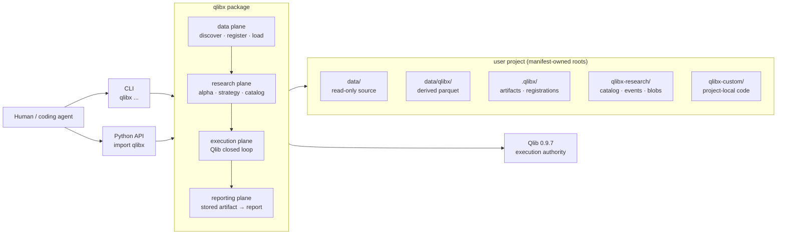

핵심 원칙 4가지:

1. **Qlib이 execution authority다.** 체결 수량·비용·포지션·NAV는 Qlib만 확정한다. qlibx는 두 번째
   bar loop를 만들지 않는다.
2. **User source는 read-only다.** qlibx가 쓰는 것은 manifest가 선언한 generated root뿐이다.
3. **Durable authority는 파일이다.** immutable manifest + append-only event가 진실이고,
   DuckDB는 언제든 재생성 가능한 projection이다.
4. **확장은 registry로 한다.** 설치된 패키지를 수정하지 않고 operation·policy·extension을 등록한다.

---

## 3. Module map과 dependency 규칙

### 3.1 계층

`src/qlibx/`는 26개 flat module이다. 계층은 디렉터리가 아니라 import 방향이 만든다.
**현재 intra-package import graph는 acyclic이다** (순환 없음).

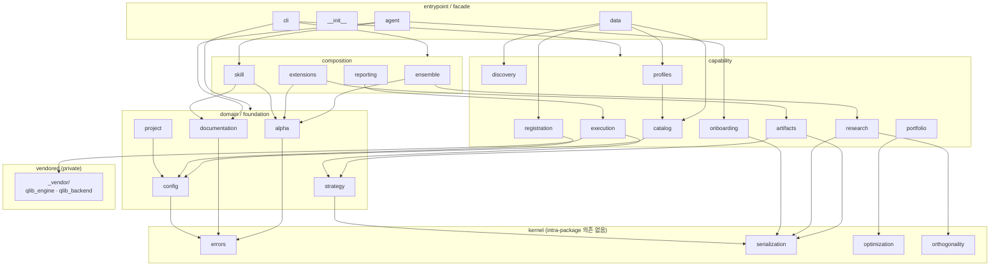

### 3.2 전체 dependency table (기계 판독용)

`(none)`은 intra-package 의존이 없다는 뜻이다.

| module | depends on (intra-package) | external |
| --- | --- | --- |
| `errors` | (none) | — |
| `serialization` | (none) | pandas |
| `optimization` | (none) | cvxpy, numpy, pandas |
| `orthogonality` | (none) | pandas |
| `config` | errors | yaml |
| `project` | config, errors | yaml |
| `documentation` | errors | — |
| `alpha` | errors | pandas |
| `strategy` | serialization | pandas |
| `catalog` | config, errors, project | duckdb, pandas |
| `discovery` | errors, project | duckdb, pyarrow |
| `registration` | config, errors, project, serialization | pyarrow |
| `profiles` | catalog, config, errors, project | — |
| `artifacts` | project, serialization, strategy | pandas |
| `research` | orthogonality, project, serialization | duckdb, pandas |
| `portfolio` | optimization | pandas |
| `execution` | `_vendor`, strategy | pandas |
| `onboarding` | errors, project, serialization | — |
| `extensions` | alpha, artifacts, errors, project | pandas |
| `ensemble` | alpha, research | pandas |
| `reporting` | execution | pandas |
| `skill` | alpha, documentation, errors, serialization | — |
| `data` | catalog, discovery, profiles, registration | — |
| `agent` | documentation, onboarding, skill | — |
| `cli` | alpha, catalog, discovery, documentation, errors, extensions, onboarding, profiles, project, registration, skill | qlib |
| `__init__` | errors, project | — |

가장 많이 의존되는 module: `errors`(13) → `project`(10) → `serialization`(6) → `config`/`alpha`(4).

### 3.3 Dependency 규칙

```text
entrypoint (cli, __init__, data, agent)
  -> composition (ensemble, reporting, extensions, skill)
    -> capability (catalog, research, execution, artifacts, ...)
      -> domain (alpha, strategy, project, config, documentation)
        -> kernel (errors, serialization, optimization, orthogonality)
```

- **Kernel은 아무것도 import하지 않는다.** 새 의존을 추가하려면 그 module이 kernel이 아니라는 뜻이다.
- **`alpha`는 pandas와 `errors` 외에 아무것도 모른다.** 순수 계산 도메인으로 유지한다. `project`,
  `catalog`, `research`를 import하면 안 된다.
- **`_vendor/`는 `execution`만 import한다.** 다른 module이 vendored 코드를 직접 참조하면 drift다.
- **역방향 import 금지.** 표에서 아래 계층이 위 계층을 import하면 순환이 생긴다.

---

## 4. Public surface

패키지 밖에서 쓸 수 있는 것은 이 두 가지뿐이다.

### 4.1 Python API

```python
import qlibx
qlibx.__all__
# ['Project', 'QlibxError', 'agent', 'alpha', 'artifacts', 'data',
#  'ensemble', 'execution', 'extensions', 'portfolio', 'reporting',
#  'research', 'strategy']
```

책임 기반의 얇은 facade다. `data`와 `agent`는 하위 module을 재수출하는 facade이고,
나머지는 실제 module이다. `_vendor`는 public surface가 아니다.

### 4.2 CLI

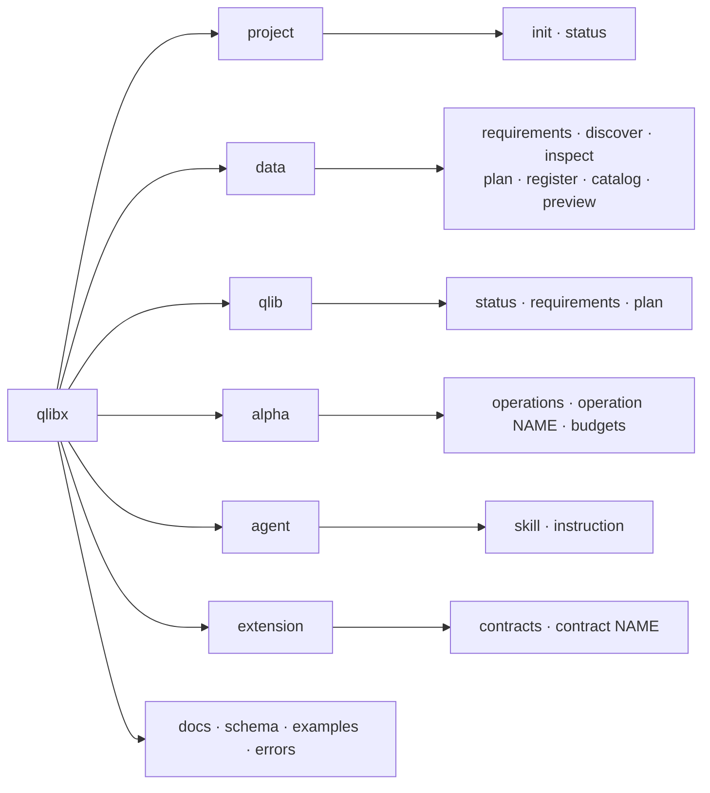

전체 23개 leaf command. 각 subcommand는 선언되는 자리에서
`set_defaults(handler=...)`로 handler를 바인딩하고, `cli.dispatch`는 `args.handler(args)` 한 줄이다.
handler는 **출력할 값을 return만** 하며 JSON 인코딩·출력·에러 변환은 한 곳에 모여 있다.

> **불변식**: 모든 leaf command는 handler를 가져야 한다.
> `tests/test_cli.py::test_every_leaf_command_binds_a_handler`가 강제한다.

읽기 전용(mutation 없음): `project status`, `data requirements|discover|inspect|plan|catalog|preview`,
`qlib *`, `alpha *`, `extension *`, `docs`, `schema`, `examples`, `errors`.
쓰기: `project init`, `data register`, `agent skill --apply`, `agent instruction --apply`.

---

## 5. Project와 ownership boundary

`qlibx.yaml`(schema_version 1)이 유일한 진입점이다. 모든 경로는 여기서 resolve하고,
project root 밖으로 나가면 `QLIBX_PATH_ESCAPE`로 실패한다.

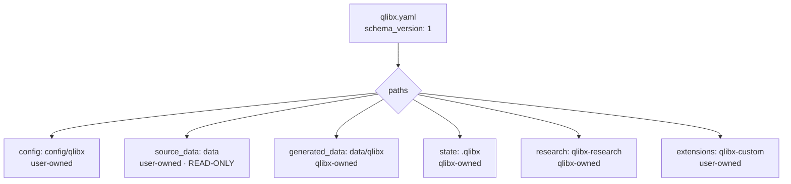

| root | 소유 | qlibx가 쓰는가 |
| --- | --- | --- |
| `config/qlibx/` | user | 아니오 (읽기만) |
| `data/` | user | **절대 아니오** |
| `data/qlibx/` | qlibx | 예 — registration 산출물 |
| `.qlibx/` | qlibx | 예 — artifacts, registrations |
| `qlibx-research/` | qlibx | 예 — research catalog |
| `qlibx-custom/` | user | 아니오 (읽고 실행만) |

User가 작성하는 config 파일의 정확한 경로:

| 경로 | 역할 |
| --- | --- |
| `qlibx.yaml` | project manifest. `schema_version` + `paths` |
| `config/qlibx/data/base.yaml` | catalog 진입점. source/dataset fragment 위치 선언 |
| `config/qlibx/data/sources.yaml` | `parquet_sources` — 물리 parquet 경로 |
| `config/qlibx/data/registrations.yaml` | source → canonical parquet 매핑 |
| `config/qlibx/data/datasets/*.yaml` | logical dataset (`kind: table` 또는 `matrix`) |
| `config/qlibx/execution.yaml` | 실행 profile. clock + role↔dataset 매핑 |

`Project.contained(path)`가 모든 경로 접근의 관문이다. Registration output은 추가로
`generated_data` 하위여야 하며(`QLIBX_OUTPUT_OUTSIDE_GENERATED_DATA`), extension source는
`extensions` 하위여야 한다.

---

## 6. Data plane — 등록에서 로딩까지

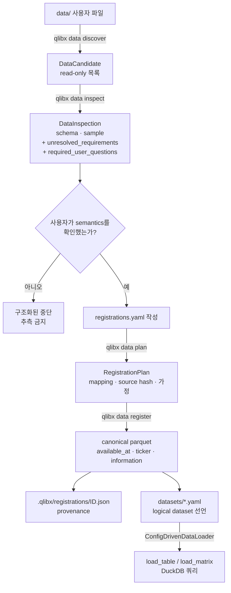

**설계 의도**: qlibx는 **시간·티커·값의 의미를 절대 추론하지 않는다.** `inspect`는 스키마와 샘플만
보여주고 미해결 질문 목록을 반환하며, 사용자가 확답한 뒤에만 YAML을 쓴다. 컬럼 이름이 비슷하다는
이유로 매핑하지 않는다.

Canonical 형태는 `available_at` + `ticker` + 불투명한 information 컬럼의 long table이다.
`available_at`이 point-in-time 가시성을 지배하는 유일한 시간축이고, event/observation time은
명시적으로 선언할 때만 별도 `time_field`로 존재한다.

Registration은 원본 SHA256을 계획 시점과 기록 직전에 두 번 확인하며, 도중에 바뀌면
`QLIBX_SOURCE_CHANGED_DURING_REGISTRATION`으로 실패한다. 쓰기는 staging → `replace`로 원자적이다.

`profiles.plan_execution_profile`은 논리 dataset을 Qlib 실행 role
(`execution_price`, `valuation_price`, `universe`, `tradable`, `volume`, `benchmark_weight`,
signed일 때 `observed`/`shortable`)에 매핑하고, 누락·비matrix·clock 불일치를 실행 전에 보고한다.

---

## 7. Alpha plane — registry 기반 확장

signal operation과 weight scaling은 **분기문이 아니라 registry**로 관리한다.
새 operation 추가는 등록 한 번이고, dispatch·lineage·문서·생성 skill이 자동으로 따라온다.

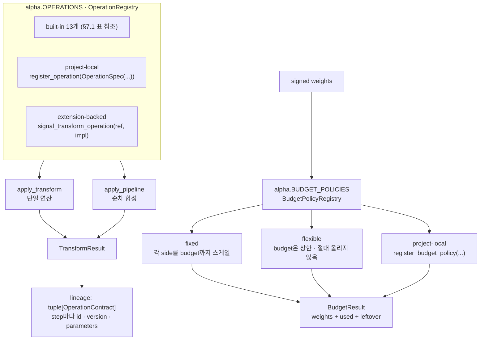

### 7.1 설치된 built-in operation

정확한 등록 이름이다. 런타임 확인은 `qlibx alpha operations`,
개별 계약은 `qlibx alpha operation <name>`.

| 이름 | axis | 요약 |
| --- | --- | --- |
| `cross_sectional_rank` | date_by_ticker | `[-0.5, 0.5]` 중심 백분위 순위 |
| `cross_sectional_demean` | date_by_ticker | 날짜별 횡단면 평균 차감 |
| `cross_sectional_zscore` | date_by_ticker | 날짜별 표준화 (모집단 표준편차) |
| `winsorize` | date_by_ticker | 날짜별 상·하위 분위수로 clip |
| `clip` | date_by_ticker | 절대 상·하한으로 clip |
| `group_demean` | date_by_ticker_with_group | 그룹 평균 차감 (라벨 결측 → 출력 결측) |
| `lag` | time_by_ticker | 인덱스 위치 기준 시프트 |
| `rolling_mean` | time_by_ticker | 완전 윈도우 이동평균 |
| `rolling_std` | time_by_ticker | 완전 윈도우 이동표준편차 |
| `linear_decay` | time_by_ticker | 최근 관측에 가중이 큰 선형 가중 평균 |
| `hump` | time_by_ticker | 스텝 변화 제한 (결측은 limiter를 재시작) |
| `top_bottom` | date_by_ticker | 상위 `count`=+1, 하위 `count`=-1 |
| `per_name_cap` | date_by_ticker | 종목별 절대 가중 상한 |

`OperationSpec`은 **선언된 semantics와 구현을 한 객체에 담는다**: `axis`, `tie_behavior`,
`nan_behavior`, `minimum_observations`, `group_missing_behavior`, `selection_behavior`, `dtype`,
`parameters`, 그리고 `apply` 콜러블. 이 덕분에 세 가지가 자동으로 일관된다.

1. **Dispatch** — `apply_transform`/`apply_pipeline`이 registry를 조회한다.
2. **Lineage** — `OperationSpec.contract()`가 결과에 기록될 `OperationContract`를 만든다.
   extension이면 `implementation_digest`(source hash)까지 들어간다.
3. **Discovery** — `qlibx alpha operations`, `alpha_operation` schema, 생성된 skill의
   `references/alpha-operations.md`가 모두 같은 registry에서 나온다.

선언되지 않은 parameter는 즉시 거부한다(`operation linear_decay does not accept parameters ['windwo']`).

**Budget 의미(PRD §8.4)**: `flexible`은 side budget을 상한으로 취급하고 절대 올려 스케일하지 않으며,
`BudgetResult.long_leftover`/`short_leftover`로 남은 예산을 관측 가능하게 남긴다. 하위 generic
module이 이 미사용 예산을 임의로 복원하거나 무관한 종목에 배분하면 안 된다.

---

## 8. Strategy plane — point-in-time 경계

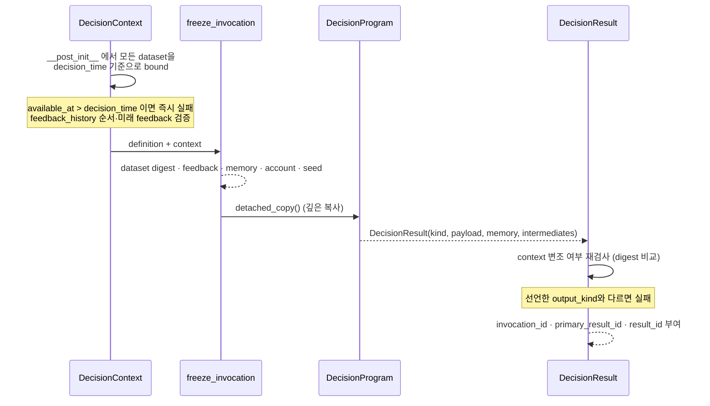

강제되는 불변식:

- **No look-ahead** — dataset은 `available_at` 행렬 또는 DatetimeIndex로 `decision_time`에서 잘린다.
  미래 관측이 섞이면 program 호출 전에 실패한다.
- **Context 불변** — program 호출 전후 digest를 비교해 bounded context 변조를 검출한다.
- **Child는 부모를 넘을 수 없다** — `DecisionContext.child()`는 시간·컬럼 범위 축소만 허용하고,
  부모 관측값이나 availability metadata를 바꾸면 실패한다.
- **Child는 계좌를 못 바꾼다** — `evaluate_child`는 부모 account digest를 전후 비교한다.
- **Resume 동등성** — `run_decision_sequence`의 checkpoint 재개 결과가 무중단 실행과 같아야 한다.

식별자 3단계: `invocation_id`(동결된 입력) → `primary_result_id`(kind + payload + memory) →
`result_id`(+ diagnostics + intermediates). diagnostic만 달라져도 상위 식별자는 유지된다.

---

## 9. Research plane — publication protocol

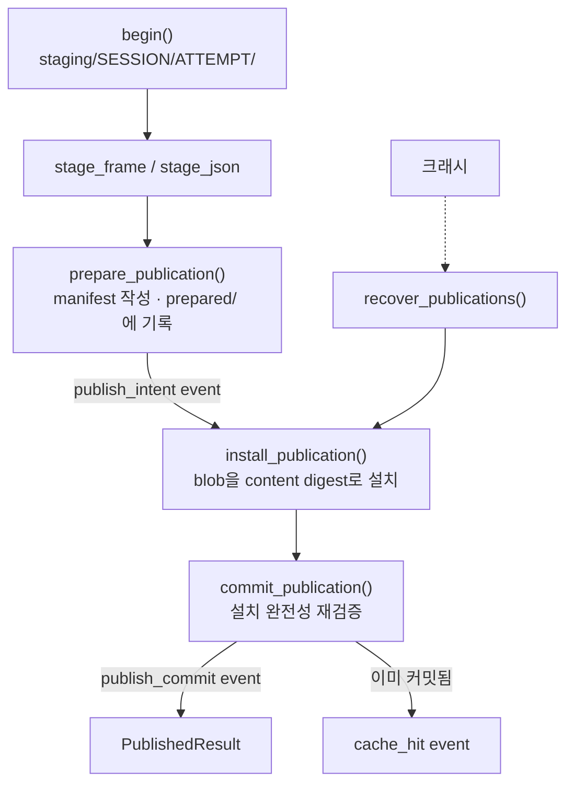

**단계를 나눈 이유**: 어느 지점에서 죽어도 복구 가능해야 한다. `prepared/`에 계획이 남아 있으면
`recover_publications()`가 install부터 다시 진행한다. 디렉터리가 존재한다는 사실만으로 완료로 보지
않으며, `commit_publication`은 모든 blob 해시를 다시 검증한 뒤에만 커밋 이벤트를 남긴다.

Durable authority와 projection의 분리:

```text
records/*.json (immutable manifest) + events/events.jsonl (append-only)  =  진실
catalog.duckdb                                                          =  재생성 가능한 projection
```

`rebuild_projection()`은 언제든 DuckDB를 버리고 다시 만들 수 있다.

**병렬 agent**: 이벤트 추가는 OS 파일 락(Windows `msvcrt` / POSIX `fcntl`)으로 직렬화한다.
`record_decision`은 `expected_version`을 요구하는 CAS이며, 낡은 버전이면 거부한다.
`_write_once`는 같은 내용이면 멱등, 다른 내용이면 `immutable content conflict`로 실패한다.

**성능 설계**: append-only 로그는 계속 자라므로 질문마다 재스캔하면 비용이 누적된다.
`_EventProjection.build()`가 **연산당 한 번** 로그를 접어 committed record/attempt, 진행 중 attempt,
최신 decision을 한 번에 만든다. 호출 간 캐싱은 **의도적으로 하지 않는다** — 병렬 agent가 그 사이에
append했을 수 있어 캐시는 정확성을 깨뜨린다.

---

## 10. Execution plane — Qlib closed loop

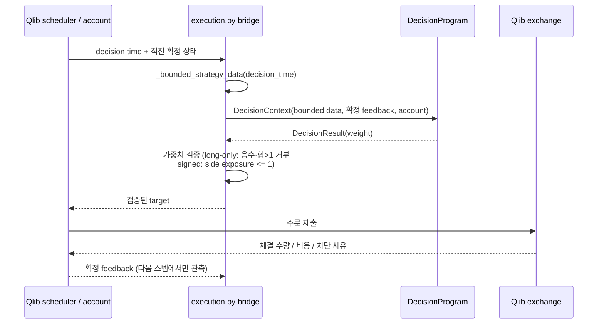

**qlibx는 production bar loop를 소유하지 않는다.** 요청한 target이나 의도한 signed 수량을 실현
보유량으로 취급하지 않는다. 체결은 Qlib이 확정한다.

두 경로:

| | Path A — long-only / enhanced index | Path B — matched capitalization |
| --- | --- | --- |
| 진입 | `run_strategy_execution(signed=None)` | `run_strategy_execution(signed=...)` / `run_signed_execution` |
| 의미 | physical weight | signed weight |
| 상태 | Qlib account가 유일 권위 | Qlib composite + capitalization journal의 joint checkpoint |
| 지위 | production | **compatibility mode** |

Path B의 항등식 — 티커별로 `C = B + A`, `A = C - B` (A=signed active, B=matched baseline ≥ 0,
C=Qlib composite ≥ 0). `_signed_result_from_backend`가 매 실행마다 수량 항등식과 NAV
(`composite = baseline + active`)를 1e-8 허용오차로 대조하고, 어긋나면 결과를 반환하지 않고
`RuntimeError`를 던진다.

Path B는 borrow/locate/margin/recall/forced buy-in/borrow fee를 **모델링하지 않는다.**
`SignedExecutionResult.compatibility_limitations`가 이 사실을 결과에 담아 반환한다.

`ExecutionScenario` dataclass가 Qlib backend 입력 계약을 한 곳에 선언한다(16개 필드).
이전에는 두 함수가 각자 `SimpleNamespace`를 만들어 이미 미세하게 어긋나 있었다.

---

## 11. Artifact · Extension · Reporting

### 11.1 Artifact envelope

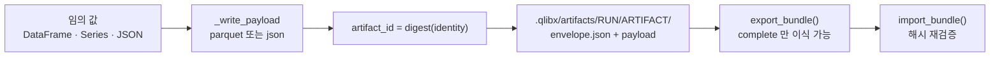

envelope는 producer identity, parent/input 계보, 시간 범위, axis/unit/currency/timezone,
payload digest, coverage/warning/diagnostics, status를 담는다. **다운스트림은 생산자가 built-in인지
project-local인지 알 필요가 없다.** 원자적 설치는 staging 디렉터리 → `os.replace`.

### 11.2 Extension contract

3개 계약이 있고 각각 워크플로 위치·입출력·검증을 소유한다.

| contract | 호출 위치 | 입력 → 출력 | 합성 |
| --- | --- | --- | --- |
| `signal_transform` v1 | signal 이후, budget/ensemble/execution 이전 | DataFrame → 동일 축 DataFrame | 예 |
| `exposure_analyzer` v1 | report 구성 이전 | ArtifactEnvelope + payload → AnalysisSection | 예 |
| `report_renderer` v1 | 최종 표현 단계 | ReportDocument → bytes/str | 아니오 |

`load_extension`은 extension root 하위 경로만 허용하고, source SHA256을 계산해 `ExtensionRef`에
담는다. `invoke_signal_transform`은 호출마다 입력 불변·축 동일·numeric-or-missing을 검증한다.

> **보안 경계 명시**: project extension은 **신뢰된 코드**다. 계약 검증은 스키마 검증이지
> malicious code sandbox가 아니다. 프로세스·파일시스템·네트워크 격리를 제공하지 않는다.

### 11.3 Reporting

```text
stored artifact  ->  AnalysisSection  ->  ReportDocument  ->  renderer  ->  output + manifest
```

- Report는 strategy·model·optimizer·backtest를 **다시 실행하지 않는다.**
- Renderer는 계산하지 않는다. `compose_report`가 선택·정렬만 하고, `render_report`는 표현만 한다.
- Report output은 canonical research artifact가 **아니다**
  (manifest의 `artifact_role`이 이를 명시한다).

---

## 12. 횡단 관심사

### 12.1 식별자와 직렬화 (`serialization.py`)

패키지의 모든 durable identity가 여기서 나온다. **두 가지 canonical form이 있고 용도가 다르다.**

| 함수 | 용도 | 비고 |
| --- | --- | --- |
| `digest_document(value)` | JSON 모양 metadata: manifest, config, plan | 인코딩 불가 값은 `str` fallback |
| `digest_dataset(value)` | pandas 구조를 가진 값: decision context, strategy result | index·columns·dtype·결측을 명시 인코딩 |
| `digest_file(path)` | 대용량 파일 | 1MB 블록 스트리밍 |
| `digest_text` / `digest_bytes` | 문자열 / 바이트 | — |
| `validate_name(name)` | 저장 payload 이름 | 소문자·숫자·`_`만 |

`digest_dataset`을 써야 할 곳에 `digest_document`를 쓰면 dtype이나 결측만 다른 두 프레임이
같은 해시로 충돌한다. 재현성 식별자에는 반드시 `digest_dataset`을 쓴다.

### 12.2 에러 계약

모든 실패는 `QlibxError`로 `{code, message, action, context}`를 반환한다.
현재 **55개 코드**가 등록되어 있고, 모두 `qlibx errors <code>`로 조회 가능하다.

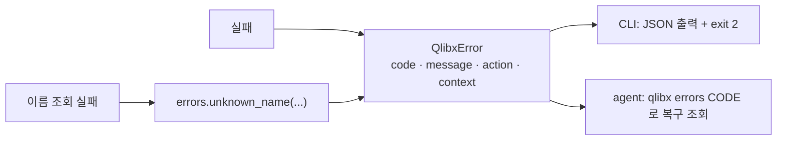

`errors.unknown_name()`이 "등록되지 않은 이름" 실패를 한 모양으로 만든다 — agent는 어느
registry에서 실패했든 `context["available"]`만 보면 대안을 얻는다.

> **불변식**: 던질 수 있는 모든 코드는 `ERROR_GUIDANCE`에 있어야 하고, 그 역도 참이어야 한다.
> `tests/test_documentation.py::test_every_raised_error_code_has_installed_recovery_guidance`가 강제한다.

### 12.3 Agent onboarding

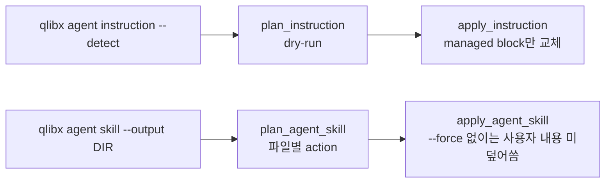

`AGENTS.md`/`CLAUDE.md`는 `<!-- qlibx:managed:start -->` 마커 사이만 교체하며 사용자 내용을
보존하고, 반복 실행해도 블록이 중복되지 않는다. 계획 이후 파일이 바뀌면
`QLIBX_INSTRUCTION_STALE_PLAN`으로 거부한다.

생성되는 skill 패키지에는 `references/alpha-operations.md`가 포함되는데,
**설치된 registry에서 렌더링**되므로 operation을 추가하면 skill이 자동으로 최신이 된다.

---

## 13. Storage layout (실제)

```text
user-project/
├─ qlibx.yaml                       # manifest — 유일한 진입점
├─ config/qlibx/                    # user-owned
│  ├─ execution.yaml                #   실행 profile (role ↔ dataset 매핑)
│  └─ data/
│     ├─ base.yaml                  #   catalog 진입점
│     ├─ sources.yaml               #   parquet source 선언
│     ├─ registrations.yaml         #   source → canonical 매핑
│     └─ datasets/*.yaml            #   logical dataset (table | matrix)
├─ data/                            # user-owned, READ-ONLY
├─ data/qlibx/                      # registration 산출 parquet
├─ qlibx-custom/                    # project-local extension
├─ qlibx-research/                  # ResearchCatalog state
│  ├─ events/events.jsonl           #   append-only 권위
│  ├─ records/<record_id>.json      #   immutable manifest 권위
│  ├─ blobs/<sha256>                #   content-addressed payload
│  ├─ staging/<session>/<attempt>/  #   미완료 작업
│  ├─ prepared/<attempt>.json       #   crash 복구용 publication plan
│  ├─ frozen/<bundle_id>.json       #   frozen run bundle
│  ├─ proposals/<id>.json
│  ├─ locks/                        #   OS 파일 락
│  └─ catalog.duckdb                #   재생성 가능한 projection
└─ .qlibx/
   ├─ artifacts/<run>/<artifact>/   #   envelope.json + payload
   └─ registrations/<dataset>.json  #   registration provenance
```

---

## 14. Testing map

96개 테스트. PRD §13 acceptance criteria와의 대응:

| PRD | 주요 테스트 |
| --- | --- |
| P0 agent onboarding | `test_agent_onboarding`, `test_documentation`, `test_cli`, `acceptance/test_p0_p1_agent_journey` |
| P1 data journey | `test_data_discovery`, `test_data_flow`, `test_execution_profile` |
| P2 StrategyAgent · no look-ahead | `test_strategy_agent`, `test_strategy_qlib_integration` |
| P3 signed alpha tool | `test_alpha_lineage`, `test_public_contracts` |
| P4 research history · parallel agent | `test_research_catalog`, `test_research_journey`, `test_orthogonality` |
| P5 ensemble · enhanced index | `test_ensemble_portfolio`, `test_ensemble_portfolio_journey`, `test_enhanced_optimizer` |
| P6 Qlib signed execution | `test_signed_execution_journey`, `test_qlib_closed_loop` |
| P7 local module · raw artifact | `test_artifact_extension_reporting_journey`, `test_reporting`, `test_execution_surface` |

구조적 불변식을 지키는 테스트(회귀 방지용, mutation으로 검증됨):

- 모든 CLI leaf command가 handler를 가진다.
- 던지는 모든 error code에 복구 guidance가 있고 그 역도 참이다.
- 문서화된 예제의 keyword가 실제 signature에 바인딩된다(단순 `compile()`이 아니라).
- 등록된 모든 operation이 `alpha_operation` schema의 필수 필드를 갖는다.

```bash
uv run pytest && uv run ruff check . && uv run ruff format --check .
```

---

## 15. Architecture guardrails

다음은 drift로 간주한다.

**계층 위반**

- `alpha`가 `project`, `catalog`, `research`를 import한다 (순수 도메인이어야 한다).
- kernel module(`errors`, `serialization`, `optimization`, `orthogonality`)이 intra-package 의존을 얻는다.
- `_vendor/`를 `execution` 외의 module이 직접 import한다.
- intra-package import graph에 순환이 생긴다.

**확장성 위반**

- signal operation이나 budget policy를 registry가 아니라 `if/elif` 분기로 추가한다.
- operation을 추가하면서 contract 선언을 별도 dict에 이중으로 관리한다.
- CLI 명령을 `parser()`에 추가하면서 handler 바인딩을 빠뜨린다.

**계약 위반**

- 이름 조회 실패를 `QlibxError`가 아닌 raw exception으로 던져 CLI가 traceback을 낸다.
- 새 error code를 `ERROR_GUIDANCE` 등록 없이 던진다.
- 문서화된 예제가 실제 signature와 맞지 않는다.

**데이터·실행 위반**

- 컬럼 이름 유사성으로 시간·티커·값 semantics를 추론한다.
- user source root에 쓴다.
- 요청 target이나 signed projection을 Qlib 실현 보유량으로 취급한다.
- Qlib scheduler 밖에 두 번째 production bar loop를 만든다.
- generic downstream이 flexible 미사용 예산을 임의로 복원한다.
- DuckDB projection만 있고 manifest/event가 없는 상태를 완료 증거로 취급한다.
- reporter가 strategy·optimizer·backtest를 다시 실행한다.
- extension 계약 검증을 malicious code sandbox라고 표현한다.

---

## 16. 알려진 격차와 다음 단계

정직하게 남겨둔 것들:

| 항목 | 현재 상태 |
| --- | --- |
| **Capability requirement contract (PRD §5.4/§5.5, P8)** | **미구현 — 최우선 격차.** PRD가 "모든 capability는 required data를 선언하고, 미충족 시 requirement gap을 보고하며, agent layer가 user와 interview한다"를 확정했으나 코드에는 자리가 없다. 상세는 아래 §16.1 |
| Beta estimation · residualization (PRD §8.2/§8.3) | **미구현.** requirement를 선언할 수단이 없어 정직하게 구현할 수 없었다. capability requirement contract가 선행 조건이다 |
| `reporting` → `execution` → `_vendor` 결합 | `reporting`이 run catalog 때문에 `execution`을 경유해 vendored 코드에 간접 의존한다. run catalog port를 분리하면 끊긴다 |
| `ResearchCatalog` 크기 | event log · blob store · publication protocol · proposal · lock을 한 클래스가 소유한다. 협력 객체로 분리하는 것이 자연스러운 다음 단계 |
| `references/`의 target architecture | `contracts/`·`runtime/`·`capabilities/`·`adapters/` 디렉터리 계층, ComponentRef, FrozenInvocationBundle, TemporalSemantics(revision/vintage), CostModelSnapshot, RiskModelSnapshot은 아직 구현되지 않았다. 현재는 flat module + import 방향으로 계층을 강제한다 |
| Path B (matched capitalization) | compatibility mode. borrow/margin/recall/fee 모델 아님 |

Flat module 구조를 유지하는 이유: 26개 module에 순환이 없고 계층이 명확하며, 디렉터리 계층을
추가해도 강제되는 규칙은 같다. 얇은 wrapper 수를 늘리기 위해 기계적으로 파일을 나누지 않는다.
module 수가 크게 늘거나 한 계층이 비대해지면 그때 디렉터리로 승격한다.

### 16.1 Capability requirement contract 격차 (PRD §5.4/§5.5, P8)

PRD가 확정한 흐름은 이렇다.

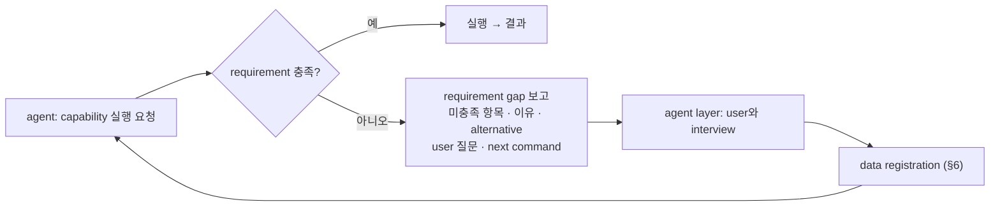

현재 코드의 상태를 실측한 결과:

| 요소 | 상태 | 근거 |
| --- | --- | --- |
| requirement 선언 필드 | **없음** | `OperationSpec`은 스칼라 `parameters`와 `requires_groups: bool`만 가진다. "어떤 dataset이 왜 필요한가"를 담을 곳이 없다 |
| 미충족 시 agent-readable 실패 | **없음** | `apply_transform("group_demean", v)` → 평범한 `ValueError`. code·context 없음 |
| 조용한 부분 결과 | **발생 중** | `analyze_exposure`가 beta 데이터 없이 `market_exposure=None`을 예외도 경고도 없이 반환한다. PRD §2.5가 이제 금지한 behavior |
| requirement gap error code | **없음** | 55개 코드 중 해당 계열 없음 |
| read-only plan 형태 | **부분적** | 아래 참조 |
| skill의 resolution interview | **없음** | SKILL.md에 registration interview는 있으나 operation gap에서 되돌아오는 경로가 없다 |

**단, 정답 템플릿은 이미 패키지 안에 있다.** 두 곳이 PRD §5.4/§5.5가 요구하는 형태에 근접해 있고,
capability requirement contract는 이 패턴을 일반화하는 작업이다.

| 기존 구현 | requirement 선언 | gap 보고 | interview 질문 |
| --- | --- | --- | --- |
| `profiles.execution_profile_requirements` + `plan_execution_profile` | `required_roles` | `missing_roles`, `unknown_datasets`, `non_matrix_datasets`, `ready` | `agent_action` |
| `discovery.inspect_data` | — | `unresolved_requirements` | `required_user_questions` |

`plan_execution_profile`은 PRD가 요구하는 "실행 전 read-only plan"에 해당하고, 그 짝인 "실행 시점 error"
형태가 없다. Alpha·exposure·portfolio·reporting 층에는 두 형태가 모두 없다.

구현 시 지켜야 할 설계 제약(PRD §5.4):

- requirement는 평평한 dataset 목록이 아니라 **derivation alternative를 가진 선택지**다
  (`market_return` = index return 등록 **또는** `market_cap` + return의 cap-weighted 계산).
- plan 형태와 error 형태는 **같은 선언에서 파생**되어야 하며 서로 다른 판정을 내면 안 된다.
- requirement 선언과 실제 실행 조건이 일치해야 한다(요구하지 않는 것을 선언하지 않는다).
- core package는 절대 user에게 직접 묻지 않는다. 질문은 gap에 담아 agent layer로 넘긴다.
