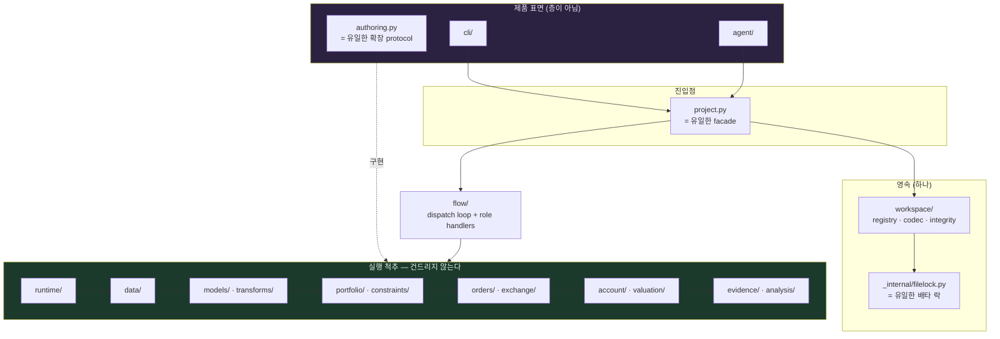

# vqapr 구조 리팩터링 — code smell과 목표 구조

| | |
|---|---|
| **작성 시각** | 2026-08-31 KST (+09:00) |
| **대상** | `src/vqapr/` 전체 — 141 modules, 32,315 lines |
| **브랜치 / HEAD** | `fix/029-one-door-into-internal` @ `4078effa` (작업 트리에 미커밋 변경 25파일 포함) |
| **테스트 기준선** | `uv run pytest tests/ -q` → **1446 passed, 14 deselected in 137.20s** |
| **lint 기준선** | `uv run ruff check src/` → **7 errors** (§S8) |
| **판정 기준** | `docs/vqapr-prd.md` (product authority) → `docs/vqapr-architecture.md` (design authority) → `docs/design/agent-first-surface.md` (표면 재설계 확정 결정) |
| **수정 여부** | **코드 수정 없음.** 이 문서는 진단과 목표 구조만 담는다. |
| **동반 문서** | 같은 패스에서 나온 correctness 결함은 §6 |
| **후속 문서** | `docs/refactoring/2026-08-31-post-step-07-review.md` — Step 0–7 실행 후 재감사, 이 문서가 잡지 못한 10건 (R1–R10) |

> **읽는 법.** 각 smell은 `증거 → 왜 문제인가 → 목표 → 이동 단위` 순서다. 측정으로 뒷받침되지
> 않는 항목은 넣지 않았다. 명령 한 줄로 재현되는 것은 그 명령을 붙였다.

---

## 0. 총평

**경제적 척추는 건강하다.** PIT 경계(`ModelWindow`가 선언되지 않은 requirement를 거부),
Account single-writer, `intended ≠ requested ≠ dealt ≠ committed` 4단계, exact-rational
optimizer, frozen run identity — architecture 문서가 약속한 불변식은 실제로 코드가 지킨다.
`Fill.__post_init__` 하나만 봐도 zero-dealt/dealt 두 상태가 서로 침범할 수 없게 잠겨 있다.
**여기는 건드릴 대상이 아니다.**

문제는 전부 **척추 바깥, 표면과 상태 저장 쪽**에 몰려 있고, 하나의 원인에서 갈라져 나왔다.

> **agent-first 표면이 기존 engine을 *대체*하지 않고 *옆에* 지어졌다.**

그 결과가 이 문서의 §1 전부다. 두 개의 facade, 두 개의 authoring protocol, 두 개의 영속
저장소, 그 둘을 잇는 7개의 bridge, 그리고 bridge가 만든 순환을 피하려고 함수 안으로 내려간
110개의 import. 각각은 그 자리에서 합리적인 선택이었고 (각 모듈의 docstring이 그 근거를 아주
성실하게 적어 두었다), **합쳐 놓으면 같은 사실을 두 곳에서 말하는 시스템**이다.

### 규모 감각

```
flow/        6,602 lines / 13 files      cli/        4,454 / 11
_internal/   3,738 / 19                  top-level   5,969 / 9
exchange/    2,253 /  9                  data/       1,717 / 10
domain/      1,191 / 10                  portfolio/  1,088 /  7
나머지 10개 package 합계  3,573 / 43
```

`flow/` + `cli/` + `_internal/` + top-level 9개 파일이 **20,763 lines, 전체의 64%**다.
경제 규칙을 소유한 층(`portfolio` · `orders` · `exchange` · `account` · `valuation` ·
`constraints` · `transforms`)은 다 합쳐 5,474 lines, 17%다. **비율이 뒤집혀 있다.**

### 우선순위 요약

| | smell | 증거 | 비용 | 난이도 |
|---|---|---|---|---|
| **S1** | 두 facade · 두 protocol · 7 bridge | `_internal/*_bridge.py` 7개 · `authoring.DataModel` vs `models.DataModel` | 최상 | 상 |
| **S2** | 한 디렉터리에 두 영속 저장소 | `.vqapr/catalog.json` + `.vqapr/workspace.yaml` · `_bridge_catalog_datasets` | 상 | 상 |
| **S3** | God module 3개 | `workspace.py` 2,251 · `flow/simulation.py` 2,116 · `public.py` 132 exports | 상 | 중 |
| **S4** | lock 3중화 · atomic write 4중화 | `grep -rn "O_CREAT | os.O_EXCL" src/` | 중 | **하** |
| **S5** | forwarding shim 층 | `extension/{component,fingerprint,loading,registration}.py` | 중 | **하** |
| **S6** | 함수 지역 import 110개 | 아래 명령 | 중 | 중 |
| **S7** | CLI가 도메인 로직을 소유 | `cli/register.py` 1,093 · `cli/run.py` 806 | 중 | 중 |
| **S8** | lint 미통과 | `uv run ruff check src/` → 7 errors | 하 | **하** |

---

## 1. 구조적 code smell

### S1 — 하나의 개념이 두 곳에서 정의되고, 7개의 bridge가 그 둘을 번역한다

**증거.**

```bash
grep -rn "^class \(DataModel\|StrategyModel\|Constraint\)\b" --include=*.py src/vqapr
```

```
authoring.py:350   class DataModel(ABC)          <-- agent-first protocol
authoring.py:852   class StrategyModel(ABC)
authoring.py:928   class Constraint(ABC)
models/data_model.py:12      class DataModel(Model)        <-- retained engine protocol
models/strategy_model.py:29  class StrategyModel(Model, ABC)
constraints/constraint.py:56 class Constraint(ABC)
```

세 확장점이 **각각 두 번** 정의되어 있다. 두 정의를 잇는 번역기가 `_internal/`에 7개 있다.

```
_internal/constraint_bridge.py    323   authoring.Constraint  -> constraints.Constraint
_internal/strategy_bridge.py      334   authoring.StrategyModel -> models.StrategyModel
_internal/pit_bridge.py           285   authoring.DatasetInput -> data.DataRequirement
_internal/venue_bridge.py         215   venues.Academic -> exchange.AcademicExchange
_internal/run_bridge.py           217   Project -> flow.preflight_run / flow.run
_internal/registration_bridge.py  131   ExtensionDeclaration -> extension.ComponentRef
_internal/schedule_bridge.py       68   simulation.Schedule -> runtime.OperationAgenda
                                 ─────
                                 1,573 lines (전체의 4.9%)
```

여기에 `_internal/models/agent_first.py` 499 lines가 더 붙는다. **번역만 하는 코드가 2,072
lines**, 경제 규칙을 소유한 `portfolio/`(1,088) + `orders/`(583)를 합친 것보다 크다.

**왜 문제인가.** DRY 위반이 아니라 **authority 위반**이다. architecture §2.7이 "변경 이유가 같은
것"을 공유 대상으로 정의하는데, `authoring.DataModel`과 `models.DataModel`은 변경 이유가 정확히
같다 — "DataModel이 무엇을 읽고 무엇을 내놓는가"가 바뀌면 둘 다 바뀐다. 지금은 **셋이 바뀐다**:
두 정의와 그 사이의 bridge. 그리고 bridge는 조용히 틀릴 수 있다. `docs/issues/041`
("a fix was verified against a double the real object does not match")과 `cli/run.py:170`의
`_recorded()` docstring이 기록한 실패 — `SimulationResult`에 없는 `.tables`를 읽으면서 테스트는
stand-in을 통과했다 — 가 정확히 이 형태다.

**목표.** bridge는 **0개**여야 한다. 두 protocol 중 **`authoring.*`가 남는 것**이 맞다.
`docs/design/agent-first-surface.md`가 그렇게 판정했고, engine protocol은 author가 minting해서는
안 되는 framework fact(intent UUID, source refs, account version)를 8개 인자 중 4개나 요구하기
때문이다 — `strategy_bridge.py`의 docstring이 스스로 그 이유를 적어 두었다.

**이동 단위.** `_internal/*_bridge.py`를 지우는 것은 마지막 단계다. 먼저 engine 쪽 protocol을
호출하는 지점을 `authoring.*`로 옮기고, bridge를 **빈 함수로 만들 수 있는지**로 진척을 잰다.

---

### S2 — 같은 디렉터리에 두 개의 영속 저장소가 있고, 한쪽이 다른 쪽으로 복사된다

**증거.**

```
.vqapr/workspace.yaml   Workspace       (workspace.py, 2,251 lines)
.vqapr/catalog.json     Catalog         (_internal/catalog_store.py + catalog.py, 482 lines)
```

`project.py:752`:

```python
def _bridge_catalog_datasets(self) -> None:
    """Mirror catalog-registered datasets into the store preflight reads.

    Two stores exist because the transactional catalog was built alongside the
    retained engine rather than replacing it. Until they are unified, a dataset the
    caller registered through `Project.register` has to be readable by preflight, or
    a Simulation whose Strategy declares `inputs()` cannot run at all.
    """
```

**왜 문제인가.** docstring이 "mirror, not a second source of truth"라고 선언하지만 **mirror는
단방향이고 additive-only다.** catalog에서 사라진 dataset이 workspace에는 남고, 그 상태를 감지하는
코드는 없다. 그리고 두 저장소는 각자의 lock, 각자의 atomic write, 각자의 failure 타입을 갖는다 —
`Workspace._exclusive`는 typed `VqaprError(write.locked)`를 던지고 `catalog_store._exclusive`는
맨 `TimeoutError`를 던진다. 지금은 `Project`가 미출하 상태라 사용자에게 도달하지 않지만,
출하되는 순간 같은 상황이 한쪽에서는 읽을 수 있는 거절이고 다른 쪽에서는 `stage: "unhandled"`다.

**목표.** 저장소는 **하나**. `Catalog`의 트랜잭션 모델(generation + root digest CAS, 후보
카탈로그 검증, rebase 없음)이 `Workspace`의 read-modify-write보다 명백히 낫다. 이름은
`Workspace`를 유지하되 **내부를 `Catalog`의 모델로 교체**하는 방향을 권한다 — 그래야 CLI 전체를
동시에 옮기지 않아도 된다.

---

### S3 — God module 세 개

| 모듈 | lines | 소유한 책임 |
|---|---|---|
| `workspace.py` | 2,251 | registry 9종 · YAML encode/decode · 파일 락 · atomic write · 참조 무결성 · legacy schema 마이그레이션 · roster pointer |
| `flow/simulation.py` | 2,116 | `SimulationFlow` 한 클래스에 **60개 메서드** (dispatch · valuation · monitoring · callback · intent 검증 · constraint · recorder · account 커밋) |
| `public.py` | 760 | `__all__`에 **132개 이름** 재수출 |

**증거.**

```bash
grep -c '"' <(sed -n '/^__all__/,/^)/p' src/vqapr/public.py)   # 132
grep -n "    def " src/vqapr/flow/simulation.py | wc -l          # 60
```

**왜 문제인가.**

- `workspace.py`의 `_decode`(1,738–2,168행, **430 lines의 단일 함수 영역**)는 legacy shape 3종
  (`legacy = expected - {"span"}`, `legacy_fill = {...}`)을 동시에 받아들인다. 새 필드 하나가
  네 곳을 건드린다: `_encode`, `_decode`, `_detach_*`, 그리고 8-tuple을 꿰는 모든 시그니처.
- `SimulationFlow`는 architecture §1.2가 "flow는 경제 규칙을 소유하지 않는다"고 못 박은 층인데,
  `_validate_callback_intended_constraints`, `_execution_horizon`, `_standalone_marks` 같은
  이름이 그 안에 있다. **규칙을 소유하지 않는 층이 2,116 lines일 수 없다.**
- `public.py`의 132개 재수출은 fan-in을 만든다. `flow/judgments.py`, `data/windows.py`,
  `workspace.py` — **아래 층이 최상위 facade를 import한다.** `docs/issues/028`이 이미 한 건
  잡았고, 구조가 그대로면 계속 생긴다.

**목표.**

- `workspace.py` → `workspace/{registry,codec,integrity,migration}.py`. 특히 **codec을 분리**하면
  legacy shape 지원이 한 파일에 갇히고, S2의 저장소 통합 때 통째로 버릴 수 있다.
- `SimulationFlow` → dispatch loop만 남기고 role별 handler로 분리
  (`flow/handlers/{callback,valuation,monitoring,execution}.py`). 이미 `_dispatch_*` 네 개로
  자연 절단선이 나 있다.
- `public.py` → 재수출 목록이 아니라 **얇은 진입점**. 132개는 사용자가 읽을 수 있는 표면이
  아니다. `src/` 내부에서의 `vqapr.public` import는 **0이 목표**다 (현재 18개 파일).

---

### S4 — 배타 락 3중화, atomic write 4중화 (가장 싸게 갚을 수 있는 빚)

**증거.**

```bash
grep -rn "O_CREAT | os.O_EXCL\|os.replace" --include=*.py src/vqapr
```

| 구현 | 위치 | 타임아웃 / stale | 실패 타입 | age 클램프 |
|---|---|---|---|---|
| workspace | `workspace.py:1207` | 30.0 / 120.0 | typed `VqaprError` | 있음 |
| catalog | `_internal/catalog_store.py:123` | 30.0 / 120.0 | 맨 `TimeoutError` | **없음** |
| run record | `flow/run_records.py:445` | — / 120.0 | typed `RunRecordLive` | 있음(이번 diff에서 추가) |

`catalog_store._exclusive`의 docstring은 대놓고 *"Modeled directly on `Workspace._exclusive`"*
라고 적어 두었다. **복사임을 알고 복사했다.** 상수 `30.0`/`120.0`이 세 파일에 흩어져 있고,
이번 작업 트리에서 `run_records`에만 들어간 `max(..., 0.0)` 클램프는 catalog에 없다.

`os.replace` 기반 atomic write도 네 곳(`workspace.py:1447`, `catalog_store.py:182`,
`_internal/objects.py:109`, `flow/run_records.py:511`)에 각자 있다.

**목표.** `_internal/filelock.py` 하나. `stale_after`/`timeout`/실패 팩토리를 파라미터로 받고,
세 호출부가 자기 typed error만 주입한다. **이 하나가 즉시 실행 가능하고, 회귀 위험이 가장 낮고,
`tests/` 에 `concurrency` 마커가 이미 있어 검증도 준비되어 있다.**

---

### S5 — 지워질 예정인 forwarding shim이 계약이 되어 가고 있다

**증거.** `extension/{component,fingerprint,loading,registration}.py` 4개, 합계 106 lines,
전부 `_internal/extensions/*`를 그대로 재수출한다. 각 파일 docstring:

> *"It carries no logic of its own and will be deleted when the internal-transition closes"*

그런데 이번 작업 트리의 diff는 **이 shim들을 강화하는 방향으로 나갔다** — `public.py`가
`as_loaded_fingerprint`를 `_internal`에서 직접 가져오던 것을 shim 경유로 되돌리고,
`tests/boundaries/test_internal_has_one_door.py`로 그 규칙을 강제했다.

**판정.** 그 결정 자체는 옳다(`docs/issues/029`의 근거가 타당하다 — 문 하나짜리 삭제가 문 둘짜리
삭제보다 싸다). **문제는 삭제 조건이 아직 문서에만 있고 코드에 없다는 것이다.** "temporary"라고
쓰인 파일이 6개월째 살아 있고, 이제 테스트가 그 존재를 고정한다.

**목표.** 둘 중 하나로 **결정**한다.

- (a) `extension/`을 정식 이름으로 승격하고 `_internal/extensions/`를 없앤다 — shim 4개가 실체가
  된다. 코드 이동만 필요하고 caller는 한 줄도 안 바뀐다. **권장.**
- (b) 삭제 조건을 만족시키고 `_internal` 직접 참조로 통일한다.

지금처럼 "임시라고 적힌 영구 계약"으로 두는 것만 피하면 된다.

---

### S6 — 함수 지역 import 110개는 숨겨진 순환이다

**증거.**

```bash
grep -rn "^\s\+from vqapr\|^\s\+import vqapr" --include=*.py src/vqapr | wc -l   # 110
```

```
project.py                     23      _internal/pit_bridge.py           6
_internal/strategy_bridge.py   13      public.py                          5
_internal/venue_bridge.py      12      _internal/registration_bridge.py   5
_internal/constraint_bridge.py 10      cli/{show,run,register}.py      각 4
_internal/run_bridge.py         7      나머지                            21
```

**`project.py` + 6개 bridge에 76개(69%)가 몰려 있다.** S1이 만든 순환을 지연 import로 덮은
것이다.

**왜 문제인가.** `pyproject.toml`이 layer 경계를 도구로 강제하지 않기로 한 근거가 이것이다:

> *"a misplaced type surfaces as a circular import, which Python reports without a tool."*

**그 전제가 이미 무너져 있다.** 함수 지역 import는 순환을 런타임 첫 호출까지 미루므로, Python은
더 이상 그것을 보고해 주지 않는다. 유일한 예외가 `run_bridge.py`인데, 거기는 지연이 *의도적*이고
(`tests/boundaries/test_capability_absence.py`가 leaf module의 `sys.modules` 오염을 검사한다)
docstring이 그 이유를 명시한다. 나머지 100여 개에는 그런 근거가 없다.

**목표.** S1이 해결되면 대부분 자동으로 사라진다. 그때까지의 중간 조치: **의도적 지연에는
근거 주석을 의무화하고, 근거 없는 지연 import 수를 회귀 지표로 고정**한다(`tests/boundaries/`에
카운트 상한 테스트 한 개). 지금 110에서 늘지 않게만 해도 S1 작업이 훨씬 쉬워진다.

---

### S7 — CLI가 도메인 로직을 소유한다

**증거.** `cli/register.py` 1,093 lines에 `_dataset`, `_execution_input`, `_sessions`, `_agenda`,
`_instruments`, `_sole_subclass`(AST 파싱으로 클래스 찾기), `_undeclared_roster_tables` —
**YAML 선언 → 도메인 객체 변환 전체**가 들어 있다. `cli/run.py`는 `_fill_summary`(체결 통계 집계),
`_tables_declared`를 소유하고, `cli/new.py`는 `_lookback_arguments`(어떤 lookback member가
어떤 kind에 유효한가 = 도메인 규칙)를 소유한다.

**왜 문제인가.** architecture §10.2가 CLI를 "층이 아니라 제품 표면"으로 정의한다. 표면이 규칙을
소유하면 **그 규칙은 CLI 없이 테스트할 수 없고, `Project` API로는 도달할 수 없다.**
`docs/issues/030`(skill이 CLI가 거부하는 명령을 stop condition으로 안내)과
`docs/issues/012`(`check`가 거부하는 spec을 `run`이 통과시킨다)가 같은 뿌리다 — 두 진입점이
각자 규칙을 들고 있으면 서로 어긋난다.

**목표.** `cli/*`는 (1) argparse 배선, (2) 도메인 호출, (3) envelope 렌더 **셋만** 한다.
`register.py`의 선언 파싱은 `authoring`/`project` 쪽으로, `run.py`의 `_fill_summary`는
`analysis/` 또는 `evidence/`로 내린다. 판정 기준: **`vqapr.cli`를 import하지 않고 같은 결론에
도달할 수 있는가.**

---

### S8 — lint가 통과하지 않는다

```bash
uv run ruff check src/
```

```
src/vqapr/cli/new.py:734:101         E501  Line too long (103 > 100)
src/vqapr/exchange/listings.py:28:36 F401  `dataclasses.field` imported but unused
src/vqapr/exchange/venue.py:6:36     F401  `dataclasses.field` imported but unused
src/vqapr/exchange/venue.py:12:38    F401  `vqapr.domain.instruments.Instrument` imported but unused
src/vqapr/flow/simulation.py:1700:101 E501 Line too long (103 > 100)
src/vqapr/public.py:7:1              I001  Import block is un-sorted
src/vqapr/public.py:143:11           RUF022 `__all__` is not sorted
Found 7 errors.  [*] 4 fixable
```

`pyproject.toml`이 `select = ["E","F","I","UP","B","SIM","RUF"]`로 설정해 두고 통과하지 않는다.
**설정된 게이트가 열려 있으면 게이트가 아니다.** `--fix`로 4개, 손으로 3개, 5분 작업이다.
`.agent/project.yaml`의 `commands`에 lint가 없는 것도 같이 고칠 것.

---

## 2. 목표 구조



**지금과 다른 점 네 가지.**

1. `public.py`가 없다. `project.py` 하나가 facade다.
2. `_internal/*_bridge.py`가 없다. `authoring.*`가 곲 engine protocol이다.
3. `.vqapr/`에 저장소가 하나다.
4. `flow/`에서 위로 올라가는 화살표(`flow → workspace`, `flow → public`)가 없다.

**층 자체는 architecture §1.2를 그대로 유지한다.** 일곱 layer의 정의와 "시간의 질문으로 층을
긋는다"는 판단은 이 리팩터링이 건드리는 대상이 아니다. 옆기는 것은 표면과 상태뿐이다.

---

> ## ERRATUM — 2026-08-31: 위 목표의 1번은 효력이 없다
>
> **무엇이 틀렸나.** 이 절의 다이어그램과 목록 1번은 *"`public.py`가 없다. `project.py`
> 하나가 facade다"* 라고 적는다. 그 목표는 **도달 불가능하며, canonical ruling을 위반한다.**
> `docs/implementations/104-which-facade-survives.md`가 이를 측정값으로 뒤집었다.
>
> **근거, 요약.** `docs/design/agent-first-surface.md:240-241`의 tracer table은 완전한 CLI
> 여정에서 `project.py`가 619줄 중 **0줄** 실행된다고 측정한다. `project.py`는 `src/` 내
> importer가 `vqapr/__init__.py:38` 단 하나다. 반면 `public.py`는 세 verb의 일곱 지점에서
> import된다(`cli/check.py:45`, `cli/register.py:66`, `cli/run.py:36,48,541,770,804`). 그리고
> 같은 canonical 문서의 freeze는 양면이다 — *"no new callers"*와 *"no growth"*(`:271-275`).
> 동작하는 제품을 동결된 모듈로 이사시키는 것은 그 둘을 동시에 깨는다. `public.py`를 지금
> 지우는 것은 `G008`이고, 두 admission gate가 모두 닫혀 있다.
>
> **대신 무엇을 하는가.** 출하된 `vqapr.public`이 살아남고, 그 안의 orchestration 450줄이
> `flow/`와 `evidence/`로 내려가 진짜로 얇은 export 표면만 남는다(단계 7).
> `project.py`는 동결된 채로 `G008`에서 예정대로 죽는다. 나머지 세 항목(2–4번)은 유효하다.
>
> **왜 승인이 아니라 erratum인가.** 이 문서는 `.agent/project.yaml:canonical_documents`에
> 없다(그 집합은 `docs/vqapr-prd.md`, `docs/design/agent-first-surface.md`,
> `gjc-handoff/README.md`). 따라서 canonical 문서는 하나도 바뀌지 않았고 owner 승인도 필요하지
> 않았다. 반대로 이 결정을 뒤집으려면 `agent-first-surface.md`의 "Which facade ships"와
> "What frozen means"를 고쳐야 하고, 그것은 **owner만** 승인할 수 있다.
>
> 이 절의 나머지 부분은 그대로 둔다 — 틀렸던 결론을 지우는 대신 왜 틀렸는지를 남기는 것이
> 이 저장소의 방식이기 때문이다.

---

## 3. 순서 — 각 단계가 독립적으로 출하 가능해야 한다

> **원칙.** 한 단계 = 하나의 implementation record(`docs/implementations/NNN-*.md`) = 하나의
> 커밋 후보. 단계 사이에 트리는 항상 green이어야 하고, `test_all`이 통과해야 한다.

### 1단계 — 갚기 쉬운 빚 (S8, S4, S5)

| # | 작업 | 검증 |
|---|---|---|
| 1.1 | `ruff --fix` + 남은 3건 수동 수정, `.agent/project.yaml`에 `lint` 명령 추가 | `uv run ruff check src/` 통과 |
| 1.2 | `_internal/filelock.py` 추출, 3개 호출부 이관, 상수 1곳으로 | `pytest -m concurrency` |
| 1.3 | atomic write 4중화 → `_internal/atomic.py` 1개 | 기존 스위트 |
| 1.4 | S5의 (a)/(b) 결정. **(a) 권장**: `_internal/extensions/*` → `extension/*` 승격, shim 4개 삭제 | `tests/boundaries/test_internal_has_one_door.py` 갱신 |

**여기까지가 회귀 위험 거의 0에 코드 ~250 lines 감소.** 그리고 1.2/1.3이 S2를 위한 준비다 —
두 저장소를 합치려면 락과 write가 먼저 하나여야 한다.

### 2단계 — fan-in 끊기 (S3의 `public.py`, S7)

| # | 작업 | 검증 |
|---|---|---|
| 2.1 | `src/` 내부의 `vqapr.public` import 18곳 제거 — 각각 실제 소유 모듈을 직접 가리키게 | `tests/boundaries/test_public.py` + 신규: `src/` 내 `vqapr.public` import 수 == 0 |
| 2.2 | `cli/register.py`의 선언 파싱을 `authoring`/`project` 쪽으로 이관 | `vqapr.cli` 없이 같은 등록을 수행하는 테스트 |
| 2.3 | `cli/run.py::_fill_summary` → `analysis/` 또는 `evidence/` | 기존 CLI 계약 테스트 유지 |
| 2.4 | 근거 없는 함수 지역 import 카운트 상한 테스트 추가(현재값 고정) | 신규 boundary 테스트 |

**2.1이 이 문서 전체에서 단일 최고 가치 작업이다.** `flow/`, `data/`, `workspace.py`가 최상위
facade를 import하는 한 어떤 층 경계 주장도 성립하지 않고, S1의 순환도 풀리지 않는다.

### 3단계 — protocol 통합 (S1)

bridge를 **하나씩** 없앤다. 작은 것부터가 맞다:

```
schedule_bridge (68)  ->  venue_bridge (215)  ->  registration_bridge (131)
  ->  pit_bridge (285)  ->  constraint_bridge (323)  ->  strategy_bridge (334)
  ->  run_bridge (217)                                          [마지막]
```

각 bridge마다: (1) engine 쪽 타입을 `authoring` 타입으로 받도록 호출부 수정 → (2) bridge를
identity 함수로 축소 → (3) 삭제. **진척 지표는 bridge lines 총합**(현재 1,573 → 0).

`models/{model,data_model,strategy_model,contexts}.py`(262 lines)와
`constraints/constraint.py`는 3단계 종료 시 사라지거나 `authoring.py`가 참조하는 얇은 base만
남는다.

### 4단계 — 저장소 통합 (S2)

3단계가 끝나야 시작할 수 있다. bridge가 남아 있으면 두 저장소를 동시에 만족시켜야 한다.

- 4.1 `workspace.py` 분해: `workspace/{registry,codec,integrity,migration}.py`
- 4.2 `Catalog`의 CAS 트랜잭션 모델을 `workspace/registry`에 이식
- 4.3 `catalog.json` → `workspace.yaml` 일회성 마이그레이션, `_bridge_catalog_datasets` 삭제
- 4.4 `codec`의 legacy shape 지원(`legacy = expected - {"span"}`, `legacy_fill`)에 만료일을 붙인다

### 5단계 — `SimulationFlow` 분해 (S3)

가장 위험하므로 **마지막**. `_dispatch_callback` / `_dispatch_valuation` / `_dispatch_monitoring`
/ `_dispatch_due` 네 개가 절단선이다. `flow/handlers/`로 내리고 `SimulationFlow`에는 merge된
occurrence 순회와 상태 전이만 남긴다. **`pytest -m ""`(slow 14개 journey 포함) 전체 통과가
단계 완료 조건**이다 — `.agent/project.yaml`이 run assembly 변경에 `test_all`을 요구한다.

---

## 4. 하지 않을 것

- **척추의 경제 규칙을 건드리지 않는다.** `optimize`, `plan_orders`, `Account.prepare_fill`,
  `Fill.__post_init__`, `ModelWindow`의 requirement 검사 — 여기는 리팩터링 대상이 아니다.
- **docstring을 줄이지 않는다.** 이 저장소의 docstring은 장식이 아니라 **결정의 근거 기록**이고,
  여러 곳에서 issue 번호를 통해 검증 가능하다. 코드를 옮길 때 근거도 같이 옮긴다.
- **층 이름과 층 정의를 바꾸지 않는다.** architecture §1.2는 유효하다.
- **import-linter를 도입하지 않는다** — `pyproject.toml`의 거부 근거는 여전히 타당하다. 대신
  S6의 카운트 상한과 2.1의 `vqapr.public` 금지처럼 **구체적 사실 하나씩을 테스트로** 고정한다.
- **한 번에 여러 단계를 묶지 않는다.** 3단계와 4단계를 동시에 하면 두 저장소와 두 protocol이
  동시에 움직여서 되돌릴 수 없다.

---

## 5. 진척 지표

각 단계 후 아래를 측정해 implementation record에 기록한다.

```bash
# bridge 총량 (목표 0)
wc -l src/vqapr/_internal/*_bridge.py | tail -1

# src 내부 public facade 의존 (목표 0)
grep -rln "vqapr\.public" --include=*.py src/vqapr | grep -v "public.py" | wc -l

# 근거 없는 지연 import (목표: 감소만)
grep -rn "^\s\+from vqapr\|^\s\+import vqapr" --include=*.py src/vqapr | wc -l

# 락 구현 수 (목표 1)
grep -rl "O_CREAT | os.O_EXCL" --include=*.py src/vqapr | wc -l

# god module (목표: 모두 < 800)
find src/vqapr -name '*.py' -exec wc -l {} + | sort -rn | head -5

# 게이트
uv run ruff check src/ && uv run pytest tests/ -q -m ""
```

---

## 6. 이 패스에서 같이 나온 correctness 결함

리팩터링과 별개로 **지금 고쳐야 하는** 것들. 각각 별도 이슈로 등록할 것을 권한다.

### C1 — 손상된 roster pointer가 조용히 "roster 없음"이 된다 (심각)

`src/vqapr/public.py:520` (`_registered_roster`), `:613` (`roster_report`)

`Workspace.registered_instruments()`는 pointer JSON이 손상되면 typed
`workspace.instruments.unreadable`을 **일부러 던진다.** 그 docstring이 근거를 명시한다:

> *"Reported, never repaired and never treated as absent: 'no roster' and 'a roster whose record
> is damaged' are different states, and only the first is ordinary."*

그런데 두 호출부가 그 예외를 삼킨다:

```python
try:
    pointer = Workspace.open(root_path).registered_instruments()
except Exception:
    return None
```

바로 **다음 줄의 주석**이 *"A REGISTERED roster that cannot be read is refused, not degraded"*
라고 쓰여 있다. 실제로 거절되는 것은 roster **테이블** 읽기 실패뿐이고, **pointer 손상은 위에서
이미 삼켜졌다.**

**재현 시나리오.** roster를 등록한 프로젝트에서 `.vqapr/instruments.json`이 중간에 잘린다
(쓰기 중 크래시, 손편집). `vqapr run`은 `ok: true`, `roster: null`로 완주하고, 모든 fill이
`kind: None`을 기록하며, KRX 형태 venue에서는 ETF 면세 sleeve까지 주식 세율로 과금된다 —
`docs/issues/007`이 닫은 결함이 그대로 되살아난다. 사용자에게는 "roster를 등록하지 않은 프로젝트"와
구별되지 않는다.

**수정.** `except Exception` → `Workspace.open`만 감싸고(`VqaprError` 제외), 
`registered_instruments()`의 typed 거절은 통과시킨다.

### C2 — `Workspace.remove()`의 참조 검사가 락 밖에서 일어난다

`src/vqapr/workspace.py:1034`

```python
blockers = self.references_to(kind, identity)   # <-- 자체적으로 _read(), 락 없음
if blockers: raise ...
with self._exclusive():                          # <-- 여기서야 락
    state = self._read()
```

`references_to()`와 `_write()` 사이에 다른 프로세스가 그 component를 참조하는 strategy config를
등록하면, 삭제가 그대로 진행되어 **참조가 끊긴 workspace 문서**가 남는다. `_decode`는 forward
reference를 검증하므로 그 뒤로는 `Workspace.open()` 자체가 실패한다 — 프로젝트 전체가 열리지
않는다. 저장소에 `concurrency` 마커가 이미 있는 만큼 가정 밖의 시나리오가 아니다.

**수정.** `references_to`를 `_exclusive()` 안에서, 락 안의 `state`에 대해 수행한다.

### C3 — `--lookback` + `--calendar-lookback` 충돌이 기본값일 때만 검출된다

`src/vqapr/cli/new.py:459` (`_lookback_arguments`, 이번 작업 트리에서 추가된 코드)

docstring이 *"Giving both is refused rather than resolved by precedence: a reader should not have
to know which flag wins"* 라고 선언하지만, 검사는 `if args.lookback != _LOOKBACK_DEFAULT`다.
`vqapr new datamodel m --dataset d --lookback 6 --calendar-lookback 30`은 두 플래그를 모두 주고도
거절되지 않고 `--lookback`이 조용히 무시된다 — 정확히 docstring이 막겠다고 한 상황이다.

**수정.** argparse `default=None`으로 바꾸고 "주어졌는가"를 값이 아니라 존재로 판정한다.

### C4 — 세 번째 락 구현만 typed failure를 갖지 않는다 (§S4와 동일 뿌리)

`_internal/catalog_store.py:150`이 맨 `TimeoutError`를 던진다. 지금은 `Project`가 미출하라
사용자에게 도달하지 않지만, `cli/main.py:200`의 `except Exception`은 이것을 `stage: "unhandled"`로
렌더한다 — 같은 상황에서 `Workspace`는 읽을 수 있는 `write.locked`를 준다. **1.2단계에서 함께
해소된다.**

---

## 부록 — 이 문서가 근거로 쓴 명령

```bash
find src/vqapr -name '*.py' -exec wc -l {} + | sort -rn | head -20
grep -rn "^class \(DataModel\|StrategyModel\|Constraint\)\b" --include=*.py src/vqapr
wc -l src/vqapr/_internal/*_bridge.py
grep -rn "^\s\+from vqapr\|^\s\+import vqapr" --include=*.py src/vqapr | cut -d: -f1 | sort | uniq -c | sort -rn
grep -rn "O_CREAT | os.O_EXCL\|os.replace" --include=*.py src/vqapr
grep -rn "vqapr\.public" --include=*.py src/vqapr | grep -v "^src/vqapr/public.py" | cut -d: -f1 | sort -u
uv run ruff check src/ --output-format concise
```
