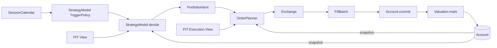

# vqapr Architecture

- **Status**: target design. `src/vqapr/`는 이 문서가 승인된 뒤에 만든다.
- **Authority**: `docs/vqapr-prd.md`가 제품 authority. 이 문서는 그것을 구현하는 설계 authority.
- **읽는 법**: 각 설계 결정은 `결정 → 왜 → 없으면 무엇이 깨지는가 → 어떤 UC` 순서로 적는다.
  근거 없는 결정은 이 문서에 두지 않는다.

---

## 1. 한 장 요약

### 1.1 실행 척추



- 위 경로를 통과하지 않고 return/NAV/PnL/turnover를 만드는 코드는 없다. — PRD §2.2
- DataModel, feature, label, IC 같은 research 연산은 이 척추에 **들어오지 않고** 끝난다.

### 1.2 여섯 layer

| layer | 답하는 질문 | module |
|---|---|---|
| Runtime | 언제 호출하는가 | `runtime/` |
| Data | 그때 무엇을 읽을 수 있는가 · 어떤 값을 만드는가 | `data/`, `research/` |
| Decision | 무엇을 의도하는가 | `strategy/`, `portfolio/` |
| Execution | 의도가 어떤 주문·체결이 되는가 | `orders/`, `exchange/` |
| State | 실제 상태가 어떻게 바뀌는가 | `account/`, `valuation/` |
| Evidence | 무엇을 읽었고 무엇이 일어났는가 | `evidence/` |

`flow/`는 이 layer들을 조립하고 이벤트를 배달한다. **경제 규칙을 소유하지 않는다.**

### 1.3 세 줄 규칙

1. **아무도 Store를 직접 열지 않는다.** 소비자는 requirement를 선언하고 Flow가 bounded View를 준다.
2. **Account만 상태를 쓴다.** 나머지는 전부 값을 계산해 Flow에 반환한다.
3. **Component는 서로를 호출하지 않는다.** 다음 단계를 부르는 건 Flow다.

---

## 2. 설계 원칙

### 2.1 IoC — Flow가 시간을 소유한다

**결정.** Clock이 이벤트를 발화하고 Flow가 callback을 부른다. StrategyModel은 언제 판단할지 *선언*만 하고
자신을 호출하거나 시간을 진행시키지 않는다.

- **왜**: decision, execution, valuation, monitoring이 서로 다른 cadence를 가져야 한다. cadence를
  component가 소유하면 조합이 불가능하다.
- **없으면**: StrategyModel이 execution을 직접 부르는 순간 "decision time에 보이는 정보"와 "execution time에
  보이는 정보"가 같은 호출 스택에 섞여 PIT 경계가 코드로 표현되지 않는다.
- **UC**: `UC-TRIGGER-001`, `UC-EXEC-001`, `UC-EXEC-003`, multi-frequency scenario

### 2.2 Least authority — bounded View

**결정.** 각 소비자는 `DataRequirement`를 선언하고, Flow의 resolver가 `available_at <= evaluation_time`을
적용한 **읽기 전용 View**를 주입한다. Store 핸들은 어디에도 전달하지 않는다.

- **왜**: PIT은 규칙이 아니라 **접근 불가능성**으로 강제해야 한다. 규칙은 잊히고 캡슐화는 잊히지 않는다.
- **없으면**: `store.query(...)` 한 줄이면 look-ahead가 가능하다. 리뷰로 막는 것은 확장되지 않는다.
- **UC**: `UC-PIT-001`, `UC-LOOKBACK-001`, `UC-DATA-002`, `UC-TIME-001`

### 2.3 Aggregate Root — Account

**결정.** cash, position, cost, version, journal의 쓰기 권한은 `Account` 하나가 갖는다. 변경은
`commit(fills, expected_version)`과 `mark(marks, expected_version)` 둘뿐이다.

- **왜**: "committed actual state만 authority"(PRD §2.4)를 지키려면 authority가 **한 객체**여야 한다.
- **없으면**: intended 값을 상태에 쓰는 경로가 생기고 `intended ≠ committed`가 무너진다.
- **UC**: `UC-CLOSED-LOOP-001`, `UC-ACCOUNT-HISTORY-001`, `UC-CONSTRAINT-ADJUST-001`

### 2.4 Functional Core / Imperative Shell

**결정.** 계산(weighting, construction, planning, matching, valuation 산술)은 순수 함수. 부작용(commit,
publication, state 전달)은 Flow에만 있다.

- **왜**: PRD가 요구하는 deterministic replay는 계산이 순수할 때 공짜로 얻어진다.
- **없으면**: 계산 안에 I/O가 섞이면 fixture 테스트가 불가능해지고 `UC-SCALE-001`의 3,000종목 검증이
  단일종목 검증과 등가임을 보일 수 없다.
- **UC**: 전 범위 (deterministic replay는 cross-cutting invariant)

### 2.5 StrategyModel Pattern — profile은 주입한다

**결정.** `Exchange`는 protocol이고 Academic/KRX는 그 구현이다. run마다 keyword로 주입한다. profile별
Flow를 만들지 않는다.

- **왜**: 두 profile은 **같은 lifecycle에 다른 정책**이다(PRD §6.4). Flow를 나누면 그 사실이 거짓이 된다.
- **없으면**: `UC-PORTFOLIO-001`(같은 alpha를 두 profile로)이 두 코드 경로의 우연한 일치가 된다.
- **UC**: `UC-PROFILE-001`, `UC-ACADEMIC-001`, `UC-PORTFOLIO-001`

### 2.6 Facade — 단일 public 진입점

**결정.** `vqapr.public`이 유일한 documented surface. 내부 module 경로는 계약이 아니다.

- **왜**: `UC-FACADE-001`이 "package source를 열지 않고 완주"를 요구한다.
- **없으면**: 사용자가 내부 import에 의존하면 리팩터가 breaking change가 된다.
- **UC**: `UC-FACADE-001`, `UC-EXTENSION-002`

### 2.7 DRY의 경계 — 무엇을 공유하고 무엇을 나누는가

DRY는 **모양이 같은 것**이 아니라 **변경 이유가 같은 것**에 적용한다.

| 공유한다 (변경 이유가 하나) | 나눈다 (변경 이유가 다르다) |
|---|---|
| `PortfolioIntent` / `OrderBatch` / `FillBatch` envelope | Academic vs KRX의 가격·비용·수량 규칙 |
| `Account.commit` / `mark` / history | long-only vs signed의 전이 유효성 |
| 이벤트 순서와 failure taxonomy | profile별 realism label과 limitation |
| requirement → View 해석 경로 | 각 소비자가 무엇을 요구하는가 |

- **없으면 (과한 공유)**: 두 profile의 비용 정책을 한 함수에 합치면 `UC-COST-004`의 "ETF에 Equity policy를
  적용하지 않는다"가 조건 분기 하나 차이로 무너진다.
- **없으면 (부족한 공유)**: envelope을 profile마다 따로 두면 `UC-PORTFOLIO-001`을 비교할 공통 축이 사라진다.

### 2.8 어떤 제약이 어디에 속하는가

새 제약이 생길 때마다 "이건 Exchange야 Account야"를 다시 논쟁하지 않기 위한 판정 규칙이다.

> **venue를 바꾸면 달라지는가?** → **Exchange**
> **계좌를 바꾸면 달라지는가?** → **Account**
> **둘 다 안 바꾸고 회계 항등식인가?** → **공통 불변식**

| 제약 | 검사 | 소속 |
|---|---|---|
| fractional / lot / quantity step | 같은 종목이 academic venue에선 `0.000001`, KRX에선 `1` | Exchange |
| permitted side | venue가 그 방향을 지원하는가 | Exchange |
| 가격·비용·체결 시점 | venue 규칙 | Exchange |
| 음수 position | 같은 venue에서도 계좌 유형에 따라 다르다 | Account |
| 음수 cash | 같은 venue에서도 현금계좌/증거금계좌에 따라 다르다 | Account |
| `NAV = cash + Σ position value` | 무엇을 바꿔도 성립해야 한다 | 공통 불변식 |

- **왜 이 규칙이 필요한가**: fractional은 **상장의 성질**이고 음수 cash는 **계좌의 성질**이다. 둘 다
  "허용되는가"라는 같은 모양의 질문이라 규칙 없이는 헷갈린다.
- **없으면**: 제약이 편한 곳에 붙는다. 그러면 venue를 하나 추가할 때 Account를 고치게 되고 §2.5의
  주입이 더 이상 순수하지 않다.

---

## 3. 시간

### 3.1 세 축

| 축 | 소유자 | 비고 |
|---|---|---|
| session time | `SessionCalendar` (frozen run input) | venue 사실. 데이터에서 유도 금지 |
| event time | `Clock` | **데이터에 행이 없어도 성립한다** |
| availability time | `available_at` (registration) | 유일한 PIT 술어 |

$$available\_at \le event.ts$$

- `SessionCalendar`는 명시적 session 목록, 승인된 provider의 결과, 또는 **user가 선언한 유도 규칙**의
  결과만 받는다(§3.6).
- **package가 알아서 추측하지 않는다.** 가격 coverage나 weekday로 calendar를 조용히 만들어내는 경로는 없다.
  → `UC-TRIGGER-001`

### 3.2 동일 timestamp 우선순위

```text
DATA_AVAILABLE → DECISION → EXECUTION → FILL_COMMIT → VALUATION → MONITORING → FINALIZE
```

- 고정 순서 하나만 둔다. 설정 가능하게 만들지 않는다 → 재현성이 설정에 의존하지 않는다.
- decision과 execution을 같은 timestamp에 두려면 가격 availability를 따로 증명해야 한다.

### 3.3 표준 daily-close 타임라인

```text
03-05 15:30  close 행이 available해짐
03-06 04:00  DECISION       — 보이는 것: available_at <= 04:00  → PortfolioIntent 동결
03-06 15:30  EXECUTION      — 현재 Account + 현재 PIT 가격 → OrderBatch → FillBatch
             FILL_COMMIT / VALUATION
```

- `03-05 04:00`에는 03-05 종가를 읽을 수 없다.
- `03-06 04:00`에 데이터 행이 없어도 이벤트는 큐에 정상 진입한다.

### 3.4 Trigger는 Model이 소유한다

```python
class EveryNSessions(BaseModel):
    n: int
    local_time: time = time(4, 0)
    timezone: str = "Asia/Seoul"
    anchor: date | None = None

class LastSessionOfMonth(BaseModel):
    months: tuple[int, ...] | None = None    # None이면 매월. (6,)이면 매년 6월
    local_time: time = time(4, 0)
    timezone: str = "Asia/Seoul"
```

**두 종류가 같은 vocabulary를 쓴다.** StrategyModel은 *언제 판단하는가*를, DataModel은 *어느 시점의 값을
만드는가*를 선언한다. 질문은 다르지만 답의 모양은 같다 — calendar에서 어느 session을 고를 것인가.
해석하는 코드도 하나다(§4.7).

- Flow가 `SessionCalendar × TriggerPolicy`를 결합해 DECISION 이벤트를 만들고, materialization은 같은 결합으로
  계산 시점을 만든다.
- **왜 Model이 소유하나**: PRD §3.3 — "정의만 읽고 cadence를 알 수 있어야 한다". run script에 두면
  같은 Model이 스크립트마다 다른 것이 된다.

**vocabulary는 닫힌 집합으로 둔다.** 임의의 cron 표현이나 콜백을 받지 않는다.

| trigger | 필요한 이유 |
|---|---|
| `EveryNSessions` | 세션 수로 세는 cadence. 매 세션, N 세션마다 |
| `LastSessionOfMonth` | **달력 경계**로 세는 cadence. 월말 리밸런싱과 연 1회 형성(Fama-French 6월말)은 세션 수로 근사할 수 없다 — 매년 날짜가 밀린다 |

- **왜 두 종류가 필요한가**: "N 세션마다"와 "매월 마지막 거래일"은 서로를 표현하지 못한다. 한 달의
  거래일 수가 달마다 다르기 때문이다.
- **왜 임의 표현을 안 받나**: cadence는 경제적 의미이고 재현 가능해야 한다. 임의 콜백은 데이터나 외부
  상태를 읽을 수 있어 §3.1(데이터에서 cadence를 유도하지 않는다)을 우회한다.
- **왜 StrategyModel이 "오늘 월말이야?"를 묻지 않나**: 물을 필요가 없다. `LastSessionOfMonth`를 선언했으면
  **불려온 순간 그날이 월말이다.** 판단 시점의 다른 성질(형성일로부터 며칠째인가 등)이 필요하면 §5.1의
  calendar view로 읽는다.

**월말이 언제인지는 calendar가 안다.** Flow가 `SessionCalendar`에서 해당 월의 마지막 eligible session을
찾는다. 6월 30일이 휴장이면 6월의 마지막 거래일이 형성일이 된다. 데이터에서 유도하지 않는다.

### 3.5 Warm-up — 판단할 준비가 되기 전의 candidate

**결정.** StrategyModel이 `warmup(self) -> Warmup`(단위: session)을 **선언**한다. run start로부터 그만큼의
eligible session이 지나기 전의 candidate는 `DECISION_SKIPPED(warmup)`으로 **기록하고** 넘어간다.

```python
class Warmup(BaseModel):
    sessions: int = 0
```

- **왜 명시 선언인가**: "lookback을 못 채우면 알아서 건너뛴다"로 하면 run 중간의 진짜 결측(상장폐지, 데이터
  누락)까지 조용히 skip된다. 그건 PRD §10.2가 금지하는 silent skip이다. **warm-up 구간의 결측은 예상된 것,
  그 이후의 결측은 실패** — 이 구분이 선언으로만 가능하다.
- **왜 run start 기준인가**: 데이터가 언제 시작되는지를 기준으로 삼으면 cadence가 데이터에서 유도된다.
  §3.1이 금지하는 바로 그것이다. calendar와 run start만으로 결정되어야 재현된다.
- **왜 lookback과 별도인가**: 같은 수가 아니다. 분기 재무제표를 `RowsLookback(4)`로 읽는 전략의 warm-up은
  4 session이 아니라 약 252 session이다.
- skip은 실패가 아니라 **기록된 정상 결과**다. run result에 어느 candidate가 왜 판단되지 않았는지 남는다.
  → `UC-TRIGGER-001` "판단하지 않은 session은 실패가 아니라 재현 가능한 기록으로 남는다"
- **기본값은 0이다.** warm-up이 필요 없는 전략은 아무것도 선언하지 않는다.

### 3.6 Calendar를 유도해야 할 때

**상황.** 사용자가 가진 것이 daily OHLCV뿐이고 거래소 calendar 파일이 없다. 이것이 일반적인 출발점이다.

**결정.** `available_at` 유도(§4.2)와 **정확히 같은 패턴**을 쓴다.

| | availability (§4.2) | calendar (여기) |
|---|---|---|
| package | 추측하지 않는다 | 추측하지 않는다 |
| user | 유도 규칙을 근거와 함께 선언 | 유도 규칙을 근거와 함께 선언 |
| package | 형식·coverage·일관성을 결정적으로 검증 | 동일 |
| 기록 | 규칙이 frozen input에 남는다 | 동일 + result limitation |

#### 날짜는 유도될 수 있고 시각은 유도될 수 없다

daily OHLCV에는 `2024-03-05`만 있고 `15:30 KST`가 없다. 그런데 `available_at`도 execution 이벤트도 시각을
요구한다. 그래서 답이 두 조각으로 갈린다.

```text
session 날짜   ← 선언된 유도 규칙으로 데이터에서
open/close 시각 ← user 선언 (이미 §4.2의 available_at 규칙이 담고 있다)
```

**두 번째는 새로 요구하지 않는다.** "`DATE=2024-03-05`인 종가 행은 `2024-03-05 15:30 Asia/Seoul`에
available해진다"는 선언에 이미 그 venue의 종가 시각이 들어 있다. 같은 선언을 재사용한다.

#### 유도 규칙마다 위험이 다르다

| 규칙 | 위험 |
|---|---|
| 전 종목 날짜 **union** — 하루라도 거래된 날이 session | 한 종목의 결측·거래정지에 무너지지 않는다. 상대적으로 안전 |
| 단일 기준 종목의 날짜 | 그 종목이 거래정지되면 **session이 사라진다.** 위험 |
| 지수 시계열의 날짜 | 안전. 다만 지수 데이터가 있어야 한다 |

bundled agent skill이 후보와 위험을 설명하고 user가 고른다. package는 고른 규칙을 검증하고 적용할 뿐이다.

- **여전히 금지되는 것**: 아무도 선언하지 않았는데 Flow가 가격 coverage로 session을 만들어내는 것.
  §3.1의 금지는 **package의 추측**을 향한 것이지 user의 선언을 향한 것이 아니었다.
- **왜 이 완화가 안전한가**: 유도 규칙이 frozen input에 남아 재현되고, 어떤 dataset의 어떤 규칙에서
  나왔는지 감사할 수 있으며, result에 limitation으로 표시된다. 조용한 추측과 정반대다.
- **UC**: `UC-CALENDAR-001`

---

## 4. Data

### 4.1 Registration — 최소한만

```python
class DatasetRegistration(BaseModel):
    dataset_id: str
    instrument_field: str
    available_at: AvailabilityBinding
    key_fields: tuple[str, ...]
    fields: tuple[str, ...]
    source: SourceIdentity
```

- 이 여섯 개가 전부다. `fiscal_period`, `session_date`, `revision`, `horizon_end`는 **일반 column**이다.
- **종목 축이 없는 시계열도 같은 계약을 쓴다.** 지수 레벨, 금리, 환율처럼 instrument가 없어 보이는
  데이터는 상수 컬럼 하나를 두어 합성 instrument(`_KOSPI`, `_CD91`)로 등록한다.
  - **왜 예외를 만들지 않나**: 예외를 두면 `ModelWindow`가 두 모양을 갖게 되고, 소비자가 "이건 종목이
    있나 없나"로 분기해야 한다. `UC-ACADEMIC-001`이 tracking-only Index를 instrument로 인정하는 것과도
    일관된다.
- **consumer-purpose alias 없음.** `execution_price` 같은 role을 등록에 새기지 않는다.
  - **왜**: 같은 `close`를 StrategyModel·Exchange·Valuation이 각자 요구해야 누가 무엇을 읽었는지 lineage에 남는다.
  - **없으면**: `UC-EXEC-002`의 "어떤 가격으로 체결했는가"가 등록 시점의 이름 선택에 숨는다.
- **UC**: `UC-DATA-001`, `UC-AGENT-001`

### 4.2 Requirement — 소비자가 선언한다

```python
class DataRequirement(BaseModel):
    consumer_id: str
    dataset_id: str
    fields: tuple[str, ...]
    lookback: Lookback          # RowsLookback | CalendarLookback
    coverage: CoverageRequirement | None = None
```

- **DataModel**은 계산 입력을, **StrategyModel**은 signal/benchmark/constituent field를,
  OrderPlanner·Exchange는 price/tradability를, Valuation은 보유 종목 mark field를 각각 선언한다.
- `lookback`은 **Store query까지 그대로 내려간다.** 전체 읽고 자르기 금지 → `UC-LOOKBACK-001`
- **`Lookback`은 전부 과거 방향이다.** 미래 방향 타입이 존재하지 않으므로, 어떤 소비자도 미래 관측을
  당겨 읽을 수 없다. label처럼 미래가 필요해 보이는 계산은 값을 나중 시점에 기록하고 소비자가 시점을 맞춰
  읽는다(PRD §3.5).

#### vocabulary를 늘리지 않고 넓게 받아 거른다

"이번 달 행만", "직전 분기만" 같은 경계를 `Lookback`에 추가하지 않는다. 필요하면 **넉넉히 받아 소비자가
거른다.**

- **왜**: 경계를 타입으로 만들면 "이번 달"이 월초인지 첫 거래일인지가 또 결정 대상이 되고, 종류가 늘수록
  조합이 폭발한다.
- **어차피 그 판단은 소비자 것이다.** PRD §3.5 — "계산에 필요한 최소 관측치와 ragged-panel 처리 방식은
  그 Model의 경제적 규칙이다."
- 대가는 창이 조금 큰 것뿐이고, `available_at` 상한은 그대로라 PIT은 영향받지 않는다.

#### `ArtifactRequirement`를 만들지 않는다

**결정.** 계산 결과를 읽을 때도 `DataRequirement` 하나만 쓴다. 별도의 artifact 요구 타입을 두지 않는다.

- **왜**: 계산 결과는 dataset이다(PRD §4.1). DataModel이 다른 DataModel의 결과를 읽는 것은 **그냥 데이터를
  읽는 것**이다.
- **없으면**: PIT 처리(`available_at` 필터, lookback 경계)를 두 경로에 각각 구현하게 되고, 둘이 어긋나는
  순간 **파생 데이터에서만** look-ahead가 생긴다. 그 버그는 원본 데이터 테스트로는 잡히지 않는다.
- 계산이 몇 단으로 이어져도 개념이 늘지 않는다.

### 4.3 View — 창은 사각형 하나다

```python
class ModelWindow(Protocol):                      # 두 종류가 공유
    evaluation_time: datetime
    instruments: tuple[InstrumentId, ...]
    def observations(self, requirement: DataRequirement) -> ObservationBatch: ...
```

**창은 (선언 종목 × 선언 lookback) 사각형 하나다.**

```text
              종목A  종목B  종목C  …  종목N
   t-2          ·      ·      ·         ·
   t-1          ·      ·      ·         ·
   t            ·      ·      ·         ·
```

| 계산 | lookback | 창 |
|---|---|---|
| 횡단면 회귀·정렬·랭킹 | 1 | 1 × N |
| 20일 이동평균 | 20 | 20 × N |
| 5년 rolling beta | 1,260 | 1,260 × N |
| 패널 회귀 | 252 | 252 × N |

- **모양이 다른 게 아니라 비율이 다르다.** "횡단면 창"과 "시계열 창"을 별도 개념으로 두지 않는다.
- **왜 이게 가능한가**: 계산식 DSL을 두지 않고 사각형을 통째로 넘기기 때문이다. DSL을 쓰면 rolling 연산자와
  횡단면 연산자를 따로 만들어야 하고, 그때 두 개념이 갈린다.
- requirement가 여럿이면 dataset마다 사각형 하나씩이다.

StrategyModel은 여기에 실행 문맥을 더 받는다.

```python
class StrategyModelContext(Protocol):
    window: ModelWindow
    calendar: CalendarView
    def account(self) -> AccountSnapshot: ...
    def account_history(self, requirement: HistoryRequirement) -> AccountHistory: ...
    def prior_feedback(self) -> tuple[ExecutionFeedback, ...]: ...
```

- **DataModel에는 `account`가 없다.** 있으면 결과가 그 run에 묶여 재사용할 수 없게 된다(PRD §2.3).
- memory는 창에 없다. Flow가 시작 시 `model.memory`에 넣어주므로 `self.memory`로 읽는다(§5.1.1).
  읽는 경로를 둘로 두지 않는다.
- 창은 실제 access를 기록해 lineage를 만든다. **읽지 않은 dataset은 dependency가 아니다.**
- `account_history`가 `memory`와 **독립**인 것이 핵심 — `UC-ACCOUNT-HISTORY-001`은 state 없이
  stop-loss가 가능해야 한다고 요구한다.

### 4.4 Model 공통 계약과 DataModel

```python
class Model(ABC):                                        # 공통 부모
    memory: ModelMemory = None
    def trigger(self) -> TriggerPolicy: ...
    def requirements(self) -> tuple[DataRequirement, ...]: ...

class DataModel(Model):
    def compute(self, window: ModelWindow) -> Rows: ...
```

| | 공유 | DataModel | StrategyModel |
|---|---|---|---|
| `trigger()` | ✅ | | |
| `requirements()` | ✅ | | |
| `memory` | ✅ | | |
| `warmup()` | | ✗ | ✅ |
| account 접근 | | ✗ | ✅ |
| 출력 | | rows | `PortfolioIntent` |

**공유 항목의 해석 코드는 하나다.** `TriggerPolicy → 시점 목록` 변환과 memory 정규화·스냅샷은 각각 한
군데에만 존재한다. 두 종류가 같은 선언을 하되 그것을 해석하는 코드를 두 벌 두면, 새 trigger를 추가할 때
한쪽만 고치는 사고가 난다. StrategyModel 고유 부분은 §5.1에 있다.

#### DataModel이 Data layer에 있는 이유

**data → data.** DataModel은 data layer를 넓히는 장치이지 execution 경로의 단계가 아니다.

- **account를 안 받는다.** 받는 순간 결과가 그 run에 묶여 여러 소비자가 나눠 쓸 수 없다.
- **진입점이 다르다.** `materialize()`와 `run()`. 한 번 materialize한 결과를 여러 run이 공유한다.
- **없어도 된다.** StrategyModel이 같은 계산을 직접 수행해도 된다(PRD §2.3). DataModel은 공유와 절약을
  위한 선택이다.

#### warm-up이 없다

데이터가 부족하면 그 시점 행을 만들지 않으면 된다. StrategyModel과 달리 "판단하지 않았음"을 기록할 이벤트
자체가 없고, 부족한 coverage는 그 결과를 읽는 쪽의 `CoverageRequirement`가 잡는다.

#### memory를 쓰면 순차 생성이 된다

memory를 쓰는 DataModel은 **trigger 순서대로 호출되어야** 같은 값이 나온다. 따라서 병렬 계산과 부분
재생성이 불가능해지고, **그 사실이 출력에 남아야 한다.** 남지 않으면 나중에 구간만 다시 만들려는 시도가
조용히 다른 값을 만든다.

memory를 쓰지 않으면 이 제약이 없다. 순서 무관이고 병렬 가능하다.

#### 성능 한계와 그 대응

창을 시점마다 넘기므로, **긴 lookback × 잦은 출력** 조합에서만 벡터화된 rolling 연산보다 느리다.
데이터 조회는 한 번이고 잘라 쓰는 것이므로 대부분의 사례는 감당된다.

정말 병목이 되면 **causal primitive**(창 밖을 건드리지 않음이 구현으로 보장되는 순수 함수)를 제공해
패널 전체를 안전하게 넘길 수 있다. 그 방식을 나중에 추가해도 **지금의 창 계약을 뜯지 않는다** — 두
방식이 공존 가능하다. 그래서 지금 만들지 않는다.

### 4.5 `available_at`은 package가 붙인다

$$available\_at = \max\big(\text{trigger 시각},\ \max(\text{창 안 } available\_at)\big)$$

- **생산자가 주장하지 않는다.** 실제로 읽은 것에서 나오므로 위조할 수 없다.
- **자기 행 시각보다 먼저 알 수는 없다.** 재무만 읽는 6월말 계산이 3월 공시를 썼더라도 `available_at`은
  6월말이다. 그렇지 않으면 "6월말 분류"가 5월에 보인다.

#### 창을 크게 잡으면 스스로 쓸모없어진다

전체 기간을 한 번에 읽어 빠르게 계산하고 싶은 유혹이 있다. 그렇게 하면 창 안 최댓값이 마지막 날이 되고,
**모든 출력 행이 마지막 날부터 유효**해진다. 과거 시점의 판단이 그 데이터를 하나도 읽을 수 없다.

- **금지 규칙을 쓰지 않아도 된다.** "전체 패널을 보지 마세요"라고 적을 필요가 없다 — 그렇게 하면 결과가
  쓸모없어지므로 아무도 하지 않는다.
- 진짜로 마지막 날에나 알 수 있는 값(전 기간 통계 등)은 이 규칙이 **정확히 맞다.** 예외 처리가 필요 없다.

---

## 5. Decision

### 5.1 StrategyModel

공통 계약(`trigger`·`requirements`·`memory`)은 §4.4에 있다. 여기서는 StrategyModel 고유 부분만 다룬다.

```python
class StrategyModel(Model):
    def warmup(self) -> Warmup: ...      # 기본 0 (§3.5)
    def decide(self, context: StrategyModelContext) -> PortfolioIntent: ...
```

- `StrategyModelContext`는 `window`, `event`, `universe`, `calendar`와 account 접근만 준다(§4.3).
  Clock·Store·Exchange·mutable Account는 없다.

**calendar view.** Account snapshot과 같은 급의 읽기 전용 surface다. StrategyModel이 판단 시점의 **성질**을
물을 수 있다 — 이번 달 몇 번째 거래일인가, 분기 첫 거래일인가, 직전 형성일로부터 몇 세션 지났는가.

- **왜 필요한가**: trigger는 *언제 불릴지*만 정한다. *불린 시점이 어떤 날인지*는 알려주지 않는다.
  두 질문은 다르다.
- **왜 Clock 자체를 주지 않나**: Clock을 주면 시간을 진행시킬 수 있다. §2.1의 IoC가 무너진다.
- 미래 session을 어디까지 노출할지는 **§15-2 열린 결정**이다.

### 5.1.1 Memory — 슬롯 하나, strict JSON

> **두 종류가 공유한다.** 이 절의 규칙은 StrategyModel과 DataModel에 똑같이 적용되며,
> `normalize_memory`는 한 곳에만 존재한다.

```python
ModelMemory: TypeAlias = (
    bool | int | float | str | list["ModelMemory"] | dict[str, "ModelMemory"] | None
)
```

**결정.** Model이 이어갈 수 있는 상태는 **`self.memory` 하나**다. `__init__` 이후에는 그 밖의 어떤
attribute도 쓸 수 없다(`__setattr__` 가드).

- **왜 슬롯 하나인가**: package가 내용을 해석하지 않으면서 durable·portable하려면 값의 **범위**가 정해져야
  한다. `self.losses`, `self.cooldown`처럼 이름이 자유롭게 늘어나면 무엇을 저장하고 무엇을 다음 run에
  넘길지 결정할 수 없다.
- **왜 strict JSON인가**: numpy array나 DataFrame을 담을 수 있으면 "portable"이 거짓이 된다.
  비유한 수치와 문자열 아닌 key도 거부한다.
- **왜 `__init__`은 예외인가**: 전략 파라미터(`n`, `threshold`)는 **불변 config**다. 생성 후 변하지 않으므로
  memory가 아니다.

**Flow가 판단 직후 스냅샷한다.**

```python
snapshot = normalize_memory(model.memory)   # 검증 + detached deep copy
```

- **왜 할당 시점이 아니라 스냅샷 시점인가**: `self.memory["cooldown"] = 5`는 in-place 변경이라
  `__setattr__`을 거치지 않는다. 확실히 잡히는 유일한 지점은 Flow의 스냅샷이다.
- **왜 detached copy인가**: 같은 dict를 계속 변경하면 모든 스냅샷이 같은 객체를 가리켜 **이력 전체가
  마지막 값 하나로 붕괴한다.** normalize의 round-trip이 detach를 증명한다.
- **왜 `StrategyStateUpdate` 같은 별도 타입이 없는가**: 매 판단마다 현재 값을 스냅샷하므로 memory를 건드리지
  않으면 이전 값이 그대로 남는다. "갱신 안 함"이 저절로 표현된다.
- 스냅샷은 fill 발생과 무관하게 항상 일어난다 → `UC-STATE-001`
- `memory`가 `None`이 아니면 그 result는 **path-dependent**로 표시된다 → PRD §5.7

#### 증분 계산 — 창 계약을 바꾸지 않아도 된다

창이 한 칸 움직이면 실제로 바뀌는 것은 두 행뿐이다.

```text
t    :  [ x₁ x₂ x₃ … x_N       ]
t+1  :  [    x₂ x₃ … x_N x_N₊₁ ]
          ↑ 하나 빠짐      ↑ 하나 추가
```

**delta를 프레임워크가 알려줄 필요가 없다.** Model이 이전 창의 경계를 memory에 적어두고 이번 창과 비교하면
스스로 계산할 수 있다.

```python
memory = {"last_window_start": "2020-01-02", "coef": [...]}
```

- 창 계약을 바꾸지 않으므로 **증분을 쓰지 않는 Model에는 아무 영향이 없다.**
- 대가는 순차 생성이다(§4.4).

#### memory에 담기 큰 값

strict JSON에 담기 어려운 파라미터(신경망 가중치 등)는 **로컬에 dump하고 경로만 memory에 둔다.**

- 그 파일은 **private state이지 공개 결과가 아니므로** PRD §12.5의 "pickle을 portable artifact로 주장"에
  해당하지 않는다.
- 실제로 잘 맞아떨어진다. 증분 갱신이 정확히 되는 계산(최소제곱, 공분산)은 파라미터가 작아 memory에 들어가고,
  파라미터가 큰 모델은 애초에 증분 제거가 되지 않아 증분 대상이 아니다.

**UC**: `UC-STATE-001`, `UC-ALPHA-ADAPTIVE-001`, `UC-ALPHA-PATH-001`

### 5.2 StrategyModel 내부의 3단 — 강제하지 않는다

```text
research values  ──►  weights  ──►  PortfolioIntent
   (자유)            (built-in 가능)      (StrategyModel 책임)
```

**결정.** 프레임워크는 `decide()`의 중간값 타입을 표준화하지 않는다. 대신 재사용 가능한 **순수 weighting
함수**를 제공한다.

- **왜**: peer momentum(랭크 기반)과 top-N(선택 기반)이 서로 다른 중간값을 쓴다. 하나로 표준화하면 한쪽이
  정보를 잃거나 우회 경로를 만든다.
- **왜 함수인가**: 타입 계약은 모든 StrategyModel을 구속하고, 함수 시그니처는 **그것을 부르기로 한 StrategyModel만**
  구속한다.
- **없으면**: 표준 타입을 두면 6개월 뒤 그것이 사실상 두 번째 signal 계약이 되어 PRD §5.3과 중복된다.
- **UC**: `UC-SIGNAL-001`, `UC-SIGNAL-002`, `UC-PORTFOLIO-001`

> built-in weighting 함수는 공통적으로 instrument별 signed 값을 받는다. 이는 **built-in을 부르는 StrategyModel만
> 구속하는 사실**이며 `decide()`의 요구 shape가 아니다. built-in을 쓰지 않는 StrategyModel은 그런 중간값을 만들지
> 않아도 된다.

### 5.3 `portfolio/weighting.py` — 순수 leaf

부호는 항상 입력에서 오고, **크기의 출처**만 다르다.

| 함수 | 크기 | 외부 입력 |
|---|---|---|
| `signal_weight(signal, ...)` | `\|signal\|`에 비례 | 없음 |
| `equal_weight(signal, ...)` | 균등 | 없음 |
| `proportional_weight(signal, sizes, ...)` | `sizes`에 비례 | 크기 panel |

> ⚠️ **`...` 자리의 normalization 인자는 아직 정하지 않았다.** §15-1 참고. 확정된 것은 위 세 함수를
> 가르는 축이 **크기의 출처**이고 부호는 항상 입력에서 온다는 것뿐이다.

보조 함수 (결측을 **명시적으로** 다루기 위한 것):

```python
drop_missing(signal) -> tuple[Signal, frozenset[InstrumentId]]   # 무엇이 빠졌는지 반환
require_complete(signal, universe) -> Signal                     # 불완전하면 실패
```

불변식:

- **`domain` 외에는 아무것도 import하지 않는다.** 아래는 전부 금지다.
  ```text
  vqapr.data  vqapr.account  vqapr.exchange  vqapr.runtime  vqapr.flow  vqapr.strategy
  ```
  시가총액이 필요하면 **인자로 받는다.** 여기서 직접 읽으면 그 data가 StrategyModel의 declared requirement를
  거치지 않아 §4.2의 lineage에 남지 않는다.
- `sizes`에 선택된 종목이 없으면 **실패**. 빼고 재정규화하지 않는다.
- `signal`의 결측은 다루지 않는다. 호출자가 위 helper로 먼저 해소한다.
- 선택된 종목이 없으면 실패하지 않고 **빈 weights**를 낸다 → hold(§6.7)를 표현할 수 있어야 하므로
- `PortfolioIntent`를 반환하지 않는다. `intent_id`, `decision_time`, `account_version_seen`은 run 문맥이고
  순수 함수가 알 수 없다.

**`fill_missing`은 제공하지 않는다.** 0으로 채우기는 "포지션 없음"이라는 경제적 주장이고, 평균으로 채우기는
연구 결정이다. built-in이 대신 말하면 안 된다.

- **왜 이 제약들인가**: 이것이 없으면 built-in은 편의 함수가 아니라 **보이지 않는 곳에서 판단하는 두 번째
  StrategyModel**이 된다. 특히 "결측 빼고 재정규화"는 PRD §10.2가 금지한 바로 그 행위다.
- **UC**: `UC-BUILTIN-001`, `UC-ALPHA-BUDGET-001`

#### 이 leaf 규칙은 두 층으로 지킨다

문서만으로는 부족하고 도구만으로도 부족하다. 두 층은 시점이 다르다.

| 층 | 언제 | 역할 |
|---|---|---|
| 이 문서 §5.3 + `weighting.py` module docstring | 코드를 **쓰기 전** | 예방 — 애초에 안 쓰게 한다 |
| import linter | CI | 포착 — 안 읽었으면 터뜨린다 |

```toml
[[tool.importlinter.contracts]]
name = "weighting is a pure leaf"      # 계약 이름이 곧 실패 이유가 되게 짓는다
type = "forbidden"
source_modules = ["vqapr.portfolio.weighting"]
forbidden_modules = [
  "vqapr.data", "vqapr.account", "vqapr.exchange",
  "vqapr.runtime", "vqapr.flow", "vqapr.strategy",
]
```

`weighting.py`의 module docstring에도 같은 금지와 그 이유(`UC-BUILTIN-001`)를 적는다. 파일을 여는 사람이
가장 먼저 보는 곳이기 때문이다.

> **signal과 weights는 shape가 같고 의미가 다르다.** 타입이 경계를 지켜주지 못하므로, 위 함수를 통과했다는
> 사실 자체가 전환이 의도되었다는 증거가 된다.

### 5.4 `PortfolioIntent`

```python
class PortfolioIntent(BaseModel):
    intent_id: UUID
    strategy_id: str
    decision_time: datetime
    effective_after: datetime
    targets: tuple[PortfolioTarget, ...]
    budget: BudgetSemantics          # 형태 미확정 — §15-1
    source_refs: tuple[ArtifactRef, ...]
    account_version_seen: int
    memory_ref: ArtifactRef | None   # 있으면 이 result는 path-dependent
```

- `PortfolioTarget`은 weight **또는** quantity 중 정확히 하나. 둘 다 채우거나 비우면 validation error.
- ⚠️ **cash를 어떻게 표현할지는 미확정.** 산술적으로는 `1 - Σw`로 유도되지만, **의도된 cash 포지션**(BAB의
  무위험자산, risk parity의 cash sleeve)과 **배분하지 못한 잔여**는 경제적 의미가 다르다. §15-1 참고.
- 생성 시 검증: tz-aware 시각, 유일 instrument, 유한 값, 선언된 budget, lineage, profile direction 호환.
- **fractional/lot 검증은 하지 않는다.** 그건 venue가 안다(§6.2).

### 5.5 Hold도 `PortfolioIntent`다

- 별도 action enum이나 `None`을 두지 않는다. 현재와 같은 완전한 target을 반환한다.
- OrderPlanner가 delta 0인 `OrderBatch`를 만들고, no-trade diagnostic만 남는다.
- **왜**: "판단 안 함 / 판단해서 유지 / 주문했는데 dealt 0" 세 가지가 구분되어야 한다.

---

## 6. Execution

### 6.1 OrderPlanner — execution time의 책임

```python
class OrderPlanner(Protocol):
    def requirements(self, intent: PortfolioIntent) -> tuple[DataRequirement, ...]: ...
    def plan(self, intent, account: AccountSnapshot,
             market: ExecutionView, rules: ExchangeRulesView) -> OrderBatch: ...
```

- decision time의 stale quantity를 **재사용하지 않는다.** execution 시점의 committed position/cash/price로
  delta를 계산한다.
- StrategyModel을 재호출하거나 intent를 재계산하지 않는다.
- 각 `OrderRequest`: instrument, side, quantity, 출처 intent/target, account version, 변환 가격,
  rounding/clipping/skip 진단.
- MVP는 **batch-atomic**: 가격이나 listing이 하나라도 없으면 Exchange 호출 전에 전체 실패. 부분 성공은 future.
- **UC**: `UC-EXEC-001`, `UC-COST-003`, `UC-CONSTRAINT-ADJUST-001`

### 6.2 Exchange

```python
class Exchange(Protocol):
    exchange_id: str
    calendar: SessionCalendar
    def rules(self, at, instruments) -> ExchangeRulesView: ...
    def requirements(self, orders: OrderBatch) -> tuple[DataRequirement, ...]: ...
    def execute(self, event, orders, account, market: ExecutionView) -> FillBatch: ...
```

```python
class ListingRule(BaseModel):
    instrument_id: InstrumentId
    quantity_step: Decimal
    minimum_quantity: Decimal
    fractional_allowed: bool
    permitted_sides: frozenset[Side]
```

**결정.** fractional/lot은 **Exchange의 instrument listing**이 정한다. Account가 아니다.

- **왜**: 같은 종목이 academic venue에서는 `step=0.000001`, KRX에서는 `1`일 수 있다. 계좌 성질이 아니라
  상장 성질이다.
- **없으면**: "academic이니까 소수점"이라는 잘못된 결합이 생겨 profile을 늘릴 때마다 Account를 고쳐야 한다.
- Exchange는 Store를 모른다. Flow가 resolve한 `ExecutionView`만 받는다.
- **UC**: `UC-ACADEMIC-001`, `UC-PROFILE-001`

#### listing의 소유자는 Exchange다

**결정.** 어떤 instrument가 그 venue에 상장되어 있고 어떤 수량 규칙을 갖는지는 **Exchange의 frozen
config**가 소유한다. `RunDefinition`에 별도 listing 필드를 두지 않는다.

- **왜**: fractional/lot이 이미 Exchange 소관이다. listing을 다른 곳에 두면 "거래 가능한데 lot을 모른다"는
  상태가 생긴다. 하나의 사실은 한 곳에 있어야 한다.
- **없으면**: venue를 추가할 때마다 `RunDefinition`을 고쳐야 하고, Exchange 교체가 더 이상 §2.5의 순수한
  주입이 아니게 된다.
- **dataset registration과 listing은 다른 일이다.** 가격 데이터가 등록되어 있다는 사실이 그 종목을 그 venue에서
  거래할 수 있다는 뜻이 아니다. 거꾸로도 마찬가지다.
- preflight가 intent의 **모든 instrument**에 대해 `exchange.rules()`가 listing을 돌려주는지 검사한다(§12).
  하나라도 없으면 run 시작 전에 실패한다.

### 6.3 두 fixture profile

| | Academic | KRX daily |
|---|---|---|
| direction | signed | long-only |
| quantity | listing별 fractional 허용 | listing의 정수 step |
| price | next eligible close의 exact PIT 가격 | next eligible close |
| fill | 전량 | 지원 order 전량 |
| cost | fee/tax/slippage/impact/borrow = 0 | effective-dated fee/tax + cash clipping |
| 미모델링 | borrow/locate/margin/collateral | partial fill, volume impact, 실제 결제 |
| realism | `hypothetical` | `simulation` |

- 이름이 realism을 주장하지 않는다. **구현된 rule과 명시한 limitation만** 주장한다.
- 두 profile 모두 `OrderBatch → FillBatch → commit → mark`를 그대로 따른다.

### 6.4 FillBatch

- requested/dealt quantity, 가격, fee/tax, reason, 적용 listing rule, execution data lineage,
  exchange id, intent id, order batch id.
- **zero-dealt와 rejected를 Fill로 가장하지 않는다.** → `UC-CLOSED-LOOP-001`

---

## 7. State

> **Account는 자기가 어떤 profile에 쓰이는지 모른다.** "academic Account"나 "KRX Account" 같은 것은 없다.
> profile 차이는 전부 Exchange에 있고(§6), Account는 **상태 전이의 유효성**만 본다. 같은 Account 구현이
> academic run과 KRX run에서 그대로 쓰인다.

### 7.1 Account

```python
class Account:
    def snapshot(self) -> AccountSnapshot: ...
    def commit(self, fills: FillBatch, *, expected_version: int) -> AccountSnapshot: ...
    def mark(self, marks: MarkBatch, *, expected_version: int) -> AccountSnapshot: ...
    def history(self, query: AccountHistoryQuery) -> AccountHistory: ...
```

- mode와 무관하게 같은 cash/position/cost/version/journal/history 구조를 쓴다.
- `expected_version`으로 optimistic concurrency. 불일치면 mutation 없이 실패.
- validation 실패 시 **하나도 바꾸지 않는다** (all-or-nothing).

#### `cash >= 0`은 공통 불변식이다 — mode가 아니다

commit 후 cash가 음수면 mutation 없이 실패한다. **모든 mode, 모든 profile에서 동일하다.**

- **왜 mode로 만들지 않나**: 차입을 허용하면서 **차입 비용·유지증거금·강제청산**을 모델링하지 않으면
  그 mode는 **공짜 돈 버튼**이다. 레버리지를 올릴수록 수익이 선형으로 커지는데 대가가 없다.
  `UC-REAL-SHORT-001`이 "borrow/locate/collateral/margin/proceeds/recall/fee를 함께 검증해야 한다"고
  요구하는 것과 같은 논리이며, PRD §13.2가 margin/leverage를 범위 밖으로 둔 것과 일관된다.
- **gross를 키우는 것과 차입은 다르다.** NAV 100에서 long 2.0 / short 1.0은 공매도 대금이 매수를
  조달하므로 cash가 정확히 0이 되고 **차입이 없다.** cash가 음수가 되는 것만 차입이다.
  BAB의 `+1.43 / -0.71`도 cash가 `+0.28`이라 차입이 아니다.
- 이중 방어: OrderPlanner가 이미 cash clipping을 한다(`UC-COST-003`). 여기까지 오는 것은 intent가
  명시적으로 과도한 gross를 요구한 경우뿐이고, 그건 조용히 넘어가면 안 된다.
- **확장 지점**: margin이 범위에 들어오면 §15-3을 먼저 정한다.

#### 유휴자본이 무엇을 버는지는 사용자가 선언한다

`cash`는 **이자를 벌지 않는 numéraire**다. 유휴자본에 수익을 주고 싶으면 §4.4의 derived unit price로
등록한 자산을 **포지션으로** 보유한다.

$$P_t = P_{t-1}(1 + r_{f,t})$$

- BAB의 `1/\beta` leg 조정 뒤 남는 `+0.28`을 무위험자산으로 보유하면 총수익 − $r_f$가 정확히 BAB가 된다.
- **왜 cash에 이자를 자동으로 주지 않나**: 그것은 lifecycle cash flow이고 `UC-CASHFLOW-001`이 future다.
  그리고 조용한 기본값보다 **선언된 포지션**이 낫다 — 무엇을 얼마에 들었는지 lineage에 남는다.

### 7.2 AccountMode — 하는 일이 하나뿐이다

```python
class AccountMode(str, Enum):
    LONG_ONLY = "long_only"   # 적용 후 어떤 position도 < 0 이면 실패
    SIGNED    = "signed"      # 음수 position 허용
```

- **이것 말고는 아무것도 결정하지 않는다.** fractional, lot, rounding, 가격, 비용, 체결 시점 전부 아니다.
- run 시작 시 동결. 중간 변경 불가.
- **이중 방어**: Exchange가 venue 규칙에 맞는 Fill만 만들고, Account는 그걸 믿지 않고 자기 mode와 회계
  불변식으로 마지막에 다시 검증한다. signed Fill을 `LONG_ONLY` Account에 commit하면 mutation 전에 실패.
  - **왜 두 번 검사하나**: Exchange는 교체 가능한 주입물이다(§2.5). authority가 주입물을 신뢰하면 authority가
    아니다.

### 7.3 History — 기록은 고정, 구독은 선언

**결정.** Account는 **`commit`과 `mark`가 이미 계산하는 값**을 기록한다. 이력을 위해 추가로 계산하지 않는다.
기록 대상을 run마다 설정하는 스위치는 두지 않는다.

```text
account series     cash, nav, realized_pnl, gross/net exposure
instrument panel   quantity, avg_entry_price, realized_pnl, last_mark_price
```

- **왜 설정하지 않는가**: 위 값들은 commit을 수행하려면 어차피 구해야 한다. 기록은 한 줄 append일 뿐이고
  3,000종목 × 250세션도 무겁지 않다. 설정 가능하게 만들면 **얻는 것 없이 run identity에 필드만 하나 는다.**
- **왜 고정 집합인가**: 집합이 고정이어야 "집합 밖 항목 요구 → 계산 전 실패"가 성립한다.
  추정 금지(PRD §6.6)를 지키는 데 필요한 건 *선언*이 아니라 *경계*다.
- 소비자(StrategyModel/Monitor)는 `HistoryRequirement`로 **읽을 항목과 범위를 좁혀** 요구한다 — data 접근과 같은 원칙.
- raw journal은 노출하지 않는다. immutable projection만 준다.
- **왜 `memory`와 분리되어 있나**: `UC-ACCOUNT-HISTORY-001`은 strategy state 없이 stop-loss/cooldown이 표현
  가능해야 한다고 요구한다. history를 memory 위에 얹으면 research-only StrategyModel이 그 규칙을 쓸 수 없다.

### 7.4 Valuation

- `ValuationService.requirements(snapshot)`가 **보유 종목 전체**의 mark field를 선언한다.
- 하나라도 mark가 없으면 NAV를 추정하지 않고 `MarkBatch` commit 전에 실패.
- `VALUATION_*` failure는 **Fill이 이미 commit된 뒤**일 수 있는 유일한 실패다 → 정확한 account version을 기록.

---

## 8. Flow

### 8.1 하나의 Flow

```python
class SimulationFlow:
    def on_decision(self, e: DecisionEvent) -> None: ...
    def on_execution(self, e: ExecutionEvent) -> None: ...
    def on_fill_commit(self, e: FillCommitEvent) -> None: ...
    def on_valuation(self, e: ValuationEvent) -> None: ...
    def on_monitoring(self, e: MonitoringEvent) -> None: ...
    def on_finalize(self, e: FinalizeEvent) -> RunResult: ...
```

책임: run 동결과 preflight · schedule 조립 · 이벤트 dispatch · requirement resolution과 View 생성 ·
StrategyModel 호출과 intent 발행 · OrderPlanner/Exchange 호출 · commit · memory 스냅샷 · evidence · finalize.

- **Academic Flow와 KRX Flow를 따로 만들지 않는다.** Exchange, AccountMode, calendar, policy를 주입한다.
- Clock은 StrategyModel나 Exchange의 의미를 모른다. callback을 부를 뿐이다.

### 8.2 State machine

```text
CREATED → PREFLIGHTED → RUNNING
    DECISION → DECISION_SKIPPED(warmup)          — 기록하고 다음 candidate로
    DECISION → INTENT_FROZEN → EXECUTION_READY → FILLS_PRODUCED
             → ACCOUNT_COMMITTED → MARKED → FEEDBACK_PUBLISHED → (반복)
  → FINALIZED

commit 전 실패        → FAILED_WITHOUT_MUTATION
commit 후 발행 실패   → FAILED_AFTER_COMMIT(account_version 기록)
```

- 중단된 run의 재개는 **현재 범위 밖**(`UC-RECOVERY-001`). 실패하면 처음부터 다시 실행한다.

### 8.3 Failure taxonomy

| family | mutation |
|---|---|
| `DATA_*`, `CALENDAR_*`, `INTENT_*`, `ORDER_*`, `EXCHANGE_*`, `ACCOUNT_*` | 없음 |
| `VALUATION_*` | Fill commit 되었을 수 있음. exact version 기록 |
| `PUBLICATION_*` | authority 변화 여부 기록 |

모든 error: hierarchical stage path, 실패한 requirement, mutation 여부, retry precondition, correlation id.
**비슷한 field·이전 가격·다른 cost policy로의 silent fallback 없음.** → `UC-ERROR-001`, `UC-COST-004`

---

## 9. Evidence

Evidence는 authority가 아니라 **영수증**이다.

```text
data access → StrategyModel + trigger → PortfolioIntent → OrderBatch → Exchange rules + inputs
→ FillBatch → Account version before/after → MarkBatch → feedback / limitations
```

- publication은 payload + metadata + catalog record가 **모두** 커밋된 뒤에만 visible → `UC-ARTIFACT-003`
- artifact는 producer의 private class 없이 typed object로 읽히고 validation된다 → `UC-ARTIFACT-001`
- report는 **intended / requested / dealt / committed / marked**를 나란히 보여준다 → `UC-REPORT-001`

---

## 10. Package layout

```text
src/vqapr/
├── domain/                 # ID, money, instrument, 공통 error
├── runtime/                # clock, events(priority), calendar
├── data/                   # registration, requirements, store(port), window
├── research/
│   ├── model.py            # Model 공통 계약 + DataModel
│   ├── schedule.py         # TriggerPolicy → 시점 목록 (두 종류가 공유)
│   └── materialize.py      # 시점마다 창을 만들어 compute 호출
├── strategy/               # StrategyModel protocol, warmup, context
├── portfolio/
│   ├── weighting.py        # 순수 함수 (leaf) — signal_weight / equal_weight / proportional_weight
│   ├── construction.py     # PortfolioIntent 조립
│   └── intent.py           # PortfolioIntent, PortfolioTarget, BudgetSemantics
├── orders/                 # OrderPlanner, OrderRequest/OrderBatch
├── exchange/               # Exchange protocol, ListingRule, academic, krx_daily
├── account/                # aggregate, mode, snapshot, history, journal
├── valuation/              # requirements → MarkBatch, performance
├── flow/                   # simulation, resolver, run(RunDefinition/RunResult)
├── evidence/               # lineage, artifacts
├── analysis/               # 저장된 result를 읽는 read model (execution 주장 없음)
├── project/                # config, registry, assembly
└── public.py               # Facade
```

### 10.1 의존 방향

```text
domain  ←  runtime · data · portfolio · orders · account
domain + data  ←  research
domain + ports  ←  strategy · exchange · valuation · analysis
all ports  ←  flow
flow + project  ←  public
```

강제 규칙 (import linter로 검사):

- `domain`은 storage/pandas/provider/concrete Exchange를 import하지 않는다.
- `portfolio.weighting`은 **`domain`만** import한다. view/store/clock/account/exchange 전부 금지.
- **`research`는 `data`와 `domain`만** import한다. `account`·`exchange`·`orders`·`flow` 전부 금지.
  - **왜**: DataModel이 account를 보면 결과가 그 run에 묶여 재사용할 수 없다(PRD §2.3). 그 경계를
    문서가 아니라 도구가 지킨다.
  - `strategy`는 `research`를 import한다 — 공통 계약이 거기 있기 때문이다. 반대 방향은 금지.
- `strategy`는 `exchange`와 mutable `account`를 import하지 않는다.
- `exchange`는 store를 import하지 않는다.
- `account`는 StrategyModel/Exchange 구현을 import하지 않는다.

---

## 11. Walkthrough

**Walkthrough는 예시가 아니라 검증 장치다.** PRD의 use case를 하나 골라 데이터가 실제로 어느 경로를
지나는지 끝까지 따라가고, 흐르지 않는 곳과 마찰이 생기는 곳을 여기 남긴다.

- **흐르지 않으면** 설계를 고친다. §3의 달력 경계 trigger와 §3.6의 calendar 유도가 이렇게 나왔다.
- **흐르지만 마찰이 있으면** 그 마찰을 기록한다. 나중에 같은 것을 다시 발견하지 않기 위해서다.
- 새 use case를 추가할 때는 §14 traceability에 절 번호를 적는 것으로 끝내지 않고, 필요하면 여기에
  경로를 남긴다.

### 11.0 공통 fixture — 두 전략

공통 fixture: sessions 03-05/03-06, close available 15:30 KST, trigger 매 세션 04:00,
decision 03-06 04:00, execution 03-06 15:30.

| 단계 | Peer momentum long-short | 5일 수익률 top-10 long-only |
|---|---|---|
| 0. warm-up | `Warmup(sessions=21)` — 그전 candidate는 skip 기록 | `Warmup(sessions=6)` |
| 1. read | peer group + 5일 수익률 | 5일 수익률 |
| 2. research value | peer 상대 랭크 (signed) | 상위 10 선택 (양수만) |
| 3. weights | `equal_weight(centered_signal, …)` → gross 1, net 0 | `equal_weight(top10, …)` → 각 10% |
| 4. intent | signed `PortfolioIntent` | long-only `PortfolioIntent` |
| 5. plan | 15:30 snapshot + exact 가격 → delta | 동일 planner |
| 6. exchange | Academic: fractional 허용 | KRX: 정수 step, 비용, cash clipping |
| 7. commit | `SIGNED` | `LONG_ONLY` |
| 8. mark | NAV, gross/net exposure, PnL, turnover | 동일 |

**다른 것은 0·2·3·6·7의 정책뿐이다.** peer momentum이 반드시 Academic이어야 하는 것도 아니다 —
호환되는 조합이면 같은 intent를 다른 profile에서 별도 run으로 비교할 수 있다(`UC-PORTFOLIO-001`).

0단계의 차이가 두 전략의 첫 판단 시점을 가른다. 같은 `EveryNSessions(5)`를 선언해도 warm-up이 다르면
첫 FIRE가 다른 session에서 일어나고, 그 사이의 candidate는 실패가 아니라 skip으로 기록된다.

### 11.1 Fama-French 스타일 팩터 — independent double sort

앞의 두 walkthrough는 **하나의 전략 = 하나의 run**이었다. 팩터 구성은 다르다. 여러 포트폴리오가 **같은
분류**를 공유해야 하고, 그 공유를 증명할 수 있어야 한다.

```text
[materialize]  DataModel 1  trigger = LastSessionOfMonth(months=(6,))
                            읽음: 재무(CalendarLookback 3y) + 시총(RowsLookback 1)
                            만듦: BM · OPE/BE · asset growth · 시총
                                          │  등록된 dataset
                                          ▼
[materialize]  DataModel 2  trigger = LastSessionOfMonth(months=(6,))
                            읽음: 위 결과 + security master   ← artifact가 아니라 그냥 dataset
                            만듦: (ticker, bucket) + breakpoint 값
                                          │
                                          ▼
[run × 6]      StrategyModel(bucket="SH" …)  자기 버킷만 읽어 weighting → PortfolioIntent
                            Academic Exchange (cost 0) → 6개 NAV 시계열

[run × 1]      StrategyModel(HML)  같은 분류를 읽어 long (SH,BH) / short (SL,BL)
```

**DataModel 2가 DataModel 1의 결과를 읽는 것은 "artifact를 읽는" 특별한 일이 아니다.** 등록된 dataset을
`DataRequirement`로 읽는 것이고, PIT 처리도 원본과 같은 경로를 탄다(§4.2). 계산이 몇 단으로 이어져도
개념이 늘지 않는다.

#### 왜 membership이 DataModel artifact인가

6개 run의 StrategyModel이 각자 breakpoint를 다시 계산하면 미묘하게 갈릴 수 있다. **membership을 artifact로
만들면 6개 run이 같은 버킷을 썼다는 사실이 lineage로 증명된다.**

부수 효과가 둘 있다.

- 버킷별 **종목 수**가 이 artifact에 이미 있다. Account에 물을 필요가 없다. Kimchi 비교 검증이
  "상관 0.9928인데 평균 종목 수 278.5 vs 349.4"를 잡아낸 그 진단이 여기서 나온다.
- "이 6개 run이 하나의 연구"라는 관계가 **dependency graph에서 유도된다.** 같은 artifact를 가리키므로
  별도 grouping 개념을 만들 필요가 없다.

#### HML은 두 경로가 있고 둘은 일치해야 한다

| 경로 | 무엇 |
|---|---|
| **직접** — signed 포트폴리오 하나로 spine 통과 | authoritative HML |
| **조합** — 6버킷 return에서 `(SH+BH)/2 − (SL+BL)/2` | 검산이자 논문 산출물 |

Academic Exchange가 zero-cost·full-fill이므로 **정확히 일치해야 한다.** 어긋나면 어딘가 틀린 것이고,
그 자체가 좋은 검산이다.

#### VW와 EW는 리밸런싱 cadence의 의미가 다르다

**시총가중은 자기유지된다.** 포지션을 그대로 들면 가치가 가격을 따라 움직이고, 그것이 정확히 시총
비중이다. 리밸런싱이 필요한 것은 편입 변경(형성 주기)과 주식수 변동뿐이다.

$$w_{i,t} = \frac{P_{i,t}S_i}{\sum_j P_{j,t}S_j} \quad\text{— 보유만 해도 성립}$$

**균등가중은 자기유지되지 않는다.** 가격이 움직이면 균등에서 멀어진다. 따라서 **cadence가 결과를 바꾼다.**
매일 균등으로 되돌린 EW 팩터와 월별로 되돌린 EW 팩터는 서로 다른 시계열이고, **어느 쪽도 정답이 아니다.**
사용자가 고르는 모델링 선택이다.

- **왜 이것이 설계상 중요한가**: pandas로 짜면 이 차이가 `mean()`이냐 `sum/sum`이냐 한 줄에 숨는다.
  우리 구조에서는 **trigger 선언**으로 드러날 수밖에 없다. 숨은 가정이 계약이 된다.
- 같은 이유로 "형성 시점 시총 고정" vs "전일 시총" 같은 선택도 trigger와 intent의 선택으로 명시된다.

#### 한계

보유 중 상장폐지·거래정지 종목의 처리는 현재 범위 밖이다(PRD §13.2 — security master/ETL 책임).
사용자가 명시해야 하며, 조용히 빠지지 않는다.

**UC**: `UC-FACTOR-001`

---

### 11.2 실제 팩터 재현 — 전체 규모 검증

§11.1이 패턴이라면 이 절은 **실제 연구 하나를 통째로** 통과시킨 기록이다. 5개 팩터, 2개 주기, VW/EW,
2×3과 5분위, 시장·무위험 수익률까지 포함한 국내 팩터 재현을 대입했다.

검증 대상: `UC-FACTOR-001` · `UC-DATA-001` · `UC-CALENDAR-001` · `UC-PIT-001` · `UC-MODEL-001`

#### 등록

| dataset | instrument | `available_at` |
|---|---|---|
| 일별 시세 | ticker | 세션 종가 시각 |
| security master 스냅샷 | ticker | 스냅샷 시각 |
| 재무제표 | ticker | **결산월말 + 3개월** ← user 선언 (§4.2 PRD) |
| 지수 레벨 | `_KOSPI` (합성) | 세션 종가 시각 |
| 단기금리 | `_CD91` (합성) | 공표 시각 |

#### DataModel 체인

```text
일별시세 ─┬─► [D1] 월별수익률·월말시총    trigger = LastSessionOfMonth()
          │
          ├─► [D2] 회계 characteristic     trigger = LastSessionOfMonth(months=(6,))
          │        읽음: 재무(3y) + 시세(1)
          │
          └─► [D3] 시장·무위험 수익률      trigger = EveryNSessions(1)
                   읽음: 지수(2) + 금리(2)

[D1] ─────► [D4] momentum signal           trigger = LastSessionOfMonth()
                 읽음: [D1] RowsLookback(12)
                 씀:   lag 1~11 (직전 달은 건너뜀 — Model의 경제적 규칙)

[D2],[D4] ► [M1] 2×3 분류 / [M2] 5분위 분류
                 읽음: 위 + security master
                 KOSPI 종목만으로 breakpoint → 양 시장에 적용
                 breakpoint 값과 기준 표본 크기를 컬럼으로 함께 기록
```

`available_at`은 전부 §4.5 규칙으로 붙는다. **재무가 3월에 공표되어도 D2의 6월말 행은 6월말부터
유효하다** — trigger 시각이 하한이기 때문이다.

#### run

```text
2×3 버킷  6 × 5팩터 = 30
5분위     5 × 5팩터 = 25
signed 직접 실행       5      ← authoritative
                     ────
                      60  × VW/EW(2) × daily/monthly(2) = 240 run
```

각 run이 독립이라 동시에 돌릴 수 있다.

---

#### 확인 1 — 재가중 주기가 trigger로 드러난다

참조 구현은 가중치를 이렇게 잡는다.

```text
daily   : 전일 시총으로 매일 재가중
monthly : 전월말 시총으로 매월 재가중
```

**둘 다 buy-and-hold가 아니다.** 시총가중이 보유만으로 유지되는 것은 **주식수가 고정일 때**뿐이고,
유상증자·소각이 있으면 시총은 변하는데 보유 수량은 변하지 않는다. 참조 구현은 그 차이를 매일(또는 매월)
다시 반영한다.

우리 구조에서는 그 선택이 **trigger 선언**이 된다.

| 원하는 정의 | trigger |
|---|---|
| 형성 후 그대로 보유 | `LastSessionOfMonth(months=(6,))` |
| 매일 시총 재가중 | `EveryNSessions(1)` |
| 매월 시총 재가중 | `LastSessionOfMonth()` |

zero-cost profile에서 숫자는 같게 나오면서 **turnover가 evidence에 남는다.** "정의상의 일간 시총가중
팩터"가 실제로는 매일 전 종목 재조정을 함의한다는 사실이 결과에 드러나는 것이다. 벡터화 코드에서는
`weight_cap = lag_market_cap` 한 줄에 숨어 영원히 보이지 않는다.

#### 확인 2 — 거래정지 종목에서 우리가 더 엄격하다

참조 구현은 수익률이 결측인 행을 버킷에서 제외하고 나머지로 가중평균한다. 이는 **암묵적 재정규화**이며
PRD §10.2 금지 목록의 첫 항목("tradable만 남기고 자동 재정규화")에 해당한다.

우리 구조에서는 포지션이 Account에 남아 있고 Valuation이 **보유 종목 전체**의 mark를 요구하므로(§7.4),
가격이 없으면 NAV를 추정하지 않고 실패한다.

따라서 재현하려면 user가 정책을 **명시**해야 한다 — 정지일에 직전가로 mark할지, 형성 시점에 제외할지.
이것은 결함이 아니라 의도된 차이다.

#### 확인 3 — 한 번에 통과하지 못하고 발견된 것

이 대입에서 **설계를 고쳐야 했던 것은 없었다.** 다만 두 가지가 문서에 없어서 추가했다.

- 종목 축이 없는 시계열(지수·금리)의 등록 방법 → §4.1
- "이번 달 행만" 같은 경계를 `Lookback`에 넣지 않고 넓게 받아 거른다는 원칙 → §4.2

#### 한계

- 이 규모(240 run)는 **모든 return이 execution을 거친다**는 §2.2의 직접적 비용이다. 벡터화 한 번으로
  끝내는 참조 구현과 대비된다. 대신 각 return이 어떤 체결·비용·계좌 상태에서 나왔는지가 남는다.
- 참조 구현이 사용한 회계 정렬은 확정된 보고 지연 가정이며 실제 공시 시점이 아니다. 그 가정은 등록의
  availability rule로 선언되고 결과의 limitation에 남는다(PRD §4.2).

---

## 12. Run definition과 preflight

```python
class RunDefinition(BaseModel):
    run_id: UUID
    strategy: ComponentRef
    exchange: ComponentRef
    account_mode: AccountMode
    calendar: CalendarRef
    start: datetime
    end: datetime
    initial_account: AccountSnapshot
    initial_memory: ModelMemory
    dataset_bindings: tuple[DatasetBindingRef, ...]
    policies: tuple[PolicyRef, ...]
```

시작 전 검사 후 동결:

- trigger timezone ↔ calendar timezone
- intent direction ↔ Exchange permitted side
- Exchange ↔ AccountMode
- instrument listing과 quantity rule 존재
- 모든 component requirement 충족 가능
- intent가 다룰 수 있는 모든 instrument에 대해 Exchange가 listing을 갖고 있음 (§6.2)
- initial account 불변식
- `initial_memory`가 strict JSON (§5.1.1)
- schedule 결정성

**동결 후 project config 변경은 이 run에 영향을 주지 않는다.** → `UC-CONFIG-001`

**왜 preflight가 필요한가**: 호환되지 않는 조합은 중간에 실패하면 이미 commit된 상태가 남는다.
시작 전에 실패하면 `FAILED_WITHOUT_MUTATION`으로 끝난다.

---

## 13. Rewrite order

기존 source를 조금씩 호환시키지 않는다. 아래 vertical slice로 다시 만든다.

1. `domain` + `runtime` + explicit `SessionCalendar`
2. minimal `data` — registration / requirement / `ModelWindow`
3. `research` — `Model` 공통 계약 + `DataModel` + materialize + `available_at` 부여
4. `Account` aggregate + mode + history recording
5. `portfolio.weighting` (순수 함수 + 테이블 기반 테스트)
6. `PortfolioIntent` + `OrderPlanner`
7. `Exchange` protocol + Academic fixture
8. 하나의 `SimulationFlow` closed loop
9. KRX daily profile
10. 세 showcase를 같은 public spine 위에서 (두 전략 + Fama-French)
11. artifacts / reports / Facade / 외부 소비자 테스트

**3번을 4번보다 앞에 둔 이유**: `Model` 공통 계약(trigger·requirements·memory)이 `StrategyModel`의 상위이므로
먼저 서야 한다. 그리고 DataModel은 account 없이 검증할 수 있어 execution 없이 닫힌다.

중간 단계에서 **두 번째 Flow, legacy intent adapter, Account fork를 만들지 않는다.** 임시 adapter가
불가피하면 public surface 밖에 두고 제거 조건과 테스트를 같은 implementation record에 적는다.

---

## 14. Traceability

| UC | 설계 위치 |
|---|---|
| `UC-DATA-001`, `UC-AGENT-001` | §4.1 |
| `UC-DATA-002`, `UC-PIT-001`, `UC-ERROR-001` | §4.2 + §8.3 |
| `UC-LOOKBACK-001` | §4.2 (lookback → Store query) |
| `UC-TIME-001`, `UC-TRIGGER-001` | §3 (세 시간축 · trigger vocabulary · warm-up skip) |
| `UC-CALENDAR-001` | §3.6 (선언된 유도 규칙 · 날짜/시각 분리) |
| `UC-SIGNAL-001`, `UC-SIGNAL-002` | §5.1–5.2 |
| `UC-MODEL-001`, `UC-MODEL-002` | §4.4 (DataModel · account 없음 · materialize 진입점) |
| `UC-FACTOR-001` | §11.1 (패턴) + §11.2 (전체 규모 검증) |
| `UC-BUILTIN-001` | §5.3 |
| `UC-ALPHA-BUDGET-001` | §5.4 (`BudgetSemantics`) — **형태 미확정, §15-1** |
| `UC-STATE-001`, `UC-ALPHA-ADAPTIVE-001` | §5.1.1 (`memory` 슬롯 + Flow 스냅샷) + §12 (`initial_memory`) |
| `UC-ALPHA-PATH-001`, `UC-ALPHA-CHILD-001`, `UC-ENSEMBLE-001` | §5.4 (immutable intent + source_refs) + §12 |
| `UC-PORTFOLIO-001`, `UC-PROFILE-001` | §2.5 + §6.3 |
| `UC-EXEC-001`, `UC-EXEC-002` | §6.1 |
| `UC-ACADEMIC-001` | §6.2 + §7.2 |
| `UC-COST-001`~`004` | §6.2 (effective-dated rules) + §8.3 (fallback 금지) |
| `UC-CLOSED-LOOP-001`, `UC-SCALE-001` | §6.4 + §7.1 |
| `UC-ACCOUNT-HISTORY-001` | §7.3 |
| `UC-EXEC-003`, `UC-MONITOR-001` | §8.1 (독립 MONITORING callback) |
| `UC-CONSTRAINT-001`, `UC-CONSTRAINT-002`, `UC-CONSTRAINT-ADJUST-001` | §5.2 (construction 내 optional policy) + §8.3 |
| `UC-LOOKTHROUGH-001`~`003` | §4.2 + §5.2 — StrategyModel이 선언하고 계산. 자동 확장 없음 |
| `UC-ARTIFACT-001`~`003`, `UC-RESEARCH-001`, `UC-REPORT-001` | §9 |
| `UC-EXTENSION-001`, `UC-EXTENSION-002`, `UC-FACADE-001` | §2.6 + §10 |
| `UC-CONFIG-001` | §12 |
| `UC-ONBOARD-001` | `project/` + `resources/` |
| `UC-RETURN-001` | §1.1 (`research/`는 척추에 들어오지 않는다) |
| future (`UC-FUTURE/PERP/CASHFLOW/SETTLEMENT/PROD/RECOVERY/IMPACT/REAL-SHORT-001`) | 현재 Exchange/Account가 미지원 semantics를 **명시적으로 거부**하는 것으로 경계만 보존 |

---

## 15. 열어 둔 결정

**이 섹션이 비어 있으면 안 된다.** 아직 답을 모르는 것을 확정처럼 적으면, 다음 사람이 문서를 전부
계약으로 읽고 첫 구현이 그 답을 조용히 확정해버린다. 열린 결정은 **어떤 미래 기능이 답을 바꾸는지와 함께**
여기 적는다. 그 기능을 만들 때 이 질문이 딸려 나오게 하기 위해서다.

### 15-1. Budget과 cash를 어떻게 표현하는가

**무엇이 안 정해졌나**

- signal → weights 변환에서 normalization 인자의 형태 (§5.3의 `...`)
- `BudgetSemantics`가 담는 것: 의도한 target인가, 실현된 관측인가, 둘 다인가
- `PortfolioIntent`가 cash를 명시 target으로 갖는가, `1 - Σw`로 유도하는가

**왜 지금 못 정하나 — 두 가지가 답을 바꾼다**

1. **Constraint optimizer.** weight cap에 걸려 truncate되면 실현 gross가 의도한 gross와 달라진다.
   normalization 인자가 budget을 *선언*하는 형태면 그 선언이 downstream에서 거짓이 된다.
   → **budget은 weighting 함수의 인자가 아니라 최종 intent의 성질일 가능성이 높다.**
2. **Cash를 자산으로 다루는 전략.** BAB의 무위험자산, risk parity의 cash sleeve, market timing의 현금
   비중은 **의도된 포지션**이다. "배분하지 못한 잔여"와 산술값은 같아도 경제적 의미가 다르다.
   유도로 처리하면 둘을 영원히 구분할 수 없다.

**지금 확정된 것 (이 결정과 무관하게 참)**

- 세 weighting 함수를 가르는 축은 **크기의 출처**이고 부호는 항상 입력에서 온다 (§5.3)
- weighting 함수는 순수하고 data/state/clock을 모른다 (§5.3)
- 결측은 조용히 처리하지 않는다 (§5.3)
- weighting 함수는 budget을 **스스로 정하지 않는다** — 어떤 형태로 받든
- 실현된 gross/net/cash는 committed state에서 관측 가능하다 (§7)

**언제 정하나**: constraint optimizer 설계 시. 그 전에 이 부분을 구현하면 optimizer가 들어올 때 다시 뜯는다.

### 15-2. Calendar view가 미래 session을 어디까지 보여주는가

StrategyModel이 `context.calendar`로 판단 시점의 성질을 묻는다(§5.1). "이번 달 마지막 거래일인가"를 답하려면
그 달의 남은 session을 봐야 한다.

- 예정된 휴장은 실제로 미리 공표되므로 보아도 look-ahead가 아니다.
- 예기치 못한 폐쇄(재난, 시장 중단)까지 frozen calendar에 있으면 그것은 새는 것이다.

**미결.** 다만 새는 것이 **데이터가 아니라 스케줄**이라 영향이 작다. 후보: 전체 노출 / 선언된 horizon까지만
노출 / calendar에도 `available_at`을 적용. 실제 전략이 무엇을 묻는지 관측한 뒤 정한다.

### 15-3. cash를 instrument로 볼 것인가

현재 `cash`는 이자를 벌지 않는 numéraire이고, 이자를 원하면 §4.4의 합성 자산을 포지션으로 보유한다(§7.1).
즉 **이미 절반은 instrument처럼 다루고 있다.** 전면적으로 바꾸면 모든 것이 포지션이 되고 `NAV = Σ q·p`
하나로 통일된다.

**지금 바꾸지 않는 이유**

- **shorting과 borrowing이 결합된다.** cash가 instrument면 "음수 cash = cash instrument의 음수 포지션"이므로
  `SIGNED`가 자동으로 차입을 허용한다. §13.2가 범위 밖으로 둔 것을 공짜로 켜는 셈이다.
- **cash는 numéraire라서 실제로 특별하다.** instrument로 만들어도 가격이 정의상 1인 특별한 instrument로
  남는다.

**언제 다시 보나**

- **margin이 범위에 들어올 때.** 그때 차입은 $P_t = P_{t-1}(1 + r_{borrow,t})$인 financing 자산을 공매도하는
  것으로 표현되고, **차입 비용이 가격 drift에 들어 있어 공짜가 아니게 된다.** 무위험자산 보유와 부호만
  반대인 대칭 구조다.
- **multi-currency가 들어올 때.** KRW/USD를 각각 instrument로 두면 FX가 두 instrument의 교환으로 자연히
  떨어진다. 이때는 cash-as-instrument가 오히려 단순하다.

---

## 16. Acceptance checklist

- [ ] 두 showcase가 같은 `SimulationFlow`와 같은 이벤트 순서를 쓴다
- [ ] executable StrategyModel의 public 결과는 `PortfolioIntent` 하나뿐이다
- [ ] 04:00 DECISION 이벤트가 데이터 행 없이 explicit calendar에서 생성된다
- [ ] registration의 universal 시간 필드는 `available_at`뿐이다
- [ ] StrategyModel·Exchange·Valuation이 각자 field requirement를 선언한다
- [ ] `lookback`이 Store query까지 도달한다 (전체 읽고 자르기 없음)
- [ ] `portfolio.weighting`이 `domain` 외 아무것도 import하지 않는다 (import linter + module docstring)
- [ ] weighting 함수가 결측 종목을 빼고 재정규화하지 않는다
- [ ] StrategyModel이 `__init__` 이후 `memory` 외의 attribute를 쓰면 실패한다
- [ ] memory 스냅샷이 detached copy다 — 이후 in-place 변경이 과거 스냅샷을 바꾸지 않는다
- [ ] 체결이 없는 세션에도 memory 스냅샷이 남는다
- [ ] fractional/lot 규칙이 `ListingRule`에 있고 `AccountMode`에는 없다
- [ ] listing이 Exchange의 frozen config에 있고 `RunDefinition`에는 없다
- [ ] warm-up 구간 candidate가 `DECISION_SKIPPED`로 기록되고, 그 이후의 결측은 실패한다
- [ ] `LastSessionOfMonth(months=(6,))`가 휴장을 반영한 6월 마지막 거래일에 발화한다
- [ ] 선언 없이 가격 coverage에서 session을 만들어내는 경로가 없다
- [ ] `research`가 `account`/`exchange`/`orders`/`flow`를 import하지 않는다 (import linter)
- [ ] 미래 방향 `Lookback` 타입이 존재하지 않는다
- [ ] 계산 결과의 `available_at`을 생산자가 적을 수 없다
- [ ] memory를 쓴 DataModel의 출력에 순차 생성 표시가 남는다
- [ ] `TriggerPolicy` 해석과 memory 정규화 코드가 각각 한 곳에만 있다
- [ ] 같은 membership artifact를 소비한 버킷 run들이 그 사실을 lineage로 증명한다
- [ ] 버킷 조합 팩터와 signed 직접 실행 팩터가 zero-friction profile에서 일치한다
- [ ] `AccountMode`의 차이가 음수 position 유효성 하나뿐이다
- [ ] account history 접근이 strategy state 보유와 무관하다
- [ ] commit 전 실패가 position/cash/version/journal을 하나도 바꾸지 않는다
- [ ] report가 intended / requested / dealt / committed / marked를 구분한다
- [ ] source/package/import/CLI가 전부 `vqapr`다

이 체크리스트가 characterization test로 닫히기 전에는 rewrite가 끝났다고 하지 않는다.
