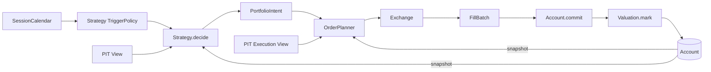

# vqapr Architecture

- **Status**: target design. `src/vqapr/`는 이 문서가 승인된 뒤에 만든다.
- **Authority**: `docs/vqapr-prd.md`가 제품 authority. 이 문서는 그것을 구현하는 설계 authority.
- **읽는 법**: 각 설계 결정은 `결정 → 왜 → 없으면 무엇이 깨지는가 → 어떤 UC` 순서로 적는다.
  근거 없는 결정은 이 문서에 두지 않는다.

---

## 1. 한 장 요약

### 1.1 실행 척추



- 위 경로를 통과하지 않고 return/NAV/PnL/turnover를 만드는 코드는 없다. — PRD §2.2
- Model, feature, label, IC 같은 research 연산은 이 척추에 **들어오지 않고** 끝난다.

### 1.2 여섯 layer

| layer | 답하는 질문 | module |
|---|---|---|
| Runtime | 언제 호출하는가 | `runtime/` |
| Data | 그때 무엇을 읽을 수 있는가 | `data/` |
| Decision | 무엇을 의도하는가 | `strategy/`, `portfolio/` |
| Execution | 의도가 어떤 주문·체결이 되는가 | `orders/`, `exchange/` |
| State | 실제 상태가 어떻게 바뀌는가 | `account/`, `valuation/` |
| Evidence | 무엇을 읽었고 무엇이 일어났는가 | `evidence/` |

`flow/`는 이 layer들을 조립하고 이벤트를 배달한다. **경제 규칙을 소유하지 않는다.**

### 1.3 세 줄 규칙

1. **아무도 Store를 직접 열지 않는다.** 소비자는 requirement를 선언하고 Flow가 bounded View를 준다.
2. **Account만 상태를 쓴다.** 나머지는 전부 값을 계산해 Flow에 반환한다.
3. **Component는 서로를 호출하지 않는다.** 다음 단계를 부르는 건 Flow다.

---

## 2. 설계 원칙

### 2.1 IoC — Flow가 시간을 소유한다

**결정.** Clock이 이벤트를 발화하고 Flow가 callback을 부른다. Strategy는 언제 판단할지 *선언*만 하고
자신을 호출하거나 시간을 진행시키지 않는다.

- **왜**: decision, execution, valuation, monitoring이 서로 다른 cadence를 가져야 한다. cadence를
  component가 소유하면 조합이 불가능하다.
- **없으면**: Strategy가 execution을 직접 부르는 순간 "decision time에 보이는 정보"와 "execution time에
  보이는 정보"가 같은 호출 스택에 섞여 PIT 경계가 코드로 표현되지 않는다.
- **UC**: `UC-TRIGGER-001`, `UC-EXEC-001`, `UC-EXEC-003`, multi-frequency scenario

### 2.2 Least authority — bounded View

**결정.** 각 소비자는 `DataRequirement`를 선언하고, Flow의 resolver가 `available_at <= evaluation_time`을
적용한 **읽기 전용 View**를 주입한다. Store 핸들은 어디에도 전달하지 않는다.

- **왜**: PIT은 규칙이 아니라 **접근 불가능성**으로 강제해야 한다. 규칙은 잊히고 캡슐화는 잊히지 않는다.
- **없으면**: `store.query(...)` 한 줄이면 look-ahead가 가능하다. 리뷰로 막는 것은 확장되지 않는다.
- **UC**: `UC-PIT-001`, `UC-LOOKBACK-001`, `UC-DATA-002`, `UC-TIME-001`

### 2.3 Aggregate Root — Account

**결정.** cash, position, cost, version, journal의 쓰기 권한은 `Account` 하나가 갖는다. 변경은
`commit(fills, expected_version)`과 `mark(marks, expected_version)` 둘뿐이다.

- **왜**: "committed actual state만 authority"(PRD §2.4)를 지키려면 authority가 **한 객체**여야 한다.
- **없으면**: intended 값을 상태에 쓰는 경로가 생기고 `intended ≠ committed`가 무너진다.
- **UC**: `UC-CLOSED-LOOP-001`, `UC-ACCOUNT-HISTORY-001`, `UC-CONSTRAINT-ADJUST-001`

### 2.4 Functional Core / Imperative Shell

**결정.** 계산(weighting, construction, planning, matching, valuation 산술)은 순수 함수. 부작용(commit,
publication, state 전달)은 Flow에만 있다.

- **왜**: PRD가 요구하는 deterministic replay는 계산이 순수할 때 공짜로 얻어진다.
- **없으면**: 계산 안에 I/O가 섞이면 fixture 테스트가 불가능해지고 `UC-SCALE-001`의 3,000종목 검증이
  단일종목 검증과 등가임을 보일 수 없다.
- **UC**: 전 범위 (deterministic replay는 cross-cutting invariant)

### 2.5 Strategy Pattern — profile은 주입한다

**결정.** `Exchange`는 protocol이고 Academic/KRX는 그 구현이다. run마다 keyword로 주입한다. profile별
Flow를 만들지 않는다.

- **왜**: 두 profile은 **같은 lifecycle에 다른 정책**이다(PRD §6.4). Flow를 나누면 그 사실이 거짓이 된다.
- **없으면**: `UC-PORTFOLIO-001`(같은 alpha를 두 profile로)이 두 코드 경로의 우연한 일치가 된다.
- **UC**: `UC-PROFILE-001`, `UC-ACADEMIC-001`, `UC-PORTFOLIO-001`

### 2.6 Facade — 단일 public 진입점

**결정.** `vqapr.public`이 유일한 documented surface. 내부 module 경로는 계약이 아니다.

- **왜**: `UC-FACADE-001`이 "package source를 열지 않고 완주"를 요구한다.
- **없으면**: 사용자가 내부 import에 의존하면 리팩터가 breaking change가 된다.
- **UC**: `UC-FACADE-001`, `UC-EXTENSION-002`

### 2.7 DRY의 경계 — 무엇을 공유하고 무엇을 나누는가

DRY는 **모양이 같은 것**이 아니라 **변경 이유가 같은 것**에 적용한다.

| 공유한다 (변경 이유가 하나) | 나눈다 (변경 이유가 다르다) |
|---|---|
| `PortfolioIntent` / `OrderBatch` / `FillBatch` envelope | Academic vs KRX의 가격·비용·수량 규칙 |
| `Account.commit` / `mark` / history | long-only vs signed의 전이 유효성 |
| 이벤트 순서와 failure taxonomy | profile별 realism label과 limitation |
| requirement → View 해석 경로 | 각 소비자가 무엇을 요구하는가 |

- **없으면 (과한 공유)**: 두 profile의 비용 정책을 한 함수에 합치면 `UC-COST-004`의 "ETF에 Equity policy를
  적용하지 않는다"가 조건 분기 하나 차이로 무너진다.
- **없으면 (부족한 공유)**: envelope을 profile마다 따로 두면 `UC-PORTFOLIO-001`을 비교할 공통 축이 사라진다.

---

## 3. 시간

### 3.1 세 축

| 축 | 소유자 | 비고 |
|---|---|---|
| session time | `SessionCalendar` (frozen run input) | venue 사실. 데이터에서 유도 금지 |
| event time | `Clock` | **데이터에 행이 없어도 성립한다** |
| availability time | `available_at` (registration) | 유일한 PIT 술어 |

$$available\_at \le event.ts$$

- `SessionCalendar`는 명시적 session 목록 또는 승인된 provider의 결과만 받는다.
- 가격 coverage나 weekday 추정으로 calendar를 만들지 않는다. → `UC-TRIGGER-001`

### 3.2 동일 timestamp 우선순위

```text
DATA_AVAILABLE → DECISION → EXECUTION → FILL_COMMIT → VALUATION → MONITORING → FINALIZE
```

- 고정 순서 하나만 둔다. 설정 가능하게 만들지 않는다 → 재현성이 설정에 의존하지 않는다.
- decision과 execution을 같은 timestamp에 두려면 가격 availability를 따로 증명해야 한다.

### 3.3 표준 daily-close 타임라인

```text
03-05 15:30  close 행이 available해짐
03-06 04:00  DECISION       — 보이는 것: available_at <= 04:00  → PortfolioIntent 동결
03-06 15:30  EXECUTION      — 현재 Account + 현재 PIT 가격 → OrderBatch → FillBatch
             FILL_COMMIT / VALUATION
```

- `03-05 04:00`에는 03-05 종가를 읽을 수 없다.
- `03-06 04:00`에 데이터 행이 없어도 이벤트는 큐에 정상 진입한다.

### 3.4 Trigger는 Strategy가 소유한다

```python
class EveryNSessions(BaseModel):
    n: int
    local_time: time = time(4, 0)
    timezone: str = "Asia/Seoul"
    anchor: date | None = None
```

- Flow가 `SessionCalendar × TriggerPolicy`를 결합해 DECISION 이벤트를 만든다.
- **왜 Strategy가 소유하나**: PRD §3.3 — "정의만 읽고 cadence를 알 수 있어야 한다". run script에 두면
  같은 Strategy가 스크립트마다 다른 전략이 된다.

---

## 4. Data

### 4.1 Registration — 최소한만

```python
class DatasetRegistration(BaseModel):
    dataset_id: str
    instrument_field: str
    available_at: AvailabilityBinding
    key_fields: tuple[str, ...]
    fields: tuple[str, ...]
    source: SourceIdentity
```

- 이 여섯 개가 전부다. `fiscal_period`, `session_date`, `revision`, `horizon_end`는 **일반 column**이다.
- **consumer-purpose alias 없음.** `execution_price` 같은 role을 등록에 새기지 않는다.
  - **왜**: 같은 `close`를 Strategy·Exchange·Valuation이 각자 요구해야 누가 무엇을 읽었는지 lineage에 남는다.
  - **없으면**: `UC-EXEC-002`의 "어떤 가격으로 체결했는가"가 등록 시점의 이름 선택에 숨는다.
- **UC**: `UC-DATA-001`, `UC-AGENT-001`

### 4.2 Requirement — 소비자가 선언한다

```python
class DataRequirement(BaseModel):
    consumer_id: str
    dataset_id: str
    fields: tuple[str, ...]
    lookback: Lookback          # RowsLookback | CalendarLookback
    coverage: CoverageRequirement | None = None
```

- Strategy는 signal/benchmark/constituent field를, OrderPlanner·Exchange는 price/tradability를,
  Valuation은 보유 종목 mark field를 각각 선언한다.
- `lookback`은 **Store query까지 그대로 내려간다.** 전체 읽고 자르기 금지 → `UC-LOOKBACK-001`

### 4.3 View

```python
class StrategyView(Protocol):
    evaluation_time: datetime
    def observations(self, requirement: DataRequirement) -> ObservationBatch: ...
    def account(self) -> AccountSnapshot: ...
    def account_history(self, requirement: HistoryRequirement) -> AccountHistory: ...
    def prior_feedback(self) -> tuple[ExecutionFeedback, ...]: ...
```

- memory는 View에 없다. Flow가 run 시작 시 `strategy.memory`에 넣어주므로 Strategy는 `self.memory`로 읽는다
  (§5.1.1). 읽는 경로를 둘로 두지 않는다.

- View는 실제 access를 기록해 lineage를 만든다. **읽지 않은 dataset은 dependency가 아니다.**
- `account_history`가 `memory`와 **독립**인 것이 핵심 — `UC-ACCOUNT-HISTORY-001`은 state 없이
  stop-loss가 가능해야 한다고 요구한다.

---

## 5. Decision

### 5.1 Strategy

```python
StrategyMemory: TypeAlias = (
    bool | int | float | str | list["StrategyMemory"] | dict[str, "StrategyMemory"] | None
)

class Strategy(ABC):
    memory: StrategyMemory = None        # 유일한 mutable 슬롯

    def trigger(self) -> TriggerPolicy: ...
    def requirements(self) -> tuple[DataRequirement, ...]: ...
    def decide(self, context: StrategyContext) -> PortfolioIntent: ...
```

- `StrategyContext`는 `view`, `event`, `universe`만 준다. Clock·Store·Exchange·mutable Account는 없다.

### 5.1.1 Memory — 슬롯 하나, strict JSON

**결정.** Strategy가 이어갈 수 있는 상태는 **`self.memory` 하나**다. `__init__` 이후에는 그 밖의 어떤
attribute도 쓸 수 없다(`__setattr__` 가드).

- **왜 슬롯 하나인가**: package가 내용을 해석하지 않으면서 durable·portable하려면 값의 **범위**가 정해져야
  한다. `self.losses`, `self.cooldown`처럼 이름이 자유롭게 늘어나면 무엇을 저장하고 무엇을 다음 run에
  넘길지 결정할 수 없다.
- **왜 strict JSON인가**: numpy array나 DataFrame을 담을 수 있으면 "portable"이 거짓이 된다.
  비유한 수치와 문자열 아닌 key도 거부한다.
- **왜 `__init__`은 예외인가**: 전략 파라미터(`n`, `threshold`)는 **불변 config**다. 생성 후 변하지 않으므로
  memory가 아니다.

**Flow가 판단 직후 스냅샷한다.**

```python
snapshot = normalize_memory(strategy.memory)   # 검증 + detached deep copy
```

- **왜 할당 시점이 아니라 스냅샷 시점인가**: `self.memory["cooldown"] = 5`는 in-place 변경이라
  `__setattr__`을 거치지 않는다. 확실히 잡히는 유일한 지점은 Flow의 스냅샷이다.
- **왜 detached copy인가**: 같은 dict를 계속 변경하면 모든 스냅샷이 같은 객체를 가리켜 **이력 전체가
  마지막 값 하나로 붕괴한다.** normalize의 round-trip이 detach를 증명한다.
- **왜 `StrategyStateUpdate` 같은 별도 타입이 없는가**: 매 판단마다 현재 값을 스냅샷하므로 memory를 건드리지
  않으면 이전 값이 그대로 남는다. "갱신 안 함"이 저절로 표현된다.
- 스냅샷은 fill 발생과 무관하게 항상 일어난다 → `UC-STATE-001`
- `memory`가 `None`이 아니면 그 result는 **path-dependent**로 표시된다 → PRD §5.7

**UC**: `UC-STATE-001`, `UC-ALPHA-ADAPTIVE-001`, `UC-ALPHA-PATH-001`

### 5.2 Strategy 내부의 3단 — 강제하지 않는다

```text
research values  ──►  weights  ──►  PortfolioIntent
   (자유)            (built-in 가능)      (Strategy 책임)
```

**결정.** 프레임워크는 `decide()`의 중간값 타입을 표준화하지 않는다. 대신 재사용 가능한 **순수 weighting
함수**를 제공한다.

- **왜**: peer momentum(랭크 기반)과 top-N(선택 기반)이 서로 다른 중간값을 쓴다. 하나로 표준화하면 한쪽이
  정보를 잃거나 우회 경로를 만든다.
- **왜 함수인가**: 타입 계약은 모든 Strategy를 구속하고, 함수 시그니처는 **그것을 부르기로 한 Strategy만**
  구속한다.
- **없으면**: 표준 타입을 두면 6개월 뒤 그것이 사실상 두 번째 signal 계약이 되어 PRD §5.3과 중복된다.
- **UC**: `UC-SIGNAL-001`, `UC-SIGNAL-002`, `UC-PORTFOLIO-001`

> built-in weighting 함수는 공통적으로 instrument별 signed 값을 받는다. 이는 **built-in을 부르는 Strategy만
> 구속하는 사실**이며 `decide()`의 요구 shape가 아니다. built-in을 쓰지 않는 Strategy는 그런 중간값을 만들지
> 않아도 된다.

### 5.3 `portfolio/weighting.py` — 순수 leaf

부호는 항상 입력에서 오고, **크기의 출처**만 다르다.

| 함수 | 크기 | 외부 입력 |
|---|---|---|
| `signal_weight(signal, ...)` | `\|signal\|`에 비례 | 없음 |
| `equal_weight(signal, ...)` | 균등 | 없음 |
| `proportional_weight(signal, sizes, ...)` | `sizes`에 비례 | 크기 panel |

> ⚠️ **`...` 자리의 normalization 인자는 아직 정하지 않았다.** §15-1 참고. 확정된 것은 위 세 함수를
> 가르는 축이 **크기의 출처**이고 부호는 항상 입력에서 온다는 것뿐이다.

보조 함수 (결측을 **명시적으로** 다루기 위한 것):

```python
drop_missing(signal) -> tuple[Signal, frozenset[InstrumentId]]   # 무엇이 빠졌는지 반환
require_complete(signal, universe) -> Signal                     # 불완전하면 실패
```

불변식:

- **`domain` 외에는 아무것도 import하지 않는다.** 아래는 전부 금지다.
  ```text
  vqapr.data  vqapr.account  vqapr.exchange  vqapr.runtime  vqapr.flow  vqapr.strategy
  ```
  시가총액이 필요하면 **인자로 받는다.** 여기서 직접 읽으면 그 data가 Strategy의 declared requirement를
  거치지 않아 §4.2의 lineage에 남지 않는다.
- `sizes`에 선택된 종목이 없으면 **실패**. 빼고 재정규화하지 않는다.
- `signal`의 결측은 다루지 않는다. 호출자가 위 helper로 먼저 해소한다.
- 선택된 종목이 없으면 실패하지 않고 **빈 weights**를 낸다 → hold(§6.7)를 표현할 수 있어야 하므로
- `PortfolioIntent`를 반환하지 않는다. `intent_id`, `decision_time`, `account_version_seen`은 run 문맥이고
  순수 함수가 알 수 없다.

**`fill_missing`은 제공하지 않는다.** 0으로 채우기는 "포지션 없음"이라는 경제적 주장이고, 평균으로 채우기는
연구 결정이다. built-in이 대신 말하면 안 된다.

- **왜 이 제약들인가**: 이것이 없으면 built-in은 편의 함수가 아니라 **보이지 않는 곳에서 판단하는 두 번째
  Strategy**가 된다. 특히 "결측 빼고 재정규화"는 PRD §10.2가 금지한 바로 그 행위다.
- **UC**: `UC-BUILTIN-001`, `UC-ALPHA-BUDGET-001`

#### 이 leaf 규칙은 두 층으로 지킨다

문서만으로는 부족하고 도구만으로도 부족하다. 두 층은 시점이 다르다.

| 층 | 언제 | 역할 |
|---|---|---|
| 이 문서 §5.3 + `weighting.py` module docstring | 코드를 **쓰기 전** | 예방 — 애초에 안 쓰게 한다 |
| import linter | CI | 포착 — 안 읽었으면 터뜨린다 |

```toml
[[tool.importlinter.contracts]]
name = "weighting is a pure leaf"      # 계약 이름이 곧 실패 이유가 되게 짓는다
type = "forbidden"
source_modules = ["vqapr.portfolio.weighting"]
forbidden_modules = [
  "vqapr.data", "vqapr.account", "vqapr.exchange",
  "vqapr.runtime", "vqapr.flow", "vqapr.strategy",
]
```

`weighting.py`의 module docstring에도 같은 금지와 그 이유(`UC-BUILTIN-001`)를 적는다. 파일을 여는 사람이
가장 먼저 보는 곳이기 때문이다.

> **signal과 weights는 shape가 같고 의미가 다르다.** 타입이 경계를 지켜주지 못하므로, 위 함수를 통과했다는
> 사실 자체가 전환이 의도되었다는 증거가 된다.

### 5.4 `PortfolioIntent`

```python
class PortfolioIntent(BaseModel):
    intent_id: UUID
    strategy_id: str
    decision_time: datetime
    effective_after: datetime
    targets: tuple[PortfolioTarget, ...]
    budget: BudgetSemantics          # 형태 미확정 — §15-1
    source_refs: tuple[ArtifactRef, ...]
    account_version_seen: int
    memory_ref: ArtifactRef | None   # 있으면 이 result는 path-dependent
```

- `PortfolioTarget`은 weight **또는** quantity 중 정확히 하나. 둘 다 채우거나 비우면 validation error.
- ⚠️ **cash를 어떻게 표현할지는 미확정.** 산술적으로는 `1 - Σw`로 유도되지만, **의도된 cash 포지션**(BAB의
  무위험자산, risk parity의 cash sleeve)과 **배분하지 못한 잔여**는 경제적 의미가 다르다. §15-1 참고.
- 생성 시 검증: tz-aware 시각, 유일 instrument, 유한 값, 선언된 budget, lineage, profile direction 호환.
- **fractional/lot 검증은 하지 않는다.** 그건 venue가 안다(§6.2).

### 5.5 Hold도 `PortfolioIntent`다

- 별도 action enum이나 `None`을 두지 않는다. 현재와 같은 완전한 target을 반환한다.
- OrderPlanner가 delta 0인 `OrderBatch`를 만들고, no-trade diagnostic만 남는다.
- **왜**: "판단 안 함 / 판단해서 유지 / 주문했는데 dealt 0" 세 가지가 구분되어야 한다.

---

## 6. Execution

### 6.1 OrderPlanner — execution time의 책임

```python
class OrderPlanner(Protocol):
    def requirements(self, intent: PortfolioIntent) -> tuple[DataRequirement, ...]: ...
    def plan(self, intent, account: AccountSnapshot,
             market: ExecutionView, rules: ExchangeRulesView) -> OrderBatch: ...
```

- decision time의 stale quantity를 **재사용하지 않는다.** execution 시점의 committed position/cash/price로
  delta를 계산한다.
- Strategy를 재호출하거나 intent를 재계산하지 않는다.
- 각 `OrderRequest`: instrument, side, quantity, 출처 intent/target, account version, 변환 가격,
  rounding/clipping/skip 진단.
- MVP는 **batch-atomic**: 가격이나 listing이 하나라도 없으면 Exchange 호출 전에 전체 실패. 부분 성공은 future.
- **UC**: `UC-EXEC-001`, `UC-COST-003`, `UC-CONSTRAINT-ADJUST-001`

### 6.2 Exchange

```python
class Exchange(Protocol):
    exchange_id: str
    calendar: SessionCalendar
    def rules(self, at, instruments) -> ExchangeRulesView: ...
    def requirements(self, orders: OrderBatch) -> tuple[DataRequirement, ...]: ...
    def execute(self, event, orders, account, market: ExecutionView) -> FillBatch: ...
```

```python
class ListingRule(BaseModel):
    instrument_id: InstrumentId
    quantity_step: Decimal
    minimum_quantity: Decimal
    fractional_allowed: bool
    permitted_sides: frozenset[Side]
```

**결정.** fractional/lot은 **Exchange의 instrument listing**이 정한다. Account가 아니다.

- **왜**: 같은 종목이 academic venue에서는 `step=0.000001`, KRX에서는 `1`일 수 있다. 계좌 성질이 아니라
  상장 성질이다.
- **없으면**: "academic이니까 소수점"이라는 잘못된 결합이 생겨 profile을 늘릴 때마다 Account를 고쳐야 한다.
- Exchange는 Store를 모른다. Flow가 resolve한 `ExecutionView`만 받는다.
- **UC**: `UC-ACADEMIC-001`, `UC-PROFILE-001`

### 6.3 두 fixture profile

| | Academic | KRX daily |
|---|---|---|
| direction | signed | long-only |
| quantity | listing별 fractional 허용 | listing의 정수 step |
| price | next eligible close의 exact PIT 가격 | next eligible close |
| fill | 전량 | 지원 order 전량 |
| cost | fee/tax/slippage/impact/borrow = 0 | effective-dated fee/tax + cash clipping |
| 미모델링 | borrow/locate/margin/collateral | partial fill, volume impact, 실제 결제 |
| realism | `hypothetical` | `simulation` |

- 이름이 realism을 주장하지 않는다. **구현된 rule과 명시한 limitation만** 주장한다.
- 두 profile 모두 `OrderBatch → FillBatch → commit → mark`를 그대로 따른다.

### 6.4 FillBatch

- requested/dealt quantity, 가격, fee/tax, reason, 적용 listing rule, execution data lineage,
  exchange id, intent id, order batch id.
- **zero-dealt와 rejected를 Fill로 가장하지 않는다.** → `UC-CLOSED-LOOP-001`

---

## 7. State

### 7.1 Account

```python
class Account:
    def snapshot(self) -> AccountSnapshot: ...
    def commit(self, fills: FillBatch, *, expected_version: int) -> AccountSnapshot: ...
    def mark(self, marks: MarkBatch, *, expected_version: int) -> AccountSnapshot: ...
    def history(self, query: AccountHistoryQuery) -> AccountHistory: ...
```

- mode와 무관하게 같은 cash/position/cost/version/journal/history 구조를 쓴다.
- `expected_version`으로 optimistic concurrency. 불일치면 mutation 없이 실패.
- validation 실패 시 **하나도 바꾸지 않는다** (all-or-nothing).

### 7.2 AccountMode — 하는 일이 하나뿐이다

```python
class AccountMode(str, Enum):
    LONG_ONLY = "long_only"   # 적용 후 어떤 position도 < 0 이면 실패
    SIGNED    = "signed"      # 음수 position 허용
```

- **이것 말고는 아무것도 결정하지 않는다.** fractional, lot, rounding, 가격, 비용, 체결 시점 전부 아니다.
- run 시작 시 동결. 중간 변경 불가.
- **이중 방어**: Exchange가 venue 규칙에 맞는 Fill만 만들고, Account는 그걸 믿지 않고 자기 mode와 회계
  불변식으로 마지막에 다시 검증한다. signed Fill을 `LONG_ONLY` Account에 commit하면 mutation 전에 실패.
  - **왜 두 번 검사하나**: Exchange는 교체 가능한 주입물이다(§2.5). authority가 주입물을 신뢰하면 authority가
    아니다.

### 7.3 History — 기록은 고정, 구독은 선언

**결정.** Account는 **`commit`과 `mark`가 이미 계산하는 값**을 기록한다. 이력을 위해 추가로 계산하지 않는다.
기록 대상을 run마다 설정하는 스위치는 두지 않는다.

```text
account series     cash, nav, realized_pnl, gross/net exposure
instrument panel   quantity, avg_entry_price, realized_pnl, last_mark_price
```

- **왜 설정하지 않는가**: 위 값들은 commit을 수행하려면 어차피 구해야 한다. 기록은 한 줄 append일 뿐이고
  3,000종목 × 250세션도 무겁지 않다. 설정 가능하게 만들면 **얻는 것 없이 run identity에 필드만 하나 는다.**
- **왜 고정 집합인가**: 집합이 고정이어야 "집합 밖 항목 요구 → 계산 전 실패"가 성립한다.
  추정 금지(PRD §6.6)를 지키는 데 필요한 건 *선언*이 아니라 *경계*다.
- 소비자(Strategy/Monitor)는 `HistoryRequirement`로 **읽을 항목과 범위를 좁혀** 요구한다 — data 접근과 같은 원칙.
- raw journal은 노출하지 않는다. immutable projection만 준다.
- **왜 `memory`와 분리되어 있나**: `UC-ACCOUNT-HISTORY-001`은 strategy state 없이 stop-loss/cooldown이 표현
  가능해야 한다고 요구한다. history를 memory 위에 얹으면 research-only Strategy가 그 규칙을 쓸 수 없다.

### 7.4 Valuation

- `ValuationService.requirements(snapshot)`가 **보유 종목 전체**의 mark field를 선언한다.
- 하나라도 mark가 없으면 NAV를 추정하지 않고 `MarkBatch` commit 전에 실패.
- `VALUATION_*` failure는 **Fill이 이미 commit된 뒤**일 수 있는 유일한 실패다 → 정확한 account version을 기록.

---

## 8. Flow

### 8.1 하나의 Flow

```python
class SimulationFlow:
    def on_decision(self, e: DecisionEvent) -> None: ...
    def on_execution(self, e: ExecutionEvent) -> None: ...
    def on_fill_commit(self, e: FillCommitEvent) -> None: ...
    def on_valuation(self, e: ValuationEvent) -> None: ...
    def on_monitoring(self, e: MonitoringEvent) -> None: ...
    def on_finalize(self, e: FinalizeEvent) -> RunResult: ...
```

책임: run 동결과 preflight · schedule 조립 · 이벤트 dispatch · requirement resolution과 View 생성 ·
Strategy 호출과 intent 발행 · OrderPlanner/Exchange 호출 · commit · memory 스냅샷 · evidence · finalize.

- **Academic Flow와 KRX Flow를 따로 만들지 않는다.** Exchange, AccountMode, calendar, policy를 주입한다.
- Clock은 Strategy나 Exchange의 의미를 모른다. callback을 부를 뿐이다.

### 8.2 State machine

```text
CREATED → PREFLIGHTED → RUNNING
    DECISION → INTENT_FROZEN → EXECUTION_READY → FILLS_PRODUCED
             → ACCOUNT_COMMITTED → MARKED → FEEDBACK_PUBLISHED → (반복)
  → FINALIZED

commit 전 실패        → FAILED_WITHOUT_MUTATION
commit 후 발행 실패   → FAILED_AFTER_COMMIT(account_version 기록)
```

- 중단된 run의 재개는 **현재 범위 밖**(`UC-RECOVERY-001`). 실패하면 처음부터 다시 실행한다.

### 8.3 Failure taxonomy

| family | mutation |
|---|---|
| `DATA_*`, `CALENDAR_*`, `INTENT_*`, `ORDER_*`, `EXCHANGE_*`, `ACCOUNT_*` | 없음 |
| `VALUATION_*` | Fill commit 되었을 수 있음. exact version 기록 |
| `PUBLICATION_*` | authority 변화 여부 기록 |

모든 error: hierarchical stage path, 실패한 requirement, mutation 여부, retry precondition, correlation id.
**비슷한 field·이전 가격·다른 cost policy로의 silent fallback 없음.** → `UC-ERROR-001`, `UC-COST-004`

---

## 9. Evidence

Evidence는 authority가 아니라 **영수증**이다.

```text
data access → Strategy + trigger → PortfolioIntent → OrderBatch → Exchange rules + inputs
→ FillBatch → Account version before/after → MarkBatch → feedback / limitations
```

- publication은 payload + metadata + catalog record가 **모두** 커밋된 뒤에만 visible → `UC-ARTIFACT-003`
- artifact는 producer의 private class 없이 typed object로 읽히고 validation된다 → `UC-ARTIFACT-001`
- report는 **intended / requested / dealt / committed / marked**를 나란히 보여준다 → `UC-REPORT-001`

---

## 10. Package layout

```text
src/vqapr/
├── domain/                 # ID, money, instrument, 공통 error
├── runtime/                # clock, events(priority), calendar
├── data/                   # registration, requirements, store(port), view
├── strategy/               # Strategy protocol, trigger, context
├── portfolio/
│   ├── weighting.py        # 순수 함수 (leaf) — signal_weight / equal_weight / proportional_weight
│   ├── construction.py     # PortfolioIntent 조립
│   └── intent.py           # PortfolioIntent, PortfolioTarget, BudgetSemantics
├── orders/                 # OrderPlanner, OrderRequest/OrderBatch
├── exchange/               # Exchange protocol, ListingRule, academic, krx_daily
├── account/                # aggregate, mode, snapshot, history, journal
├── valuation/              # requirements → MarkBatch, performance
├── flow/                   # simulation, resolver, run(RunDefinition/RunResult)
├── evidence/               # lineage, artifacts
├── research/               # model / materialization / analysis (execution 주장 없음)
├── project/                # config, registry, assembly
└── public.py               # Facade
```

### 10.1 의존 방향

```text
domain  ←  runtime · data · portfolio · orders · account
domain + ports  ←  strategy · exchange · valuation · research
all ports  ←  flow
flow + project  ←  public
```

강제 규칙 (import linter로 검사):

- `domain`은 storage/pandas/provider/concrete Exchange를 import하지 않는다.
- `portfolio.weighting`은 **`domain`만** import한다. view/store/clock/account/exchange 전부 금지.
- `strategy`는 `exchange`와 mutable `account`를 import하지 않는다.
- `exchange`는 store를 import하지 않는다.
- `account`는 Strategy/Exchange 구현을 import하지 않는다.

---

## 11. Walkthrough

공통 fixture: sessions 03-05/03-06, close available 15:30 KST, trigger 매 세션 04:00,
decision 03-06 04:00, execution 03-06 15:30.

| 단계 | Peer momentum long-short | 5일 수익률 top-10 long-only |
|---|---|---|
| 1. read | peer group + 5일 수익률 | 5일 수익률 |
| 2. research value | peer 상대 랭크 (signed) | 상위 10 선택 (양수만) |
| 3. weights | `equal_weight(centered_signal, …)` → gross 1, net 0 | `equal_weight(top10, …)` → 각 10% |
| 4. intent | signed `PortfolioIntent` | long-only `PortfolioIntent` |
| 5. plan | 15:30 snapshot + exact 가격 → delta | 동일 planner |
| 6. exchange | Academic: fractional 허용 | KRX: 정수 step, 비용, cash clipping |
| 7. commit | `SIGNED` | `LONG_ONLY` |
| 8. mark | NAV, gross/net exposure, PnL, turnover | 동일 |

**다른 것은 2·3·6·7의 정책뿐이다.** peer momentum이 반드시 Academic이어야 하는 것도 아니다 —
호환되는 조합이면 같은 intent를 다른 profile에서 별도 run으로 비교할 수 있다(`UC-PORTFOLIO-001`).

---

## 12. Run definition과 preflight

```python
class RunDefinition(BaseModel):
    run_id: UUID
    strategy: ComponentRef
    exchange: ComponentRef
    account_mode: AccountMode
    calendar: CalendarRef
    start: datetime
    end: datetime
    initial_account: AccountSnapshot
    initial_memory: StrategyMemory
    dataset_bindings: tuple[DatasetBindingRef, ...]
    policies: tuple[PolicyRef, ...]
```

시작 전 검사 후 동결:

- trigger timezone ↔ calendar timezone
- intent direction ↔ Exchange permitted side
- Exchange ↔ AccountMode
- instrument listing과 quantity rule 존재
- 모든 component requirement 충족 가능
- initial account 불변식
- `initial_memory`가 strict JSON (§5.1.1)
- schedule 결정성

**동결 후 project config 변경은 이 run에 영향을 주지 않는다.** → `UC-CONFIG-001`

**왜 preflight가 필요한가**: 호환되지 않는 조합은 중간에 실패하면 이미 commit된 상태가 남는다.
시작 전에 실패하면 `FAILED_WITHOUT_MUTATION`으로 끝난다.

---

## 13. Rewrite order

기존 source를 조금씩 호환시키지 않는다. 아래 vertical slice로 다시 만든다.

1. `domain` + `runtime` + explicit `SessionCalendar`
2. minimal `data` — registration / requirement / PIT View
3. `Account` aggregate + mode + history recording
4. `portfolio.weighting` (순수 함수 + 테이블 기반 테스트)
5. `PortfolioIntent` + `OrderPlanner`
6. `Exchange` protocol + Academic fixture
7. 하나의 `SimulationFlow` closed loop
8. KRX daily profile
9. 두 showcase를 같은 public spine 위에서
10. artifacts / reports / Facade / 외부 소비자 테스트

중간 단계에서 **두 번째 Flow, legacy intent adapter, Account fork를 만들지 않는다.** 임시 adapter가
불가피하면 public surface 밖에 두고 제거 조건과 테스트를 같은 implementation record에 적는다.

---

## 14. Traceability

| UC | 설계 위치 |
|---|---|
| `UC-DATA-001`, `UC-AGENT-001` | §4.1 |
| `UC-DATA-002`, `UC-PIT-001`, `UC-ERROR-001` | §4.2 + §8.3 |
| `UC-LOOKBACK-001` | §4.2 (lookback → Store query) |
| `UC-TIME-001`, `UC-TRIGGER-001` | §3 |
| `UC-SIGNAL-001`, `UC-SIGNAL-002` | §5.1–5.2 |
| `UC-BUILTIN-001` | §5.3 |
| `UC-ALPHA-BUDGET-001` | §5.4 (`BudgetSemantics`) — **형태 미확정, §15-1** |
| `UC-STATE-001`, `UC-ALPHA-ADAPTIVE-001` | §5.1.1 (`memory` 슬롯 + Flow 스냅샷) + §12 (`initial_memory`) |
| `UC-ALPHA-PATH-001`, `UC-ALPHA-CHILD-001`, `UC-ENSEMBLE-001` | §5.4 (immutable intent + source_refs) + §12 |
| `UC-PORTFOLIO-001`, `UC-PROFILE-001` | §2.5 + §6.3 |
| `UC-EXEC-001`, `UC-EXEC-002` | §6.1 |
| `UC-ACADEMIC-001` | §6.2 + §7.2 |
| `UC-COST-001`~`004` | §6.2 (effective-dated rules) + §8.3 (fallback 금지) |
| `UC-CLOSED-LOOP-001`, `UC-SCALE-001` | §6.4 + §7.1 |
| `UC-ACCOUNT-HISTORY-001` | §7.3 |
| `UC-EXEC-003`, `UC-MONITOR-001` | §8.1 (독립 MONITORING callback) |
| `UC-CONSTRAINT-001`, `UC-CONSTRAINT-002`, `UC-CONSTRAINT-ADJUST-001` | §5.2 (construction 내 optional policy) + §8.3 |
| `UC-LOOKTHROUGH-001`~`003` | §4.2 + §5.2 — Strategy가 선언하고 계산. 자동 확장 없음 |
| `UC-ARTIFACT-001`~`003`, `UC-RESEARCH-001`, `UC-REPORT-001` | §9 |
| `UC-EXTENSION-001`, `UC-EXTENSION-002`, `UC-FACADE-001` | §2.6 + §10 |
| `UC-CONFIG-001` | §12 |
| `UC-ONBOARD-001` | `project/` + `resources/` |
| `UC-RETURN-001` | §1.1 (`research/`는 척추에 들어오지 않는다) |
| future (`UC-FUTURE/PERP/CASHFLOW/SETTLEMENT/PROD/RECOVERY/IMPACT/REAL-SHORT-001`) | 현재 Exchange/Account가 미지원 semantics를 **명시적으로 거부**하는 것으로 경계만 보존 |

---

## 15. 열어 둔 결정

**이 섹션이 비어 있으면 안 된다.** 아직 답을 모르는 것을 확정처럼 적으면, 다음 사람이 문서를 전부
계약으로 읽고 첫 구현이 그 답을 조용히 확정해버린다. 열린 결정은 **어떤 미래 기능이 답을 바꾸는지와 함께**
여기 적는다. 그 기능을 만들 때 이 질문이 딸려 나오게 하기 위해서다.

### 15-1. Budget과 cash를 어떻게 표현하는가

**무엇이 안 정해졌나**

- signal → weights 변환에서 normalization 인자의 형태 (§5.3의 `...`)
- `BudgetSemantics`가 담는 것: 의도한 target인가, 실현된 관측인가, 둘 다인가
- `PortfolioIntent`가 cash를 명시 target으로 갖는가, `1 - Σw`로 유도하는가

**왜 지금 못 정하나 — 두 가지가 답을 바꾼다**

1. **Constraint optimizer.** weight cap에 걸려 truncate되면 실현 gross가 의도한 gross와 달라진다.
   normalization 인자가 budget을 *선언*하는 형태면 그 선언이 downstream에서 거짓이 된다.
   → **budget은 weighting 함수의 인자가 아니라 최종 intent의 성질일 가능성이 높다.**
2. **Cash를 자산으로 다루는 전략.** BAB의 무위험자산, risk parity의 cash sleeve, market timing의 현금
   비중은 **의도된 포지션**이다. "배분하지 못한 잔여"와 산술값은 같아도 경제적 의미가 다르다.
   유도로 처리하면 둘을 영원히 구분할 수 없다.

**지금 확정된 것 (이 결정과 무관하게 참)**

- 세 weighting 함수를 가르는 축은 **크기의 출처**이고 부호는 항상 입력에서 온다 (§5.3)
- weighting 함수는 순수하고 data/state/clock을 모른다 (§5.3)
- 결측은 조용히 처리하지 않는다 (§5.3)
- weighting 함수는 budget을 **스스로 정하지 않는다** — 어떤 형태로 받든
- 실현된 gross/net/cash는 committed state에서 관측 가능하다 (§7)

**언제 정하나**: constraint optimizer 설계 시. 그 전에 이 부분을 구현하면 optimizer가 들어올 때 다시 뜯는다.

### 15-2. Instrument listing의 소유자 (§12)

`RunDefinition`에 `exchange: ComponentRef`만 있고 listing 출처가 없다. preflight가 "listing과 quantity rule
availability"를 검사한다고 적었지만 어디서 오는지 정하지 않았다.

- 후보 A: Exchange의 frozen config가 listing을 소유한다 (fractional/lot이 이미 Exchange 소관이므로 일관)
- 후보 B: `RunDefinition`에 별도 listing 필드

**미결.** 다만 A가 §6.2와 일관된다.

### 15-3. Lookback warm-up이 부족한 candidate session (§3.4)

lookback을 채우지 못하는 초기 session에서 무엇이 일어나는지 정하지 않았다. 지금 문서대로면
`DATA_*` 실패로 run이 중단된다. PRD `UC-TRIGGER-001`은 "판단하지 않은 session은 실패가 아니다"를 허용하지만,
**무엇이 그것을 skip으로 만드는지**가 없다.

- 후보 A: Strategy가 warm-up을 선언하고, 그 전 candidate는 기록된 skip으로 넘어간다
- 후보 B: skip 개념 없이 run `start`를 워밍업 이후로 잡는다

**미결.** A는 "정의만 읽고 cadence를 안다"(PRD §3.3)와 일관되고, B는 사용자가 휴장일을 손으로 세야 한다.

---

## 16. Acceptance checklist

- [ ] 두 showcase가 같은 `SimulationFlow`와 같은 이벤트 순서를 쓴다
- [ ] executable Strategy의 public 결과는 `PortfolioIntent` 하나뿐이다
- [ ] 04:00 DECISION 이벤트가 데이터 행 없이 explicit calendar에서 생성된다
- [ ] registration의 universal 시간 필드는 `available_at`뿐이다
- [ ] Strategy·Exchange·Valuation이 각자 field requirement를 선언한다
- [ ] `lookback`이 Store query까지 도달한다 (전체 읽고 자르기 없음)
- [ ] `portfolio.weighting`이 `domain` 외 아무것도 import하지 않는다 (import linter + module docstring)
- [ ] weighting 함수가 결측 종목을 빼고 재정규화하지 않는다
- [ ] Strategy가 `__init__` 이후 `memory` 외의 attribute를 쓰면 실패한다
- [ ] memory 스냅샷이 detached copy다 — 이후 in-place 변경이 과거 스냅샷을 바꾸지 않는다
- [ ] 체결이 없는 세션에도 memory 스냅샷이 남는다
- [ ] fractional/lot 규칙이 `ListingRule`에 있고 `AccountMode`에는 없다
- [ ] `AccountMode`의 차이가 음수 position 유효성 하나뿐이다
- [ ] account history 접근이 strategy state 보유와 무관하다
- [ ] commit 전 실패가 position/cash/version/journal을 하나도 바꾸지 않는다
- [ ] report가 intended / requested / dealt / committed / marked를 구분한다
- [ ] source/package/import/CLI가 전부 `vqapr`다

이 체크리스트가 characterization test로 닫히기 전에는 rewrite가 끝났다고 하지 않는다.
