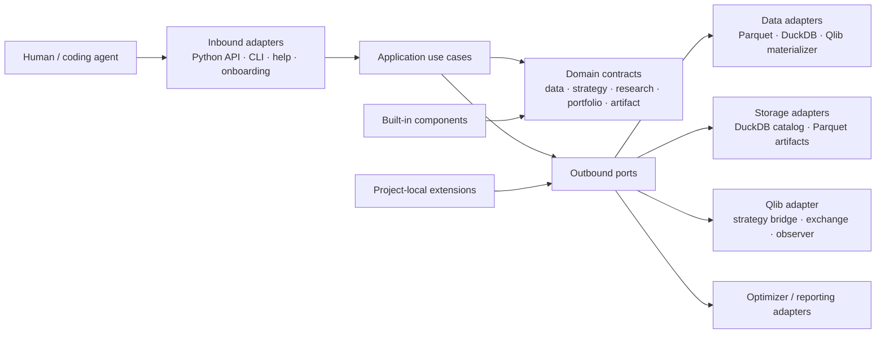
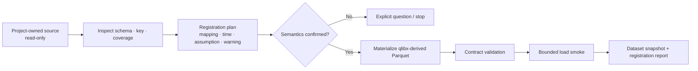
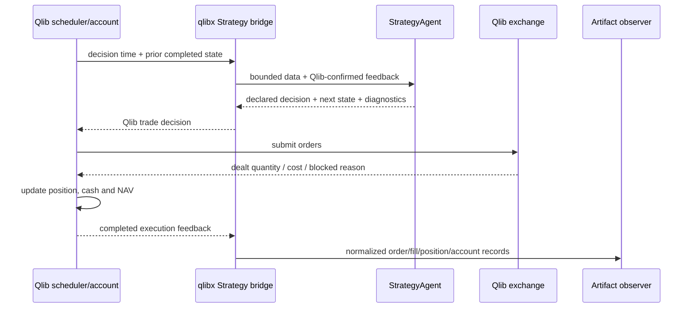

# qlibx Architecture

> 이 문서는 새 target architecture 작성 전의 보존본이다. 현재 architecture는
> [`qlibx-architecture.md`](qlibx-architecture.md)를 따른다.

## 1. 문서의 목적과 범위

이 문서는 [`qlibx-prd.md`](qlibx-prd.md)를 구현하기 위한 `qlibx`의 target architecture를 정의한다.
`qlib-integration-codex/`는 동작을 증명한 reference prototype으로 사용하지만, package 구조와 public
naming은 그대로 계승하지 않는다.

이 문서가 결정하는 범위는 다음과 같다.

- Package와 user project의 경계
- Hexagonal architecture와 dependency direction
- Data registration, StrategyAgent, research, ensemble, portfolio, Qlib execution, artifact와 reporting의
  책임 분리
- AI coding agent가 public surface만으로 작업하는 흐름
- Shared branch에서 여러 agent가 안전하게 연구하는 방식
- Python package와 project-owned directory 구조
- Prototype에서 재사용할 behavior와 새로 설계할 boundary

구체적인 class signature, 함수 구현, SQL schema, CLI option과 serializer 세부사항은
`implementation.md`에서 다룬다.

## 2. Executive summary

`qlibx`는 **Qlib 주변의 research operating system**이다.

- Qlib은 실제 order, fill, position, cash, cost와 account lifecycle을 소유한다.
- qlibx는 point-in-time data contract, StrategyAgent, alpha/ensemble/portfolio research, artifact
  lineage와 agent workflow를 소유한다.
- 각 stage는 live Python object가 아니라 versioned stored artifact를 통해 연결된다.
- 실제 실행되는 account는 하나뿐이며, child research와 historical what-if는 이 account를 변경하지
  않는다.
- 모든 run은 시작 시 effective config, dataset snapshot, component implementation과 seed가 동결된다.
- Worker는 자기 workspace에 artifact를 완성하고, qlibx publisher만 짧은 transaction으로 중앙 catalog에
  등록한다.

핵심 구조는 다음 한 줄로 요약할 수 있다.

```text
public use case -> application orchestration -> domain contract/port -> replaceable adapter
```

Prototype에서 가장 가치 있는 것은 이미 검증된 execution mechanism과 acceptance test다. 가장 크게
바꿔야 하는 것은 여러 세대의 catalog, runner, research module과 Qlib loop를 하나의 public product
contract로 통합하는 방식이다.

## 3. Working prototype 평가

### 3.1 현재 구조

`qlib-integration-codex/`에는 서로 다른 시기에 만든 네 가지 축이 함께 있다.

- `qlib_extended/`: config-driven facade, deterministic run identity, DuckDB/Parquet store, ensemble,
  enhanced-index와 report
- `kwam_qlib_backend/`: Qlib `Account`/`Exchange`를 직접 사용하는 custom target loop, optimizer,
  matched-capitalization과 acceptance harness
- `peer_momentum_runtime/`: Qlib `BaseStrategy`와 `backtest()`를 사용하는 native lifecycle twin
- `qlib_extended/research/`, `report_twin/`, `report_assets/`: systematic research, 별도 artifact catalog,
  frozen migration acceptance와 report asset generation

이 구조는 많은 capability를 증명했지만, 하나의 제품 안에 다음 중복이 생겼다.

- `RunCatalog`, `AlphaPoolCatalog`, `ParquetResearchCatalog`가 서로 다른 identity와 publication rule을
  가진다.
- Whole-matrix strategy callable, test harness의 adaptive strategy, peer-specific `BaseStrategy`가 공통
  `StrategyAgent` contract 없이 공존한다.
- Native Qlib schedule과 Qlib object를 사용한 custom bar loop가 별도 경로로 존재한다.
- General application module과 project-specific alpha research code가 같은 distribution에 포함된다.
- Config를 plan한 뒤 worker가 mutable config file을 다시 읽으므로 run-start freeze가 구조적으로
  보장되지 않는다.

따라서 prototype은 “버릴 prototype”이 아니라 **mechanism을 검증한 여러 실험을 아직 하나의 product
boundary로 정리하지 않은 prototype**으로 보는 것이 정확하다.

### 3.2 PRD 충족도

| PRD 영역 | 현재 충족도 | 확인된 evidence | qlibx에서 보완할 핵심 |
| --- | --- | --- | --- |
| P0 Agent onboarding | 낮음 | `run`, `report`, `ensemble` CLI | Versioned help/schema/example, instruction managed block, skill generation과 dry-run |
| P1 Project/data journey | 낮음~부분 | Explicit Parquet config, duplicate key fail-fast, matrix loader | Project manifest, DuckDB source, time semantics, inspect → plan → materialize → validate registration |
| P2 StrategyAgent/no look-ahead | 부분 | Dataset별 lookback, feedback timing, memory, adaptive rule/model, resume Goal test | 공통 public StrategyAgent, capability-bounded data view, native Qlib bridge, child research isolation |
| P3 Signed alpha tool | 부분 | Peer alpha, 일부 transform/evaluation/weight logic | Versioned built-in operation catalog, canonical signed-alpha artifact, budget/exposure contract |
| P4 Research history/parallel agent | 부분 | Immutable artifact, failed run manifest, process parallelism, lineage/cache | 단일 catalog, session/proposal/decision/orthogonality, frozen run bundle, multi-process safe publication과 stale-write detection |
| P5 Ensemble/enhanced index | 높음(메커니즘) | Stored-alpha ensemble, ticker netting, look-through optimizer, attribution | 공통 artifact/port 위로 이동, flexible budget semantics와 opaque ETF mode를 public contract로 고정 |
| P6 Qlib signed execution | 높음(메커니즘), 부분(제품 경로) | Actual Qlib order/fill/account, partial fill, matched-capitalization, active reconciliation | Custom scheduler 제거, native Qlib lifecycle에 하나의 bridge로 통합, compatibility limitation 표준화 |
| P7 Local module/raw artifact | 부분 | Python callable import, Parquet artifacts, stored-result report | Discoverable extension contracts, schema validation, JSON/Parquet artifact envelope, composable analysis/section/renderer |

전체적으로 **execution·optimizer·artifact mechanism의 증명 수준은 높고, agent-facing product와 일관된
application architecture의 완성도는 낮다.** 새 package는 이미 검증된 수치 behavior를 다시 발명하기보다
이 product boundary를 완성하는 데 집중한다.

### 3.3 재사용, 재구성, 제외

#### Behavior와 test를 우선 재사용

- Qlib feedback ordering, partial fill, actual holding과 account reconciliation
- Dataset별 bounded lookback과 strategy memory
- Universe entry/exit, blocked liquidation과 re-entry
- Lot, volume, stock/ETF cost와 structured execution diagnostics
- Checkpoint/resume parity
- Stored-alpha reuse와 ticker-level ensemble netting
- Enhanced-index look-through optimization, infeasibility와 post-solve validation
- Matched-capitalization의 capitalization, actual SELL/BUY, baseline/active reconciliation
- Train-only fit, purge/embargo와 portable ML prediction

#### Clean adapter로 재구성

- Qlib exchange와 execution policy
- CVXPY optimizer와 validator
- DuckDB query/index와 Parquet artifact storage
- Content hash, implementation fingerprint와 lineage
- Research graph의 typed edge, transitive dependency와 node cache 개념

#### 그대로 이식하지 않음

- `qlib_extended`, `kwam_qlib_backend`, `peer_momentum_runtime`라는 package 구분
- Test `Harness`를 production API로 승격하는 방식
- 1,000줄 이상의 custom bar scheduler
- Project-specific market/consensus/financial research module을 reusable package에 포함하는 방식
- Report-specific twin과 migration script를 runtime package에 포함하는 방식
- 여러 catalog와 manifest schema를 병렬 유지하는 방식
- 모든 payload를 무조건 `pandas.DataFrame` 하나로 제한하는 방식

Prototype은 migration 기간에 differential-test oracle과 fixture source로 남기고, qlibx runtime이
prototype package를 import하지는 않는다.

## 4. Architecture principles

### 4.1 하나의 execution authority

Order, fill, position, cash, cost와 NAV의 source of truth는 Qlib account다. qlibx는 execution input을
adapt하고 결과를 관측하지만 별도의 backtester나 independently advancing position ledger를 만들지 않는다.

### 4.2 Control plane과 data plane을 분리한다

- **Control plane**: project manifest, component definition, dataset metadata, proposal, run record, lineage,
  status와 decision
- **Data plane**: large table/matrix, model, signal, weight, order/fill/position/account와 diagnostics payload

Control plane은 중앙 catalog에서 query하고, data plane은 immutable artifact file로 저장한다. 큰 matrix를
catalog row로 잘게 넣거나, 반대로 모든 query를 directory scan으로 해결하지 않는다.

### 4.3 Artifact가 stage 사이의 API다

Stage 내부에서는 효율적인 Python object와 pandas/Arrow를 사용할 수 있다. 그러나 stage가 끝나면
documented artifact schema로 저장하며 downstream은 producer의 private object를 요구하지 않는다.

### 4.4 Time boundary는 data access에서 강제한다

Strategy가 받은 DataFrame을 스스로 잘 잘랐다고 신뢰하지 않는다. Dataset subscription을 resolve하는
data access port가 decision time, availability policy와 allowed lookback을 적용한다. Child strategy는
parent가 받은 access scope보다 넓은 scope를 얻을 수 없다.

### 4.5 Definition, attempt와 content identity를 분리한다

- Definition ID: dataset, strategy, component 같은 stable semantic definition
- Run ID: 한 번의 immutable execution attempt
- Run fingerprint: 같은 effective input의 verified result를 재사용하기 위한 idempotency identity
- Artifact ID: schema와 payload content의 identity

이 분리로 같은 input을 cache hit할 수 있으면서도 failed retry, resume와 duplicate publication을
구분할 수 있다.

### 4.6 Explicit failure가 silent fallback보다 우선한다

Unknown config key, schema mismatch, unavailable time semantics, incompatible axes, missing extension,
optimizer infeasibility, corrupt artifact와 account reconciliation failure는 structured error로 끝난다.
Fallback은 public contract와 config에 명시된 경우에만 사용한다.

### 4.7 General framework와 project research를 섞지 않는다

`qlibx` package는 contract, built-in, adapter와 documentation을 제공한다. Peer momentum,
organization-specific benchmark, custom alpha와 research note는 project가 소유한다.

## 5. Hexagonal architecture



Dependency rule은 단방향이다.

```text
entrypoints -> application -> domain + ports
adapters --------------------> domain + ports
builtins --------------------> domain contracts
```

- Domain은 Qlib, DuckDB, filesystem layout, CLI와 renderer를 import하지 않는다.
- Application은 use case 순서와 transaction boundary를 정하지만 SQL, Qlib bar loop와 chart 계산을
  구현하지 않는다.
- Adapter는 port를 구현하고 external library의 개념을 domain contract로 번역한다.
- Entrypoint는 argument parsing과 result presentation만 담당한다.

## 6. Bounded contexts와 책임

### 6.1 Project

Project manifest는 qlibx가 어떤 repository와 root를 사용해야 하는지 알려주는 유일한 시작점이다.

소유하는 정보:

- Config, generated state, research workspace와 extension root
- qlibx/config/artifact schema version
- Default catalog와 artifact adapter
- Supported execution profile
- Project-local component search root

Project resolver는 current directory를 무제한으로 탐색하지 않는다. 명시적인 manifest 또는
well-documented discovery rule로 active project를 하나 선택하고, 모든 path를 그 project 기준으로
resolve한다.

### 6.2 Data

Data context는 source discovery와 runtime access를 분리한다.

- **Discovery**: source를 read-only로 inspect하고 schema/coverage/ambiguity를 보고한다.
- **Registration plan**: source-to-logical schema와 source-to-Qlib mapping, time semantics, derived field,
  warning과 unsupported feature를 명시한다.
- **Materialization**: 승인된 plan으로 qlibx-owned derived Parquet을 만든다.
- **Snapshot**: logical dataset definition과 physical content identity를 결합한다.
- **Subscription**: decision time에 허용되는 observation만 StrategyAgent에 제공한다.

`date`, `ticker`, availability, frequency, timezone와 value meaning은 모두 explicit field다. 비슷한 column
name이나 regex로 경제적 의미를 추정하지 않는다.

### 6.3 Strategy

StrategyAgent는 state를 가질 수 있는 deterministic decision program이다. Fixed function도 가장 단순한
StrategyAgent adapter로 지원한다.

Strategy definition은 다음을 선언한다.

- Stable strategy ID와 contract version
- 필요한 logical dataset과 dataset별 access policy
- Parameter, declared seed와 implementation identity
- Primary output kind
- 허용되는 intermediate record
- Optional child-research resource limit

Decision context에는 현재 decision에 허용된 bounded data, 이전 Qlib-confirmed feedback, actual holding,
strategy-owned state와 child research interface만 들어간다. Global project loader, future dataset,
catalog writer와 live Qlib account는 전달하지 않는다.

Decision result는 declared primary payload와 next state, diagnostics, optional named intermediate records를
포함할 수 있다. Downstream은 private Strategy instance가 아니라 이 result contract를 소비한다.

### 6.4 Research

Research context는 proposal, run, comparison과 decision을 관리한다.

- Proposal은 hypothesis, mechanism, input, clock, horizon, search bound, comparison set와 stopping condition을
  가진다.
- Trial은 complete, failed, invalid, incomplete/abandoned를 구분한다.
- Orthogonality는 semantic, empirical, incremental 결과를 별도로 저장한다.
- Promotion/rejection/supersede는 evidence와 expected current version을 참조하는 decision이다.
- Scratch file은 자유롭게 사용할 수 있지만 canonical record는 아니다.

Static reusable computation은 typed research graph로 표현할 수 있다. Adaptive StrategyAgent의
decision-time child evaluation은 별도의 bounded runtime tree다. 둘을 하나의 거대한 workflow engine으로
통합하지 않는다.

### 6.5 Alpha와 ensemble

Canonical atomic output은 original ticker의 signed signal 또는 signed active weight다.

Built-in transform은 작은 deterministic operation으로 제공하며 operation ID/version을 lineage에 남긴다.
Initial family는 rank, demean/z-score, winsorize/clip, lag/rolling, decay, hump/barrier, group demean,
residualization, selection, cap와 fixed/flexible budget이다.

Ensemble은 verified stored alpha artifact를 입력으로 받는다.

- Member strategy를 다시 실행하지 않는다.
- Member의 실제 flexible exposure를 보존한다.
- 같은 ticker에서만 opposite intent를 netting한다.
- Member contribution, similarity, marginal contribution과 full lineage를 기록한다.

### 6.6 Portfolio

Portfolio context는 economic intent와 physical implementation을 분리한다.

```text
signed active intent
+ benchmark exposure
-> desired constituent exposure
-> stock / ETF / cash physical target
```

Optimizer port는 `problem -> result`의 작은 contract만 노출한다. CVXPY, solver topology와 expression은
adapter 내부다. Result는 optimal, hard infeasible, relaxed, solver failure를 구분하며 독립 validator가
제약을 다시 확인한다.

ETF는 기본적으로 opaque physical instrument다. Point-in-time constituent dataset이 등록된 경우에만
look-through exposure와 constraint를 계산한다. Qlib physical holding과 constituent exposure는 서로
다른 artifact다.

### 6.7 Execution

Execution context는 Qlib adapter가 소유한다.

- Strategy decision을 Qlib trade decision으로 변환한다.
- Qlib scheduler, executor, order, exchange, fill, position과 account lifecycle을 사용한다.
- Instrument type별 lot, cost와 tradability input을 적용한다.
- Qlib-confirmed feedback을 다음 decision context로 변환한다.
- Raw Qlib result와 qlibx normalized artifact를 함께 기록한다.

Matched-capitalization은 signed intent를 Qlib long-only account에서 관측하기 위한 별도 compatibility
policy다. 일반 long-only/enhanced-index execution contract에 short semantics를 섞지 않는다.

### 6.8 Artifact와 catalog

Artifact store는 immutable payload와 manifest를 저장한다. Catalog는 이 manifest를 query하기 위한
centralized index다.

하나의 catalog에서 다음 entity를 찾을 수 있어야 한다.

- Project/dataset definition과 immutable snapshot
- Component/strategy definition
- Session, proposal와 run attempt
- Artifact와 parent lineage
- Metric, comparison과 orthogonality
- Research decision과 supersede relation

Catalog는 재구축 가능한 index이며 artifact manifest와 content hash가 durable evidence다. Catalog row만
있고 payload가 없거나 hash가 맞지 않으면 verified complete result가 아니다.

### 6.9 Reporting

Reporting은 세 단계로 나눈다.

1. Analysis가 stored artifact에서 수치를 계산한다.
2. Composition이 section을 선택하고 배열한다.
3. Renderer가 report data를 HTML, table, chart, notebook 또는 document로 표현한다.

Renderer 안에서 performance, attribution과 reconciliation을 다시 계산하지 않는다. Report-local temporary
data와 최종 output은 canonical research lineage에 등록하지 않는다.

### 6.10 Agent onboarding와 documentation

Installed resource는 package version과 함께 배포한다.

- Task-oriented help
- JSON Schema와 artifact schema
- Minimal examples
- Error code와 recovery guidance
- Extension contract
- Instruction managed-block template
- Tool별 skill template와 supporting resource

Agent는 package source를 읽지 않고도 project status, planned file change, schema와 extension contract를
조회할 수 있어야 한다.

## 7. Canonical contracts

### 7.1 Frozen run bundle

Application은 worker를 시작하기 전에 `FrozenRunBundle`에 해당하는 immutable input set을 만든다.

- Effective project/component config
- Exact dataset snapshot ID와 physical content hash
- Strategy/component implementation identity
- Time range와 seed
- Parent artifact ID
- Expected output contract
- Session/proposal identity

Worker는 mutable config path를 다시 읽지 않는다. 다른 agent가 YAML이나 local Python file을 수정해도
이미 시작한 run의 의미는 변하지 않는다.

### 7.2 Artifact envelope

모든 portable artifact는 공통 envelope를 가진다.

- Artifact type과 schema version
- Artifact ID, producer run ID와 implementation identity
- Parent/input artifact ID
- Completion status와 bounded time range
- Axis, index, unit, currency, timezone와 data semantics
- Payload format/location/content hash
- Coverage, warning과 diagnostics

Metadata/config는 JSON, table/matrix는 Parquet 또는 Arrow-compatible format을 기본으로 한다. 새로운
payload type은 serializer와 loader contract가 함께 등록될 때만 허용한다.

### 7.3 Run lifecycle

```text
planned -> running -> staged -> verified -> complete
                    \-> failed
                    \-> invalid
running/staged crash -> abandoned or recoverable
```

- `complete`는 manifest, payload와 hash가 모두 검증되고 catalog transaction이 완료된 상태다.
- `failed`도 failure reason과 frozen input을 가진 canonical record가 될 수 있다.
- `invalid`는 실행은 끝났지만 schema, causality 또는 acceptance condition을 충족하지 못한 결과다.
- `abandoned` scratch output은 complete alpha로 조회되지 않는다.

### 7.4 Structured error

Agent가 다음 행동을 결정할 수 있도록 public error는 최소한 code, message, context, affected path,
safe-to-retry 여부와 suggested action을 제공한다. Python exception text만 파싱하도록 만들지 않는다.

## 8. Python package layout

아래 구조는 책임 경계를 명시한다. 같은 책임의 작은 파일은 구현 시 합칠 수 있지만 dependency direction은
유지한다.

```text
qlibx/
├─ pyproject.toml
├─ README.md
├─ docs/
│  ├─ qlibx-prd.md
│  ├─ qlibx-prd-old.md
│  └─ qlibx-architecture.md
├─ src/
│  └─ qlibx/
│     ├─ __init__.py                 # 작은 public Python facade
│     ├─ entrypoints/
│     │  ├─ api.py                   # Python-facing use-case adapter
│     │  └─ cli.py                   # thin CLI adapter
│     ├─ application/
│     │  ├─ project.py               # init/status/validation use cases
│     │  ├─ data_registration.py     # inspect/plan/materialize/register
│     │  ├─ research.py              # session/proposal/run/publish/context
│     │  ├─ ensemble.py
│     │  ├─ portfolio.py
│     │  ├─ execution.py
│     │  ├─ reporting.py
│     │  └─ onboarding.py
│     ├─ domain/
│     │  ├─ project.py
│     │  ├─ data.py
│     │  ├─ strategy.py
│     │  ├─ research.py
│     │  ├─ alpha.py
│     │  ├─ portfolio.py
│     │  ├─ execution.py
│     │  ├─ artifact.py
│     │  ├─ reporting.py
│     │  └─ errors.py
│     ├─ ports/
│     │  ├─ data.py                  # source, materializer, subscription
│     │  ├─ components.py            # StrategyAgent/local component resolution
│     │  ├─ storage.py               # artifact, catalog, publication
│     │  ├─ optimization.py
│     │  ├─ execution.py
│     │  └─ reporting.py
│     ├─ adapters/
│     │  ├─ config/
│     │  │  └─ yaml.py
│     │  ├─ data/
│     │  │  ├─ parquet.py
│     │  │  ├─ duckdb.py
│     │  │  └─ qlib_materializer.py
│     │  ├─ storage/
│     │  │  ├─ duckdb_catalog.py
│     │  │  ├─ parquet_artifacts.py
│     │  │  └─ publisher.py
│     │  ├─ qlib/
│     │  │  ├─ runner.py
│     │  │  ├─ strategy_bridge.py
│     │  │  ├─ exchange.py
│     │  │  ├─ matched_capitalization.py
│     │  │  └─ observer.py
│     │  ├─ extensions/
│     │  │  └─ python.py
│     │  ├─ onboarding/
│     │  │  ├─ instructions.py
│     │  │  └─ skills.py
│     │  └─ reporting/
│     │     ├─ html.py
│     │     └─ matplotlib.py
│     ├─ builtins/
│     │  ├─ signal/
│     │  ├─ exposure/
│     │  ├─ portfolio/
│     │  └─ reporting/
│     ├─ schemas/                    # machine-readable config/artifact contracts
│     └─ resources/
│        ├─ docs/                    # version-matched task documentation
│        ├─ examples/
│        └─ skill_templates/
└─ tests/
   ├─ unit/                          # domain와 deterministic built-in
   ├─ contract/                      # port/extension/artifact contract
   ├─ integration/                   # DuckDB/Parquet/Qlib adapter
   └─ acceptance/                    # PRD P0~P7와 parallel-agent scenario
```

`adapters/qlib/`만 Qlib concrete class를 알아야 한다. `adapters/storage/`만 DuckDB transaction과
artifact directory installation 방식을 안다. Project-specific alpha는 `builtins/`에 넣지 않는다.

## 9. User project layout

Project가 root를 선택할 수 있으므로 아래는 default recommendation이지 mandatory layout이 아니다.

```text
user-project/
├─ config/qlibx/
│  ├─ project.yaml
│  ├─ datasets/
│  ├─ strategies/
│  ├─ portfolios/
│  └─ reports/
├─ data/
│  ├─ source/                        # user-owned, qlibx는 read-only
│  └─ qlibx/                         # validated derived dataset/snapshot
├─ qlibx-custom/
│  ├─ strategies/
│  ├─ transforms/
│  ├─ analyzers/
│  └─ reporting/
├─ qlibx-research/
│  ├─ sessions/<session-id>/scratch/
│  └─ summaries/
└─ .qlibx/
   ├─ catalog.duckdb
   ├─ artifacts/<artifact-id>/
   ├─ runs/<run-id>/
   ├─ staging/<session-id>/
   └─ publication/
```

- `config/qlibx/`, `data/source/`, `qlibx-custom/`은 user-owned다.
- `data/qlibx/`는 approved registration plan으로 재생성 가능한 derived data다.
- `qlibx-research/`는 사람이 읽고 수정할 수 있는 workspace다.
- `.qlibx/`는 qlibx-managed generated state이며 user config의 source of truth가 아니다.
- Source data를 generated area로 이동하거나 overwrite하지 않는다.

## 10. 주요 data flow

### 10.1 Data registration



Registration plan과 materialization을 분리하는 이유는 Qlib input을 만들기 위한 수치적 가정이 source
inspection만으로 자동 확정되지 않기 때문이다. Agent와 user는 materialization 전에 proposed mapping과
limitation을 볼 수 있다.

Daily OHLCV default profile은 PRD대로 `t-1`까지 관측하고 `t` 종가에 실행·평가한다. 다른 profile은
별도 versioned definition이며 source registration의 silent option이 아니다.

### 10.2 Strategy research

```text
research context query
-> bounded proposal
-> isolated session
-> freeze run bundle
-> StrategyAgent / reusable graph node execution
-> signed alpha + diagnostics
-> evaluator / orthogonality
-> immutable publication
-> promotion, rejection or follow-up decision
```

Data-heavy work는 artifact reference를 worker에 전달하고 필요한 date/column만 읽는다. Large DataFrame을
process 사이에서 반복 pickle하지 않는다. Independent trials은 병렬 실행하지만 publication은 중앙
publisher가 짧게 serialize한다.

### 10.3 Nested child research

Parent는 현재 `DecisionScope`에서 child scope를 만든다. Child scope는 parent의 snapshot, maximum
observation time와 lookback upper bound를 상속하며 더 넓힐 수 없다.

```text
parent bounded context
-> one or more side-effect-free child evaluations
-> serializable comparison
-> parent selects declared action
-> selected parent action only enters Qlib
```

Child는 sibling state, parent memory와 actual account를 직접 수정하지 않는다. 필요한 결과만 parent에
반환한다.

### 10.4 Stored ensemble과 enhanced index

```text
verified alpha artifacts
-> axis/time contract validation
-> member coefficient
-> same-ticker contribution crossing/netting
-> combined signed active intent artifact
-> benchmark-relative constructor
-> optimizer + independent validator
-> stock / ETF / cash physical target artifact
```

Flexible member의 unused budget은 ensemble 또는 portfolio layer가 자동 복원하지 않는다. Constraint로
구현하지 못한 exposure, intentionally unused budget, passive exposure와 cash는 서로 다른 diagnostic으로
남긴다.

### 10.5 Qlib closed-loop execution



Target architecture는 Qlib의 scheduler와 `BaseStrategy` lifecycle을 사용한다. Prototype
`QlibClosedLoopBackend.run_targets()`처럼 qlib object를 호출하더라도 qlibx가 별도의 `for date` scheduler를
소유하는 경로는 migration oracle로만 남긴다.

StrategyAgent가 signal이나 signed weight를 반환하면 bridge 앞의 declared transform/portfolio policy가
physical decision으로 바꾼다. StrategyAgent가 이미 physical target 또는 order를 반환하는 경우에도 output
contract validation을 거쳐 같은 Qlib lifecycle에 들어간다.

### 10.6 Matched-capitalization

Matched-capitalization adapter는 한 bar에서 다음 순서를 지킨다.

1. Prior completed Qlib composite position과 baseline record를 읽는다.
2. Current signed intent에 필요한 baseline capacity를 계산한다.
3. Baseline quantity와 matching cash를 Qlib composite account에 NAV-neutral하게 반영한다.
4. `C_target = B + A_target`이 non-negative인지 검증한다.
5. Active delta를 actual underlying Qlib `SELL` 또는 `BUY` order로 제출한다.
6. Qlib dealt quantity 이후 `A_realized = C_realized - B`를 관측한다.
7. Cover fill이 완료된 범위에서만 configured policy에 따라 baseline을 release한다.
8. Composite, baseline과 active account를 reconcile한다.

Baseline sidecar는 Qlib account와 함께 checkpoint되는 compatibility state지만 독립 execution ledger가
아니다. Signed observer는 read-only projection이다. Borrow, locate, margin, recall과 forced buy-in을
지원한다고 표시하지 않는다.

### 10.7 Reporting

```text
artifact query
-> analysis modules
-> typed report data
-> section composition
-> selected renderer
-> report output
```

Report build는 strategy, model, optimizer와 Qlib execution을 호출할 수 없다. 동일 analysis result를
HTML과 chart renderer가 재사용한다. Cached rendering은 report output의 local optimization일 뿐 research
run identity를 새로 만들지 않는다.

## 11. Agentic workflow

### 11.1 Public discovery surface

정확한 CLI spelling은 interface design에서 확정하지만 다음 capability는 bounded public command/API로
노출한다.

- Project status와 selected roots
- Topic별 help, schema, example와 error lookup
- Dataset inspect, registration plan, validation과 bounded smoke
- Registered component와 extension contract describe
- Prior research context, nearest neighbor와 searched range query
- Session/proposal/run/publish/decision
- Artifact inspect/export/import
- Ensemble/portfolio/backtest/report
- Instruction/skill dry-run, apply, update와 remove

각 mutation command는 실행 전에 바뀔 project file과 generated file을 구분해 보여줄 수 있어야 한다.

### 11.2 Agent의 기본 연구 loop

```text
1. project status와 schema version 확인
2. prior evidence와 active proposal 조회
3. bounded proposal 작성
4. isolated session 시작
5. frozen run input 확인
6. trial 실행
7. artifact/metric/diagnostic 검증
8. canonical result publish
9. comparison과 decision 기록
10. user에게 changed file, run/artifact ID와 limitation 보고
```

Agent는 private module을 import하거나 historical scratch directory 전체를 읽지 않는다. 필요한 context는
catalog query가 제한된 크기의 summary로 제공한다.

### 11.3 Onboarding

Instruction integration은 managed delimiter 내부만 수정한다.

- Dry-run이 default preview를 제공한다.
- 같은 version을 반복 적용해도 block이 중복되지 않는다.
- Upgrade는 기존 managed block만 교체한다.
- User content와 user-owned skill extension은 보존한다.
- Generated skill은 qlibx version과 instruction schema version을 기록한다.

Managed block에는 전체 manual을 복사하지 않고 version-matched help와 skill을 찾는 방법만 둔다.

## 12. Parallel-agent와 publication architecture

### 12.1 Session isolation

각 agent/session은 고유 staging과 scratch root를 가진다. 같은 branch에서 config와 local code가 바뀔 수
있지만 worker는 frozen run bundle과 content-addressed dataset/component snapshot만 사용한다.

### 12.2 Worker와 publisher 분리

- Worker는 artifact payload와 manifest를 자기 staging에 쓴다.
- Worker는 shared DuckDB에 직접 쓰지 않는다.
- Publisher는 manifest/schema/hash/lineage를 검증한다.
- 검증된 artifact directory를 atomic install한 뒤 짧은 catalog transaction을 수행한다.
- qlibx-owned lock과 retry policy는 adapter 내부이며 user가 선택하지 않는다.

Catalog commit 전후 crash에 대비해 publish-ready manifest를 남긴다. Startup/recovery는 orphan staging,
installed-but-unindexed artifact와 expired running session을 구분하고 안전한 복구 action을 제안한다.

### 12.3 Duplicate와 conflict

- 같은 run fingerprint의 verified complete result가 있으면 cache hit로 반환한다.
- 두 worker가 같은 content를 동시에 publish하면 하나만 canonical result가 되고 다른 하나는 duplicate로
  연결된다.
- 같은 claimed identity가 다른 content/provenance를 가지면 conflict로 실패한다.
- Artifact directory가 있다는 사실만으로 complete로 간주하지 않는다.
- Promotion/supersede는 expected current version을 요구하는 compare-and-swap update로 stale decision을
  막는다.

이 구조는 DuckDB의 single-writer 특성을 숨기면서 read concurrency와 worker parallelism을 유지한다.
별도의 long-running distributed orchestration service는 첫 version에 도입하지 않는다.

## 13. Extension architecture

모든 extension에 하나의 base class나 global registry를 강제하지 않는다. 대신 실제 제공하는 각 extension
point가 자기 contract를 소유한다.

첫 version에서 명시적으로 지원할 extension point는 다음으로 제한한다.

- StrategyAgent
- Signal transform
- Exposure analyzer
- Portfolio constructor/optimizer
- Report analysis/section/renderer

각 contract 문서는 workflow 위치, input/output schema, time boundary, lifecycle, state, side effect,
validation과 minimal example을 제공한다.

Project-local Python resolver는 config에 선언된 explicit module/file reference만 load한다. Extension의
source content, dependency version과 contract version은 run identity에 포함한다. Installed qlibx/Qlib를
수정하거나 directory 전체를 임의 scan하지 않는다.

새 extension point는 실제 두 번째 implementation 또는 user need가 생길 때 추가한다. “미래에 필요할 수
있다”는 이유로 generic plugin framework와 lifecycle hook을 먼저 만들지 않는다.

## 14. Efficiency design

- Dataset reader는 date/column projection과 DuckDB/Parquet predicate pushdown을 사용한다.
- StrategyAgent에는 전체 project data가 아니라 declared subscription만 전달한다.
- 같은 run 안에서는 immutable dataset chunk를 read-through cache할 수 있다.
- Process worker에는 large DataFrame 대신 artifact/snapshot reference와 bounded slice specification을
  전달한다.
- Static research graph node는 definition hash와 transitive snapshot fingerprint로 cache한다.
- Alpha, ensemble, portfolio, backtest와 report identity를 분리하여 downstream-only change가 upstream을
  재실행하지 않게 한다.
- Artifact는 long tidy table 또는 matrix 중 semantics에 맞는 form을 사용하되 envelope에서 axes를
  명시한다.
- Catalog는 metadata query에 집중하고 large payload 분석은 DuckDB의 Parquet scan이나 artifact reader가
  담당한다.
- Reporting renderer는 analysis output을 재사용하고 unchanged output hash는 다시 render하지 않는다.

성능 때문에 contract validation, no-look-ahead audit, lineage와 reconciliation을 생략하지 않는다.

## 15. Versioning, compatibility와 safety

다음 version은 독립적으로 관리한다.

- qlibx package version
- Project config schema version
- Dataset/artifact schema version
- Extension contract version
- Qlib adapter compatibility version

Package upgrade가 project-owned config, data나 local extension을 자동 수정하지 않는다. Migration은
dry-run, changed path와 reversible plan을 제공한다.

Path boundary는 project manifest에서 resolve한다. Source data adapter는 read-only로 열고, derived data,
staging, artifact와 report output만 declared writable root에 쓴다. Artifact import는 schema, hash,
path traversal과 provenance를 검증한다.

Qlib version과 adapter implementation identity는 backtest fingerprint에 포함한다. Qlib upgrade 후 같은
alpha artifact는 재사용할 수 있지만 execution result는 별도 backtest identity를 가진다.

## 16. Testing architecture

### 16.1 Test pyramid

- Unit: domain invariant, identity, transform, budget, graph와 validator
- Contract: built-in/local extension parity, artifact serializer/loader, port behavior
- Integration: Parquet/DuckDB publication, Qlib bridge, optimizer, checkpoint
- Acceptance: PRD P0~P7 user/agent journey
- Differential: migration 기간 prototype과 qlibx의 execution/accounting artifact 비교

### 16.2 반드시 유지할 high-risk acceptance

- Parent/child time boundary 위반이 실행 전에 실패한다.
- Config/code edit 중인 run이 frozen input으로 동일하게 완료된다.
- 세 개 이상의 process가 같은 catalog에 independent publish한다.
- Same-fingerprint race, publisher crash와 stale promotion이 안전하게 처리된다.
- Native Qlib partial fill 이후 다음 decision이 actual holding을 본다.
- Resume와 uninterrupted execution의 observable artifact가 같다.
- Matched-capitalization의 NAV neutrality, actual SELL/BUY와 `A = C - B`가 reconcile된다.
- Report와 ensemble이 original strategy를 load하지 않는다.
- Local extension이 installed package 수정 없이 built-in과 같은 contract를 통과한다.
- Onboarding repeat/update/remove가 user-authored content를 보존한다.

Prototype Goal test는 해당 qlibx acceptance가 생기기 전까지 regression oracle로 유지한다.

## 17. Architecture guardrails

다음 상태가 보이면 architecture drift로 간주한다.

- Application use case가 Qlib, DuckDB SQL 또는 chart library를 직접 import한다.
- Strategy가 global dataset loader, catalog writer 또는 Qlib account를 직접 받는다.
- Worker가 중앙 catalog에 직접 쓴다.
- Reporter가 strategy/optimizer/backtest를 다시 실행한다.
- Requested target이나 signed sidecar를 Qlib realized holding으로 취급한다.
- Dataset axis 존재만으로 universe/tradability를 추정한다.
- Flexible budget을 generic downstream이 자동 복원한다.
- User config와 generated state가 같은 directory/ownership rule을 가진다.
- Project-specific alpha가 reusable package의 domain/application layer에 들어간다.
- 새로운 use case마다 package-level compatibility re-export와 별도 catalog를 만든다.
- Native Qlib scheduler 밖에서 두 번째 production bar loop가 생긴다.

## 18. Review가 필요한 선택

Architecture 방향을 바꾸지 않으면서 user feedback으로 확정할 항목은 다음이다.

1. Default project manifest 이름과 config 분할 수준
2. `.qlibx/`, `data/qlibx/`, `qlibx-research/`, `qlibx-custom/`의 default 위치
3. 첫 release에서 공식 지원할 StrategyAgent primary output kind
4. 첫 release의 local extension point 범위
5. Daily OHLCV 이외에 함께 제공할 registration profile
6. Matched-capitalization을 native Qlib lifecycle에 연결할 최소 adapter hook과 지원 Qlib version
7. Built-in report의 첫 section/renderer set

추천 default는 이 문서의 directory와 extension 범위를 그대로 시작하되, config root와 generated root는
manifest에서 바꿀 수 있게 하는 것이다. Qlib adapter와 publication concurrency는 user option으로
노출하지 않고 qlibx가 안전한 default를 소유한다.
