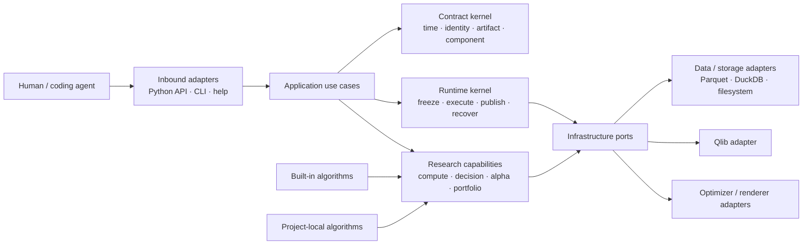
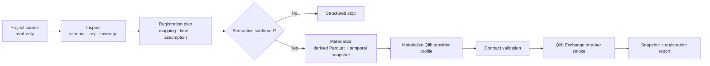
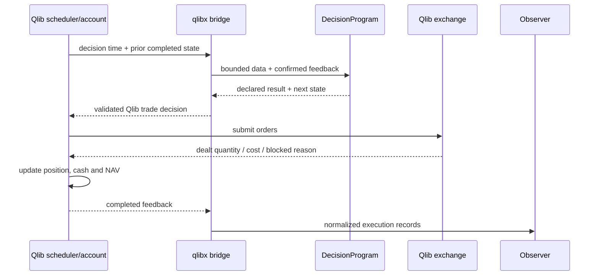

# qlibx Architecture

## 1. 문서의 지위와 목적

이 문서는 [`qlibx-prd.md`](qlibx-prd.md)를 구현하기 위한 `qlibx`의 target architecture와
구현 전제조건을 정의한다. 기존 architecture는
[`qlibx-architecture-old.md`](qlibx-architecture-old.md)로 보존한다.

이 문서는 다음 review를 반영하여 새로 작성했다.

- [`critical-review-on-architecture-codex.md`](critical-review-on-architecture-codex.md)
- [`critical-review-on-prd-claude.md`](critical-review-on-prd-claude.md)

`qlib-integration-codex/`는 동작을 증명한 reference prototype이지만 target package 구조나 public
contract의 기준은 아니다. Prototype에서는 mechanism과 acceptance evidence를 재사용하고, 여러 runner,
catalog, scheduler와 project-specific module이 함께 누적된 구조는 계승하지 않는다.

이 문서는 다음을 architecture 수준에서 확정한다.

- Package, user project와 generated state의 ownership
- Temporal data, component, run, artifact와 economic input의 canonical contract
- Frozen execution, worker isolation, publication과 crash recovery
- Static computation과 stateful decision program의 경계
- Enhanced-index와 matched-capitalization execution profile
- Qlib, DuckDB, filesystem, optimizer와 renderer에 대한 dependency direction
- Shared branch에서 병렬 연구할 때 보장하는 범위
- Version compatibility, migration, trust와 safety boundary
- 구현 전에 통과해야 하는 feasibility gate와 이후 vertical slice 순서

Class signature, SQL DDL, CLI spelling과 serializer 내부 구현은 후속 interface/implementation 문서에서
정한다. 그러나 persisted identity, state authority, time semantics, transaction ordering과 failure
behavior는 이 문서의 contract를 따라야 한다.

## 2. Architecture 판정과 핵심 결정

전체 방향은 승인하지만 다음 Gate 0을 통과하기 전까지 native Qlib
matched-capitalization adapter의 final shape는 확정하지 않는다.

1. Qlib native lifecycle에서 partial fill을 다음 decision이 관측한다.
2. Matched baseline activation과 actual underlying `SELL`이 같은 lifecycle에서 동작한다.
3. Qlib account와 capitalization journal을 함께 checkpoint하고 resume할 수 있다.
4. Mutable project source가 바뀌어도 frozen component bundle이 동일한 결과를 실행한다.
5. Artifact install과 catalog projection 사이 crash를 복구할 수 있다.

Target architecture의 핵심 결정은 다음과 같다.

- Qlib은 market order, fill, execution cost, physical position, cash와 NAV의 유일한 execution authority다.
- Matched-capitalization에서는 Qlib composite account와 qlibx capitalization journal이 하나의 joint
  compatibility checkpoint를 이룬다. Signed account는 두 상태에서 계산되는 projection이다.
- Worker는 mutable project config나 module path를 실행하지 않고 self-contained frozen invocation을
  실행한다.
- Point-in-time은 availability lag뿐 아니라 revision/vintage와 as-of selection을 포함한다.
- Definition, invocation, attempt, reusable result, artifact record와 content blob identity를 분리한다.
- Immutable artifact manifest와 append-only control event가 durable evidence이며 DuckDB는 rebuildable
  query projection이다.
- Static batch computation과 Qlib clock에서 동작하는 stateful decision program을 분리한다.
- Cost, benchmark와 risk model은 portfolio/backtest 결과를 좌우하는 versioned input이다.
- Built-in과 project-local algorithm은 domain extension contract를 구현한다. Qlib, DuckDB와 filesystem만
  infrastructure port 뒤에 둔다.
- Same-branch 안전성은 frozen run, generated state, publication과 stale-write detection에 한정한다.
  Arbitrary user source의 semantic merge는 보장하지 않는다.
- 첫 release는 작은 contract kernel과 vertical slice를 먼저 완성하고 broad plugin framework나
  distributed orchestrator를 만들지 않는다.

## 3. System model

### 3.1 Public flow

```text
human / coding agent
-> public API or CLI
-> project status and compatibility validation
-> use-case plan
-> frozen invocation
-> isolated worker
-> staged result verification
-> immutable publication
-> small public result and artifact reference
```

Agent는 private source를 읽거나 mutable scratch directory 전체를 탐색하지 않고도 public help, schema,
status, context query와 structured error를 통해 다음 행동을 결정할 수 있어야 한다.

### 3.2 Control plane, data plane과 execution plane

- **Control plane**: definition, proposal, invocation, attempt, result status, lineage, decision, version과
  compatibility metadata
- **Data plane**: dataset partition, model, signal, weight, risk model, target, order/fill/position/account와
  diagnostic payload
- **Execution plane**: Qlib scheduler, executor, exchange, account lifecycle와 qlibx compatibility hook

Control plane의 durable authority는 immutable control event다. Data plane의 durable authority는 verified
blob과 artifact record다. Execution plane의 realized market state는 Qlib account가 확정한다.

### 3.3 Dependency direction



Dependency rule:

```text
entrypoints -> application -> contracts + runtime + capabilities
runtime/capabilities -> infrastructure ports
adapters -> contracts + ports
built-in/project algorithm -> extension contracts
```

- Contracts와 research capability는 Qlib, DuckDB, filesystem layout, CLI와 renderer를 import하지 않는다.
- Application은 use-case 순서와 transaction boundary를 정하지만 SQL, chart calculation이나 별도 bar
  scheduler를 구현하지 않는다.
- Adapter는 external library 개념을 qlibx contract로 번역한다.
- Project-local algorithm은 infrastructure adapter가 아니다. 해당 algorithm을 찾고 frozen bundle로
  resolve하는 loader만 adapter다.
- 두 번째 implementation이나 external boundary가 없는 deterministic helper에는 port를 만들지 않는다.

## 4. Architecture kernels와 bounded responsibility

### 4.1 Project kernel

Project manifest는 active project와 ownership boundary를 선택하는 유일한 시작점이다.

소유하는 정보:

- Config, source-data, generated-state, research와 extension root
- Project schema와 required qlibx compatibility range
- Default storage, execution과 reporting profile
- Project-local component root
- Resource budget와 retention policy

Project resolver는 current directory를 무제한 scan하지 않는다. 모든 path는 selected manifest를 기준으로
resolve하고 declared root 밖의 mutation은 거부한다.

### 4.2 Contract kernel

Contract kernel은 다음의 작은 immutable value와 validation rule을 소유한다.

- `TemporalSemantics`, `DatasetDefinition`, `DatasetSnapshot`
- `ExecutionDataProfile`
- `BenchmarkSnapshot`, `CostModelSnapshot`, `RiskModelSnapshot`
- `ComponentRef`, extension contract version과 capability
- `FrozenInvocationBundle`
- Definition, invocation, attempt, result, artifact record와 blob identity
- `ArtifactEnvelope`, `DecisionScope`, `ExecutionCheckpoint`
- Structured status와 error

이 kernel은 serialization schema의 semantic source of truth다. JSON Schema와 installed documentation은 이
contract에서 생성하거나 동일 version으로 검증한다.

### 4.3 Runtime kernel

Runtime kernel은 use case를 재현 가능하게 실행하고 결과를 publish한다.

- Project config와 component를 resolve하고 freeze한다.
- Worker별 staging, scratch와 process isolation을 만든다.
- Attempt lifecycle, cancellation, checkpoint와 retry를 관리한다.
- Payload, schema, hash, lineage와 acceptance condition을 검증한다.
- Artifact와 control event를 publish하고 DuckDB projection을 갱신한다.
- Crash, orphan staging, incomplete install과 stale running state를 복구한다.

Runtime은 research 의미, alpha logic, optimizer objective나 Qlib fill을 스스로 결정하지 않는다.

### 4.4 Research capabilities

Research capability는 다음을 소유한다.

- Data registration과 bounded subscription
- Side-effect-free `ComputePlan`
- Stateful `DecisionProgram`
- Signed alpha transform와 evaluation
- Stored-alpha ensemble
- Benchmark-relative portfolio construction
- Orthogonality, capacity, stress와 decision record
- Stored artifact 기반 reporting analysis

Project-specific peer momentum, benchmark policy, promotion threshold와 report narrative는 package에 넣지
않는다.

### 4.5 Infrastructure adapters

첫 release에서 우선 필요한 external boundary는 다음으로 제한한다.

- Dataset snapshot reader와 Qlib provider materializer
- Frozen local-component resolver
- Blob/artifact store, event store와 DuckDB projection
- Portfolio optimizer
- Qlib execution engine
- Report renderer

## 5. Canonical contracts

### 5.1 TemporalSemantics와 DatasetSnapshot

Logical dataset은 경제적 의미와 point-in-time selection rule을 함께 선언한다.

`TemporalSemantics` 최소 필드:

- Required clock field와 timezone
- `event_time`: measurement 또는 event가 속한 시각
- `available_at`: strategy가 처음 관측할 수 있는 시각
- Optional revision/vintage key
- Optional `valid_from`, `valid_to`
- `ingested_at`
- As-of selection과 tie-breaking rule
- Calendar/session boundary와 decision cutoff
- Late arrival와 correction policy
- Latest view인지 point-in-time history인지

Revision이 없는 daily OHLCV는 이 contract의 단순 specialization이다. Dataset-level fixed lag만으로 충분한
경우에도 그 사실을 profile에 명시한다.

`DatasetSnapshot`은 다음을 결합한다.

- Logical definition ID와 version
- Temporal selection rule과 `as_of`
- Canonical schema digest
- Ordered immutable partition manifest
- Partition별 content digest
- Source lineage와 materialization implementation
- Coverage, missingness와 known limitation

Snapshot ID는 ordered partition manifest의 digest다. Worker는 전체 dataset을 매번 복사하거나 rehash하지
않고 immutable partition reference를 받는다. Append-only source는 새 partition과 manifest만 추가하여
incremental snapshot을 만들 수 있다.

### 5.2 BenchmarkSnapshot

Benchmark member와 weight는 일반 config list가 아니라 temporal logical dataset으로 등록한다.

- Announcement time과 effective time을 구분한다.
- Decision cutoff에서 알려진 member/weight version만 선택한다.
- Rebalance, correction과 provider revision을 lineage에 남긴다.
- Benchmark snapshot ID는 ensemble/portfolio/backtest result key에 포함한다.
- ETF/index constituent look-through도 같은 temporal rule을 사용한다.

Benchmark snapshot이 없거나 point-in-time status가 불명확하면 enhanced-index result를 verified
point-in-time result로 publish하지 않는다.

### 5.3 ExecutionDataProfile

Research data를 Parquet으로 읽는 것과 native Qlib `Exchange`가 execution quote를 구독하는 것은 별도
integration path다.

첫 release는 `daily_close_v1` execution profile 하나를 기본 지원한다.

- `t-1` cutoff까지 관측하고 `t` 종가에 decision을 실행·평가한다.
- Trading calendar와 instrument lifecycle
- Execution/valuation price
- Corporate-action quantity factor
- Volume, suspension과 price-limit field
- Instrument type, lot와 cost mapping
- Research universe와 execution tradability source
- Currency와 timezone

Registered snapshot은 Qlib provider-backed execution dataset으로 materialize한다. Registration smoke는
Parquet read에서 끝나지 않고 작은 Qlib calendar/`Exchange`가 해당 profile을 subscribe하여 최소 한 bar의
order/fill/account update를 실행하는 데까지 포함한다.

다른 timing 또는 custom quote adapter는 별도 versioned `ExecutionDataProfile`이다. Silent option으로 기존
profile의 의미를 바꾸지 않는다.

### 5.4 ComponentRef

Lifecycle interface는 extension point별로 유지하지만 모든 component reference는 공통 identity envelope를
가진다.

```text
component_kind
contract_name
contract_version
semantic_id
implementation_ref
implementation_digest
config_schema
declared_resources
capabilities
```

`capabilities`는 최소 다음 reproducibility class 중 하나를 선언한다.

- `deterministic`
- `seeded`
- `external_nondeterministic`

Resolver는 explicit module/file/package reference만 load한다. Directory 전체를 자동 scan하거나 비슷한
이름의 fallback implementation을 선택하지 않는다.

### 5.5 FrozenInvocationBundle

Application은 worker를 시작하기 전에 self-contained `FrozenInvocationBundle`을 만든다.

최소 내용:

- Canonical JSON effective config bytes
- Definition과 invocation identity
- Exact dataset/economic-input snapshot ID
- Component entry point
- Project-local source tree, wheel 또는 content-addressed source bundle
- Transitive project-local source digest
- Declared non-code resource와 digest
- Dependency lock/environment fingerprint
- Time range, seed와 resource budget
- Parent artifact record ID
- Expected output contract와 verification policy
- Session/proposal identity

첫 version은 arbitrary import graph를 추론하지 않는다. Explicit component root 아래 source tree와 declared
resource를 통째로 snapshot한다.

Worker loader는 다음 규칙을 따른다.

- Source YAML과 mutable project module path를 다시 읽지 않는다.
- Frozen source bundle만 import한다.
- Import namespace와 process start behavior를 isolate한다.
- Bundle digest가 다르면 실행 전에 실패한다.
- Resume은 original bundle과 compatible checkpoint를 검증할 수 있을 때만 허용한다.

### 5.6 Identity model

| 개념 | Identity | 의미 |
| --- | --- | --- |
| Definition | Semantic ID + version | Dataset, component, strategy와 policy 정의 |
| Invocation | UUID/ULID | User/agent가 요청한 한 번의 use case |
| Attempt | UUID/ULID | 실제 worker 실행; retry마다 새 identity |
| Result key | Deterministic fingerprint | 동일 frozen input의 verified result reuse key |
| Artifact record | UUID/ULID 또는 stable record ID | Role, schema, provenance와 blob 연결 |
| Blob | Content digest | 실제 JSON/Parquet/Arrow bytes |

Behavior:

- Cache hit는 새 invocation이 기존 verified result를 참조하는 event다. Worker attempt를 만들지 않아도 된다.
- Failed retry는 같은 result key를 가질 수 있지만 새 attempt를 만든다.
- Failed/invalid attempt는 complete result slot을 점유하지 않는다.
- 같은 payload를 다른 attempt가 만들어도 artifact record는 각 provenance를 보존하고 blob만 deduplicate한다.
- Artifact record ID와 blob digest를 같은 identity로 사용하지 않는다.
- Result key에는 transitive dataset, component, config와 relevant adapter identity가 포함된다.

### 5.7 Economic input contract

#### CostModelSnapshot

Cost는 단순 runtime option이 아니라 alpha evaluation, optimizer와 execution이 공유하는 versioned input이다.

- Commission, tax, slippage와 market-impact definition
- Instrument/ticker applicability
- Effective time range와 point-in-time tax/fee schedule
- Currency와 unit
- Parameter 또는 fitted-model identity
- Fitting에 사용한 dataset snapshot
- Implementation digest와 limitation

Cost assumption이 달라지면 dependent portfolio/backtest result key가 달라진다.

#### RiskModelSnapshot

Risk model은 enhanced-index optimization과 ex-ante tracking diagnostic을 위한 versioned artifact다.

- Factor exposure 또는 covariance matrix
- Specific risk
- Estimation window와 decision cutoff
- Universe/axis, currency와 annualization convention
- Missing coverage
- PSD, conditioning과 validation result
- Model implementation과 input lineage

Valid risk model이 없으면 heuristic portfolio 또는 ex-post tracking statistic은 만들 수 있지만
`tracking-error optimized` 또는 ex-ante tracking error라고 표시하지 않는다.

### 5.8 Artifact contract와 materialization policy

Artifact는 세 종류로 나눈다.

1. **Canonical artifact**: public use-case output, downstream reuse 또는 promotion evidence
2. **Checkpoint artifact**: resume/recovery에 필요한 runtime state
3. **Diagnostic record**: 명시적으로 선택한 intermediate evidence

Compute graph 내부 node는 기본적으로 ephemeral이다. 다음 경우에만 canonical 또는 cached artifact로
materialize한다.

- 다른 run이 직접 참조하는 named output
- Explicit cache policy가 있는 pure node
- 계산비용 threshold를 넘는 node
- Causality, optimizer, reproducibility 또는 reconciliation audit evidence

Fused execution을 허용하되 node definition과 lineage는 manifest에 남긴다.

`ArtifactRecord`는 다음 metadata와 immutable blob reference를 가진다.

- Artifact role/type과 schema version
- Artifact record ID와 blob digest
- Producer invocation/attempt와 implementation identity
- Parent/input artifact record ID
- Completion status와 bounded time range
- Axis, index, unit, currency, timezone와 data semantics
- Payload format, location과 content digest
- Coverage, warning, diagnostic과 validation result

Canonical portable format은 metadata/config에 JSON, table/matrix에 Parquet 또는 Arrow-compatible format을
사용한다. Pickle과 arbitrary live Python object는 canonical format으로 허용하지 않는다. 새로운 payload
type은 versioned serializer, loader, validator와 security policy가 함께 있을 때만 추가한다.

### 5.9 DecisionScope와 nested research

`DecisionScope`는 다음을 machine-readable하게 제한한다.

- Decision time와 maximum `available_at`
- Dataset snapshot ID set
- Dataset별 lookback upper bound
- Qlib-confirmed feedback boundary
- Child maximum depth와 total child count
- Fan-out, wall time, memory와 artifact-byte budget
- Allowed evaluator와 side-effect capability

Invariant:

- `child.dataset_ids ⊆ parent.dataset_ids`
- Child-only dependency도 parent definition의 transitive dependency union에 사전 선언
- `child.available_at <= parent.available_at`
- Child lookback은 dataset별 parent upper bound를 넘지 않음
- Cancellation과 timeout은 모든 descendant에 전파
- Child는 actual Qlib account, parent state와 sibling state를 변경하지 않음
- Unbounded depth/fan-out은 invalid definition

Child result는 기본적으로 run-local diagnostic이다. Parent가 선택한 action만 Qlib execution으로 들어가며,
child output을 reusable result로 공개하려면 별도 canonicalization과 publication을 거친다.

### 5.10 ExecutionCheckpoint

일반 long-only mode의 execution checkpoint는 Qlib account, strategy state, scheduler position과 observer
offset을 같은 completed execution step에서 참조한다.

Matched-capitalization mode의 checkpoint는 다음 joint state를 가진다.

- Qlib composite account checkpoint ID
- Capitalization journal checkpoint ID
- Shared `execution_step_id`
- Strategy/decision state
- Observer event offset
- Activation/release idempotency key set
- Reconciliation result

Qlib checkpoint와 journal 중 하나만 존재하거나 step ID가 다르면 complete checkpoint가 아니다.

### 5.11 Structured status와 error

Public error는 최소한 다음을 제공한다.

- Stable error code
- Human-readable message
- Machine-readable context
- Affected definition, path 또는 identity
- Safe-to-retry 여부
- Suggested action과 migration/help reference

Unknown config, temporal ambiguity, missing column, incompatible axis, unsupported version, optimizer
infeasibility, corrupt blob, stale write와 account reconciliation failure는 서로 다른 code로 실패한다.

## 6. Data registration architecture



Registration plan은 materialization 전에 다음을 보여준다.

- Explicit source column과 logical/Qlib field mapping
- Primary key와 duplicate policy
- Temporal semantics와 unresolved ambiguity
- Derived field formula
- Corporate-action, universe와 tradability assumption
- Supported/unsupported execution constraint
- Expected generated path와 mutation boundary

Source data는 read-only다. qlibx-owned derived data만 declared generated root에 쓴다. Missing semantics를
regex나 유사 column 이름으로 추정하지 않는다.

## 7. Research and portfolio architecture

### 7.1 ComputePlan과 DecisionProgram

- `ComputePlan`: side-effect-free batch DAG다. Immutable dataset/artifact를 읽고 immutable result를 만든다.
- `DecisionProgram`: Qlib clock에서 bounded data, prior confirmed feedback와 strategy state를 소비한다.

`DecisionProgram`은 `ComputePlan` artifact를 read-only subscription으로 사용할 수 있다. Online decision
history를 reusable alpha로 publish하려면 run 종료 후 canonical signed-alpha contract로 변환하고 별도
result key로 publish한다.

두 모델을 하나의 generic workflow engine으로 합치지 않는다.

### 7.2 Strategy output profile

PRD의 장기 capability는 signal, weight, physical target과 order를 포함하지만 각 output이 우회하는
validation layer를 분리한다.

- `AlphaDecision`: `signed_signal` 또는 `signed_active_weight`; v1 기본 research profile
- `PortfolioPolicy`: physical stock/ETF/cash target; portfolio validation 필수
- `ExecutionStrategy`: order intent; target-to-order policy를 소유하는 별도 advanced contract

Runtime type 하나로 pipeline을 임의 조립하지 않는다. 각 public profile은 통과해야 하는 transform,
portfolio, risk, cost와 execution validation을 명시한다.

### 7.3 Reproducibility와 cache

- `deterministic`과 `seeded` component만 result-key cache를 사용할 수 있다.
- `external_nondeterministic` component는 attempt마다 새 result를 만든다.
- External response를 재사용하려면 response와 evidence를 frozen input artifact로 먼저 capture한다.
- 중요한 deterministic result는 동일 frozen invocation replay로 reproducibility audit할 수 있다.
- Replay mismatch는 result를 삭제하지 않고 `reproducibility_failed` status와 diff artifact를 남긴다.

### 7.4 Signed alpha와 budget

Canonical atomic alpha는 original instrument ticker의 signed signal 또는 signed active weight다.

Budget policy는 effective config와 artifact에 명시한다.

- Fixed dollar-neutral
- Flexible maximum budget
- Project-defined explicit policy

Fixed rescale은 기본 profile일 수 있지만 silent transform이 아니다. Result는 raw/rescaled weight,
before/after exposure, transform identity, used/unused budget과 raw signal scale이 가려졌다는 diagnostic을
남긴다.

Generic downstream은 flexible unused budget을 복원하거나 unrelated security에 배분하지 않는다.

### 7.5 Stored-alpha ensemble

```text
verified member alpha records
-> axis/time/budget contract validation
-> member coefficient
-> same-ticker contribution crossing/netting
-> combined signed active intent
```

- Member strategy를 다시 실행하지 않는다.
- Member의 실제 flexible exposure를 보존한다.
- 다른 ticker의 opposite exposure를 자동 netting하지 않는다.
- Member contribution, similarity, marginal contribution과 full lineage를 기록한다.

### 7.6 Orthogonality와 evaluation

Orthogonality는 semantic, empirical과 incremental evaluation을 분리한다.

각 result는 다음을 반드시 기록한다.

- Reference pool과 evaluation segment
- Metric과 threshold
- Missing comparison
- Budget/scale normalization method
- Cost/risk/capacity assumption
- Regime 또는 stress slice

Capacity curve와 stress replay는 canonical alpha 자체가 아니라 typed diagnostic artifact다.

- Capacity diagnostic: booksize, participation rate, volume, expected slippage와 blocked intent
- Stress replay: declared tail window에서 alpha, portfolio, infeasibility, reserve와 execution behavior

이 diagnostic은 Gate 4 research capability이며 contract/storage kernel의 선행조건은 아니다.

### 7.7 Enhanced-index portfolio

```text
point-in-time benchmark snapshot
+ signed active intent
+ current actual holding and cash
+ cost/risk snapshot
-> desired constituent exposure
-> stock / ETF / cash physical target
```

Optimizer port는 `OptimizationProblem -> OptimizationResult`만 노출한다. Adapter와 독립 validator를
분리한다.

Result는 다음을 구분한다.

- Optimal
- Hard infeasible
- Soft-constraint relaxed
- Solver failure

ETF는 기본적으로 opaque physical instrument다. Point-in-time constituent snapshot이 있을 때만
look-through risk, constraint와 attribution을 계산한다. Physical holding과 constituent exposure는 별도
artifact다.

## 8. Qlib execution architecture

### 8.1 두 execution profile

```text
Path A — enhanced-index production
signed alpha -> ensemble -> benchmark-relative portfolio
-> long-only stock/ETF/cash target -> native Qlib execution

Path B — signed-alpha compatibility evaluation
signed alpha -> matched-capitalization
-> Qlib composite execution -> reconstructed signed diagnostic
```

Path A는 v1 production path다. Path B는 Gate 0과 관련 ADR이 통과하기 전까지 experimental compatibility
profile이며 enhanced-index production portfolio를 대체하지 않는다.

두 path는 같은 alpha parent를 참조할 수 있지만 별도 result key, cost/accounting semantics와 performance
artifact를 가진다.

### 8.2 Native Qlib closed loop



qlibx는 production `for date` loop를 소유하지 않는다. Requested target, intended signed quantity와 observer
projection을 realized Qlib holding으로 취급하지 않는다.

### 8.3 Matched-capitalization authority

각 ticker에서:

```text
A = realized signed active quantity
B = matched baseline quantity, B >= 0
C = Qlib composite quantity, C >= 0

C = B + A
A = C - B
```

일반 long-only execution에서는 Qlib account가 유일한 authoritative state다. Matched mode에서는 Qlib
composite account와 qlibx capitalization journal이 하나의 versioned compatibility checkpoint를 이룬다.
Signed active view는 이 둘에서 계산되는 read-only projection이다.

Capitalization journal은 두 번째 execution engine이 아니다.

- 독립 clock, market order, fill이나 position advance를 소유하지 않는다.
- Qlib execution step과 분리되어 commit될 수 없다.
- Market dealt quantity와 cost는 Qlib만 확정한다.
- Capitalization은 composite account의 long-only 표현을 위한 NAV-neutral compatibility mutation이다.

한 bar의 순서:

1. Prior completed joint checkpoint를 읽는다.
2. Required baseline capacity를 계산한다.
3. Activation/top-up event를 idempotently prepare한다.
4. Baseline quantity와 matching cash를 composite account에 NAV-neutral하게 반영한다.
5. `C_target = B + A_target >= 0`을 검증한다.
6. Active delta를 actual underlying Qlib `SELL`/`BUY` order로 제출한다.
7. Qlib dealt quantity 이후 `A_realized = C_realized - B`를 관측한다.
8. Actual cover fill 범위에서만 configured policy로 baseline을 release한다.
9. Composite, baseline, active cash/NAV와 event sequence를 reconcile한다.
10. Joint checkpoint를 publish한다.

Sidecar만 있거나 Qlib checkpoint만 있는 상태는 complete가 아니다. Resume 전 `C >= 0`, `B >= 0`,
cash/NAV neutrality와 event sequence를 모두 검증한다.

Result는 average/peak reserve, reserve utilization, insufficient-reserve rejection, retained baseline과
reserve opportunity-cost scenario를 diagnostic으로 제공한다. Borrow, locate, margin, recall, forced buy-in과
borrow fee를 지원한다고 표시하지 않는다.

### 8.4 Qlib feasibility ADR

Gate 0 spike는 다음을 기록하는 ADR을 만든다.

- 지원 pyqlib version/range
- 사용하는 public 또는 허용된 stable hook
- Direct account mutation lifecycle point
- Qlib accumulated metrics에 미치는 영향
- Checkpoint/resume integration
- Partial fill observer callback
- 실패한 접근과 limitation

Spike가 stable hook으로 성립하지 않으면 Path B를 experimental offline compatibility analysis로 늦추고
private Qlib internals에 production contract를 고정하지 않는다.

## 9. Storage, catalog와 publication

### 9.1 Durable authority

```text
immutable artifact manifest + append-only control event = durable authority
DuckDB catalog = rebuildable query projection
```

Control event는 최소 다음을 포함한다.

- Proposal/invocation 생성
- Attempt transition
- Publish intent/commit
- Cache-hit reference
- Failure/invalid/abandoned
- Decision, promotion, rejection, supersede와 retirement
- CAS version transition

DuckDB만 backup 없이 authoritative state로 취급하지 않는다.

### 9.2 Publisher protocol

Worker는 shared catalog에 직접 쓰지 않는다.

```text
stage payload and manifest
-> verify schema/hash/lineage
-> append publish intent
-> atomic blob/artifact install
-> append publish commit
-> update DuckDB projection
```

Recovery는 다음 상태를 구분한다.

- Orphan worker staging
- Publish intent without installed artifact
- Installed artifact without commit event
- Committed event missing from DuckDB projection
- Expired running attempt
- Conflicting identity/provenance

각 상태는 idempotent resume, rollback 또는 quarantine action을 가진다. Artifact directory가 존재한다는
사실만으로 complete로 간주하지 않는다.

### 9.3 Duplicate, conflict와 CAS

- 같은 result key의 verified result가 있으면 cache hit로 연결한다.
- 같은 blob은 한 번만 저장하되 artifact record별 provenance는 유지한다.
- 같은 claimed identity가 다른 content/provenance를 가지면 conflict로 실패한다.
- Promotion/supersede와 shared config mutation은 expected current version/content hash를 요구한다.
- Stale write는 새 내용을 덮어쓰지 않고 revised plan을 요구한다.

### 9.4 Lean projection과 retention

Catalog projection은 다음을 분리한다.

- Hot core: identity, status, parent, artifact location, CAS version
- Durable evidence: manifest와 append-only event
- Derived view/cache: comparison, orthogonality matrix, nearest neighbor와 heavy diagnostic

Retention은 evidence를 조용히 삭제하지 않는다.

- Derived cache는 재생성 가능하면 제거할 수 있다.
- Large blob은 reachability, project retention policy와 legal/audit hold를 확인한 뒤 archive할 수 있다.
- Archived record는 metadata query와 restore action을 제공한다.
- Event schema migration은 original event를 보존하고 새 projection을 만든다.

## 10. Parallel-agent architecture

각 session은 고유 workspace, staging과 scratch root를 가진다. Worker는 frozen bundle과 immutable snapshot만
사용한다.

qlibx가 보장하는 것:

- Running job의 input stability
- Session/generated-state isolation
- Worker와 publisher 분리
- Same-fingerprint race와 duplicate publication 처리
- Catalog/config mutation의 stale-write detection
- Crash가 다른 completed result를 손상시키지 않음

qlibx가 감지하지만 자동 해결하지 않는 것:

- Shared strategy/config file의 expected-content hash 변경
- Local component source의 stale plan

qlibx가 보장하지 않는 것:

- Arbitrary user source의 semantic merge
- Git branch/worktree/commit coordination
- Project-owned file에 대한 자동 conflict resolution

Mutation command는 dry-run plan에 read-time content hash와 변경할 user-owned/generated path를 구분해
표시한다.

## 11. Extension architecture

Extension point는 하나의 global base class나 registry를 공유하지 않는다. 각 extension contract가
workflow 위치, input/output, time boundary, lifecycle, state, side effect와 validation을 소유한다.

첫 release의 공식 extension point:

- `AlphaDecision` / StrategyAgent
- Signal transform
- Exposure analyzer
- Portfolio constructor/optimizer
- Report analysis/section/renderer

Physical-order `ExecutionStrategy`는 Gate 3 이후 별도 advanced contract로 추가한다.

Local extension은 trusted project code다. Schema/contract validation은 malicious side effect를 방지하는
security sandbox가 아니다. Process, filesystem 또는 network isolation을 제공하지 않는 한 safe sandbox라고
표현하지 않는다.

Extension source, resource, dependency와 contract version은 frozen invocation과 result identity에 포함한다.
Installed qlibx/Qlib를 수정하거나 silent monkey patch하지 않는다.

## 12. Reporting architecture

```text
stored artifact query
-> typed analysis result
-> section composition
-> renderer
-> report output + output manifest
```

- Report는 strategy, model, optimizer나 backtest를 다시 실행하지 않는다.
- Renderer에서 performance, attribution이나 reconciliation을 다시 계산하지 않는다.
- Analysis result를 여러 renderer가 재사용할 수 있다.
- Report output은 upstream research identity나 promotion evidence를 변경하지 않는다.

Reproducible/cacheable report는 output 옆에 manifest를 둔다.

- Input artifact record ID
- Analysis definition/version
- Renderer identity/version
- Output blob digest
- Warning과 rendering environment

Temporary plot data는 저장하지 않아도 된다. Typed analysis result는 명시적으로 선택한 경우 derived
presentation artifact로 재사용할 수 있다.

## 13. Project와 package layout

### 13.1 User project default

Project가 root를 변경할 수 있으므로 다음은 default recommendation이다.

```text
user-project/
├─ config/qlibx/                 # user-owned definitions
├─ data/source/                  # user-owned, read-only to qlibx
├─ data/qlibx/                   # reproducible derived dataset/provider
├─ qlibx-custom/                 # trusted project-local algorithms
├─ qlibx-research/
│  └─ sessions/<session-id>/     # human-readable scratch and summary
└─ .qlibx/
   ├─ events/                    # append-only control events
   ├─ blobs/                     # content-addressed payload
   ├─ records/                   # artifact manifests
   ├─ bundles/                   # frozen invocation/component bundle
   ├─ checkpoints/
   ├─ staging/<session-id>/
   └─ catalog.duckdb             # rebuildable projection
```

User-owned config/source/extension과 qlibx-managed generated state는 ownership rule을 공유하지 않는다.
Package upgrade가 user-owned file을 자동 수정하지 않는다.

### 13.2 Package topology

Directory topology는 provisional하며 dependency rule보다 우선하지 않는다.

```text
src/qlibx/
├─ entrypoints/
├─ application/
├─ contracts/                    # time, identity, component, artifact, errors
├─ runtime/                      # freeze, attempt, publish, recover, checkpoint
├─ capabilities/
│  ├─ data/
│  ├─ research/
│  ├─ alpha/
│  ├─ portfolio/
│  ├─ execution/
│  └─ reporting/
├─ adapters/
│  ├─ data/
│  ├─ storage/
│  ├─ qlib/
│  ├─ optimization/
│  ├─ extensions/
│  └─ rendering/
├─ builtins/
├─ schemas/
└─ resources/
   ├─ docs/
   ├─ examples/
   └─ skill_templates/
```

관련 contract, use case와 deterministic implementation은 vertical capability 안에 가까이 둘 수 있다.
Thin wrapper 수를 늘리기 위해 domain/port/application 파일을 기계적으로 하나씩 만들지 않는다.

## 14. Versioning, compatibility와 migration

다음 version 축을 독립적으로 관리한다.

- qlibx package
- Project config schema
- Dataset/artifact/event schema
- Extension contract
- ExecutionDataProfile
- Qlib adapter compatibility

독립 version 선언만으로 충분하지 않다. 각 reader/adapter는 compatibility predicate를 제공한다.

```text
package supports project_schema >=2,<4
artifact_reader supports artifact_schema in {1,2}
extension requires alpha_decision_contract ==2
qlib_adapter supports pyqlib == validated version/range
```

`project status`와 run planning은 실행 전에 각 조합을 다음 상태로 판정한다.

- `supported`
- `readable_only`
- `migration_required`
- `incompatible`

Migration은 dry-run, affected path/record, reversible plan과 backup/restore instruction을 제공한다. 오래된
evidence를 읽을 수 없으면 조용히 누락하지 않고 catalog에 readable status와 reason을 남긴다.

Qlib version과 adapter implementation은 backtest result key에 포함한다. Qlib upgrade 후 compatible alpha
artifact는 재사용할 수 있지만 execution result는 새 identity를 가진다.

## 15. Efficiency rules

- Dataset reader는 date/column projection과 Parquet/DuckDB predicate pushdown을 사용한다.
- Worker에는 large DataFrame 대신 immutable snapshot과 bounded slice specification을 전달한다.
- Dataset snapshot은 partition manifest로 incremental hash한다.
- 같은 run에서는 immutable chunk read-through cache를 허용한다.
- Pure `ComputePlan` node만 transitive fingerprint로 cache한다.
- Alpha, ensemble, portfolio, backtest와 report identity를 분리한다.
- Catalog는 metadata query에 집중하고 large payload 분석은 Parquet scan이 담당한다.
- Renderer는 typed analysis result와 unchanged output digest를 재사용한다.

성능을 이유로 temporal validation, lineage, independent optimizer validation, checkpoint reconciliation과
reproducibility audit를 생략하지 않는다.

## 16. Testing architecture

### 16.1 Test pyramid

- Unit: temporal selection, identity, transform, budget, validator와 state-machine invariant
- Contract: component, extension, artifact, event, serializer/loader와 compatibility predicate
- Integration: Parquet/Qlib materialization, publisher recovery, DuckDB projection, optimizer와 Qlib bridge
- Acceptance: PRD P0~P7 user/agent journey와 parallel process
- Differential: migration 기간 prototype과 qlibx execution/accounting artifact 비교

### 16.2 High-risk acceptance

- Mutable config/code edit 중에도 worker가 original frozen bytes를 실행한다.
- Cache hit, failed retry와 duplicate blob이 invocation/attempt/provenance를 올바르게 보존한다.
- Revised data가 decision cutoff 이후 값이면 subscription에서 제외된다.
- Benchmark announcement/effective time이 point-in-time으로 선택된다.
- Qlib `Exchange`가 registered execution profile로 한 bar를 실제 실행한다.
- Native partial fill 이후 다음 decision이 actual holding을 본다.
- Long-only resume와 uninterrupted run의 observable artifact가 같다.
- Matched mode crash 후 joint checkpoint가 같은 step으로 복구되거나 명시적으로 실패한다.
- `A = C - B`, NAV neutrality와 actual `SELL`/`BUY`가 reconcile된다.
- 세 개 이상의 process가 independent publish한다.
- Publish intent/install/commit/projection 각 crash point를 복구한다.
- Child dataset/depth/resource violation이 실행 전에 실패한다.
- Stochastic component가 deterministic result cache를 사용하지 않는다.
- Report/ensemble이 original strategy를 load하지 않는다.
- Unsupported schema/Qlib 조합이 `project status`에서 실행 전에 실패한다.
- Local extension과 onboarding update가 user-owned content를 보존한다.

## 17. Implementation gates

### Gate 0 — Feasibility

- Native Qlib partial-fill/feedback bridge
- Matched activation, actual `SELL`, joint checkpoint/resume
- Frozen component execution under mutable source edit
- Publication crash recovery

### Gate 1 — Contract and storage kernel

- Temporal dataset/benchmark snapshot
- ComponentRef와 frozen invocation
- Invocation/attempt/result/artifact/blob identity
- Cost/risk input contract
- Artifact/event store와 DuckDB projection
- Compatibility predicate와 project status

### Gate 2 — Smallest vertical slice

```text
registered daily data
-> fixed deterministic AlphaDecision
-> signed alpha artifact
-> immutable publication
-> stored-artifact report
```

이 단계에서 local extension, cache hit, failed attempt, no-look-ahead와 raw export/reload를 검증한다.

### Gate 3 — Qlib long-only closed loop

```text
stored/online active intent
-> portfolio policy
-> physical target
-> native Qlib execution
-> confirmed feedback
-> checkpoint/resume
```

Enhanced-index production path를 먼저 완성한다. Matched-capitalization은 Gate 0 ADR 판정에 따라 같은 release
또는 이후 release로 결정한다.

### Gate 4 — Research operating system

- Proposal/context/decision과 promotion state transition
- ComputePlan cache와 stored ensemble
- Orthogonality, capacity와 stress diagnostic
- Parallel session, stale-write와 publisher recovery
- Nested research resource enforcement

Minimum promotion vocabulary는 `candidate`, `promoted`, `rejected`, `superseded`, `retired`다. Project는
중간 state와 threshold를 추가할 수 있지만 모든 transition은 evidence, reviewer, rationale와 expected
current version을 가진 append-only event다.

### Gate 5 — Agent product surface

- Version-matched task help와 schema discovery
- Managed instruction block
- Skill generation
- Extension scaffold

Onboarding generator는 core contract가 안정된 뒤 그 contract를 얇게 참조한다. Manual과 schema를 generator
안에 중복 복사하지 않는다.

## 18. Architecture guardrails

다음 상태는 architecture drift다.

- Worker가 source YAML 또는 mutable project module을 다시 읽는다.
- 같은 identifier가 invocation, attempt, reusable result와 blob identity를 동시에 뜻한다.
- Availability lag만으로 revision dataset의 point-in-time correctness를 주장한다.
- Benchmark, cost 또는 risk assumption이 result lineage에 없다.
- Application use case가 Qlib, DuckDB SQL 또는 chart library를 직접 import한다.
- Project-local algorithm을 infrastructure adapter로 취급한다.
- Strategy가 global dataset loader, catalog writer 또는 live Qlib account를 받는다.
- Child가 parent에 선언되지 않은 dataset이나 unbounded resource를 사용한다.
- Worker가 central catalog/projection에 직접 쓴다.
- DuckDB row만 있고 durable event/manifest가 없는 상태를 complete evidence로 취급한다.
- Every intermediate transform을 무조건 physical artifact로 저장한다.
- Reporter가 strategy, optimizer나 backtest를 다시 실행한다.
- Signal, physical target과 order가 validation profile 없이 하나의 dynamic output contract를 공유한다.
- Requested target, capitalization journal 또는 signed projection을 Qlib realized holding으로 취급한다.
- Matched baseline journal이 Qlib checkpoint와 다른 execution step에서 advance한다.
- Dataset axis 존재만으로 universe 또는 tradability를 추정한다.
- Flexible budget을 generic downstream이 자동 복원한다.
- User config와 generated state가 같은 ownership/mutation rule을 가진다.
- Same-branch operation이 arbitrary user source merge까지 보장한다고 주장한다.
- Local extension validation을 malicious code sandbox라고 표현한다.
- Unsupported Qlib/schema 조합을 warning만 남기고 실행한다.
- Native Qlib scheduler 밖에 두 번째 production bar loop를 만든다.

## 19. 남은 product 선택

다음은 architecture-critical feasibility가 아니라 user feedback으로 정할 수 있는 product choice다.

1. Default project manifest 이름
2. Config file 분할 수준
3. Default root 이름과 위치
4. Daily profile 이후 추가할 registration/execution profile
5. Gate 3 이후 지원할 advanced Strategy output
6. Built-in report의 첫 section/renderer set
7. Default resource/retention budget
8. Project promotion lifecycle에 추가할 optional state

Directory 위치와 resource budget은 manifest에서 바꿀 수 있게 하되 publication safety, temporal correctness,
Qlib execution authority와 version compatibility는 user option으로 약화하지 않는다.
